# Skill MCP 架构图与时序图

> 基于 Mermaid 语法，涵盖系统架构、组件依赖、核心操作时序

---

## 目录

- [1. 系统分层架构图](#1-系统分层架构图)
- [2. 组件依赖关系图](#2-组件依赖关系图)
- [3. 数据库 ER 图](#3-数据库-er-图)
- [4. 缓存架构图](#4-缓存架构图)
- [5. 导入流水线时序图](#5-导入流水线时序图)
- [6. MCP 工具调用时序图](#6-mcp-工具调用时序图)
  - [6.1 skill_list](#61-skill_list)
  - [6.2 skill_view](#62-skill_view)
  - [6.3 skill_file](#63-skill_file)
- [7. 配置加载时序图](#7-配置加载时序图)
- [8. 传输层初始化时序图](#8-传输层初始化时序图)
  - [8.1 stdio 模式](#81-stdio-模式)
  - [8.2 SSE / HTTP 模式](#82-sse--http-模式)
- [9. 安全扫描流程图](#9-安全扫描流程图)
- [10. 权限过滤流程图](#10-权限过滤流程图)

---

## 1. 系统分层架构图

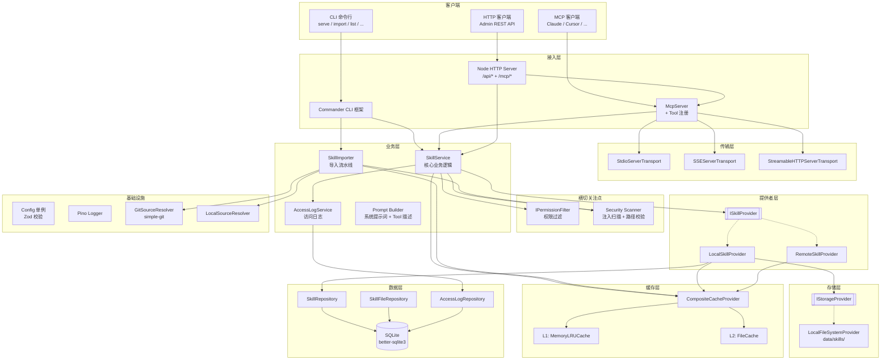

## 2. 组件依赖关系图

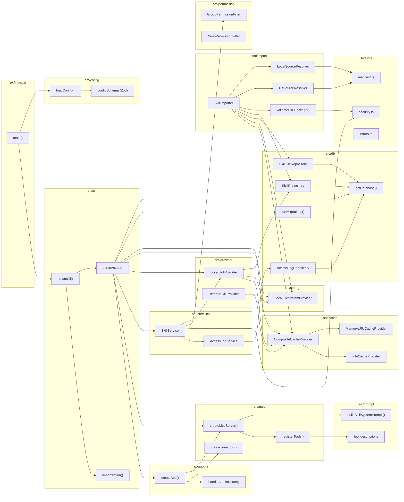

## 3. 数据库 ER 图

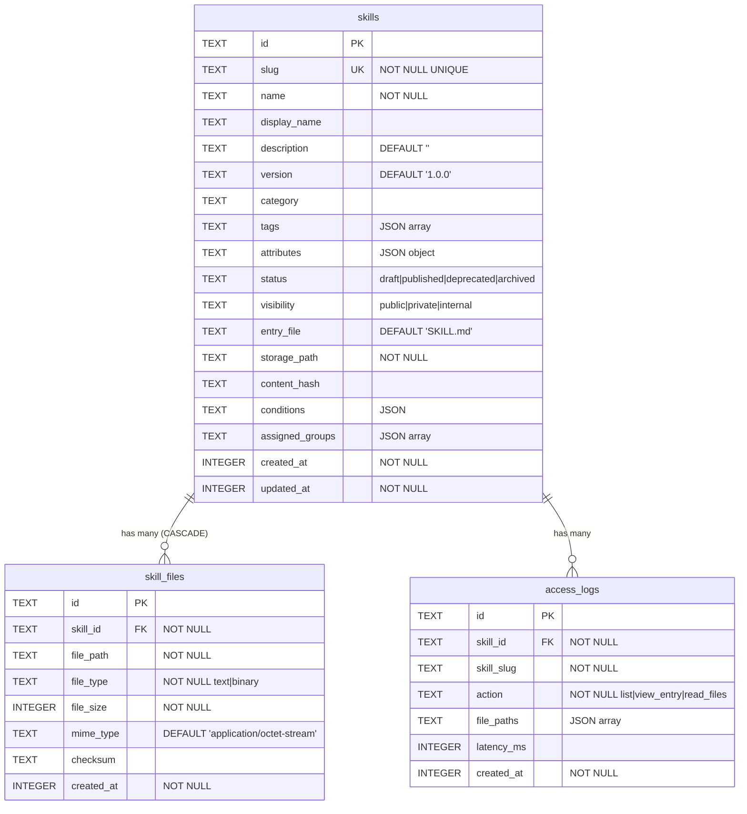

## 4. 缓存架构图

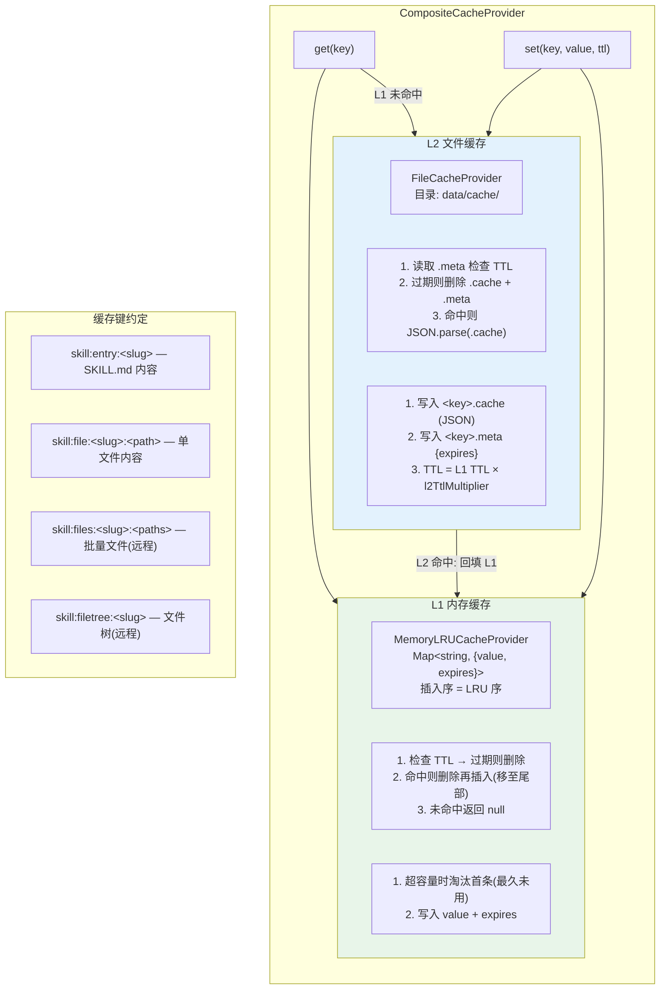

## 5. 导入流水线时序图

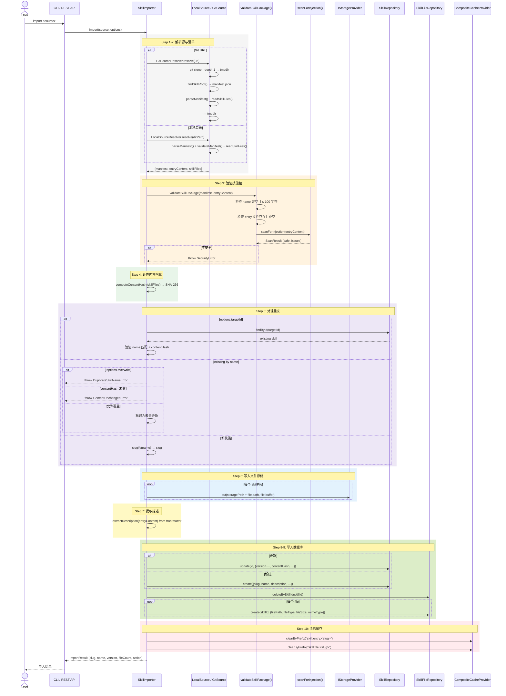

## 6. MCP 工具调用时序图

### 6.1 skill_list

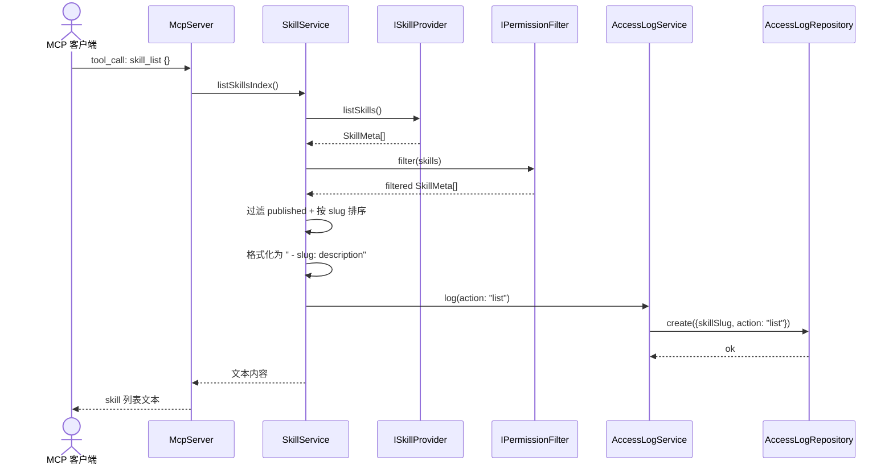

### 6.2 skill_view

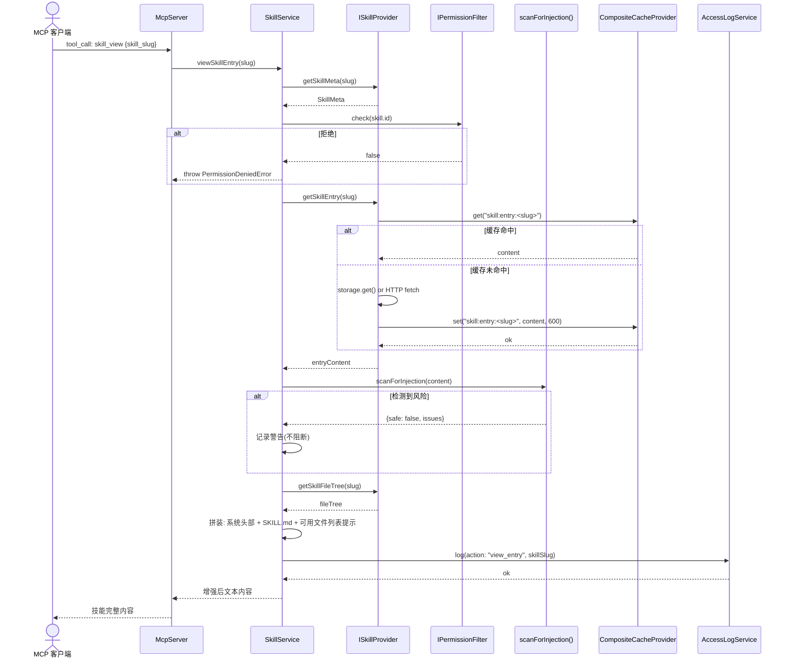

### 6.3 skill_file

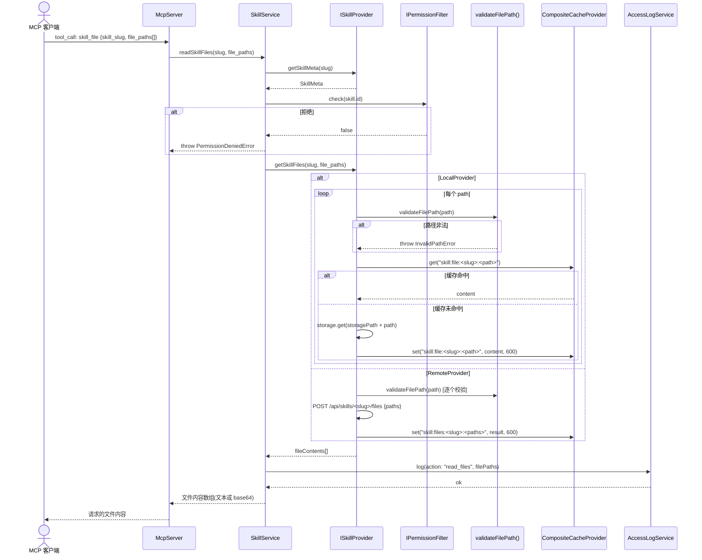

## 7. 配置加载时序图

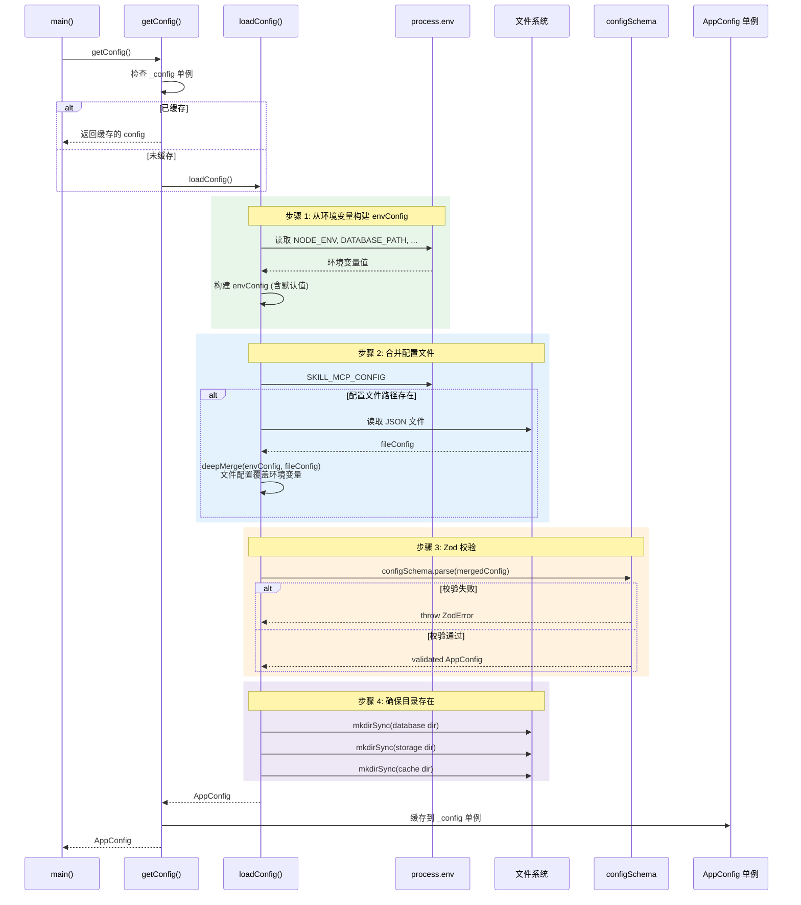

## 8. 传输层初始化时序图

### 8.1 stdio 模式

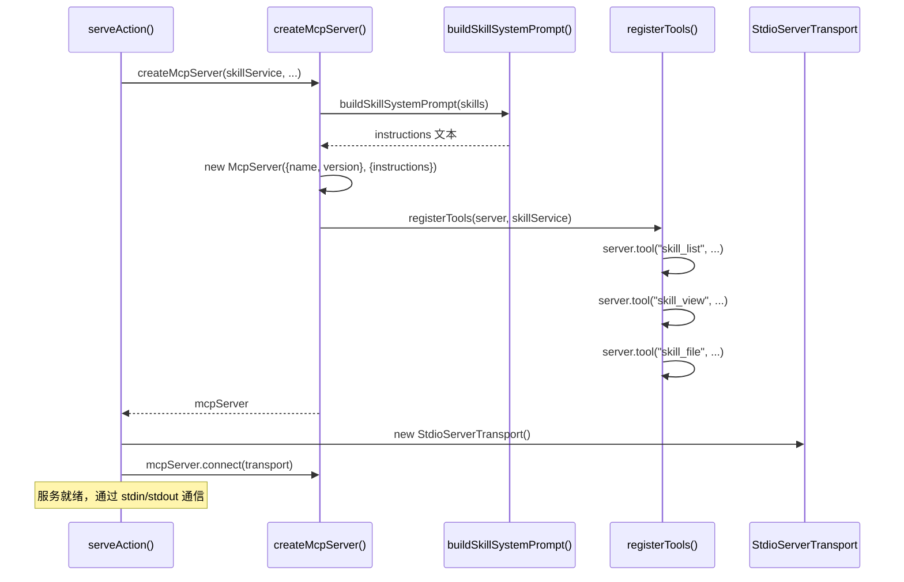

### 8.2 SSE / HTTP 模式

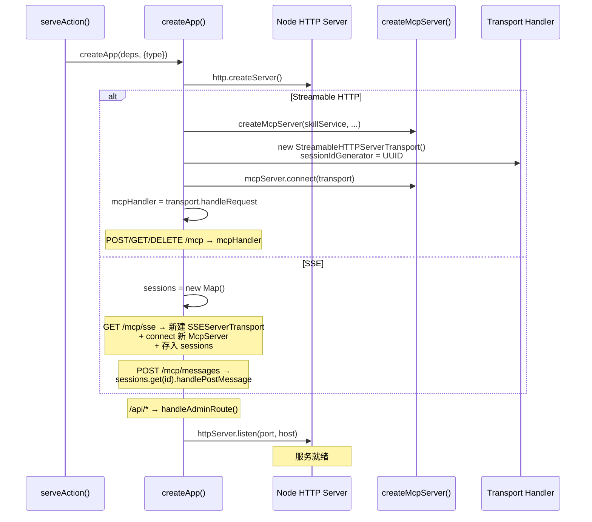

## 9. 安全扫描流程图

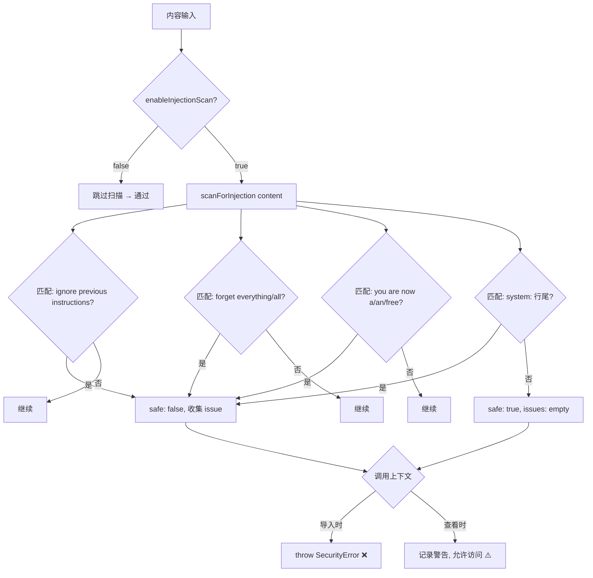

## 10. 权限过滤流程图

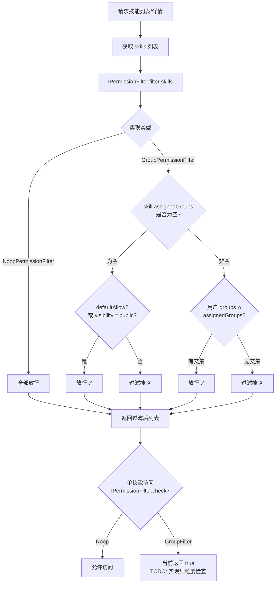
