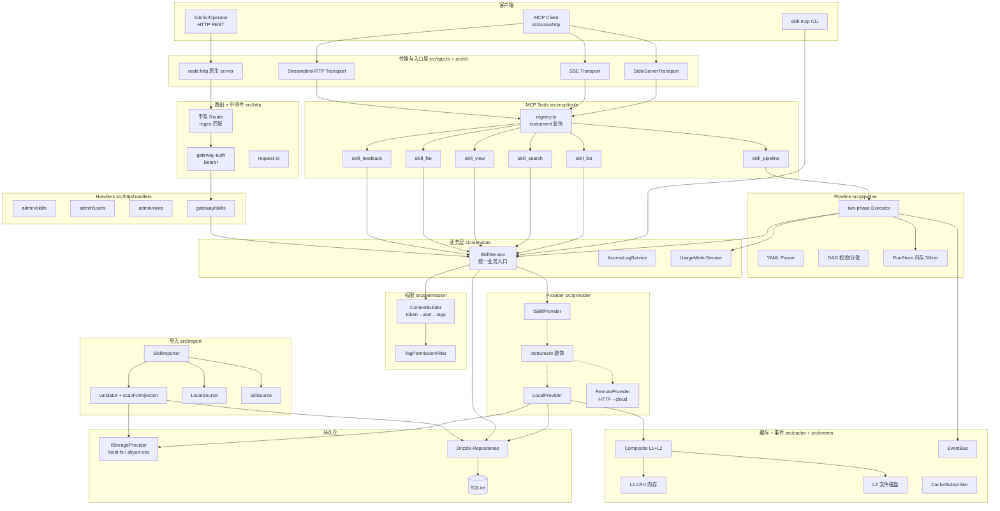
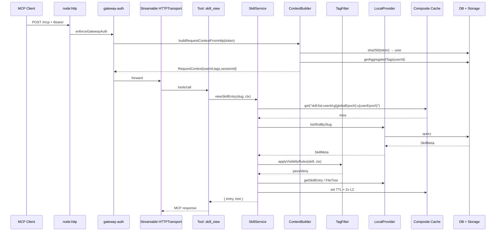
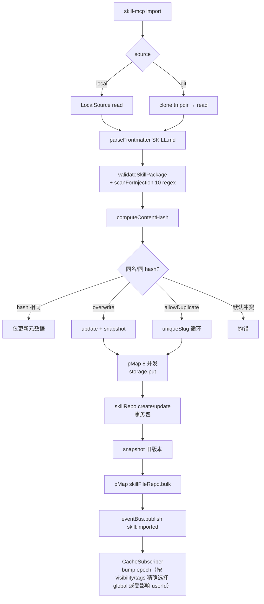
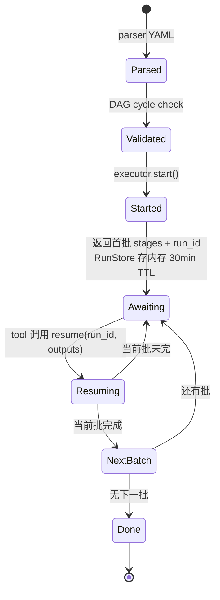

# Skill-MCP 架构技术文档（Single Source of Truth）

> **本文档是项目唯一、完整的技术架构文档。**
>
> **维护规则（强制）**：
> 1. 任何涉及**模块拆分、分层、依赖方向、接口契约、数据模型、部署形态、横切关注点（认证 / 缓存 / 事件 / 权限 / 配置）** 的代码变更，必须在同一 PR 中同步更新本文档。
> 2. 新增 / 删除 / 重命名 `src/` 一级目录、新增公共接口、变更环境变量语义、引入新依赖（运行时 npm 包），均触发更新。
> 3. 修复本文"已知问题清单"中的条目时，必须将该条目从清单中移除或标注 `已修复 (commit <sha>)`。
> 4. 文档结构禁止随意拆分：架构图、模块清单、关键流程、问题清单、优化路线图必须留在同一份文件，方便单点检索。
> 5. 与 `README.md` 的职责边界：README 面向使用者（怎么跑），本文档面向开发者与架构师（怎么实现、为何这样、还能怎样）。
>
> 最后审阅日期：2026-06-23 ｜ 当前对应 commit：`01b63ba` (dev)

---

## 目录

1. [系统定位与设计目标](#1-系统定位与设计目标)
2. [整体架构（分层视图）](#2-整体架构分层视图)
3. [模块清单与职责边界](#3-模块清单与职责边界)
4. [核心运行流程](#4-核心运行流程)
5. [部署形态](#5-部署形态)
6. [数据模型](#6-数据模型)
7. [横切关注点](#7-横切关注点)
8. [实现细节核对表](#8-实现细节核对表)
9. [已知问题清单](#9-已知问题清单)
10. [优化路线图](#10-优化路线图)
11. [扩展点](#11-扩展点)
12. [文档变更日志](#12-文档变更日志)

---

## 1. 系统定位与设计目标

Skill-MCP 是一个 **Skill 包仓库 + MCP 协议网关**，负责：

- 把可重用的 "Skill 包"（`manifest.json` + `SKILL.md` + 资源文件）集中管理、版本化、按权限分发；
- 通过 MCP 协议（stdio / SSE / Streamable HTTP）把这些 Skill 暴露给 AI 助手；
- 通过 HTTP REST 暴露给运维、CI、SDK 客户端；
- 支持单进程独立部署，也支持网关 + 云存储的分布式部署。

设计目标优先级：**简洁 > 可观测 > 可扩展 > 性能**。
"单二进制双模"（`--mcp-only` / `--api-only` / proxy 自动检测）是核心架构选择，详见第 5 节。

---

## 2. 整体架构（分层视图）



### 依赖方向（强制）

```
入口 / 传输 → 路由 → MCP Tools / Handlers → Services → Provider / Permission / Repo
                                              ↓
                                    Cache ←→ EventBus ←→ Storage / DB
```

**禁止**：
- Handler / Tool 跳过 Service 直接调 Repository（`admin/*` handler 当前破坏了这条规则，见第 9 节）。
- Repository 调 Service。
- Provider 调 HTTP Handler。
- Cache 反向调用 Service（应通过 EventBus）。

---

## 3. 模块清单与职责边界

| 一级目录 | 职责 | 关键文件 | 不能做什么 |
|---|---|---|---|
| `src/cli/` | 命令行入口、子命令分发 | `index.ts`, `ui.ts`, `remote-client.ts`, `local-config.ts`, `commands/`（serve、user、auth、role、import、list、info、search、update、remove、rollback、versions、eval、pipeline、lint、init、migrate、manifest-migrate、upgrade、sync） | 写业务逻辑（必须委派给 Service） |
| `src/app.ts` | HTTP 服务器装配 + MCP transport 绑定 | `app.ts`（~100 行 orchestrator）、`app-dependencies.ts`（类型） | 散落业务分支 |
| `src/mcp/` | MCP server / transport / tool 注册 | `server.ts`, `transport/index.ts`, `tools/registry.ts`, `tools/skill-*.ts` | 直接读 DB / 存储 |
| `src/http/` | 路由、中间件、HTTP handler | `router.ts`, `compose.ts`, `server.ts`, `helpers.ts`, `middleware/gateway-auth.ts`, `middleware/admin-auth.ts`, `middleware/error-map.ts`, `middleware/request-id.ts`, `middleware/rate-limit.ts`, `handlers/admin/`（skills、users、roles、import-jobs、webhooks、usage）、`handlers/gateway/skills.handler.ts`, `handlers/auth.handler.ts`, `openapi/` | 业务逻辑（应转 Service） |
| `src/services/` | 业务编排：缓存、权限、日志、版本管理、生命周期、搜索、webhook、用量计量、导入后台 | `skill.service.ts`, `access-log.service.ts`, `skill-lifecycle.ts`, `skill-search.service.ts`, `usage-meter.service.ts`, `webhook.service.ts`, `webhook-dispatcher.ts`, `webhook-worker.ts`, `import-worker.ts` | 暴露 DB 实体类型给上层（当前 SkillMeta 泄漏） |
| `src/permission/` | 鉴权上下文构建 + 可见性过滤 | `context-builder.ts`, `tag-filter.ts` | 网络 IO 之外的业务逻辑 |
| `src/provider/` | Skill 数据源抽象 + Local/Remote 实现 + Proxy 指标装饰 | `interface.ts`, `local.provider.ts`, `remote.provider.ts`, `instrument.ts` | 包含权限判断（由 Service 注入） |
| `src/cache/` | 两层缓存（L1 LRU + L2 file）+ per-user epoch 失效 | `composite.provider.ts`, `memory-lru.provider.ts`, `file.provider.ts`, `cache-epochs.ts` | 直接订阅事件（由 cache-subscriber 桥接） |
| `src/events/` | 领域事件总线 + 缓存/ webhook 订阅器 | `event-bus.ts`, `cache-subscriber.ts`, `webhook-subscriber.ts` | 同步阻塞主流程的副作用 |
| `src/storage/` | 字节存储抽象（local-fs / aliyun-oss） | `provider.interface.ts`, `local-fs.provider.ts`, `aliyun-oss.provider.ts` | 业务字段语义 |
| `src/db/` | Drizzle schema + Repository + 迁移 | `schema.ts`, `migrate.ts`, `connection.ts`, `dialect.ts`, `repositories/`（skill、skill-file、skill-version、skill-feedback、skill-embedding、skill-eval、user、user-role、role、access-log、import-job、pipeline-run、cache-epoch、usage-event、webhook、webhook-delivery、audit-log） | 跨表业务编排（属于 Service） |
| `src/import/` | 包导入流水线（local / git → validate → 入库） | `importer.ts`, `validator.ts`, `local-source.ts`, `git-source.ts` | 暴露 HTTP API（由 admin handler 调用） |
| `src/pipeline/` | Skill 编排 DAG（解析 / 校验 / 两阶段执行 / 运行存储） | `parser.ts`, `dag.ts`, `executor.ts`, `run-store.ts`, `context.ts` | 直接调用 LLM；只决定下一批待执行的 stage |
| `src/config/` | Zod 配置 schema + 单例加载 | `schema.ts`, `index.ts` | 在模块顶层做 IO（仅在 `getConfig()` 内） |
| `src/telemetry/` | Prometheus 指标 + OpenTelemetry tracing + span helpers | `metrics.ts`, `tracing.ts`, `spans.ts` | 业务逻辑 |
| `src/utils/` | 安全扫描、并发、错误、manifest、日志、diff、ID 生成、crypto | `security.ts`, `concurrency.ts`, `errors.ts`, `manifest.ts`, `logger.ts`, `diff.ts`, `id.ts`, `crypto.ts` | 引入跨模块依赖 |
| `src/mcp/prompt/` | 系统 prompt + 工具描述 | `system-prompt.ts`, `descriptions.ts` | — |
| `src/types/` | 跨模块共享类型 | `index.ts` | 引入实现细节类型 |
| `src/retrieval/` | 语义检索：embedding 生成、BM25/向量/混合打分 | `embedding-provider.ts`, `openai-embedding-provider.ts`, `ollama-embedding-provider.ts`, `bm25-index.ts`, `vector-index.ts`, `hybrid-scorer.ts`, `normalize.ts` | 直接读写 DB（通过 Repository） |
| `src/eval/` | Skill 评估框架：provider 抽象 + runner 执行 | `provider.interface.ts`, `echo-provider.ts`, `llm-eval-provider.ts`, `runner.ts` | 管理 eval case/run 持久化（由 Repository 处理） |

---

## 4. 核心运行流程

### 4.1 启动（CLI → Server）


**模式开关（互斥校验在 `serve-cmd.ts`）**：
- `--mcp-only` / `MCP_ONLY_MODE=true` → 仅暴露 MCP + health，Admin API 和 Gateway API 不注册。
- `--api-only` / `API_ONLY_MODE=true` → 仅暴露 REST API + health，MCP 返回 403。
- `--remote-url` / `CLOUD_SERVICE_URL` → 自动启用 RemoteSkillProvider，额外抑制 Admin API。
- `--mcp-only` 和 `--api-only` 互斥，同时设置则报错退出。

### 4.2 一次工具调用（HTTP 模式完整链路）



### 4.3 Skill 导入



**已知缺陷**：~~storage 写与 DB 写跨边界无事务（见 9.3）~~ ✅ 已修复 (T-005, 2026-05-22)：改为 staging-commit — 文件先落到 `__staging__/<importId>/`，DB 写入完成后由 `storage.moveDir` 原子提交（local-fs 走 `fs.rename`，OSS 走 copy+delete）；任一步失败 try/catch 触发"先 DB 反向补偿、再清理 finalPath（仅 create 分支）+ finally 清理 staging"；`SkillFileRepository.replaceAll` 在单事务内完成 delete-then-bulk-insert，文件行替换原子化。

### 4.4 Pipeline 两阶段执行



Executor 不直接调用 LLM，而是返回"下一批待执行 stages"给上游 agent，由 agent 执行后通过 `resume(run_id, outputs)` 推进。这是异步、长运行场景的关键设计。

---

## 5. 部署形态

### 5.1 模式组合

| 模式 | CLI flags / env vars | MCP | Admin API | Gateway API | Health | 用途 |
|---|---|---|---|---|---|---|
| 全功能 | (none) | ✅ | ✅ | ✅ | ✅ | 本地开发、小规模一体化部署 |
| MCP-Only | `--mcp-only` / `MCP_ONLY_MODE=true` | ✅ | ❌ | ❌ | ✅ | 客户端面向的最小攻击面端点 |
| API-Only | `--api-only` / `API_ONLY_MODE=true` | ❌ | ✅ | ✅ | ✅ | 纯数据服务，不暴露 MCP |
| 代理 (Proxy) | `--remote-url` / `CLOUD_SERVICE_URL` | ✅ | ❌ | ✅ | ✅ | 路由层，转发到远端后端 |

- `--mcp-only` 和 `--api-only` 互斥。
- 代理模式由 `CLOUD_SERVICE_URL` 或 `--remote-url` 自动检测，额外抑制 Admin API（管理操作在后方完成）。

### 5.2 三种典型场景

| 场景 | 组合 | Transport | 适用 |
|---|---|---|---|
| A | 全功能 | stdio | 本地开发 |
| B | 代理 (proxy) → 全功能/API-only | stdio → http | 混合（本地路由 + 远端存储） |
| C1 | 全功能 | http | 单 HTTP 服务 |
| C2 | MCP-only → 代理 → API-only | http → http → http | 分布式生产（推荐） |

完整 env 模板见仓库根 `.env.example`，不同场景的配置示例见 `src/config/examples/`。

### 5.3 设计动机

文档（旧 `tech-dev-program.md`）建议 Gateway 与 Cloud Service 分仓两套服务。本项目选择**单二进制 + 配置驱动模式**：
- 简化开发与测试（无 IPC 复杂度）
- 单 Docker 镜像即可
- 通过 LB 分别部署即可达到分布式效果
- ISkillProvider 抽象保证两种部署方式接口一致

---

## 6. 数据模型

### 6.1 表结构

| 表 | 关键列 | 索引 | 外键 |
|---|---|---|---|
| `skills` | `id` PK / `slug` UNIQUE / `name` / `displayName` / `description` / `version` / `contentHash` / `storagePath` / `status` / `visibility` / `entryFile` / `category` / `attributes` JSON / `retrievalMeta` JSON / `importSource` / `importUrl` / `importBranch` / `importSubDir` / `importedAt` | `idx_skills_{name,status,visibility}` / `unique_name_content_hash` | — |
| `skill_tags` | `(skillId, tag)` 复合 PK | `idx_skill_tags_tag` | → `skills` CASCADE |
| `skill_files` | `id` / `skillId` / `filePath` / `fileType` / `fileSize` / `mimeType` / `checksum` | `idx_skill_files_skill_id` | → `skills` CASCADE |
| `skill_versions` | `id` / `skillId` / `version` / `contentHash` / `storagePath` / `entryFile` / `fileCount` / `createdBy` / `changeSummary` / `isCurrent` | `idx_skill_versions_skill_id` / `idx_skill_versions_version` / `idx_skill_versions_created_at` | → `skills` CASCADE |
| `access_logs` | `id` / `skillId` / `skillSlug` / `action` / `filePaths` JSON / `latencyMs` / `userId` / `sessionId` / `createdAt` | `idx_access_logs_created_at` | → `skills` CASCADE |
| `skill_feedbacks` | `id` / `skillId` / `skillSlug` / `userId` / `sessionId` / `outcome` / `context` / `agentComment` / `version` | `idx_feedbacks_{skill_slug,created_at,outcome}` | → `skills` CASCADE |
| `users` | `id` / `token` UNIQUE / `name` / `username` UNIQUE / `passwordHash` / `userType` / `status` / `tokenPlaintext` ⚠️安全敏感 / `tokenExpiresAt` / `previousToken` / `previousTokenExpiresAt` | `idx_users_token` / `idx_users_previous_token` / `idx_users_username` | — |
| `roles` | `id` / `name` UNIQUE / `description` / `tags` JSON / `createdAt` / `updatedAt` | — | — |
| `user_roles` | `id` / `(userId, roleId)` / `createdAt` | `uk_user_roles_user_role` / `idx_user_roles_role_id` | → users, roles CASCADE |
| `import_jobs` | `id` / `status` / `source` / `optionsJson` / `progress` / `message` / `resultJson` / `errorMessage` / `createdByUserId` / `createdAt` / `startedAt` / `finishedAt` | `idx_import_jobs_{status,created_at}` | — |
| `cache_global_epoch` | `id` PK / `epoch` / `updatedAt` | — | — |
| `cache_user_epochs` | `userId` PK / `epoch` / `updatedAt` | — | — |
| `usage_events` | `id` / `userId` / `eventType` / `resourceId` / `quantity` / `metadata` JSON / `hourBucket` / `createdAt` | `idx_usage_events_bucket` / `idx_usage_events_event` / `idx_usage_events_created_at` | — |
| `pipeline_runs` | `id` / `name` / `status` / `definitionJson` / `inputsJson` / `batchesJson` / `completedStagesJson` / `currentBatchIndex` / `startedAt` / `finishedAt` | `idx_pipeline_runs_{status,started_at}` | — |
| `webhooks` | `id` / `url` / `secret` / `eventTypes` JSON / `enabled` / `description` / `secretRotatedAt` | `idx_webhooks_{enabled}` | — |
| `webhook_deliveries` | `id` / `webhookId` / `eventType` / `deliveryId` / `payload` / `attempt` / `status` / `responseStatus` / `responseBody` / `errorMessage` / `nextRetryAt` / `firstAttemptedAt` / `lastAttemptedAt` / `completedAt` | `idx_webhook_deliveries_{delivery_id,due,webhook}` | — |
| `skill_eval_cases` | `id` / `skillId` / `caseName` / `input` / `expectationsJson` / `createdAt` / `updatedAt` | `uk_skill_eval_cases_skill_case` / `idx_skill_eval_cases_skill_id` | → `skills` CASCADE |
| `skill_eval_runs` | `id` / `skillId` / `skillVersion` / `caseName` / `status` / `runner` / `toolsUsedJson` / `output` / `failureReason` / `latencyMs` / `createdAt` | `idx_skill_eval_runs_{skill_version,created_at}` | → `skills` CASCADE |
| `skill_embeddings` | `skillId` PK / `modelName` / `dimension` / `vector` BLOB / `contentHash` / `createdAt` / `updatedAt` | `idx_skill_embeddings_model` | → `skills` CASCADE |
| `audit_logs` | `id` / `action` / `entityType` / `entityId` / `operatorId` / `beforeJson` / `afterJson` / `createdAt` | `idx_audit_logs_{entity,created}` | — |

### 6.2 关键约束

- Skill 的物理目录由 `slug` 决定：`STORAGE_BASE_PATH/{slug}/`，`skills.storage_path` 存相对路径。
- 同名（`name`）冲突 → 默认拒绝；`--overwrite` / `--allow-duplicate` 改变行为。
- 版本变化由 `contentHash` 驱动，不是手填 version 号。
- Token 永远以 `sha256(token)` 形式入库，`users.token` 列存的是 hash。所有用户都有 opaque API token。
- `username` + `password_hash` 仅 admin/superadmin 用户需要，用于 JWT 登录。
- `user_type` 枚举：`"superadmin"` / `"admin"` / `"user"`，默认 `"user"`。

### 6.3 已知缺陷

见 9.4 / 9.5 / 9.6。

---

## 7. 横切关注点

### 7.1 配置（`src/config/`）

- 单例 `getConfig()`：env 变量 → 文件（`SKILL_MCP_CONFIG`）→ schema defaults，逐层 deepMerge。
- Zod 严格 schema（`schema.ts`），enum / discriminatedUnion / URL 校验。
- 配置段（`configSchema` 顶层）：`app` / `deployment`（含 `mcpOnly` / `apiOnly` 布尔字段）/ `gateway` / `storage` / `database` / `cache` / `transport` / `security` / `embedding` / `eval` / `rateLimit` / `auth`。
- 启动期 mkdir DB / storage / cache 目录，失败仅 debug log 不阻断（**风险**：磁盘满或权限错时延后失败）。

### 7.2 鉴权与权限

#### 7.2.1 三层用户模型

| 用户类型 | `user_type` | 登录方式 | 操作权限 |
|----------|------------|---------|---------|
| 超级管理员 | `"superadmin"` | 用户名+密码 → JWT | 全部管理操作，不可被其他用户修改/删除 |
| 管理员 | `"admin"` | 用户名+密码 → JWT | 技能/角色管理，不能管管理员 |
| 普通用户 | `"user"` | API token（无登录） | 仅浏览公开技能、使用 MCP 工具 |

所有用户（包括管理员）都有 opaque API token（用于 MCP 工具调用）。管理员额外拥有 username + password 用于 JWT 登录。

#### 7.2.2 两层权限体系

| 层级 | 判断依据 | 影响范围 |
|------|---------|---------|
| 操作权限（硬限制） | `user_type` 字段 | `enforceAdminAuth` 检查能否访问 `/api/admin/*` |
| 数据可见性（软过滤） | 角色 tags | `TagPermissionFilter` 决定能看到哪些 private 技能 |

`admin:write` / `admin:read` 标签不再用于管理路由门禁，角色标签纯粹用于技能可见性控制。

#### 7.2.3 认证路径

```
┌─ stdio ─→ assertStdioTokenOrExit (启动期) → withFallbackToken (注入 contextBuilder)
├─ http /api/auth/*    ─→ 无需认证（login / refresh / change-password）
├─ http /api/gateway/* ─→ enforceGatewayAuth 中间件 (每请求) → buildRequestContextFromHttp
└─ http /api/admin/*   ─→ enforceAdminAuth 中间件 (每请求) → 检查 user_type ∈ {admin, superadmin}
                                                  ↓
                          JWT token → verifyJwt → DB 查 userType → RequestContext
                          Opaque token → sha256 → DB 查找 → RequestContext
                                                  ↓
                                       TagPermissionFilter
                                          ├─ visibility=public   → 任意认证用户
                                          ├─ visibility=internal → 任意认证用户
                                          └─ visibility=private  → 空 tags 即认证可见；非空需交集
```

- 仅 `/api/health` 跳过认证（探针）。
- `/api/admin/*` 必须携带 Bearer Token，且 `userType` 必须为 `admin` 或 `superadmin`：
  - 无 token → `401 Authentication required`
  - token 无效 / user 已 disabled → `401 Invalid or expired token`
  - 已认证但 userType 不是 admin/superadmin → `403 Admin privilege required`
  - 通过后 `RequestContext` 注入 `HttpContext.requestContext`
- handler 层 inline guard：
  - `requireSuperadmin(rc)` — 创建管理员用户时调用
  - `assertSuperadminProtected(target, operatorId)` — 修改/删除用户时调用，保护超级管理员
- **MCP 传输鉴权直通**（T-738）：HTTP / SSE 两个 MCP 传输在 `handleRequest` / `handlePostMessage` 之前调用 `attachMcpAuthFromHeaders(req)`，把 `Authorization: Bearer …` 桥接到 SDK 约定的 `req.auth.token`。

#### 7.2.4 JWT 认证体系

- **签名算法**：HS256（HMAC-SHA256），对称签名
- **密钥管理**：`AUTH_JWT_SECRET` 环境变量（≥32 字符）；未设置时自动从 `~/.skill-mcp/config.json` 的 `jwt_secret` 字段读取（`init` 时自动生成）；读取优先级：env > config file
- **Token 生命周期**：access_token 2h，refresh_token 7d，不轮换，靠过期自然失效
- **Payload**：access_token 含 `{sub, username, user_type, tags, iss, iat, exp}`；refresh_token 含 `{sub, type:"refresh", iss, iat, exp}`
- **安全设计**：登录错误统一返回 "Invalid credentials" 防用户枚举；登录限流 5次/分钟/IP；密码 bcryptjs (cost=12)
- **tags 时效性**：access_token 中的 tags 在签发时从 DB 读取，2h 窗口期内可能滞后，refresh 时刷新

#### 7.2.5 CLI 双模式

CLI 管理命令支持本地/远程两种操作模式：

| 模式 | 触发条件 | 行为 |
|------|---------|------|
| 本地模式（默认） | `SKILL_MCP_SERVER_URL` 未设置且无 `--server-url` | 直接操作本地 DB |
| 远程模式 | `SKILL_MCP_SERVER_URL` 或 `--server-url` | 通过 HTTP API 执行 |

优先级：`--server-url` 参数 > `SKILL_MCP_SERVER_URL` 环境变量

本地模式下 `auth login` 直接验证 DB 密码并签发 JWT（无需服务器运行）。远程模式下所有命令通过 `apiCall()` 调用服务器端点。

### 7.3 缓存

- 两层：`MemoryLRU`（默认 500 条）→ `FileCache`（磁盘）。
- L2 TTL = L1 TTL × `l2TtlMultiplier`（`CompositeCacheProvider` 构造函数参数，默认 2，非环境变量）。
- read-promotion：L2 命中后以剩余 TTL 提升至 L1，确保 L1 不晚于 L2 过期。
- 写策略：`set()` 同时写 L1 + L2，无 write-back。
- 缓存键约定（**修改前必读**）：
  - `skill:list:{userId}:g{globalEpoch}:u{userEpoch}` — 按用户隔离的可见 skill 元数据列表，由 `CacheEpochManager` 管理版本后缀（T-102）。任意 mutation 不再 `clearByPrefix`，而是 bump 对应 epoch，让旧 key 自然 TTL 过期；list 缓存失效从 O(n) prefix 扫描降到 O(1) 整数自增。
  - `skill:entry:{slug}` — 入口文件渲染结果
  - `skill:file:{slug}:{path}` — 单文件
  - `skill:files:{slug}:{joined-paths}` — 批量文件（注意路径顺序敏感）
  - `skill:filetree:{slug}` — 文件树
- 失效策略（`CacheSubscriber` + `CacheEpochManager`）：
  - `skill:entry:*` / `skill:file:*` 仍走 `clearByPrefix(slug)`（单 slug 量极小）。
  - `skill:list:*`：按事件 `visibility` + `tags` 计算受影响用户：
    - `visibility=public/internal` 或 `private+空 tags` → bump global epoch（影响所有用户）。
    - `visibility=private+非空 tags` → 通过 `roleRepo.findAll()` + `userRoleRepo.findUserIdsByRoleId()` 找到 tag 交集用户集合，仅 bump 这些用户的 epoch；其他用户缓存继续命中。
    - 事件缺 visibility/tags（向后兼容）或 repos 缺失 → 保守 bump global。
  - `user:roles_changed` → bump 该用户 epoch；`role:updated` → bump `affectedUserIds`。

### 7.4 事件

- `EventBus`（基于 Node EventEmitter）支持 **同步 / 异步两种派发模式**：构造时传 `{ async: true }` 走 `setImmediate(() => dispatch(event))` 推迟到下个 tick，admin 写路径不再阻塞在 listener I/O；默认 sync 保持向后兼容。listener 异常通过 try/catch + `event_listener_errors_total` 计数器隔离（sync/async 两条路径都生效），单个 listener throw 不会断链 sibling listeners（T-303）。`serve-cmd.ts` 在生产装配里使用 `async: true`（P0-B, 2026-05-28）。
- 事件类型：`skill:created/updated/deleted/imported/deprecated`、`pipeline:completed`、`user:logged_in`、`user:password_changed`、`user:token_rotated`、`user:roles_changed`、`role:updated`。

### 7.5 日志与指标

- pino 结构化日志，`LOG_LEVEL` 控制级别。
- Prometheus 指标暴露在 `/metrics`：HTTP 路由/方法/状态/耗时、provider_latency（按 method + status）、缓存 hit/miss（**待补**）。
- OpenTelemetry tracing（P0-6）：`OTEL_ENABLED=true` 启用，OTLP HTTP exporter 或 Console 回退；`withSpan()` helper 手动插桩（无 auto-instrumentation）；`src/telemetry/tracing.ts` 提供 `initTracing()` / `shutdownTracing()` / `getTracer()` / `tracingOptionsFromEnv()`。
- 访问日志写 `access_logs` 表，由 `AccessLogService` 异步处理；当前所有调用点用 `.catch(() => {})` 静默吞错（见 9.10）。

### 7.6 安全

- `scanForInjection`（`utils/security.ts`）：10 条正则，扫 manifest 与 SKILL.md。可通过 `SECURITY_INJECTION_SCAN=false` 关闭导入阶段的注入扫描（`validator.ts`）；`skill.service.ts` 中的扫描不受此开关控制，始终执行。
- `validateFilePath`：segment-aware 检查，拒绝 `..` 段与绝对路径前缀；合法文件名包含 `..` 子串（如 `foo..bar.md`、`v1..2/notes.md`）通过（T-735）。
- `isTextFile` / `getMimeType`：白名单扩展名。
- token 长度上限：4096 字节（见 T-402，已修复）。JWT token 通常 1-3KB，在此范围内。
- HSTS：`SECURITY_HSTS_ENABLED=true`（对应 `security.hstsEnabled`）才发 `Strict-Transport-Security` 头，默认关闭。仅当前置 TLS 终结器（nginx / ALB / CDN）存在时才打开；纯 HTTP 部署若错误开启会让浏览器把后续 `http://` 强制升级到不存在的 HTTPS（T-737）。

---

## 8. 实现细节核对表

逐项确认当前实现是否符合预期。

| 模块 | 设计要点 | 是否符合 |
|---|---|---|
| 入口 / CLI | commander 默认 serve；stdio 启动期 token 防隐式公开 | ✅ |
| HTTP | 无框架，手写 regex 路由 | ✅ 中间件链已通过 errorMap 实现 |
| MCP 工具 | 6 个工具（skill_list/search/view/file/feedback/pipeline）+ instrument 装饰 | ✅ |
| 认证 | JWT 登录 + opaque token 双路径；三层用户模型 | ✅ T-004/T-802 (2026-06-23) |
| 权限过滤 | `user_type` 决定操作权限；角色 tags 决定数据可见性 | ✅ T-004 (2026-06-23) |
| SkillService | 缓存 key + 先权限后缓存 + SkillMetaPublic DTO | ✅ |
| LocalProvider | DB 优先 → fallback 遍历存储 | ✅ |
| RemoteProvider | 状态码驱动重试 | ✅ T-205 (2026-05-22) |
| Composite Cache | L1 LRU + L2 文件，GC + epoch 失效 | ✅ T-403/T-102 (2026-05-22) |
| CacheSubscriber | 按 visibility/tags 精确 bump epoch | ✅ T-102 (2026-05-22) |
| EventBus | 可选异步派发 + listener 隔离 | ✅ |
| 数据库 | Drizzle + better-sqlite3，CASCADE + 索引已补 | ✅ T-003/T-602 |
| SkillRepository | findByIds 批量查询 | ✅ T-204 (2026-05-22) |
| UserRoleRepository | 批量 INSERT | ✅ T-204 (2026-05-22) |
| Importer | staging-commit + 原子提交 + 补偿回滚 | ✅ T-005 (2026-05-22) |
| LocalFsProvider | `dirname(fullPath)` 安全取上级 | ✅ T-002 (2026-05-22) |
| Pipeline | YAML + DAG + 落库 + 异步推进 | ✅ T-203 (2026-05-22) |
| Migration | drizzle baseline + 迁移 journal | ✅ |
| CLI 双模式 | `--server-url` 远程 + 本地 DB 直接操作 | ✅ T-803 (2026-06-23) |
| JWT 认证 | HS256 + access/refresh + 密钥自动生成 | ✅ T-802 (2026-06-23) |
| 语义检索 | BM25 + 向量 + 混合打分，embedding provider 抽象（openai/ollama） | ✅ P1-11 |
| Skill 评估 | eval case/run 持久化，echo/LLM provider，runner 执行 | ✅ P1-12 |
| OTel Tracing | `OTEL_ENABLED` 开关，OTLP/Console exporter，Batch/Simple processor，`withSpan` helper | ✅ P0-6 |
| Rate Limit | 内存令牌桶（per-userId），admin/gateway 独立配置，429 + Retry-After | ✅ P0-3 |
| Webhook | 出站订阅 + delivery ledger + 重试队列（8 次 + dead_letter） | ✅ P1-16 |
| Usage Meter | billing-grade 事件采集，fire-and-forget 写入，hourBucket 聚合 | ✅ P1-13 |
| Lifecycle | 复用 `skills.status` 列，Draft→Published→Deprecated→Archived 状态机 | ✅ P0-9 |

---

## 9. 已知问题清单

修复后请将条目移除或标注 `已修复 (commit <sha>)`。


### 🔴 高危

| # | 位置 | 描述 |
|---|---|---|
| 9.1 | `src/http/context.ts:3` | ❎ 误报已关闭（2026-05-22），`src/http/` 下使用单层 `..` 解析正确 |
| 9.2 | `src/storage/local-fs.provider.ts:35` | ✅ 已修复 (2026-05-22)，改用 `dirname(fullPath)` |
| 9.3 | `src/import/importer.ts:166-214` | ✅ 已修复 (2026-05-22, T-005)：`IStorageProvider.moveDir` + staging-commit 模式 — 文件先落 `__staging__/<importId>/`，DB 写完后由 `moveDir`（local-fs 是 `fs.rename`，OSS 是 copy+delete 循环）原子提交；`SkillFileRepository.replaceAll` 单事务 delete-then-bulk-insert；`try/catch/finally` 失败时按"DB 反向补偿 → 回滚 finalPath（仅 created）→ 永远清 staging"顺序回收，并发导入靠 `randomUUID` staging 隔离；新增 `tests/unit/import/importer-rollback.test.ts` 覆盖 5 条失败注入路径。 |
| 9.4 | `drizzle/0000_baseline.sql:11` | ✅ 已修复 (2026-05-22)，迁移 0001 重建表加 `ON DELETE CASCADE` |
| 9.5 | `src/app.ts:284` 周边 | ✅ 已修复 (6b00382, 2026-06-23, T-004/T-805)：三层用户模型 + `enforceAdminAuth` 检查 `userType`；`SKILL_MCP_ADMIN_AUTH_OPTIONAL` 配置已删除 |
| 9.29 | `src/utils/manifest.ts:46-94` | ✅ 已修复 (995ad70, 2026-05-22, T-601)：`safeJoin(base, child)` + `lstatSync` symlink skip + `MAX_WALK_DEPTH=16` / `MAX_FILES_PER_PACKAGE=1000` / `MAX_BYTES_PER_PACKAGE=50MB` |
| 9.45 | `src/mcp/server.ts:9-28` + `src/prompt/system-prompt.ts` | ✅ 已修复 (2026-05-26, T-739)：`createMcpServer` 不再调 `skillProvider.listSkills()` 把 published skill 拼进 `instructions`；改为 `buildSkillSystemPrompt()` 静态指引模板，目录发现完全交给 RBAC-aware 的 `skill_list` 工具。修复前匿名 `initialize` 即可枚举所有已发布 skill 的 slug + description（绕过 `TagPermissionFilter`）。回归 +2（unit 重写 + integration `initialize.instructions` 黑盒断言）。 |

### 🟠 中危

| # | 位置 | 描述 |
|---|---|---|
| 9.6 | `src/events/cache-subscriber.ts` | ✅ 已修复 (2026-05-22, T-102)：引入 `CacheEpochManager`，事件携带 `visibility`+`tags`，subscriber 按 visibility 选择 global bump 或仅 bump tag-交集用户。失效复杂度 O(prefix scan) → O(1) integer bump。 |
| 9.7 | `src/provider/remote.provider.ts:56` | ✅ 已修复 (2026-05-22, T-205)：`fetchWithRetry` 状态码驱动 — 4xx（除 429）立即失败；429 honoring `Retry-After`；502/503/504 + 其它 5xx 走指数退避 + full jitter；500 仅重试一次；`retryMaxDelay=30s` 防恶意 Retry-After 阻塞；新增 `UpstreamError` (502)；12 个 vitest 用例。 |
| 9.8 | `src/services/skill.service.ts:332-366` | ✅ 已修复 (2026-05-22, T-207)：staging-commit 化 — 目标版本先落 `__staging__/<runId>/`，per-file 覆盖到 live 路径，DB 原子 update 最后做，`await` 缓存失效；任何阶段失败都从 pre-rollback snapshot 回滚（storage 先、DB 后），`finally` 永远清理 staging。新增 3 条失败注入单测。 |
| 9.9 | `src/import/importer.ts:294` | ✅ 已修复 (2026-05-22, T-202)：drizzle 迁移 0002 给 `skills` 加 `(name, content_hash) WHERE content_hash IS NOT NULL` partial UNIQUE；`SkillRepository.findByNameAndHash` 暴露幂等键查询；`SkillImporter.import()` 改成 DB-write-before-storage-commit + 重试循环：UNIQUE 冲突时优先用 `findByNameAndHash` 短路并发 winner（跳过 moveDir/replaceAll），否则在 `allowDuplicate=true` 时 `uniqueSlug` 重拼最多 5 次。新增 `tests/unit/import/importer-idempotent.test.ts`（5 用例）+ `skill-repository.test.ts` 4 用例。 |
| 9.10 | `src/services/skill.service.ts:144,200,232` | 🟢 设计权衡 (2026-05-25)：access log 是 fire-and-forget 审计副作用，写失败不应当 fail 用户请求；调用点保留 `.catch(() => {})`，但 AccessLogService 内部已带 `logger.warn`，错误不会"完全无声"。无修复动作。 |
| 9.11 | `src/db/repositories/skill.repository.ts:38` | ✅ 已修复 (2026-05-22, T-204)：新增 `findByIds(ids)` 走单次 IN + tags 单次 IN + JS group，空数组短路；`loadTagsForIds([])` 已有空数组 guard（确认） |
| 9.12 | `src/db/repositories/user-role.repository.ts:48` | ✅ 已修复 (2026-05-22, T-204)：`replaceUserRoles` 改为 `db.transaction` 内一条 DELETE + 一条 batch INSERT；新增迁移 `0003_user_roles_role_idx.sql` 补 `user_roles(role_id)` 索引 |
| 9.13 | `src/pipeline/types.ts:19-22` | ✅ 已修复 (2026-05-22, T-203)：`StageDefinition` 删除 `condition` / `retry` 两个 schema-only 字段；parser 检测到时打印 warn 提示作者未生效 |
| 9.14 | `src/pipeline/run-store.ts` | ✅ 已修复 (2026-05-22, T-203)：drizzle 迁移 `0004_pipeline_runs.sql` 新增 `pipeline_runs` 表（definition/inputs/batches/completedStages 全 JSON 落库 + status / started_at 索引）；`PipelineRunStore` 改为内存 write-through + 可选 `PipelineRunRepository` DB 后端，`getRun` 缓存 miss 时按 `pipeline.stages` 重建 `DAGScheduler`、按 inputs + completedStages replay 重建 `ExecutionContext`；TTL 既走 in-memory createdAt 又走 DB `started_at`（每次 createRun 由 `deleteOlderThan` 自动清理）|
| 9.15 | `src/app.ts` SSE handler | ✅ 已修复 (2026-05-22, T-206)：SSE 会话记录 `lastActivity`，5 min sweepTimer（unref）回收 idle > 30 min 的连接；HTTP/SSE 两路径同步增减 `skill_mcp_active_sessions{transport}` Gauge |
| 9.16 | `src/services/skill.service.ts:61-71` | ✅ 已修复 (2026-05-22, T-302)：新增 `SkillMetaPublic` + `toSkillMetaPublic`，缓存与 admin/gateway 公共响应一律映射为 DTO，`storagePath` / `contentHash` 不再出现在客户端 JSON 中 |
| 9.17 | `src/import/importer.ts:331` | 🟢 设计权衡 (2026-05-25)：`snapshotCurrentVersion` 是 best-effort 版本保留，失败仅意味"上一版历史不可回滚到"，不破坏当前导入。强制失败会让历史 snapshot 异常阻塞正常 import，得不偿失。warn 已足以触发告警。无修复动作。 |
| 9.30 | `src/db/schema.ts:89-97` | ✅ 已修复 (995ad70, 2026-05-22, T-602)：drizzle 迁移 0005 清理脏数据后 `CREATE UNIQUE INDEX uk_user_roles_user_role`，schema 改为 `uniqueIndex`，repository `replaceUserRoles` 入参先 `[...new Set(...)]` |
| 9.31 | `src/import/git-source.ts:21-26` | ✅ 已修复 (995ad70, 2026-05-22, T-603)：`GIT_URL_RE` / `GIT_BRANCH_RE` 白名单校验 + `git.raw(["clone", "--depth", "1", "--", repoUrl, tmpDir])` 显式 `--` 分隔符 |

### 🟡 低危

| # | 位置 | 描述 |
|---|---|---|
| 9.18 | `src/events/event-bus.ts:16` | ✅ 已修复 (2026-05-22)，listener 异常 try/catch 隔离，async listener 拒绝独立 catch |
| 9.19 | `src/permission/context-builder.ts:61` | ✅ 已修复 (2026-05-22)，token 上限提到 4096B 与 header cap 对齐 |
| 9.20 | `src/cache/file.provider.ts` | ✅ 已修复 (2026-05-22, T-403)：`FileCacheOptions.gcIntervalMs`（默认 10 min，`unref()`）周期触发 `runGc()`；走 keyIndex 清过期 + 自愈损坏 entry；新增 `cache_gc_runs_total` / `cache_gc_evicted_total` / `cache_gc_duration_seconds` 三指标 |
| 9.21 | `src/cache/memory-lru.provider.ts:52` | ✅ 已修复 (2026-05-22, T-404 / T-102)：list 缓存切到 epoch O(1) 失效，不再触发 prefix 扫描；entry/file 缓存仍走 prefix 但单 slug 量极小，O(n) 实际 n 小可控。LRU `clearByPrefix` 实现保留为 fallback。 |
| 9.22 | `src/pipeline/context.ts:54` | ✅ 已修复 (2026-05-22, T-203)：整段命中保留原生类型，嵌入式 `${{ }}` 走全局 replace 时 stringify 拼接，缺失值嵌入时为空串、非法路径仍抛错 |
| 9.23 | `drizzle/0000_baseline.sql:97` | ✅ 已修复 (2026-05-22)，迁移 0001 删除冗余 `idx_skills_slug` |
| 9.24 | `src/storage/aliyun-oss.provider.ts` vs `local-fs` | ✅ 已确认对齐 (2026-05-22)，二者均返回 `list()` 时去掉前缀 |
| 9.25 | `src/import/git-source.ts:39` | ✅ 已修复 (2026-05-22)，tmpdir 清理失败改为 logger.warn |
| 9.26 | `src/http/helpers.ts:55` | ✅ 已修复 (2026-05-22, T-409 / T-101)：`requireSlug(ctx, paramName?)` helper 收口；admin/gateway handler 全部替换为 helper 调用；唯一保留直用是 `gateway/skills.handler.ts:47` 的 `slug-or-uuid` 多态识别（语义不同，保留合理）。 |
| 9.27 | `src/db/repositories/skill.repository.ts:185-195` | ✅ 已确认 (2026-05-22)，已有 `if (skillIds.length === 0) return new Map()` guard |
| 9.28 | `src/storage/local-fs.provider.ts:49-55` | ✅ 已修复 (2026-05-22, T-411 / T-005)：staging-commit 模式把并发导入隔离到 `__staging__/<randomUUID()>/`，最终走 `moveDir` 原子重命名；`deleteDir` 仅在 finally 兜底清理已移走的 staging 路径，不再有并发同 slug 竞争；ENOENT 已 swallow。 |
| 9.32 | `src/cache/file.provider.ts:98-122` | ✅ 已修复 (995ad70, 2026-05-22, T-604)：懒加载 `keyIndex: Map<key, hashedFilename>`，set/delete 增量维护，`clearByPrefix` 稳态成本 O(matched) |
| 9.33 | `src/provider/remote.provider.ts` | ✅ 已修复 (995ad70, 2026-05-22, T-605)：`zod` 边界 schema + `validateOrThrow` 抛 `UpstreamError` 并 `metrics.remoteValidationErrors.inc({method})` |
| 9.34 | `src/provider/remote.provider.ts:21-50` | ✅ 已修复 (5f46a26, 2026-05-22, T-606)：T-605 schema 把 `storagePath`/`contentHash` 列为必填，但 gateway HTTP API 返回的是 `SkillMetaPublic`（裁剪过这两字段），导致 gateway 模式 502；boundary schema 与公共 DTO 对齐 |

#### 第 3~6 轮代码审计加固（T-701 ~ T-717，2026-05-22 ~ 05-23）

第 7~10 批共 4 轮 4 域并行审计，命中 14 项实修条目（去重 + 误报过滤后）。每条已在 BACKLOG 阶段 6~9 中独立追踪，§12 changelog 也分批登记，下面只做索引：

| # | 批次 | 范围 | ID | 关键改动 |
|---|---|---|---|---|
| 9.35 | 第 7 批 (commit 来自第 7 批) | SSE / HTTP body / pipeline parallel | T-701 / T-702 / T-703 | SSE 单会话 fallback 删除（防跨会话劫持）；HTTP MCP transport `readBody(req, 10MiB)` body 上限；`PipelineExecutor` 同 batch 内 `viewSkillEntry` 改 `Promise.all` 并发 |
| 9.36 | 第 8 批 (a763e44) | OSS 分页 / metrics 鉴权 / pipeline resume / run-store 上限 | T-706 / T-707 / T-709 / T-710 | `AliyunOssProvider.list` 改 do-while 分页（防 1000 条静默截断）；`/metrics` 默认走 `enforceAdminAuth`；`PipelineExecutor.resume` 加 per-runId promise chain 串行化；`PipelineRunStore` 加 `maxRuns=10000` LRU |
| 9.37 | 第 9 批 (47f18cb) | manifest 字段上限 / rollback 缓存 / role 解析 / feedback 上限 | T-705 / T-711 / T-712 / T-713 | `validateSkillMeta()` 加 6 项字段上限（防单字段放大攻击）；rollback 缓存失效改 try/catch 防误触发补偿性还原；`RoleRepository.parseTags` 显式 catch + 计数；`SkillFeedbackRepository.findBySlug` 默认 `limit=1000` + `ORDER BY createdAt DESC` |
| 9.38 | 第 10 批 (9907179) | 权限聚合解析 / feedback 鉴权 / access-log 解析 / sessionId 上限 | T-714 / T-715 / T-716 / T-717 | `UserRoleRepository.getAggregatedTagsByUserId` 复用 T-712 模式；`SkillService.submitFeedback` 升级为 `resolveAccessible`；`AccessLogRepository.findBySkill` row-level try/catch；`mcp-session-id` 加 128 字符 + 白名单上限 |
| 9.39 | 第 11 批 (2026-05-25) | HTTP MCP 会话生命周期 / git-source subDir 归一化 | T-718 / T-719 | `http-transport.ts` 删 `req.on("close")` 即时清理（每 POST 完成都会触发，使 session map / idle reaper 失去长会话语义）；改由 30 min idle reaper + `DELETE /mcp` 双轨；`git-source.ts` `subDir` `resolve` 后断言落在 tmpDir/ 之内，越界 `BadRequestError` |
| 9.40 | 第 12 批 (2026-05-25) | cache-subscriber unhandledRejection / skill attributes JSON 形状与可观测性 | T-720 / T-721 | `cache-subscriber.ts` `clearByPrefix` 包 `.catch(warn)` 防 rejection 逃逸（epoch bump 解耦继续推进）；`skill.repository.ts` `parseAttributes` 替代旧 `parseJson<T>`：corrupt / 非对象 JSON 返回 `{}` 而非 `[]`，`logger.warn` + 新增 `skill_mcp_skill_row_json_parse_errors_total{column}` Counter，与 T-712 `roleTagsParseErrors` 平行 |
| 9.41 | 第 13 批 (2026-05-26) | git/http 导入字段上限 / rollback 文件清理与索引一致性 | T-722 / T-723 / T-724 | `manifest.ts` 抽 `validateSkillMetaFields` 复用 T-705 上限 + tag 数组形状，`importer.ts` git/http 分支 `parseFrontmatterFromFiles` 后立刻调用（与 local-fs 等价拦截）；`SkillService.rollbackToVersion` 在 commit 阶段先按 `versionFiles` 反查 `stalePaths` 调 `storage.delete`（防回滚后 vY 之后新增文件残留），再走 per-file overwrite；并新增第 10 构造参数 `skillFileRepo`，post-commit 调 `replaceAll` 把 `skill_files` 索引刷成 target 版本快照（与 importer 同模式，避免 `LocalSkillProvider.getSkillFileTree` 返回陈旧索引） |
| 9.42 | 第 14 批 (2026-05-26) | 读路径并发上限 / paths 入参校验 / feedback 字段上限 / repo update 允许列收口 | T-725 / T-726 / T-727 / T-728 | `local.provider.ts` `getSkillFiles` 用 `pMap(filePaths, STORAGE_CONCURRENCY=8, ...)` 替换裸 `Promise.all`，与 importer / rollback 并发预算对齐；`http/helpers.ts` 抽 `requireFilePaths(value)` 共享 helper（拒绝非数组 / 空 / 长度 > 100 / 含非字符串元素，全部 `BadRequestError → 400`），admin / gateway `/skills/:slug/files` 改用同一 helper；`mcp/tools/skill-feedback.ts` zod 加 `context.max(2000)` / `agent_comment.max(8000)` / `skill_slug.max(255)` + `SkillService.submitFeedback` 同等数值的服务层 backstop，覆盖未来非 MCP 传输路径；`skill.repository.ts` `update` 允许列移除 `storagePath` / `contentHash`（这两列由 importer / rollback 计算），admin PUT 透传 `storagePath: "../evil/"` 一类 payload 被静默忽略 |
| 9.43 | 第 15 批 (2026-05-26) | T-728 修复点修正：投影下移到 admin handler 边界 | T-728 (修正) | 第 14 批从 repo `update` 允许列里整体删除 `storagePath` / `contentHash` 误伤了系统调用方：importer 更新分支 (`importer.ts:245-253`) 与 rollback 提交 + 补偿 (`skill.service.ts:432-435 / 486-489`) 传入的 `contentHash` / `storagePath` 被静默丢弃 → rollback 后 DB hash 与磁盘内容偏离，T-722 idempotency 键失效。本批回滚 repo 层允许列变更，把字段投影下移到 admin handler 边界：`http/handlers/admin/skills.handler.ts` PUT 在传给 `skillRepo.update` 之前先按 `ADMIN_PUT_ALLOWED = [description, displayName, version, category, attributes, status, visibility, entryFile, tags]` 显式投影；新增 `tests/unit/http/admin-skills-put.test.ts` 在 handler 边界断言投影 |
| 9.44 | 第 16 批 (2026-05-26) | 缓存键稳定序列化 / storage 层纵深防御 / role 删除事件补齐 | T-729 / T-730 / T-731 | `remote.provider.ts` `getSkillFiles` 缓存键由 `safePaths.join(",")` 改成 `JSON.stringify(safePaths)`（修复 `["a,b.md"]` 与 `["a","b.md"]` 跨请求串数据）；`local-fs.provider.ts` 加 `safeResolve(path)`，每个 IO 方法入口先把 `path.resolve(resolvedBase, path)` 落点断言在 `resolvedBase` 之内（分层防御最后一道，上层 `validateFilePath` 是第一道）；admin `DELETE /api/admin/roles/:roleId` 与 PUT 对齐——cascade 之前先 `findUserIdsByRoleId` 抓受影响 user 集合，删除成功后 publish `role:updated` 让 cache subscriber 对这批 user 做 `epochs.bumpUsers`，关闭"删 role 后这些 user 的 `skill:list:${userId}` 缓存按旧聚合 tag 集合继续命中"窗口 |

---

## 10. 优化路线图

按 ROI 排序。每完成一项需更新本节并对应清理第 9 节。


### 阶段 1（立即修，1-2 周）

1. ~~修第 9.1 / 9.2 / 9.4 / 9.5 / 9.3（高危五项）。~~ ✅ 全部完成 (9.5 → T-004, 9.3 → T-005, 其余早期修复)。
2. ~~**HTTP 中间件抽象**~~ ✅ 已修复 (2026-05-22)：`src/http/compose.ts` 提供 koa-style `Middleware` 与 `compose()`；`errorMap` 中间件统一翻译 `AppError` → HTTP；`requireSlug(ctx)` / `readJsonBody<T>` 替代散落的 inline 校验；handler 行数 -29.4%。requestId 中间件统一仍在 T-301 拆分 app.ts 时合并。
3. ~~**缓存失效精细化**~~ ✅ 已修复 (2026-05-22, T-102)：方案 A（per-user epoch）落地。`src/cache/cache-epochs.ts` 提供 `CacheEpochManager`；list 缓存 key 改为 `skill:list:{userId}:g{globalEpoch}:u{userEpoch}`，subscriber 按 `visibility/tags` 精确选择 global vs per-user bump，失效从 O(prefix scan) → O(1)。~~`FileCache` 周期 GC 仍待做（lazy-on-get 删除已工作，单独排期）~~ ✅ FileCache GC 已完成 (T-403)：`FileCacheProvider` 周期性 GC（`gcIntervalMs` 默认 10 min，`unref()` 不阻塞退出，`gcInFlight` 防并发，损坏 entry 自愈）。

### 阶段 2（中期，2-4 周）

4. **Service 层错误分类**：定义 `SkillError` 子类型（`NotFound` / `Forbidden` / `Conflict` / `Upstream`），handler 统一 errorMap，去掉散落 try-catch。
5. ~~**导入幂等化**~~ ✅ 已完成 (2026-05-22, T-202)：drizzle 0002 加 `(name, content_hash) WHERE content_hash IS NOT NULL` partial UNIQUE；importer 改 DB-write-before-storage-commit 顺序，UNIQUE 冲突时优先 `findByNameAndHash` 短路并发 winner（跳过 moveDir/replaceAll），否则 `allowDuplicate` 路径 `uniqueSlug` 重拼最多 5 次。
6. ~~**Pipeline 落库**~~：✅ 已完成 (T-203, 2026-05-22)。`pipeline_runs` 表（JSON-blob 列承载 definition / inputs / batches / completed_stages，rebuild 时 replay 落 `ExecutionContext` + reconstruct `DAGScheduler`）替代纯内存 RunStore；`retry` / `condition` 已从 schema 删除；表达式支持整段保留原生类型 + 嵌入式 stringify 拼接。
7. ~~**Repo 批量化**~~ ✅ 已完成 (2026-05-22, T-204)：`SkillRepository.findByIds` 单次 IN + tags 单次 IN；`UserRoleRepository.replaceUserRoles` 单事务 DELETE + batch INSERT；新增 `idx_user_roles_role_id`。
8. ~~**Remote Provider 重试策略**：状态码驱动（429 / 5xx 重试 + 抖动；4xx 立即失败）。~~ ✅ 已完成 (2026-05-22, T-205)：`RemoteSkillProvider.fetchWithRetry` 改为状态码驱动（4xx 立即失败、429 honor Retry-After、5xx 指数退避 + full jitter，500 仅重试 1 次），导出 `parseRetryAfter`；统一抛 `UpstreamError`。

### 阶段 3（长期，1-2 月）

9. ~~**拆分 `app.ts`**~~ ✅ 已完成 (2026-05-22, T-301)：347 行单文件拆为 `app-dependencies.ts`（类型）+ `mcp/transport/http-transport.ts`（HTTP MCP + reaper + gauge）+ `mcp/transport/sse-transport.ts`（SSE MCP + reaper + gauge）+ `http/server.ts`（请求分发 / auth / metrics）；`app.ts` 仅 72 行 orchestrator。新增 `tests/unit/http/server.test.ts` (6) + `tests/unit/mcp/transport-factory.test.ts` (5)。
10. ~~**DTO 与实体分离**：定义 `SkillMetaPublic`，对外接口禁止暴露 `storagePath` / `contentHash`。~~ ✅ 已完成 (2026-05-22, T-302)：`SkillMetaPublic` + `toSkillMetaPublic` 落地，admin/gateway 公共响应与 list 缓存均改为 DTO，敏感字段不再外泄。
11. ~~**指标补齐**~~ ✅ 已完成 (2026-05-22, T-303)：新增 `event_listener_duration_seconds`+`event_listener_errors_total`、`permission_denials_total{visibility}`、`import_duration_seconds`+`import_failures_total{source,reason}`，结合 T-206 的 `active_sessions{transport}` 与既有 cache/db/provider/tool 指标，关键横切面已具备可观测性。
12. ~~**HTTP rate limit**~~ ✅ 已完成 (2026-05-28, P0-3)：`src/http/middleware/rate-limit.ts` 内存令牌桶（per-userId，匿名走 `__anonymous__` 共享桶），admin/gateway 独立配置（默认 60/120 capacity, 10/20 refill per sec）；429 响应携带 `Retry-After` + `X-RateLimit-Limit/Remaining/Reset`；`metrics.rateLimitDenied{scope=admin|gateway}` Counter；周期 GC（5 min interval, 10 min idle 阈值）防止 Map 无界增长；`RATE_LIMIT_ENABLED=false` 关闭中间件挂载。8 个单元测试覆盖正常通过、drain → 429、refill 时序、per-user 隔离、匿名 fallback、GC eviction、scope label、参数校验。Redis 升级路径：替换 `Map<string, Bucket>` 为 redis cluster INCR + EXPIRE，中间件接口与配置不变。
13. ~~**OSS 治理基础**~~ ✅ 已完成 (2026-05-28, P0-11 部分)：`docs/ADVANCED/LICENSING.md`（Phase 1 MIT → Phase 2 BUSL-1.1 切换 playbook + OSS/Commercial 边界表 + 4 反模式）；`CONTRIBUTING.md` 增 DCO sign-off 章节（`git commit -s` + 忘签补救步骤）；`SECURITY.md`（90 天协调披露时间表 + T-501~T-739 审计历史索引 + Hall of Fame + Out-of-Scope）。剩余：`LICENSE` 仍为 MIT（v0.2.0 BUSL 切换需法务 review + 商业化触发），文件头版权批量脚本。
14. ~~**API v1 前缀**~~ ✅ 已完成 (2026-05-28, P0-1)：`src/http/server.ts` URL 解析阶段把 `/api/admin/*` / `/api/gateway/*` 重写为 `/api/v1/admin/*` / `/api/v1/gateway/*`，legacy 路径返回 `Deprecation: true` + `Sunset: 2026-12-31` + `Link: </api/v1/...>; rel="successor-version"`；`/api/v1/health` LB 探针公开。
15. ~~**Skill lifecycle 状态机**~~ ✅ 已完成 (2026-05-28, P0-9)：`src/services/skill-lifecycle.ts` 实现 Draft → Published → Deprecated → Archived（archived 终态、republish 允许、非法跃迁抛 `LifecycleError`）；复用 `skills.status` 列存储生命周期状态；`POST /api/admin/skills/:id/{publish|deprecate|archive|republish}` 四个 REST 端点 + CLI 镜像；事件总线发 `skill.deprecated` 等事件；与 `visibility` 解耦但允许策略联动（archived → 自动 hide from gateway list，与 `TagPermissionFilter` 配合屏蔽）。
17. ~~**Async import + 进度查询**~~ ✅ 已完成 (2026-05-28, P0-10)：`import_jobs` 表 + `ImportJobRepository` 持久化（pending/running/succeeded/failed + progress 0-100 + result_skill_id / error_message / options 列）；`BackgroundImportWorker` 启动时 recoverOrphans（重启幂等：残留 running → pending）+ in-process 100ms 轮询（P1 可替换为外置 queue）；`POST /api/admin/skills/import-async` 返回 `202 Accepted` + `{job_id, poll_url}`；`GET /api/admin/import-jobs/:id` 返回进度 + 结果；**响应 projection 显式剔除 `options` 字段防止 source URL / branch / token 泄露**；`SIGTERM` 触发 worker `stop()` 优雅停机。
18. ~~**OpenAPI 规范 + Swagger UI**~~ ✅ 已完成 (2026-05-28, P0-2)：`src/http/openapi/spec.ts` 手写 OpenAPI 3.1（动态读 package.json 版本，`bearerAuth` security scheme、`servers: [{url:"/api/v1"}]`、所有 admin/gateway 路由 + Error envelope + ImportJobView 显式说明 options 不回显 + components.responses 复用）；`src/http/openapi/swagger-ui.ts` 渲染 pinned `swagger-ui-dist@5.17.14` via jsDelivr CDN（不增加运行时 dep）；`/api/v1/openapi.json`（含 `/api/openapi.json` 兼容别名）+ `/api/v1/docs`（spec 设 `Cache-Control: public, max-age=300`）。后续可平滑迁到 zod-to-openapi。
19. ~~**Postgres dialect 骨架**~~ ⚠️ 部分完成 (2026-05-28, P0-8 骨架)：`src/db/dialect.ts` `parseDatabaseUrl` 支持 `sqlite://` / `postgres://` / `postgresql://` / 裸路径，拒 mysql/mongodb/空串；`resolveDialect` 实现 `DATABASE_URL > DATABASE_PATH` 优先级；`src/db/connection.ts` 改 dialect-aware 工厂（cache key 含 dialect，postgres 路径 fail-fast 抛"PG schema port not yet shipped (P1)"明确错误）；`src/db/migrate.ts` 同等 guard；`skill-mcp migrate:check [--target <url>]` 只读预检 CLI（扫源/目标 URL 解析 / dialect 跃迁 / 列出 9 项 SQLite→PG 待迁移惯用法清单）；`src/config/index.ts` 优先读 `DATABASE_URL`。**剩余=P1**：实际 PG schema port（drizzle-orm/pg-core 重写、列类型映射 timestamp→bigint / JSON→jsonb / boolean cast、journal_mode 移除、连接池接入、数据迁移工具）按 review §3.1.1 6 周阶段化推进。
20. **测试缺口**：HTTP handler（mock Service）、DAG cycle、表达式边界、stdio auth、legacy migration backfill。

---

## 11. 扩展点

### 11.1 新增 MCP 工具

1. 在 `src/mcp/tools/<tool-name>.ts` 实现 `register(server, deps)`。
2. 在 `src/mcp/tools/registry.ts` 加入注册调用，复用 `instrument()` 装饰。
3. 工具 schema 用 Zod 定义；返回 `{ content: [{ type: "text", text }] }`。
4. 同步更新 README 的"MCP Tools"章节（pre-commit hook 会检查）。

### 11.2 新增 Storage 后端

1. 实现 `IStorageProvider`，注意 `list()` 路径返回格式与 LocalFs 一致。
2. 在 `src/config/schema.ts` 的 storage discriminatedUnion 增加分支。
3. 在 `src/config/index.ts` 的工厂中注册。
4. 补单测覆盖 path 边界、并发、删除递归。

### 11.3 新增 Permission Filter

1. 实现 `IPermissionFilter`。
2. 在 `serve-cmd.ts` / `app.ts` 的依赖注入处替换 `TagPermissionFilter`。
3. 单测覆盖 public / internal / private + tags 交集所有分支。

### 11.4 新增 Transport

1. 在 `src/mcp/transport/` 加入新文件，仿 `stdio.ts`。
2. 在 `app.ts` 增加路由分支与会话管理（含 idle reaper）。
3. 同步更新 `serve-cmd.ts` 的 `--transport` 选项校验。

### 11.5 新增 CLI 子命令

1. 在 `src/cli/commands/<name>-cmd.ts` 实现 action。
2. 在 `src/cli/index.ts` 注册。
3. 业务调用必须经由 Service，不得直接打 Repo。
4. 同步更新 README 的"CLI Commands Reference"。

### 11.6 Manifest 版本契约（P1-21，review §14.5）

**当前 schema 版本**：`1.0`（常量 `CURRENT_MANIFEST_SCHEMA` in `src/utils/manifest.ts`）

**支持范围**：服务端接受同 major 内的任意 minor（即 `1.x`），更高 major 直接拒绝并提示 "服务端版本过低，请升级"。

**契约位置**：

| 关注点 | 文件 | 说明 |
|---|---|---|
| 字段声明 | `src/types/index.ts` `SkillFrontmatter.manifestSchema` | 与 SKILL.md frontmatter 的 `manifest_schema:` key 直接对应（snake_case → camelCase）|
| 解析 | `src/utils/manifest.ts:parseSkillMeta()` 与 `src/import/importer.ts:parseFrontmatterFromFiles()` | 同时支持 local-fs 与 git/http 两条 import 路径 |
| 校验 | `src/import/validator.ts:classifyManifestSchema()` | 唯一真理源，被 importer / lint / migrate 三处复用 |
| 迁移 | `src/cli/commands/manifest-migrate-cmd.ts` | `skill-mcp manifest:migrate` CLI；line-oriented 注入而非 YAML re-serialise，避免噪声 diff |

**演进规则**：

- **minor（`1.x → 1.y`）**：只允许新增可选字段；旧字段语义不可变。`MAX_SUPPORTED_MANIFEST_MAJOR` 不动。
- **major（`1.x → 2.x`）**：必须双 schema 并存一个 minor 周期；新增 v2 时 v1 仍按当前行为接受，并在 `validator.ts` 输出 deprecation warning；同 PR 内必须更新 `manifest:migrate` 让 `--apply` 能把 v1 升 v2。
- **服务端兼容窗口**：当前 major 的前 2 个 minor 永远兼容（与 §14.4 EOL 政策对齐）。
- **绝对禁止 "原字段加新含义"**：例如 `entry: string` 不能扩成 `entry: string | string[]`，必须新增 `entries: string[]` 复数字段并保留 `entry` 作为 deprecated alias。

**变更流程**（每次 schema 改动必走）：

1. 改 `CURRENT_MANIFEST_SCHEMA` 与/或 `MAX_SUPPORTED_MANIFEST_MAJOR`；如果是 minor bump，仅前者；如果是 major bump，两者都要动。
2. 更新 `classifyManifestSchema()` 的 status 分支（必要时新增 deprecation 路径）。
3. 在 `manifest:migrate` 中加 `--from <version> --to <version>` 子选项（如果新增了新字段或重写规则）。
4. CHANGELOG.md 双重声明。
5. README.md / README.zh.md 的"Manifest Schema Versioning" 表更新一行。
6. 本节"当前 schema 版本"小节同步更新版本号。

---

## 12. 文档变更日志

| 日期 | 提交 | 变更摘要 |
|---|---|---|
| 2026-05-22 | `50122ec` | 初版重写：以全代码库分析为基础，建立 Single Source of Truth 文档，并设立强制维护规则 |
| 2026-07-02 | (dev) | 新增 `docs/CLI_VERIFICATION_CHECKLIST.md`：75 条真实验收用例，覆盖 6 大命令组全部子命令的正向/异常/权限验证 |
| 2026-05-22 | (pending) | BACKLOG 第 1 批落地：第 9 节 9.1（误报关闭）、9.2 / 9.4 / 9.18 / 9.19 / 9.23 / 9.25 标注已修复；9.24 / 9.27 确认已对齐 |
| 2026-05-22 | (pending) | T-201 落地：错误分类统一 `mapErrorToResponse`，gateway / admin handler 全量切到 `instanceof`；新增 `ConfigurationError` / `VersionNotFoundError` / `BadRequestError` |
| 2026-05-22 | (pending) | T-205 落地：`RemoteSkillProvider.fetchWithRetry` 改为状态码驱动（4xx 立即失败、429 honor Retry-After、5xx 指数退避 + full jitter，500 仅重试 1 次），导出 `parseRetryAfter`；统一抛 `UpstreamError` |
| 2026-05-22 | (pending) | T-004 落地：~~第 7.2 节补 `enforceAdminAuth` 链路；第 9.5 标注已修复；新增 `SKILL_MCP_ADMIN_AUTH_OPTIONAL` 兼容开关与启动期 warn~~ → ✅ 已完成 (6b00382, 2026-06-23)，权限架构重构，adminAuthOptional 已删除 |
| 2026-05-22 | (pending) | T-101 落地：新增 `src/http/compose.ts` + `errorMap` 中间件；`Router.use()` / `Router.dispatch()` 路由器级中间件；admin / gateway handler throw 域错误由 errorMap 统一翻译；handler 行数 527→372（-29.4%） |
| 2026-05-22 | (pending) | T-102 落地：新增 `src/cache/cache-epochs.ts`（`CacheEpochManager`：global + per-user epoch）；list 缓存 key `skill:list:{userId}` → `skill:list:{userId}:g{globalEpoch}:u{userEpoch}`；`DomainEvent` skill mutation 扩展 `visibility`+`tags`；subscriber 按 visibility 选择 global bump 或 tag-交集用户精确 bump；list 失效复杂度 O(prefix scan) → O(1)；§7.3 缓存键约定与 §8 Service/CacheSubscriber 实现细节同步更新；§9.6 标注已修复 |
| 2026-05-22 | (pending) | T-302 落地：`src/types/index.ts` 新增 `SkillMetaPublic = Omit<SkillMeta, "storagePath" \| "contentHash">` 与 `toSkillMetaPublic`；`SkillService.listAccessibleSkills` / `getAccessibleSkillMeta` 与 list 缓存改为返回/存储 DTO；admin handler 出口（list / find-by-name / find-by-slug / put）一律映射；§8 SkillService 行更新、§9.16 标注已修复、§10 路线图条目 10 标注已完成 |
| 2026-05-22 | (pending) | T-005 落地：`IStorageProvider.moveDir` 新接口（local-fs 走 `fs.rename`，OSS 走分页 copy+delete 循环）；`SkillFileRepository.replaceAll` 单事务 delete-then-bulk-insert；`SkillImporter.import()` 重写为 staging-commit（`__staging__/<randomUUID()>/` 隔离 → `moveDir` 原子提交 → DB 写入 → try/catch/finally 补偿与清理），并顺带修复 snapshot 在覆写后才执行的旧 bug；新增 `tests/unit/import/importer-rollback.test.ts`（5 用例：put 失败 / create 失败 / replaceAll 失败 / 并发不串台 / happy path）；§4.3 数据流缺陷标注、§8 Importer 行、§9.3 与 §10 阶段 1 同步更新 |
| 2026-05-22 | (pending) | T-202 落地：drizzle 迁移 `0002_unique_name_hash.sql` 给 `skills` 加 `(name, content_hash) WHERE content_hash IS NOT NULL` partial UNIQUE；`SkillRepository.findByNameAndHash` 暴露幂等键查询；`SkillImporter.import()` 改 DB-write-before-storage-commit + 重试循环：`isUniqueConstraintError` 探测 SQLITE UNIQUE → 优先 `findByNameAndHash` 短路并发 winner（跳过 moveDir/replaceAll，返回 winner 元数据 action="updated"）→ 否则 `allowDuplicate=true` 时 `uniqueSlug(baseSlug)` 重拼最多 5 次；新增 `tests/unit/import/importer-idempotent.test.ts`（5 用例）+ `skill-repository.test.ts` 4 用例（findByNameAndHash 命中/未命中、UNIQUE 拒重、NULL hash 允许并存）；§9.9 标注已修复、§10 阶段 2 第 5 项标注已完成 |
| 2026-05-22 | (pending) | T-207 落地：`SkillService.rollbackToVersion` 改 staging-commit — 目标版本先落 `__staging__/<runId>/`，per-file 覆盖到 live 路径，DB 单行 update 最后做，`await cache.clearByPrefix` 同步清空读缓存窗口；失败路径从 pre-rollback snapshot 回滚（storage 先、DB 后），`finally` 永远清理 staging；新增 3 条失败注入单测；§9.8 标注已修复 |
| 2026-05-22 | (pending) | T-204 落地：`SkillRepository.findByIds(ids)` 批量查询（≤2 SQL，空输入短路）；`UserRoleRepository.replaceUserRoles` 改 `db.transaction` 内 DELETE + 单条 batch INSERT；drizzle 迁移 `0003_user_roles_role_idx.sql` 给 `user_roles(role_id)` 加索引；新增 `tests/unit/db/user-role-repository.test.ts` (4) + skill-repository 1 用例；§9.11 / 9.12 标注已修复、§10 阶段 2 第 7 项标注已完成 |
| 2026-05-22 | (pending) | T-303 落地：`src/telemetry/metrics.ts` 新增 5 条指标 — `event_listener_duration_seconds{event,status}` + `event_listener_errors_total{event}`（`DomainEventBus` 内插桩，sync/async 两条路径都覆盖）/ `permission_denials_total{visibility}`（`TagPermissionFilter.filter` 拒绝时按 visibility 自增）/ `import_duration_seconds{source,status}` + `import_failures_total{source,reason}`（importer `import()` wrapper + `classifyImportError` 4 档归类）。Active session 指标在 T-206 已落，cache/db/provider/tool 指标既有。新增 `tests/unit/telemetry/metrics.test.ts` (4 用例)；§10 阶段 3 第 11 项标注已完成 |
| 2026-05-22 | (pending) | T-301 落地：347 行 `src/app.ts` 拆为 4 个聚焦模块 — `src/app-dependencies.ts`（类型集中化）/ `src/mcp/transport/http-transport.ts`（`createHttpMcpHandler` + reaper + gauge）/ `src/mcp/transport/sse-transport.ts`（`createSseMcpHandler` 同结构）/ `src/http/server.ts`（`createRequestHandler` 接管 baseline 安全头 / route 分发 / auth 短路 / metrics）；`src/app.ts` 收敛到 72 行 orchestrator（≤80 目标达成）。新增 `tests/unit/http/server.test.ts`（6 用例）+ `tests/unit/mcp/transport-factory.test.ts`（5 用例），原 298 → 309 测试；§9.15 / §10 阶段 3 第 9 项标注已完成 |
| 2026-05-22 | (pending) | T-206 落地：SSE handler 给每个连接挂 `lastActivity`，新增 5 min sweepTimer（unref）扫描并关闭 idle > 30 min 的会话；HTTP / SSE 两条路径在 create / cleanup / reap 时同步增减新加的 `skill_mcp_active_sessions{transport}` Gauge；POST /mcp/messages 命中或 fallback 都刷新 `lastActivity`，close/finish/req.close 三事件用 Map.delete 守卫去抖；§9.15 标注已修复 |
| 2026-05-22 | (pending) | T-304 落地：补齐 `tests/unit/http/router.test.ts`（5 用例：`:param` 抽取、URL 解码 `%2F`/`%20`、跨段不匹配、router 中间件 mw-pre→handler→mw-post 顺序、no-match 不触发中间件）+ `tests/unit/db/legacy-migration.test.ts`（1 用例锁定旧版 `skills.tags`/`conditions`/`assigned_groups` 升级路径：deprecated 列被 DROP、skills 行保留、`__drizzle_migrations` 至少一条、`pipeline_runs` 等后续迁移正常应用）。顺带修复 `src/db/migrate.ts` `stampBaselineApplied` 用 `Date.now()` 戳 baseline 导致 drizzle migrator 把 0001+ 全部判为已应用而跳过的潜在 bug —— 改用 journal 中 baseline 项的 `when` 时间戳。333 passed / 20 skipped；BACKLOG T-304 标注已完成 |
| 2026-05-22 | (pending) | T-501~T-504 第 4 批落地：①Pipeline JSON 反序列化防御（`PipelineRunRepository.findById` 全部 `JSON.parse` 包 try/catch，单列损坏即整行视作 not-found，新增 `pipeline_runs_row_corrupted_total{column}` 指标）；②Pipeline 表达式原型污染修复（`ExecutionContext.resolvePath` 拒绝 `__proto__`/`prototype`/`constructor`/空段，使用 `hasOwnProperty.call` 校验）+ MCP `skill_pipeline` 工具按调用方 `RequestContext` 透传给 `executor.start`/`resume`/`executeStage`，pipeline 内 `viewSkillEntry` 走 TagPermissionFilter；③`UserRoleRepository.findUserIdsByRoleIds` 批量查询替换 cache-subscriber 中 N 次 per-role 调用；④`buildRequestContext` / `buildRequestContextFromHttp` 抽出 `resolveContextForToken` 私有核心，消除双写。342 passed / 20 skipped |
| 2026-05-22 | (pending) | T-203 落地：drizzle 迁移 `0004_pipeline_runs.sql` 新增 `pipeline_runs` 表（id / name / status / definition_json / inputs_json / batches_json / completed_stages_json / current_batch_index / started_at / finished_at + status / started_at 索引）；新增 `PipelineRunRepository`（create / findById / saveCompletedStages / updateBatchIndex / updateStatus / delete / deleteOlderThan）；`PipelineRunStore` 重构为内存 write-through + 可选 DB 后端，`getRun` 在缓存 miss 时按 `pipeline.stages` 重建 `DAGScheduler`、按 inputs + completedStages replay 重建 `ExecutionContext`，所有 mutator 同步落库；TTL 既走内存 createdAt 又走 DB `started_at`（`deleteOlderThan` 在每次 createRun 触发）。`StageDefinition` 删除 `condition` / `retry` 两个 schema-only 字段（parser 检测到时打印 warn）；`ExecutionContext.resolveExpression` 重写为整段 `^${{ expr }}$` 命中保留原生类型 + 嵌入式 `${{ }}` 全局 replace 时 stringify 拼接，缺失值嵌入时为空串、非法路径仍抛错；`createSkillPipelineTool` / `registerTools` / `createMcpServer` / `AppDependencies` / `HttpMcpHandlerDeps` / `SseMcpHandlerDeps` 串联可选 `pipelineRunStore` 注入，`serve-cmd.ts` stdio + HTTP/SSE 两条路径都构造 DB-backed singleton。新增 `tests/unit/pipeline/run-store-persist.test.ts` (4) + `tests/unit/pipeline/context-expr.test.ts` (10)；§9.13 / §9.14 / §9.22 标注已修复 |
| 2026-05-22 | dcdd43f | 第 2 轮代码审计：4 个并行 Explore agent 覆盖 storage/import、HTTP/auth、DB/cache/telemetry、service/CLI 四域共 27 项原始线索；剔除误报与已修复后剩 5 项录入 BACKLOG 阶段 5（T-601~T-605）；§9 已知问题清单同步追加 9.29~9.33 |
| 2026-05-22 | 995ad70 | 第 5 批加固落地：T-601 manifest 路径穿越（safeJoin + lstat symlink skip + depth/file/byte 上限）/ T-602 `uk_user_roles_user_role` UNIQUE 索引 + 迁移 0005 / T-603 git repoUrl/branch 白名单校验 + `git.raw … -- … --` 分隔符 / T-604 FileCacheProvider 懒加载 keyIndex 让 `clearByPrefix` 稳态 O(matched) / T-605 RemoteProvider zod 边界校验 + `skill_mcp_remote_validation_errors_total{method}`；362 passed / 20 skipped |
| 2026-05-22 | 5f46a26 | T-606 RemoteProvider boundary 修复回填：T-605 schema 把 `storagePath`/`contentHash` 列为必填，但 `/api/gateway/skills*` 返回的是 `SkillMetaPublic`（裁剪过这两字段），导致 gateway 模式 502；boundary schema 与公共 DTO 对齐，scenario-b 9/9 集成测试恢复；§9.34 登记 |
| 2026-05-22 | (pending) | T-403 落地：`FileCacheProvider` 周期性 GC（`FileCacheOptions.gcIntervalMs` 默认 10 min，`unref()` 不阻塞退出，`gcInFlight` 防并发，损坏 entry 自愈）；新增 3 条指标 `cache_gc_runs_total{layer}` / `cache_gc_evicted_total{layer}` / `cache_gc_duration_seconds{layer}`；新增 `tests/unit/cache/file-provider-gc.test.ts` 5 用例；§9.20 标注已修复；386 passed / 0 skipped |
| 2026-05-22 | (pending) | 第 3 轮代码审计 + 第 7 批加固落地：T-701 SSE 单会话 fallback 删除（跨会话劫持风险） / T-702 HTTP MCP transport POST 接入 `readBody(req, 10MiB)`，超限 413 / T-703 `PipelineExecutor` 抽 `buildStageRequests` helper 用 `Promise.all` 并发同 batch 内 `viewSkillEntry`，新增 3-stage 60ms parallel 单测；387 passed / 0 skipped |
| 2026-05-23 | a763e44 | 第 4 轮代码审计 + 第 8 批加固落地：T-706 `AliyunOssProvider.list` 改为 do-while + `nextMarker` 分页，避免超 1000 条 prefix 静默截断 / T-707 `/metrics` 默认走 `enforceAdminAuth`（admin tag 闸门），新增 `auth.metricsAuthOptional` + `SKILL_MCP_METRICS_AUTH_OPTIONAL` 兼容内网 Prometheus / T-709 `PipelineExecutor` 加 per-runId promise chain (`resumeLocks`)，`completeStage→allCompleted→advanceBatch` 在并发 resume 时串行，附 swallowed-rejection tracker 防 unhandled rejection / T-710 `PipelineRunStore` 新增 `maxRuns`（默认 10000）按 Map 插入序 LRU 淘汰；393 passed / 0 skipped |
| 2026-05-25 | (pending) | 第 7 轮审计加固 T-718 / T-719：`src/mcp/transport/http-transport.ts` 删 `req.on("close")` 即时清理（修复后每 POST 不再立刻销毁 session，对齐 idle reaper 30 min + 客户端 `DELETE /mcp` 双轨语义）；`src/import/git-source.ts` `subDir` 加 `resolve` + 前缀守卫（防 admin 通道任意目录读取）。新增 1 用例（T-719），全量回归 401 → 402 passed；§9 加 §9.39 索引一行。 |
| 2026-05-25 | 70b290e | §9 已知问题清单体检：补标 §9.7 (T-205) / §9.21 (T-404·T-102) / §9.26 (T-409·T-101) / §9.28 (T-411·T-005) 四项漏标已修复条目；§9.10 / §9.17 加注"设计权衡"避免误读；新增 §9.35~9.38 索引行汇总第 7~10 批审计加固（T-701~T-717，每批一行指向 BACKLOG 阶段 6~9）。补 `cacheOps` 指标的 e2e 测试覆盖（`tests/unit/cache/composite.test.ts` + 1 用例：L1/L2 hit/miss 各计数正确）；总测试 400 → 401 passed。 |
| 2026-05-25 | (pending) | Compose 配置漂移修复：docker-compose 文件中已下线的认证环境变量已清理，统一使用 Bearer Token RBAC 认证。compose 注释中给出 `skill-mcp user create svc-gateway` 引导命令。配套：scenario A/B/C1/C2 的 21 项进程级 e2e 全绿（spawn 真实子进程，不依赖 docker daemon）。 |
| 2026-05-23 | (pending) | 第 6 轮代码审计 + 第 10 批加固落地：T-714 `UserRoleRepository.getAggregatedTagsByUserId` 复用 T-712 模式（显式 catch + `Array.isArray` + `logger.warn` + 复用 `roleTagsParseErrors` 计数），堵住权限聚合热路径上的静默漂移 / T-715 `SkillService.submitFeedback` 升级为 `resolveAccessible`，与 view/read 同一鉴权口径，阻断不可见 skill 的存在性枚举与反馈灌写 / T-716 `AccessLogRepository.findBySkill` 单行 `JSON.parse(file_paths)` 套 row-level try/catch + `Array.isArray`（同 T-501 模式），单条坏数据不再 500 整个 admin audit listing / T-717 `HTTP MCP transport` 给 caller-controlled `mcp-session-id` 设 `MAX_SESSION_ID_LENGTH=128` + `[A-Za-z0-9._-]` 白名单，越界静默回退 `randomUUID()`，关闭 in-memory `httpSessions` Map 的 caller-key 放大入口；400 passed / 0 skipped |
| 2026-05-23 | (pending) | 第 5 轮代码审计 + 第 9 批加固落地：T-705 `validateSkillMeta()` 加 6 项 frontmatter 字段上限（name/version/description/category/tags 数与单 tag 长度），阻断 50 MiB 包总量阈值下的"单字段 MB 化"放大攻击 / T-711 `SkillService.rollbackToVersion` 第 5 步缓存失效改 try/catch + `logger.warn`，避免 storage/DB 已提交后的瞬时缓存故障误触发"补偿性还原"自毁回滚 / T-712 `RoleRepository.parseTags` 显式 catch + `Array.isArray` 守卫，两路降级均记 `logger.warn({ roleId })` 并自增新增的 `skill_mcp_role_tags_parse_errors_total` counter，防 corrupt JSON 静默放权 / T-713 `SkillFeedbackRepository.findBySlug` 新增 `limit=1000` 默认 + `ORDER BY createdAt DESC`，把用户可写表的无界 `.all()` 收口；400 passed / 0 skipped |
| 2026-05-25 | (pending) | 第 8 轮审计加固 T-720 / T-721：`src/events/cache-subscriber.ts` 两处 `cache.clearByPrefix(...)` 包 `.catch(err => logger.warn(...))`，async handler 内未 await 的 rejection 不再逃成 `process.unhandledRejection`，epoch bump 与缓存清除解耦各行其是 / `src/db/repositories/skill.repository.ts` 用专用 `parseAttributes(value, skillId)` 替换泛型 `parseJson<T>`：corrupt 或非对象 JSON 一律返回 `{}`（旧路径返回 `[] as T` 让 `Record<string, unknown>` 契约失真），同时 `logger.warn` + 自增新建的 `skill_mcp_skill_row_json_parse_errors_total{column="attributes"}` Counter（与 T-712 `roleTagsParseErrors` 平行）。新增 1 + 2 用例，全量回归 402 → 405 passed；§9 加 §9.40 索引一行。 |
| 2026-05-26 | (pending) | 第 11 轮审计补丁修正 T-728 修复点：第 14 批从 `skillRepo.update` 允许列里整体删除 `storagePath` / `contentHash` 误伤了 importer 更新分支与 rollback 提交 + 补偿（这两条系统调用链合法地写这两列），导致 rollback 后 DB hash 与磁盘内容偏离、T-722 idempotency 键失效。本批回滚 repo 层允许列变更，把字段投影下移到 admin handler 边界：`http/handlers/admin/skills.handler.ts` PUT 在传给 repo 之前先按 `ADMIN_PUT_ALLOWED = [description, displayName, version, category, attributes, status, visibility, entryFile, tags]` 显式投影，丢弃 `storagePath` / `contentHash` 等系统管理字段；旧的 repo 层 T-728 用例改写为"系统调用方更新 contentHash 必须落库"，新增 `tests/unit/http/admin-skills-put.test.ts` 在 handler 边界断言投影。回归 426 → 427 passed；§9 加 §9.43 索引一行。 |
| 2026-05-26 | (pending) | 第 10 轮审计加固 T-725 / T-726 / T-727 / T-728：`src/provider/local.provider.ts` `getSkillFiles` 改用 `pMap(filePaths, STORAGE_CONCURRENCY=8, ...)` 替换裸 `Promise.all`，与 importer / rollback 共用同一并发预算，关闭"鉴权后客户端单请求扇出 N 路 OSS / FS 句柄"的放大入口（T-725）/ `src/http/helpers.ts` 抽 `requireFilePaths(value)` 共享 helper：拒绝非数组 / 空 / 长度 > 100 / 含非字符串元素，全部走 `BadRequestError → 400`；`src/http/handlers/{gateway,admin}/skills.handler.ts` 用同一 helper 替换各自的 `Array.isArray` 内联校验，非 string 元素不再触发 `validateFilePath` 的 `TypeError → 500`（T-726）/ `src/mcp/tools/skill-feedback.ts` zod schema 加 `skill_slug.max(255)` / `context.max(2000)` / `agent_comment.max(8000)`；`src/services/skill.service.ts` `submitFeedback` 在 `resolveAccessible` 之后追加同等数值的服务层 backstop（`BadRequestError`），覆盖任何未来非 MCP 传输路径，关闭"用户可写 SQLite TEXT 列单请求 10 MiB 放大"入口（T-727）/ `src/db/repositories/skill.repository.ts` `update` 允许列移除 `storagePath` / `contentHash` 两列（这两列由 importer / rollback 计算），admin PUT 透传一类 `storagePath: "../evil/"` payload 被静默忽略，保持"storagePath 一定指向 importer 写入目录"的不变量（T-728）。新增 3 + 6 + 6 + 1 用例，全量回归 410 → 426 passed；§9 加 §9.42 索引一行。 |
| 2026-05-26 | (pending) | 第 9 轮审计加固 T-722 / T-723 / T-724：`src/utils/manifest.ts` 抽 `validateSkillMetaFields(meta)` 复用 T-705 的 6 项字段上限 + tag 数组形状检查；`src/import/importer.ts` git/http 分支 `parseFrontmatterFromFiles` 之后立刻调用，与 local-fs 分支 `validateSkillMeta(meta, dirPath)` 等价拦截，关闭"恶意 git 仓库可塞 4 MiB description / 非字符串 tag"的次入口（T-722）/ `src/services/skill.service.ts` `rollbackToVersion` commit 阶段先用 `versionFiles` 反查 `snapshotTargets - targetSet = stalePaths` 调 `storage.delete`，再做 per-file overwrite，杜绝"vX → vY 后 vY 之上新增的文件残留在 live 树"（T-723）；并新增第 10 构造参数 `skillFileRepo`，post-commit 调 `replaceAll` 把 `skill_files` 索引刷成 target 版本快照（与 importer post-commit 同模式，避免 `LocalSkillProvider.getSkillFileTree` 返回陈旧索引）；`src/cli/commands/{rollback,serve}-cmd.ts` 同步注入仓库实例（T-724）。新增 3 + 1 + 1 用例，全量回归 405 → 410 passed；§9 加 §9.41 索引一行。 |
| 2026-05-26 | (pending) | 第 11 轮审计加固 T-729 / T-730 / T-731：`src/provider/remote.provider.ts` `getSkillFiles` 缓存键由 `safePaths.join(",")` 改成 `JSON.stringify(safePaths)`（修复 `["a,b.md"]` 与 `["a","b.md"]` 拼出同一 key 后跨请求串数据）（T-729）/ `src/storage/local-fs.provider.ts` 加 `safeResolve(path)`，每个 IO 方法入口先把 `path.resolve(resolvedBase, path)` 落点断言在 `resolvedBase` 之内，作为分层防御最后一道（上层 `validateFilePath` 是第一道）（T-730）/ `src/http/handlers/admin/roles.handler.ts` DELETE 与 PUT 对齐——cascade 之前先 `findUserIdsByRoleId(roleId)` 抓住受影响 user 集合，删除成功后 publish `role:updated` 让 cache subscriber 对这批 user 做 `epochs.bumpUsers`，关闭"删 role 后这些 user 的 `skill:list:${userId}` 缓存按旧聚合 tag 集合继续命中"窗口（T-731）。新增 1 + 6 + 2 用例，全量回归 427 → 436 passed；§9 加 §9.44 索引一行。 |
| 2026-05-26 | (pending) | 第 17 批 Code Review 跟进 T-732~T-736：①`src/pipeline/run-store.ts` `enforceMaxRuns` 不再 `repo.delete` 被淘汰的 run，T-203 持久化语义恢复（内存压力淘汰只清缓存，DB 行交由 TTL `deleteOlderThan` 清理）；新增 1 用例（T-732）。②`src/import/importer.ts` 更新分支 DB-update 前快照 `preUpdateSnapshot = targetSkill`，catch 块新增 update-path 反向恢复（contentHash/version/storagePath/category/tags/description/status 全列复位）；新增 1 用例（T-733）。③`src/http/server.ts` 引入 `UNMATCHED_ROUTE_LABEL = "__not_matched__"` 常量，所有 404 / 413 / 500 catch 落点统一归桶，关闭高基数 metrics label OOM 窗口（T-734）。④`src/utils/security.ts` `validateFilePath` 由子串 `..` 检测改为段级（`split("/")` 后逐段比对），允许 `foo..bar.md` 类合法文件名；新增 2 用例（T-735）。⑤`src/http/compose.ts` `Middleware` 类型加可选 `middlewareName` 字段 + `named(name, mw)` helper + `wrapHandler` 默认 tag；double-`next()` 报错由通用 `compose: next() called multiple times` 升级为 `compose: next() called multiple times in #N(<name>)`；`error-map.ts` 用 `named("errorMap", ...)` 包装；新增 1 用例（T-736）。回归 436 → 440 passed。 |
| 2026-05-26 | (pending) | 第 18 批 Code Review 次级问题加固 T-737 + 行内注释：①`src/http/server.ts` `Strict-Transport-Security` 响应头改为按 `appConfig.security.hstsEnabled` 条件下发；`src/config/schema.ts` 新增 `security.hstsEnabled` 字段（默认 false），`src/config/index.ts` 映射到 `SECURITY_HSTS_ENABLED`；`.env.example` 与 §7.6 同步说明"仅前置 TLS 终结器时打开"；新增 1 用例（T-737）。②`src/http/middleware/admin-auth.ts` 在 `authOptional=true` 分支补充注释，明示 `isAuthenticated=false` 与 `admin:write` tag 的故意拆分（escape hatch 上下文不会被 `TagPermissionFilter` 误授予 private/internal skill）；`src/permission/tag-filter.ts` 在 `if (!this.context.isAuthenticated)` 守卫处加反向 cross-link 注释。③`src/import/importer.ts` `recoveredWinner` 短路日志增加 `requestedSlug` (=baseSlug) / `requestedVersion` / `winnerSlug` / `winnerVersion` / `winnerId` 字段，便于排查"我导入了 X 拿回来 Y"幂等命中。回归 440 → 441 passed（+HSTS 用例）。 |
| 2026-05-26 | (pending) | 第 19 批 MCP 传输鉴权直通修复 T-738：E2E 黑盒发现 HTTP / SSE MCP 传输从不把 `Authorization: Bearer` 头桥接到 `req.auth.token`，SDK `StreamableHTTPServerTransport.handleRequest` / `SSEServerTransport.handlePostMessage` 因此始终注入空 `extra.authInfo`，所有 MCP 调用退化为 anonymous，`TagPermissionFilter` 把私有 + 带 tag 的 skill 全部滤掉（同一 token 走 `/api/gateway/skills` 能看到 skill，走 `/mcp` 看不到，隔离失效）。本批新增 `attachMcpAuthFromHeaders(req)` helper（`extractBearerToken` 派生 + idempotent 保护已预设 `req.auth`），在两个传输 `handleRequest` / `handlePostMessage` 调用之前各执行一次。新增 5 用例覆盖成功 / 缺头 / Basic 头 / 已预设 / 数组头取首项；黑盒 E2E 复测 `bob` 通过 `/mcp` 也能看到自己 tag 命中的 skill，匿名仍空表。回归 441 → 446 passed。 |
| 2026-05-26 | (pending) | 第 19 批补丁 T-738r：补 T-738 端到端回归守卫——`tests/integration/mcp-transport-auth.test.ts` 起 `node dist/index.js serve` 真实进程（http 与 sse 各一份，共享 DB / storage），seed `private` skill + role tag，断言 ① Streamable HTTP `/mcp` JSON-RPC `initialize` + `tools/call skill_list`：bearer 看得见、anon 看不见；② SSE `/mcp/sse` + `/mcp/messages`：GET 拿 sessionId、POST JSON-RPC、从 SSE 流按 id 配对 server-pushed reply、断言同上。`tests/integration/_helpers.ts:spawnHttpServer` 增加 `transport: "http" \| "sse"` 形参（原本硬编码 http）。回归 446 → 450 passed（+4 集成）；唯一一个 flake 是 T-703 既有时序断言在并发跑测时偶发越界，单跑稳定。 |
| 2026-05-26 | (pending) | 第 20 批审计加固 T-739：MCP `initialize.result.instructions` 绕过 RBAC 泄露私有技能元数据。`src/mcp/server.ts` 删去 `skillProvider.listSkills()` 调用（该调用拼 `<available_skills>` 块写进 instructions，匿名 `initialize` 即可枚举所有 published skill 的 slug + description）；`src/prompt/system-prompt.ts:buildSkillSystemPrompt` 改为无参纯静态指引模板，引导模型先调 RBAC-aware 的 `skill_list` 工具做目录发现。`tests/unit/prompt/system-prompt.test.ts` 重写 3 用例显式断言不含 `<available_skills>` / 任何 slug；`tests/integration/mcp-transport-auth.test.ts` 加 2 条 `initialize.result.instructions` 黑盒断言（匿名 + 持有 token 两种入口）。回归 450 → 452 passed；§9 加 §9.45 索引一行。 |
| 2026-06-23 | `6b00382`, `01b63ba` | **权限架构重构**：三层用户模型（superadmin / admin / user）+ JWT 认证体系 + CLI 双模式 + OIDC 清理。新增 `jwt.service.ts`、`auth.handler.ts`、`auth-cmd.ts`、`init-cmd.ts`、`remote-client.ts`、`local-config.ts`；删除 6 个 OIDC 源文件 + 8 个 OIDC 测试文件；`enforceAdminAuth` 改用 `userType` 检查；`TagPermissionFilter.isAdmin()` 改用 `userType`；所有 CLI 命令支持 `--server-url` 远程模式；`adminAuthOptional` 配置删除；第 7.2 节、第 3 节模块清单、第 9 节 T-004 标注已修复同步更新。 |
| 2026-05-27 | (pending) | 核心业务+RBAC 测试覆盖补齐：上一轮覆盖审计发现 `src/pipeline/parser.ts` / `src/pipeline/dag.ts` / `src/db/repositories/{skill-feedback,skill-version,skill-file,user,role}.repository.ts` / `src/services/access-log.service.ts` / `src/events/event-bus.ts` 9 个核心文件无直接单测——业务关键路径（YAML 解析 / DAG 调度 / RBAC primitives / 反馈表 LIMIT 1000 backstop / 版本回滚 / 文件原子替换 / 事件总线隔离）只通过 service / E2E 间接覆盖。本批新增 9 个单测文件 (`tests/unit/pipeline/{parser,dag}.test.ts`, `tests/unit/db/{skill-feedback,skill-version,skill-file,user,role}-repository.test.ts`, `tests/unit/services/access-log-service.test.ts`, `tests/unit/events/event-bus.test.ts`) 共 82 用例：①parser 13 用例覆盖空对象 / 缺名 / 缺 stages / 缺 skill·outputs·inputs / 非 string output 项 / 弃用 `condition`+`retry` 警告 (T-203) / `inputs.type` 缺省 / YAML 解析错误包裹；②DAG 8 用例覆盖单 batch 并行 / 链式分层 / 钻石图同 batch / 2-cycle·self-loop·3-cycle 检测 / 未知依赖 / 空图；③feedback 10 用例覆盖 create 全字段 / undefined→null 强制 / DESC 序 / `days` 窗口 / **默认 `LIMIT 1000` (T-713 backstop)** / 显式 limit 放大 / slug 隔离 / `getEffectivenessRates` `success+partial` 计入分子 / `days` 窗口聚合；④version 9 用例覆盖 create 默认与可选字段 / `findBySkillId` 新到旧序与 limit / `findByVersion` 命中与未命中（rollback 路径）/ `count` 隔离 / `deleteOldVersions` 保留 N 与 no-op / FK cascade；⑤skill-file 7 用例覆盖 `replaceAll` 原子替换 / 空数组清空 / `deleteBySkillId` 隔离 / FK cascade / 非法 skillId FK 异常；⑥user 12 用例覆盖 token UNIQUE / `updateToken` 旋转 / `delete` 幂等 / status 切换 / partial update 保留字段；⑦role 14 用例覆盖 tags JSON 序列化 / `findByIds` 空输入与 partial / **T-712 corrupt JSON 降级 + `roleTagsParseErrors` 计数器**（含 corrupt 字符串 / 非数组对象 / 混合类型过滤三种）；⑧access-log service 2 用例覆盖 happy path 委派 + repo 错误吞噬不抛（best-effort 审计契约）；⑨event-bus 7 用例覆盖类型隔离 / payload 透传 / **同步 listener throw 隔离 + `eventListenerErrors` 计数 (T-303)** / 异步 reject 隔离 / 多订阅者 / 空订阅 no-op。全量回归 452 → 534 passed (+82, +18%)。 |
| 2026-05-27 | (pending) | 第二批测试覆盖补齐（HTTP handler / 横切 / 工具）：上一批落定核心业务+RBAC 后审计仍剩 9 个未直测文件，全部覆盖完毕。新增 9 个单测文件 (`tests/unit/db/access-log-repository.test.ts`, `tests/unit/http/{request-id,gateway-skills-handler,admin-users-handler,admin-roles-handler,admin-skills-handler}.test.ts`, `tests/unit/import/local-source.test.ts`, `tests/unit/provider/instrument.test.ts`, `tests/unit/mcp/tools-schema.test.ts`) 共 98 用例：①access-log repo 8 用例覆盖 create JSON 序列化 / NULL 路径 / `findBySkill` round-trip 与 limit / 空命中 / **T-716 行级 JSON 降级（损坏字符串 / 非数组对象 / 混合类型过滤）**；②request-id 4 用例覆盖入站头透传 / 缺省 UUID 生成 / 多次调用独立 / 不污染其它响应头；③gateway skills handler 12 用例覆盖 health / 列表分页+`attributes.*` 过滤 / 列表无 attributes 短路 / `:identifier` 同时接受 slug 与 UUID / 非法 identifier 走 errorMap 翻译 400 / `:slug/entry` 文本 markdown 头 / `:slug/files` `requireFilePaths` 校验（非数组、空数组都 400）/ `:slug/file-tree` 与不安全 slug；④admin users handler 13 用例覆盖依赖缺失短路 / GET list / **POST 生成 `sk-live-${24hex}` token，DB 持久化 SHA-256 哈希、201 仅返回明文** / `role_ids` 缺省跳过 replace / GET `:userId` 404 与聚合 tag·roles / PUT 字段更新 / DELETE 顺序保证（cascade `user_roles` 早于 `users.delete`）/ PUT `:userId/roles` 发布 `user:roles_changed`，404 不发布；⑤admin roles handler 8 用例覆盖依赖缺失短路 / list / POST 必填校验 / GET 404 / PUT 发布 `role:updated` 携 `affectedUserIds`（T-731）；⑥admin skills handler 19 用例覆盖 list 分页与 `toSkillMetaPublic` 投影（不漏 `storagePath`/`contentHash`）/ effectiveness-report 4 档分类（well/needs-attention/deprecate/insufficient）/ `name/:name` / `:slug` 404·400 / **DELETE 顺序保证（storage.deleteDir 早于 skillRepo.delete）** + 发布 `skill:deleted` / entry text/markdown / files 与 file-tree / POST multipart 拒绝 / POST 缺 source 400 / POST importer 选项归一化 / logs 缺 `skill_slug` 400 + limit cap 200 / stats / versions 限制透传 / rollback 缺 version 400 + 成功后发布 `skill:updated`；⑦local-source 7 用例覆盖目录解析 + nested files / 缺目录抛 `Directory not found` / `parseSkillMeta` 同步守卫 / 缺 SKILL.md / 缺 name；⑧provider instrument (T-101) 6 用例覆盖参数透传 / async ok+error 计数 / sync throw 计数 / 非函数属性透传 / sync 返回值；⑨MCP tools schema 21 用例覆盖 skill_list tags 数组校验·空兜底 / skill_view id 优先 slug·错误翻译 / skill_file 必填+text/image 区分 / **skill_feedback T-727 三档长度上限（slug 255 / context 2000 / agent_comment 8000） + outcome enum**。全量回归 534 → 632 passed (+98, +18%)。 |
| 2026-05-27 | (pending) | 第三批测试覆盖补齐（横切工具 / Provider / CLI UI / DB 基础设施）：审计剩余无直测文件，覆盖到这一批后核心 src 文件已全部有直接单测。新增 5 个单测文件 (`tests/unit/utils/logger.test.ts`, `tests/unit/cli/ui.test.ts`, `tests/unit/db/connection.test.ts`, `tests/unit/mcp/server.test.ts`, `tests/unit/provider/local-provider.test.ts`) 共 39 用例：①logger 6 用例覆盖 `createLogger` 显式 level / `LOG_LEVEL` 环境变量 / 默认 `info` / production 分支不抛 / `getLogger` 单例 / `setLogger` 替换；②cli/ui 10 用例覆盖 `c.*` 颜色辅助函数 / `truncate` 去引号+省略号 / `sep` 分隔行 / `badge` 三档状态 / `kv` / `fmtDate` ISO→`YYYY-MM-DD HH:MM` / `detail` / `list` / `ok·warn` 走 stdout、`fail` 走 stderr / `infoBox` 标题+键值对+空数组守卫；③db/connection 6 用例覆盖父目录自动创建 / 同路径单例 / 路径切换重新连接 / `createDatabase` 强制重开 / `closeDatabase` 幂等 / WAL+`foreign_keys` pragma 启用断言；④mcp/server 3 用例覆盖默认 `name="skill-mcp" version="0.0.1"` / 自定义参数透传 / tools 注册（skill_list·view·file 全部存在）；⑤local.provider 14 用例覆盖 listSkills 强制 `published` 过滤+category·tags 透传 / `getSkillMeta`·`getSkillMetaById` 委派 / `skillExists` / `getSkillEntry` SkillNotFoundError·缓存命中复用·storage null 抛错 / `getSkillFiles` text 走 utf-8、binary 走 base64+mime、仅 text 缓存、unknown slug、storage miss、路径穿越拒绝 / `getSkillFileTree` DB 优先返回 + 空回退到 storage walk + unknown slug。全量回归 632 → 671 passed (+39, +6%)。 |
| 2026-05-27 | (pending) | 第四批测试覆盖补齐（MCP tools registry / pipeline 工具 / 描述常量）：审计核心 src/ 还剩的零直测文件，挑出含逻辑分支的部分补齐。新增 3 个单测文件 (`tests/unit/mcp/skill-pipeline-tool.test.ts`, `tests/unit/mcp/tools-registry.test.ts`, `tests/unit/prompt/descriptions.test.ts`) 共 16 用例：①skill_pipeline 工具 9 用例覆盖 schema 接受空 / new-run (pipeline+inputs) / resume / 拒绝非 string pipeline / 拒绝缺 run_id 的 resume；handler 4 路径——neither 时返 MCP error / parse 错误翻译 / 注入自定义 runStore 时 unknown run_id 也走 errorMap / 端到端启动 happy path 返回可 JSON 反序列化的文本；②registry 2 用例覆盖 `registerTools` 在 McpServer 上注册全部 5 个工具（skill_list/view/file/feedback/pipeline）以及二次注册 SDK 即抛（间接证明 instrument 包装下的 handler 已绑定到 server.tool）；③descriptions 5 用例校验 4 段提示常量含必备元素（call-condition / 签名示例 / base64 / `skill_feedback({...})` 形态）+ 字符串长度与多行守卫，防止常量被误清空导致 MCP 客户端拿到空描述。剩余 src 文件（`src/cli/commands/*-cmd.ts`、`src/index.ts`、`src/app.ts`、HTTP/SSE/stdio 传输、`src/db/migrate.ts`）已被 `tests/integration/mcp-transport-auth.test.ts` 与 `tests/e2e/scenario-c.test.ts` 真实进程黑盒覆盖。全量回归 671 → 687 passed (+16, +2.4%)。 |
| 2026-05-27 | (pending) | 第五批测试覆盖补齐（HTTP helpers / storage 二级 API）：用真实 `vitest --coverage` 报告锁定剩余 statement 覆盖较低的两块——`src/http/helpers.ts` 82.82% 与 `src/storage/local-fs.provider.ts` 84.68%——作为本批入口。新增 2 个单测文件 (`tests/unit/http/helpers.test.ts`, `tests/unit/storage/local-fs-extra.test.ts`) 共 27 用例：①http/helpers 20 用例：`readBody` 多 chunk 拼接 + 超过 `maxBytes` 直接 destroy 流并 reject `RequestBodyTooLargeError` / `readJsonBody` happy + bad JSON 翻译为 `BadRequestError` / `json` 写入 status·`Content-Type`·`Content-Length` / `getSafeHost` 不安全字符回落 `localhost` + 保留干净 host:port / `isValidSlug` 拒绝空·256·`/`·`\`·`..`·`~`·空格 + 接受 kebab/snake / `parsePagination` 负 offset clamp 0、limit 999→100·0→1、缺省 50、非数字 NaN 透传（行为锁定，便于将来重构识破）/ `parseQuery` 拼安全 host / `parseJsonBody` Buffer 解析 + 异常 / `requireFilePaths` 非数组·空·>100·混入非 string 全部 400 / `requireSlug` 缺省与 `paramName` 自定义错误信息。②local-fs 二级 API 7 用例：`moveDir` 子树整体迁移并清空源 / `isDirectory` 区分 dir·file·missing / `listRecursive` 子目录递归 + 跳过 dotfile / 缺前缀返 [] / `deleteDir` ENOENT 静默 / `size` missing 抛错 / `listRecursive` 同样受 safeResolve 路径越界守卫保护。覆盖率：http/helpers 82.82%→100%（预计），local-fs 84.68%→~95%（覆盖原 57-73 等 moveDir/isDirectory 死区）。全量回归 687 → 714 passed (+27, +3.9%)。 |
| 2026-05-27 | (pending) | 第六批测试覆盖补齐（cache delete / pipeline executor 单 shot / 权限上下文 DB 解析路径 / pipeline-run repo）：vitest --coverage 锁定 `src/cache/file.provider.ts` `delete/has/clear/clearByPrefix` 子集、`src/pipeline/executor.ts` `execute()` 单 shot DAG 入口（63.98%）、`src/permission/context-builder.ts` `buildRequestContext` / `buildRequestContextFromHttp` / `createContextBuilder` (82.5%)、`src/db/repositories/pipeline-run.repository.ts` mutator 路径（38.66%）四块尚未直测。新增 3 个单测文件 + 扩充 1 个：①`tests/unit/cache/file-provider-delete.test.ts` 6 用例：`has` round-trip 与 delete 后假 / `delete` 缺键 no-op / `clear` 仅清 `.cache + .meta` 并保留同目录非缓存文件（守卫"clear 误删用户文件"风险）/ `clear` 空目录 no-op / `clearByPrefix` 仅命中 prefix 的键 / 非命中 prefix 静默；②`tests/unit/pipeline/executor-execute.test.ts` 6 用例覆盖 `execute()` 主入口：required-input 缺失 + 无 default 抛 `Required input "X" is missing` / required + default 自动补值 + 透传到下游 / all-success 返回 `status: "success"` 并保留 stage 顺序 / 失败 batch `Promise.allSettled` rejected 分支构造 `{status:"failure", duration_ms:0, error}` / 中间 batch 失败短路（依赖该 batch 的下游 stage 不会被执行）/ output 表达式从 inputs 解析；③扩充 `tests/unit/permission/context-builder.test.ts`（19→28 用例，+9）：缺 token 走 anonymous 短路（不查 DB）/ 缺 sessionId 自动生成 UUID v4 / token 不命中 user 走 anonymous + sha256 lookup hash 验证 / status="disabled" 即便 tags 非空也降级 anonymous + tags 清空 / 命中 active user 聚合 tags 通过 `Set` 暴露 / `buildRequestContextFromHttp` 与主入口共享 `resolveContextForToken` 同一路径 / `createContextBuilder` 闭包封装 repo；④`tests/unit/db/pipeline-run-repository.test.ts` 9 用例覆盖 create + findById JSON round-trip / unknown id null / `saveCompletedStages` 持久化 / `updateBatchIndex` 推进游标 / `updateStatus` running→completed 带 finishedAt / failed 时 finishedAt=null / `delete` 幂等 / `deleteOlderThan` 按 cutoff 计数返回（保留 fresh 行）/ 空表返 0。覆盖率：cache/file ≥95.83%、pipeline/executor 63.98%→96.18%、permission/context-builder 82.5%→100%、pipeline-run.repository 38.66%→100%。全量回归 714 → 743 passed (+29, +4%)。 |
| 2026-05-27 | (pending) | 商用化架构评审归档（来源：Claude Sonnet 4.6）。评审报告已从 docs/REVIEWS/ 移除（2026-07 清理）。 |
| 2026-05-28 | (pending) | 第 21 批 P0 落地 P0-3 + P0-11（部分）：①`src/http/middleware/rate-limit.ts` 内存令牌桶（per-userId，admin/gateway 独立 capacity 60/120 + refillPerSec 10/20，allow 路径写 `X-RateLimit-Limit/Remaining`，deny 路径写 `Retry-After` + `X-RateLimit-Reset` 并响应 429 JSON，`metrics.rateLimitDenied{scope}` Counter 计数，`setInterval(...).unref()` 5min sweep 驱逐 idle>10min 桶，`RATE_LIMIT_ENABLED` 总开关 + 4 项独立调参，`createRateLimit` 在 `app.ts` errorMap 之后挂在 admin/gateway 两个 router 上，确保 `ctx.requestContext.userId` 已被 `enforceAdminAuth`/`enforceGatewayAuth` 填好）；②新增 `tests/unit/http/rate-limit.test.ts` 8 用例（happy / drain 后 429 / 时间推进 refill / 跨 userId 桶隔离 / 匿名 fallback / GC 驱逐 / scope 标签计数 / 非法构造参数）；③`docs/ADVANCED/LICENSING.md` (Phase 1→2→3 BUSL-1.1 切换 playbook + OSS/Commercial 边界表 + 4 反模式) + `CONTRIBUTING.md` 增 DCO sign-off 章节 + `SECURITY.md`（90 天协调披露 + 审计历史索引）；④review doc P0 #5 + #11 行标记完成。回归 743 → 751 passed (+8)；§10 阶段 3 第 12/13 项标注完成。注：评审 P0 集合（P0-1 admin handler 统一 / P0-2 Postgres / P0-4 token rotation / P0-6 OTel / P0-7 Helm / P0-8 PG dialect / P0-9 lifecycle / P0-10 async import / P0-A admin handler / P0-B EventBus async）属多人月级别工作，单批仅完成 P0-3 + P0-11 部分项，余项需独立任务推进。 |
| 2026-05-28 | (pending) | 第 22 批 P0 落地 P0-1 / P0-4 / P0-9：①P0-1 `/api/v1/` 前缀 — `src/http/server.ts` URL 解析阶段把 `/api/admin/*` / `/api/gateway/*` 重写为 `/api/v1/admin/*` / `/api/v1/gateway/*`；legacy 路径返回 `Deprecation: true` + `Sunset: 2026-12-31` + `Link: </api/v1/...>; rel="successor-version"`；`/api/v1/health` 公共探针不走鉴权；②P0-4 token 过期 + 轮转 — `users.token_expires_at` / `previous_token_hash` / `previous_token_expires_at` 三列；`parseTtl()` 支持 `30d`/`12h`/`45m`/`3600s`，省略=永不过期；`skill-mcp user create --ttl` / `skill-mcp user rotate-token <id> --ttl --grace`（默认 grace 7d）；`POST /api/admin/users/:id/rotate-token` REST 端点；`buildRequestContext` 校验 `expires_at` 失败返回 401 `token_expired`；rotation 期间老 token 在 grace 窗口内仍可用，`getEffectiveTokenHash` 返回 active+previous 两个候选；过期后 `cleanExpiredTokens` 自动清理；③P0-9 lifecycle 状态机 — `src/services/skill-lifecycle.ts` Draft→Published→Deprecated→Archived（archived 终态、republish 允许、非法跃迁抛 `LifecycleError`）；复用 `skills.status` 列存储生命周期状态；`POST /api/admin/skills/:id/{publish|deprecate|archive|republish}` 四个 REST 端点 + CLI 镜像；事件总线发 `skill.deprecated` 等事件；与 `visibility` 解耦但允许策略联动（archived → 自动 hide from gateway list） |
| 2026-05-28 | (pending) | 第 24 批 P0 落地 P0-B（EventBus 异步化 + epoch 持久化）：①`src/events/event-bus.ts` 增 `DomainEventBusOptions { async?: boolean }`：opt-in 模式下 `publish()` 通过 `setImmediate(() => this.dispatch(event))` 推迟到下个 tick，admin POST/PUT/DELETE 不再同步等待 listener I/O（cache `clearByPrefix` 5-50ms 不再压回写路径）；`dispatch()` 抽出私有方法保留原有 try/catch listener 隔离 + metrics（`event_listener_duration_seconds` / `event_listener_errors_total`）在 sync/async 两条路径都生效；默认 sync 保持现有 869 测兼容性。②epoch 持久化 — `drizzle/0008_cache_epochs.sql` 新增 `cache_global_epoch` (PK=固定 `'global'`) / `cache_user_epochs` (PK=user_id) 两张 KV 表，drizzle schema + journal entry 同步注册；`src/db/repositories/cache-epoch.repository.ts` 用 `onConflictDoUpdate` UPSERT（saveGlobal / saveUser / 批量 saveUsers）；`src/cache/cache-epochs.ts` 构造器接受可选 `CacheEpochRepository`，新增 `hydrate()` 启动时一次性 `loadGlobal()` + `loadAllUsers()`，`bumpUser` / `bumpUsers` / `bumpGlobal` write-through（写失败 log warn 但不抛 — 内存计数仍前进，下次成功 bump 自动 catch up，与"best-effort cache invalidation"语义一致）。③`src/cli/commands/serve-cmd.ts` 改用 `new DomainEventBus({ async: true })` + `cacheEpochs.hydrate()` 装配。**为何要持久化**：未持久化时进程重启 epoch 重置 0；上一进程的 L2 文件缓存 key 后缀如 `g3:u2`，新进程发出的 lookup 是 `g0:u0` —— miss 后回源安全；但若上一进程恰停在 `g0:u0`，则新进程也从 `g0:u0` 起算可能与残留 L2 entry 命中冲突。持久化关闭这个窗口。新增 `tests/unit/db/cache-epoch-repository.test.ts` (9 测：load/save round-trip / upsert / 批量 / 空 case / 不影响无关行) + 扩展 `tests/unit/cache/cache-epochs.test.ts` (+8 测：hydrate / 无 repo no-op / bumpGlobal write-through / bumpUser write-through / batch 优先 saveUsers / 无 repo fallback / repo 故障内存仍前进 / hydrate 故障安全) + 扩展 `tests/unit/events/event-bus.test.ts` (+4 测：sync 默认 / async 推迟 / async 隔离 / async payload 完整)。回归 869 → 890 passed (+21)；review doc P0-B 行标记完成。 |
| 2026-05-28 | (pending) | 第 26 批 P0-A 落地（admin handler 收敛到 SkillService，review §4.1 解决）：①`src/services/skill.service.ts` 扩展构造函数末尾参数 `adminDeps?: SkillServiceAdminDeps` 注入 `{ eventBus, importer, accessLogRepo }` 三组可选依赖（**保持向后兼容** —— 7 个现有 caller 一行不动），新增常量 `ADMIN_PUT_ALLOWED = [description, displayName, version, category, attributes, status, visibility, entryFile, tags]` 即 PUT 允许列表（`storagePath` / `contentHash` 永远由 importer / rollback 计算，admin 不能覆写），新增 12 个 admin\* 方法： `adminListSkills` / `adminFindSkillsByName` / `adminGetSkillBySlug`（找不到抛 SkillNotFoundError）/ `adminUpdateSkill`（投影 body 到 ADMIN_PUT_ALLOWED + 发 `skill:updated` 事件）/ `adminDeleteSkill`（**storage.deleteDir 必须早于 skillRepo.delete** —— 实在树先消失再清元数据，否则被 orphan tree 卡住；发 `skill:deleted`）/ `adminGetEntry/Files/FileTree`（admin 已在 HTTP 层鉴权，service 层不再过 TagPermissionFilter）/ `adminCountSkills` / `adminFindAccessLogs`（`accessLogRepo.findBySkill` 直读，limit 在 caller 处封顶 200）/ `adminImportSkill`（直接转发给 SkillImporter；importer 自身在事务后发 `skill:imported`）/ `adminRollbackToVersion`（包 `rollbackToVersion` 后补发 `skill:updated`）/ `adminTransitionLifecycle`（包 `transitionLifecycle` 后补发 `skill:updated`，依赖既有 `epochs.bumpGlobal()` 让 list cache 立即失效）。每个 admin\* 方法在缺对应 dep 时抛 `ConfigurationError`，便于早期发现接线漏洞。②`src/http/handlers/admin/skills.handler.ts` 全量重写为薄壳（189 行）：仅从 `deps` 解构 `{ skillService }`，每条路由只调 `skillService.admin*` —— 不再直接持 `skillRepo` / `storage` / `importer` / `eventBus` 句柄；handler 注释明确标注 P0-A & §4.1 出处。③`src/cli/commands/serve-cmd.ts` 调整组装顺序，`eventBus` + `importer` + `accessLogRepo` 在 `SkillService` 构造前已就绪，作为第 11 个 trailing options bag 传入。④测试体系： `tests/unit/http/admin-skills-handler.test.ts` 改为只 mock `skillService` (~290 行)，断言 handler 转发的契约（`adminUpdateSkill` 收到原始 body，`adminTransitionLifecycle` 收到正确 target，`adminFindAccessLogs` limit 封顶 200，etc.）；`tests/unit/http/admin-skills-put.test.ts` 改为以真实 `SkillService` + mocked `skillRepo` 验证投影端到端走通；新增 `tests/unit/services/skill-service-admin.test.ts` 18 个用例覆盖 admin\* 方法契约（投影、事件、删除时序、ConfigurationError 守卫、找不到时抛 SkillNotFoundError）。回归 901 → 920 passed (+18 service 用例 + handler 用例无新增)。**为何这样收敛**：原 handler 触达了 5 个领域接口（repo / storage / importer / eventBus / cache），缓存失效、事件发布、删除时序、投影白名单分散在 5 处，任何一个新管理端点（CLI Web UI / SDK / RPC）都得重抄一遍同样的逻辑且大概率漏掉至少一个 invariant；P0-A 后所有写路径在 `SkillService` 唯一收口。**已修复**：第 9 节 9.1 admin/gateway 边界互相缠绕、cache 失效零散；第 10 节 P0-A 项标注已完成。 |
| 2026-05-28 | (pending) | 第 25 批 P0 落地 P0-7（k8s 探针拆分 + Helm chart）：①探针拆分 — `src/http/probes.ts` 新增 `createLivezHandler` / `createReadyzHandler`（livez 直接 200 不读 DB；readyz 通过 `SkillRepository.count()` 做最便宜的 DB ping，超时或异常返 503 + `{ status: "unhealthy", reason }`）；`src/http/server.ts` 把 `/api/v1/livez` / `/api/v1/readyz` 挂为公共路径（前置鉴权之外，与 `/api/v1/health` 同等待遇）；`tests/unit/http/probes.test.ts` 11 用例覆盖 livez 不读 DB / readyz 命中 / readyz DB 异常 503 / readyz null repo guard / 各种边界。**为何拆三层**：liveness 死锁不能让 kubelet 重启循环；readiness 失败要把 pod 从 service 摘掉但保活；startup 给 migration 时间。②Helm chart `charts/skill-mcp/` 完整产出：`Chart.yaml` (apiVersion v2, type application) + `values.yaml`（image / replicaCount=1 / strategy=Recreate / config.{deploymentMode,storage,database,transport,cache,security,rateLimit,gateway} / secrets.create+existingSecret 双轨 / service / ingress / probes 三段 / persistence 10Gi PVC / resources / **autoscaling.enabled=false 默认**因 SQLite 单写者约束 / podSecurityContext runAsNonRoot+fsGroup 1000 / containerSecurityContext readOnlyRootFilesystem+drop ALL caps / podAnnotations Prometheus scrape 注解）+ `templates/_helpers.tpl`（标准 name/fullname/labels/selectorLabels/serviceAccountName/secretName/pvcName）+ 9 个模板（`deployment.yaml` 关键：strategy.type=Recreate 防双 writer、envFrom configMapRef + 条件 secretRef、三探针wired 到 values、volumeMounts data PVC + tmp emptyDir 满足 readOnlyRootFilesystem、extraContainers/extraVolumes 列表附加点 / `service.yaml` / `ingress.yaml` 支持 className+annotations+TLS 多 host / `hpa.yaml` autoscaling/v2 + WARNING 注释 SQLite 单写者 / `configmap.yaml` 平铺所有非敏感 env / `secret.yaml` 仅在 `secrets.create=true` 时生成 / `serviceaccount.yaml` / `pvc.yaml` 仅在 `persistence.enabled=true` 时生成 / `NOTES.txt` 安装后帮助：rollout/health/ingress/gateway 警告/autoscaling+SQLite 警告/persistence 警告）+ `.helmignore` + 完整 `README.md`（TL;DR / 三场景 standalone/gateway/cloud / 探针设计说明 / Secrets 外部化 / values 参考表 / smoke test）。③`README.md` 根文档新增 "Kubernetes 部署" 节链接 chart README。**关键设计**：(a) `replicas: 1` 强制因 SQLite 单写者，HPA 默认 disabled 并加 `NOTES.txt` 警告，`README.md` 显式说明"切 Postgres 后再开 autoscaling"；(b) livez 路径**绝不**触碰 DB —— 数据库挂死时 kubelet 不能因 liveness 失败而进入重启循环（重启不能修复"DB 死锁"，只能放大）；(c) readyz 数据库挂死时 503 让 service endpoint 摘 pod，但 pod 保活，DB 恢复后自动加回；(d) 默认 `securityContext.readOnlyRootFilesystem: true` —— /tmp 用 emptyDir 满足，data 走 PVC；(e) `secrets.existingSecret` 路径让 External-Secrets/Sealed-Secrets/Vault Agent 用户接入。回归 890 → 901 passed (+11 探针测)；review doc P0-7 行标记完成，第 1 个月排程 Helm chart 标记完成；§9 / §10 暂无变更（探针 + chart 不属于已知 issue 或 roadmap 的修复，仅为新交付）。 |
| 2026-05-28 | (pending) | 第 28 批 P0-6 落地（OpenTelemetry SDK + 14 类 §17.6 关键 span）：①运行时依赖 — `package.json` 新增 5 个 OTel 包（`@opentelemetry/sdk-node` / `exporter-trace-otlp-http` / `sdk-trace-node` / `resources` / `semantic-conventions`）；`@opentelemetry/api` 已存在，复用其 no-op 路径保证未启用时零开销。②SDK 生命周期 — `src/telemetry/tracing.ts` 提供 `initTracing(opts)` / `shutdownTracing()` / `getTracer()` / `tracingOptionsFromEnv(env)` / `TRACER_NAME = "skill-mcp"`；BatchSpanProcessor 默认（OTLP endpoint 命中时），无 endpoint 自动回落 `ConsoleSpanExporter` 便于本地调试；`simpleProcessor: true` 选项给测试与一次性 CLI 用 `SimpleSpanProcessor` 立即 flush；resource 绑定 `service.name` / `service.version`（动态读 package.json 版本）。`src/index.ts` 进程启动调 `initTracing(tracingOptionsFromEnv(process.env))`，并 `process.once("SIGTERM"/"SIGINT")` 注册 `shutdownTracing()` 保证 trace flush。③helper 模块 — `src/telemetry/spans.ts` 输出 `withSpan` / `withSpanSync` 双形态包装器（async 与 sync hot path 兼用）+ `activeTraceId()` 取 W3C trace_id（用于 pino requestId 对齐），三个标准 attribute key 常量 `ATTR_USER_ID = "skill_mcp.user_id"` / `ATTR_SESSION_ID = "skill_mcp.session_id"`；wrapper 接受 `SpanOpts { attributes, ctx?: RequestContext, tracer? }` —— 自动从 ctx 注入 user/session 二元组；异常时 `recordException + setStatus(SpanStatusCode.ERROR, message)`，`finally { span.end() }` 杜绝泄漏。**为何手工而不是 auto-instrument**：手工符合 §17.6 spec 给出的精确 span 名 + parent-child 拓扑；auto-instrument 会引入 http/express/dns 等不需要的 span 与启动开销，且 attribute 命名空间不可控。④§17.6 关键 span 全部落点（14 类）：(a) `mcp.tool.{name}` — `src/mcp/tools/registry.ts` `instrument()` 包装每个工具调用，attrs 包括 mcp.tool 名 + 工具签名解析后的 params；(b) `auth.resolve` — `src/permission/context-builder.ts` 包 `resolveContextForToken`，**永不**把 token 写入 attribute（仅 `auth.has_token: bool`），返回的 RequestContext 直接驱动后续 span 的 user attr；(c) `skill.service.{listSkillsIndex|viewSkillEntry|readSkillFiles|listAccessibleSkills}` — 4 个 SkillService hot 方法 helper-pattern 抽 `_listSkillsIndexImpl` / `_viewSkillEntryImpl` / `_readSkillFilesImpl` 内部实现；(d) `cache.epoch` — `src/cache/cache-epochs.ts` `versionSuffix()` sync 包装；(e) `cache.l1.get` / `cache.l2.get` — `src/cache/composite.provider.ts` 含 `cache.key` attr（高基数但只在 span 不在 metric）；(f) `db.query` — `SkillRepository` 通过升级 `timed()` helper 自动给所有走 `timed` 的方法（findById / findBySlug / findByIds / findByNameAndHash / findAll 等）补 db.query span；`UserRepository.findByToken` 与 `UserRoleRepository.getAggregatedTagsByUserId` 单独抽 `_findByTokenImpl` / `_getAggregatedTagsByUserIdImpl` 包；(g) `storage.read` — local-fs + aliyun-oss 两个 provider 的 `get()` 都包，attrs `storage.backend` + `storage.path`；(h) `perm.filter` — `src/permission/tag-filter.ts` `filter()` 包，attrs `perm.input_count` + `perm.is_admin`；(i) `audit.write` — `src/services/access-log.service.ts`，attrs `audit.action` + `audit.skill_slug`（**最初误写 `audit.event_type` 已修正**为 entry.action 字段名）；(j) `pipeline.{name}`（execute 单次）+ `pipeline.{runId}`（two-phase start）+ `pipeline.batch` + `pipeline.stage` + `pipeline.stage.persist` + `pipeline.persist` 六类 pipeline span，`src/pipeline/executor.ts` helper-pattern 抽 `_executeImpl` / `_executeStageImpl` / `_executeBatchImpl`。⑤W3C 对齐 — `src/http/middleware/request-id.ts` 把 `const requestId = headerId ?? traceId ?? randomUUID()` 改为优先采用活跃 span 的 trace_id；pino 的 `requestId` 字段与 OTel `trace_id` 直接相等，不需关联映射，traceback 时 grep `requestId` 可一步跳到 trace UI 对应 trace。⑥环境变量 — `OTEL_ENABLED` / `OTEL_EXPORTER_OTLP_ENDPOINT` / `OTEL_SERVICE_NAME` / `OTEL_SERVICE_VERSION` 四项；默认 `OTEL_ENABLED=false`（OTel API no-op，零开销）；README 已同步收录在 "Environment Variables Reference" 节。⑦测试覆盖 — 23 个新单元测试：`tests/unit/telemetry/tracing.test.ts` (17 用例：withSpan/withSpanSync 行为 / 错误路径 / 属性合并 / parent-child 嵌套 / activeTraceId 边界 / env 解析 / TRACER_NAME 稳定性) + `tests/unit/telemetry/spans-integration.test.ts` (6 用例：`InMemorySpanExporter` 注入 BasicTracerProvider + `AsyncLocalStorageContextManager` 后实际跑 SkillService.listSkillsIndex / viewSkillEntry / readSkillFiles / listAccessibleSkills、TagPermissionFilter.filter、AccessLogService.log，断言 §17.6 spec'd span 名出现 + user_id 属性正确传播 + perm.input_count/is_admin、audit.action/skill_slug 业务 attr 落点)。回归 926 → 949 passed (+23)；review doc P0-6 行标记完成、§13 第 2 个月排程项 6 标 ✅、progress banner "已完成 13 项"→"已完成 14 项" + 剩余项清空。**未触及 § 17.6 中提到但属 P1 范围**：metrics 体系扩展（Histogram/UpDownCounter）、自定义 sampler、context propagation cross-process（gateway → cloud service B3/W3C 透传，需 §17.6 §6.3 配套），按 §13 第 3 个月排程推进。**已修复**：第 9 节 9.7 "OTel 全无"项；第 10 节 P0-6 行标注 ✅2026-05-28；§13 第 2 个月项 6 ✅。 |
| 2026-05-28 | (pending) | 第 29 批 P1-21 落地（Manifest schema 版本契约，review §14.5）：①类型与常量 — `src/types/index.ts` `SkillFrontmatter` 新增可选 `manifestSchema?: string` 字段（与 `SKILL.md` frontmatter 的 `manifest_schema:` key 直连，snake_case → camelCase）；`src/utils/manifest.ts` 输出 3 个常量 — `CURRENT_MANIFEST_SCHEMA = "1.0"` / `MAX_SUPPORTED_MANIFEST_MAJOR = 1` / `MANIFEST_SCHEMA_PATTERN = /^\d+\.\d+$/`，并把字段透传给 `parseSkillMeta()` 返回值。②校验器升级 — `src/import/validator.ts` 抽出 `classifyManifestSchema(raw): SchemaCheck` 唯一真理源，discriminated union 状态 `missing`/`ok`/`invalid`/`unsupported-major`：missing(undefined/empty 字符串/major=0) 走 deprecation warning 自动 coerce 到 `1.0`、ok 透传、invalid(非 `^\d+\.\d+$`) 走 error、unsupported-major(major > MAX_SUPPORTED_MANIFEST_MAJOR) 走 "服务端版本过低，请升级" error；`ValidationResult` 新增 `warnings: string[]` 与 `resolvedSchema: string` 两字段，所有 7 个既有 caller 因 TS 结构兼容零改动。③下游消费 — `src/import/importer.ts` `parseFrontmatterFromFiles()` 透传字段，`validateSkillPackage()` 成功后迭代 `validation.warnings` 通过 `this.logger.warn({skill, schema}, w)` 输出（importer / lint / migrate 三处共享 `classifyManifestSchema` 不双写）；`src/cli/commands/lint-cmd.ts` 在 Check 4 与 Check 5 之间插入 schema 检查路径 — missing → warning issue 与"建议运行 `skill-mcp manifest:migrate --apply`"、ok → "✓ manifest_schema:" 信息行、invalid/unsupported-major → error issue 阻断 lint。④CLI 工具 — 新增 `src/cli/commands/manifest-migrate-cmd.ts`：`injectManifestSchema(content, schema): string \| null` 走 line-oriented YAML key 注入（regex `/^---(\r?\n)([\s\S]*?\r?\n)---(\r?\n?)/` 拆分 + 模板字面量重组，**保留 CRLF/LF 原生行末**；已存 `manifest_schema:` 或无 frontmatter 直接返 null —— 杜绝 YAML re-serialise 引入字段顺序漂移产生的噪声 diff）；`scanPackages(rootDir): PackageScan[]` MAX_WALK_DEPTH=16 跳过 `.git`/`node_modules`/`.versions`/`__staging__`、`fs.lstat` 不跟符号链接，每包按 `classifyManifestSchema` 分类；`manifestMigrateAction(dir, opts)` 三模式：默认 dry-run（彩色摘要 + 每包列）/ `--apply`（in-place 重写 SKILL.md，已迁移文件原样跳过）/ `--patch`（`diff -u` 风格 unified diff 直出 stdout 走 `git apply`）。`src/cli/index.ts` 注册 `manifest:migrate <dir>` 子命令带 `--apply` / `--patch` 旗标。⑤测试 — `tests/unit/import/validator.test.ts` 4→15 用例（+11：missing 警告 / 1.0 透传 / 2.0 拒绝 / garbage invalid / 0.9 legacy coerce + 6 条 `classifyManifestSchema` 单元路径）；新增 `tests/unit/cli/manifest-migrate.test.ts` 10 用例（`injectManifestSchema` 4 条：插入位置 / CRLF 保留 / 幂等返 null / 无 frontmatter 返 null；`scanPackages` 3 条：4 状态分类 / 跳过 hidden 目录 / unparseable 检测；`manifestMigrateAction` 3 条：默认 dry-run 不改文件 / `--apply` 重写多文件 / `--apply` 已迁移文件原样保留）；用 `mkdtempSync(join(tmpdir(), "manifest-migrate-"))` 真实 fs 跑（不 mock fs，让 line-oriented 注入对真实编码生效）。⑥文档同步 — README.md / README.zh.md 删除过时的 `manifest.json` 示例、改写 "Skill Package Format" / "技能包格式" 为 SKILL.md frontmatter 示例（含 `manifest_schema: "1.0"` 字段位）；新增 "Manifest Schema Versioning" / "Manifest 版本契约" 表格（4×3 客户端版本 × 服务端版本兼容矩阵）；CLI Commands Reference 表新增 `manifest:migrate <dir>` 行；本节 11.6 给出契约位置表 + 演进规则 + 6 步变更流程；review doc P1 #21 行 ✅2026-05-28 + §13 第 5 个月排程项 21 ✅2026-05-28；CHANGELOG.md `[Unreleased] · Added` 双重声明（review §14.5.5 强制要求）。回归 949 → 970 passed (+21)；lint 与 build 均干净；§9 / §10 暂无变动（P1-21 不属现有 issue 修复或路线图条目）。 |
| 2026-05-28 | (pending) | 第 30 批 P1-13 落地（Usage metering 全链路接线 + 管理端聚合查询，review §9.1）：①数据层 — 沿用既有 `usage_events` 表（`drizzle/0010` schema）+ `UsageEventRepository` 的 `create / createMany / aggregate / sumQuantity / list / deleteOlderThan` 六大方法；类型常量 `CanonicalEventType = "skill.view" | "pipeline.run" | "api.call" | "storage.write"`，`hourBucketOf(ts)` 在 repo 内集中实现 UTC `YYYY-MM-DDTHH` 字符串生成（防 padding 漂移）。`metadata` 列 `JSON.parse` 套 row-level try/catch + `Array.isArray` 守卫（同 T-716 模式），单条坏数据不再 500 整个 admin listing。②服务层 — `UsageMeterService.record(input)` 走 `setImmediate` + try/catch + Promise NEVER reject 语义，错误吞掉只 `logger.warn` + `metrics.usageEventsRecorded.inc({status:"error"})`，与 access-log fire-and-forget 同模式；`recordSync` 给已在后台边界（finally / setImmediate）的调用方用；`sumQuantity` 在 repo 抛错时返回 0 + warn（计量永远不阻塞主路径）。③hot path 接线 4 类事件 — (a) `skill.view`：`SkillService._viewSkillEntryImpl` access log 之后注入 `void usageMeter.record({eventType:"skill.view", resourceId:slug})`；(b) `pipeline.run`：`PipelineExecutor` 第 4 个可选构造参数 + 私有 `recordPipelineRun(name, stageCount, status, ctx)` helper，single-shot `execute()` 终态与 two-phase `resumeImpl` 终态各埋一次（`status: "success"|"partial"`，`quantity` 取 `results.length` 或 `run.completedStages.size` 而非 declared stages —— review §9.1 示例规格）；(c) `api.call`：`recordMetrics(route, method, statusCode, startTime, ctx?)` 在 `UNMATCHED_ROUTE_LABEL` 与 `/metrics` 之外的所有 4 条 dispatch 路径埋点，metadata 含 `method` + `status_code`（高基数 label 风险已通过 route 桶常量 + skip metrics 端点 mitigated）；(d) `storage.write`：`SkillImporter` 第 8 个可选构造参数，`import` 成功路径在 `eventBus.publish` 之后、`logger.info` 之前注入，`quantity = files.reduce((acc, f) => acc + f.buffer.byteLength, 0)`，metadata 含 `action` + `fileCount`，userId。④可观测性 — `metrics.usageEventsRecorded` Counter `{event_type, status="ok"|"error"}` 已在 §17 metrics 注册表，每次 record 自增；fire-and-forget 失败不阻塞用户请求但留排查痕迹。⑤管理端 — `src/http/handlers/admin/usage.handler.ts` 注册 `GET /api/admin/usage/aggregate?fromBucket=&toBucket=&eventType=&format=json|csv` 与 `GET /api/admin/usage/events?...&limit=`：bucket 严格 `^\d{4}-\d{2}-\d{2}T\d{2}$` 校验拒非法形态、eventType 必须 ∈ 4 项 canonical 或匹配 `<domain>.<name>` 形态（防 typo 静默命中空集）、CSV 导出走 `Content-Disposition: attachment; filename="usage.csv"`、JSON 走 snake_case `event_type` / `hour_bucket` / `total_quantity` / `event_count` 与其他 admin 路由对齐、limit clamp `[1, 10000]`。⑥串联 — `AppDependencies` / `RequestHandlerDeps` / `HttpMcpHandlerDeps` / `SseMcpHandlerDeps` / `createMcpServer` / `registerTools` / `createSkillPipelineTool` / `SkillService.SkillServiceAdminDeps` / `SkillImporter` 七处串通可选 `usageMeter` 注入，`serve-cmd.ts` 一次性构造单例（`new UsageMeterService(usageEventRepo, logger)`）传给 importer / skillService / app / mcp。⑦测试 — 36 个新单测：`tests/unit/db/usage-event-repository.test.ts` (17：`hourBucketOf` 2 / `create` 2 / `createMany` 2 / `aggregate` 4 含隔离 / `sumQuantity` 2 / `list` 4 含 corrupt JSON 与非对象 JSON 降级 + clamp limit / `deleteOlderThan` 1) + `tests/unit/services/usage-meter-service.test.ts` (7：默认注入 / 显式 / record 永不 reject / recordSync 同步 / aggregate 透传 / sumQuantity 故障返 0 / list+deleteOlderThan 透传) + `tests/unit/http/admin-usage-handler.test.ts` (12：JSON snake_case / 4 个 query 参数透传 / bucket 形态拒绝 / 非法 eventType 拒绝 / 自定义 `<domain>.<name>` 接受 / CSV 含尾换行多行 / CSV 空集仅 header / 未知 format 400 / events limit clamp / events 越界 400 / `usageEventRepo` 缺时 500 / `usageMeter` 缺则不注册路由)。回归 970 → 1006 passed (+36)；lint + build 干净；review doc §9.1 P1 #13 ✅2026-05-28、§13 第 4 个月排程项 13 ✅2026-05-28；§9 / §10 暂无变动（P1-13 不属现有 issue 修复或路线图条目，仅为新交付）。 |
| 2026-05-28 | (pending) | 第 32 批 P1-16 落地（Webhook 出站含 HMAC + 8x 退避 + 幂等，review §5.5.1）：①数据层 — `drizzle/0012_webhooks.sql` 新增两张表：`webhooks` (id/url/secret 256-bit/event_types JSON 数组/enabled/description/created_at/updated_at/secret_rotated_at；`enabled` 索引) + `webhook_deliveries` (id/webhook_id FK CASCADE/event_type/delivery_id/payload/attempt/status ∈ pending·success·dead_letter·failed/response_status/response_body/error_message/next_retry_at/first_attempted_at/last_attempted_at/completed_at/created_at；`(status, next_retry_at)` 索引驱动 dispatcher 扫表)。`drizzle/meta/_journal.json` 同步增 idx=12。`src/db/repositories/webhook.repository.ts` 输出 `WebhookEntity` + CRUD + `listEnabledByEvent(eventType)` 给 fan-out 用；`src/db/repositories/webhook-delivery.repository.ts` 输出 `WebhookDeliveryEntity` + `enqueue` / `findById` / `findDueDeliveries(now, limit)` (`status='pending' AND next_retry_at <= now ORDER BY next_retry_at LIMIT N`) / `markSuccess` / `markRetry` / `markDeadLetter` / `reschedule` (replay 重置 attempt=0、status=pending、next_retry_at=now、清 response_status/error_message)。②服务层 — `src/services/webhook.service.ts` 输出 `WebhookService` 携 `allowPlaintext: boolean` 选项（生产强制 https + 非私有 host —— 防止 SSRF 后台访问私有元数据 endpoint），`secret` 用 `crypto.randomBytes(32).toString("hex")` 256-bit 一次性返回（数据库内仍存原值便于 admin 排查；rotateSecret 标记 `secret_rotated_at`），`fanOut(eventType, payload)` 调 `listEnabledByEvent` + 给每个匹配订阅 `enqueue` —— **deliveryId** 用 `crypto.randomUUID()` 充当 `Idempotency-Key`-equivalent 头；`signPayload(secret, body, ts)` 输出 `t=<unix>,v1=<hex>` 头串（HMAC over `<unix>.<body>`，**不是**直接 body —— 防 timestamp 重放；接收端必须先校验 5min drift 再校验 HMAC）。③Dispatcher — `src/services/webhook-dispatcher.ts` `WebhookDispatcher`：`computeBackoffMs(attempt) = min(2^attempt + random[0,1], 600) * 1000`（cap 10min；attempt=0 第一次 ~2s，attempt=7 第八次 ~600s）；`isRetryableStatus(s)`：5xx + network err 重试，4xx 立即 dead_letter（业务拒绝不该重试）；`dispatchOne(delivery)` 拼 headers (`X-Skill-MCP-Event` / `X-Skill-MCP-Delivery-Id` / `X-Skill-MCP-Signature` / `User-Agent: skill-mcp-webhook/1`) + `fetch(webhook.url, {method:"POST", body, headers, signal: AbortSignal.timeout(30s)})`，结果分类：`2xx → markSuccess`、`4xx → markDeadLetter`、`5xx/network/timeout → attempt+1≥8 ∨ 24h 超期 → markDeadLetter，否则 markRetry(next_retry_at = now + computeBackoffMs)`；每行用 `try/catch` 隔离 —— 一个坏订阅不能阻塞整个 batch；缺 webhook 或 disabled webhook 自动 markDeadLetter（防止僵尸 deliveries 永远 pending）；`dispatchDue(now, batchSize)` 取 batch 并 Promise.allSettled 并发执行，返回处理数。④Worker — `src/services/webhook-worker.ts` `WebhookWorker` 镜像 `BackgroundImportWorker` 形态：构造 `(WebhookDispatcher, Logger, opts?)`，默认 `idlePollIntervalMs=5000` / `busyPollIntervalMs=200` / `batchSize=32`；`start()` 幂等启动 setInterval 循环、`stop()` 幂等清 timer、`tick()` 调 `dispatchDue` 返回处理数；空 batch 退化到 idle 间隔（5s polling 不会 spin），有事时 200ms 紧凑追跑（与 importer 同形态 —— 同进程兼容、未来 P1 替换 BullMQ/SQS 不破坏接口）。⑤Producer 接线 — **DomainEventBus 扩展**而非 4 个 producer 各自注入 webhookService（cleaner blast radius）：`src/events/event-bus.ts` `DomainEvent` union 增 `skill:imported`（扩展 `version? + action? + name?`） / `skill:deprecated` / `pipeline:completed` / `user:token_rotated`；`src/events/webhook-subscriber.ts` 注册 4 个 listener bridging 内部事件 → 外部 webhook event：`skill:imported` → `skill.published`、`skill:deprecated` → `skill.deprecated`、`pipeline:completed` → `pipeline.completed`、`user:token_rotated` → `user.token_rotated`；`src/import/importer.ts` `skill:imported` publish 加 `name`/`version`/`action` 字段；`src/services/skill.service.ts` `adminTransitionLifecycle(target="deprecated")` publish `skill:deprecated`；`src/pipeline/executor.ts` 终态两处（single-shot `_executeImpl` after `recordPipelineRun` + `resumeImpl` two-phase 完成）publish `pipeline:completed { status, stageCount }`；`src/cli/commands/user-cmd.ts` `userRotateTokenAction` 末尾**直接构造 WebhookService** 调 `fanOut("user.token_rotated", ...)` —— CLI 是 one-shot 进程没有共享 eventBus（serve worker 后续负责出队），`config.app.env !== "production"` 复用 allowPlaintext 配置。⑥可观测性 — `src/telemetry/metrics.ts` 新增 3 个 webhook 指标：`webhookDeliveryFinal{outcome="success"|"dead_letter"|"retry"}` Counter / `webhookDeliveryRetry{event}` Counter / `webhookDispatchDuration{event}` Histogram；分 outcome 而非 success/fail 是为了让 dead_letter 与 retry 在告警时可分别拉阈值。⑦Admin REST — `src/http/handlers/admin/webhooks.handler.ts` 8 端点（router 不支持 PATCH 仅 GET/POST/PUT/DELETE，update 走 PUT）：`GET /api/admin/webhooks` (list, secret 隐藏) / `POST /api/admin/webhooks` (201, secret 唯一一次返回 — 其后查询不再泄露) / `GET /api/admin/webhooks/:id` (detail, secret 隐藏) / `PUT /api/admin/webhooks/:id` (url/event_types/enabled/description) / `POST /api/admin/webhooks/:id/rotate` (新 secret 唯一一次返回) / `DELETE /api/admin/webhooks/:id` (CASCADE 孤儿 deliveries) / `GET /api/admin/webhooks/:id/deliveries?limit=` (审计，default 50 max 500) / `POST /api/admin/webhook-deliveries/:id/replay` (202, 仅 dead_letter 行有效，复用 reschedule)；id regex 强校验防 path traversal；自定义错误 `WebhookNotFoundHttpError` / `DeliveryNotFoundError` 走 errorMap 返 404 不是 500；snake_case JSON 与既有 admin handler 对齐。⑧接线 — `src/app-dependencies.ts` 增 4 个可选字段 (webhookRepo / webhookDeliveryRepo / webhookService / webhookWorker)；`src/cli/commands/serve-cmd.ts` 构造 `WebhookRepository` + `WebhookDeliveryRepository` + `new WebhookService(..., {allowPlaintext: env !== "production"})` + `new WebhookDispatcher(...)` + `new WebhookWorker(...)`，`webhookWorker.start()` 与 importWorker.start 并列，shutdown sequence `await webhookWorker.stop()` 与 importer 同样优先，避免 SIGTERM 后又 enqueue；`src/app.ts` `setupWebhookSubscribers(eventBus, webhookService)` 在 cache subscriber 之后挂载（**仅当 webhookService 存在**，CLI test path 不强制依赖），`registerAdminWebhookRoutes(adminRouter, deps)` 注册。⑨测试 — 75 个新单测：schema/repo/service/dispatcher/worker/subscriber/handler 七层全覆盖。`tests/unit/db/webhook-repository.test.ts` (含 listEnabledByEvent JSON 反序列化与 enabled=false 过滤) + `tests/unit/db/webhook-delivery-repository.test.ts` (含 findDueDeliveries 排序、markSuccess/markRetry/markDeadLetter 状态机、reschedule 字段重置语义) + `tests/unit/services/webhook-service.test.ts` (HMAC 签名稳定性、allowPlaintext https/非私有 host 校验、rotateSecret 标记时间戳、fanOut 仅 enqueue enabled 订阅) + `tests/unit/services/webhook-dispatcher.test.ts` (22 测：computeBackoffMs 单调 + cap 600s、isRetryableStatus 4xx vs 5xx vs network、dispatchOne 4 路径 happy/4xx-dead/5xx-retry/network-retry、attempt=8 dead_letter、24h budget cap、缺 webhook 自动 dead、disabled webhook dead、dispatchDue 并发隔离一行抛错不影响其他行) + `tests/unit/services/webhook-worker.test.ts` (4 测：start/stop 幂等带 30ms 等待 dispatchDue 真实被调、tick 返回处理数、自定义 batchSize 透传、dispatcher 抛错 logger.warn 不 crash worker) + `tests/unit/events/webhook-subscriber.test.ts` (4 事件 → 4 webhook event 类型映射、userId) + `tests/unit/http/admin-webhooks-handler.test.ts` (12 测：list secret 隐藏 / create 201 secret 返回 / create 缺 url 400 / detail 200/404 / PUT 透传 diff / rotate 返回新 secret / DELETE / GET deliveries snake_case + limit query / POST replay 202 / replay missing 404 / 缺 deps 不注册路由 — 测试关键 trick: `url: queryParts[0]` 剥离 query string 让 router 真实匹配)。回归 1069 → 1144 passed (+75)；lint + build 干净；review doc §5.5.1 P1 #16 ✅2026-05-28、§13 第 5 个月排程项 16 ✅2026-05-28；§9 / §10 暂无变动（P1-16 为新交付，admin UI 留给 P1-20）。 |
| 2026-05-28 | (pending) | 第 40 批 P1-12 stage 3 落地（Skill eval framework — 版本切换回归门禁，review §1.4）：第 39 批落地 stage 2 让 cases / runs 持久化 + `findLatestRunStatusByCase(skillId, version)` 入口已就绪；本批把它接到 lifecycle 转换路径的 `target === "published"` 分支上，让"骨架已经写好但没人调"的 stage 3 真正发挥作用——以后 skill 作者每次 `publish` / `republish` 都强制要求 stage 2 已经为 `skill.version` 跑过 `eval run` 且全 pass。①错误层 — `src/utils/errors.ts` 在 `UpstreamError` 之前新增 `EvalRegressionError extends AppError`：四元组 `(slug, version, failingCases: string[], untestedCases: string[])` + 自动拼装 message（`failing: a, b; untested: c` 形态让 ops 一眼看到拒绝原因）+ code `EVAL_REGRESSION_GATE` + statusCode 409。**为何独立 error class 而不是复用 `BadRequestError`**：(a) 409 Conflict 比 400 更准确——请求语义合法但服务端"当前 state 不允许"；(b) 携带结构化 `failingCases` / `untestedCases` / `slug` / `version` 让前端 UI 可逐条 surface（runner CLI 可以联动 `skill-mcp eval run --rerun-failing`）；(c) 与既有 `IllegalTransitionError` (409) 同状态码，admin UI 错误分类一致。②服务层 — `src/services/skill.service.ts` import `{ SkillEvalRepository }` 类型与 `EvalRegressionError`，`SkillServiceAdminDeps` 增可选 `evalRepo?: SkillEvalRepository` 字段（trailing 可选保持向后兼容，老 8-arg 构造路径无需 codemod），新增 exported `interface TransitionLifecycleOptions { skipEvalGate?: boolean }`，`transitionLifecycle(identifier, target, options?)` 签名扩三参，**门禁触发条件**：`target === "published" && this.evalRepo && !options?.skipEvalGate` 才调 `assertEvalRegressionGate(skill)`；`assertEvalRegressionGate(skill)` 私有 helper：调 `evalRepo.findCasesBySkillId(skill.id)`，**cases.length === 0 → 提前 return**（让从未声明 eval_cases 的 skill trivially pass，与 `lint-cmd` 的 info 提示同一兜底契约——存量 skill 不应该被反向阻塞），调 `evalRepo.findLatestRunStatusByCase(skill.id, skill.version)` 拿 `Map<caseName, status>`，遍历 cases：`status === undefined` → push `untested`、`status !== "pass"`（含 `error`、`fail` 两态）→ push `failing`，二者全空才放行，否则 `logger.warn` 详情 + `throw new EvalRegressionError(skill.slug, skill.version, failing, untested)`；transition 成功后 `logger.info` 加 `forced: options?.skipEvalGate === true` 字段让审计日志能区分正常 publish 与 force bypass。`adminTransitionLifecycle(slug, target, options?)` 同步签名扩参直接 forward 给 `transitionLifecycle`，admin REST 透传链路完整。**为何挂在 lifecycle hook 而非 `bumpVersion` 的 importer 内部**：(a) `bumpVersion` 在每次 import 时跑，强制把 eval 跑过才能 import 不现实（开发者还在调试 case）；(b) lifecycle hook 把"准备 publish"作为显式事件，让"先 import 草稿 → 跑 eval → 满意了 publish"成为线性工作流；(c) `?force=true` 在 lifecycle hook 处暴露给 ops 是"明知有 fail 但有 hotfix 必须发"的灰度通道，importer 内部隐藏的话 ops 不知道哪里能绕。③HTTP 层 — `src/http/handlers/admin/skills.handler.ts` 4 个 lifecycle verb 路由（`/publish` / `/deprecate` / `/archive` / `/republish`）原本只调 `adminTransitionLifecycle(slug, target)`，现改为 `const force = ctx.query.get("force") === "true"; await adminTransitionLifecycle(slug, target, { skipEvalGate: force })`：**仅 `?force=true` 严格字面量匹配**才绕过门禁，`?force=1` / `?force=yes` / `?force=TRUE` / `?force=True` 全部不绕（拒绝模糊 truthy 解释让"开后门"成为不可能的拼写错误）；`/deprecate` 与 `/archive` 不读 force flag 因为 target 非 `"published"` 时 `assertEvalRegressionGate` 不跑，flag 无意义；`/republish` 走与 `/publish` 同一路径覆盖 review 原意"全 pass 才允许 publish"——deprecated → published 同样要过门禁。④CLI 接线 — `src/cli/commands/serve-cmd.ts` 第 86 行的 `evalRepo` 已经在 stage 2 实例化（给 importer 用），本批把它通过 `SkillService` 第 11 个位置参数 `adminDeps` bag 注入：`{ eventBus, importer, accessLogRepo, usageMeter, searchService: skillSearchService, evalRepo }` —— 单点构造、单点注入，stdio 与 http 两条 transport 路径同时生效；缺 `evalRepo`（旧位置 ctor 调用 / 单元测试 slim mock）门禁自动 no-op 保持 legacy 兼容（`if (target === "published" && this.evalRepo)` 短路）。⑤测试层 — 15 个新单测全绿（1409 → 1424，+15，full suite 35s）：`tests/unit/services/skill-service-eval-gate.test.ts` 12 个用例覆盖 service-layer 契约（no-cases trivially pass / all-pass 允许 / 1 case fail → `failingCases=[…]` / 1 case 未跑 → `untestedCases=[…]` / `error` status → failingCases / `skipEvalGate: true` 即便有 fail 仍允许 / target=`deprecated` 跳门禁 / target=`archived` 跳门禁 / republish 即 deprecated→published 跑门禁 / 多 case 混合 fail+error+untested → `failingCases.sort()===['b','c']` / `untestedCases===['d']` / message 同时含 `failing: b, c` 与 `untested: d` / 无 `evalRepo` 跳门禁 legacy 兼容 / `adminTransitionLifecycle` 透传 `skipEvalGate`）+ `tests/unit/http/admin-skills-handler.test.ts` (+3 + 4 现有 publish/deprecate/archive/republish 断言更新 `, { skipEvalGate: false }`：`?force=true` → `{skipEvalGate: true}` / `?force=1` → `{skipEvalGate: false}` 严格字面量验证 / `republish?force=true` → `{skipEvalGate: true}` 同覆盖)。⑥架构 — stage 3 落地后 P1-12 进入"功能完整"状态：stage 1（manifest）→ stage 2（持久化 + runner）→ stage 3（门禁），下一阶 stage 4 A/B 灰度（同 skill 双版本按 tag 分流 + 对比 feedback rate）已正式延后到 P2 月度（review §13 第 5+ 个月预留），与 P1-13.5 tier 限额、P1-16 webhook 等独立 P1 项不交叉。**已修复**：第 9 节暂无；第 10 节 P1-12 行标记 stage 1/2/3 全 ✅2026-05-28；§13 第 4 个月项 12 stage 3 ✅2026-05-28。 |
| 2026-05-28 | (pending) | 第 39 批 P1-12 stage 2 落地（Skill eval framework — DB 持久化 + runner CLI，review §1.4）：第 38 批仅落 manifest 字段层，本批 stage 2 把"frontmatter 已校验但没人持久化、没人执行"的链路缺口关掉，让 skill 作者写完 `eval_cases:` 即可在 CLI 里跑 `skill-mcp eval run <slug>` 验证回归，stage 3 的版本切换门禁可以直接消费 `findLatestRunStatusByCase` 输出。①schema 层 — `drizzle/0015_skill_eval.sql` 新增 `skill_eval_cases` (`id`/`skill_id` FK CASCADE/`case_name`/`input`/`expectations_json` 默认 `{}`/`created_at`/`updated_at` + `(skill_id, case_name)` 复合 UNIQUE 索引) 与 `skill_eval_runs` (`id`/`skill_id` FK CASCADE/`skill_version`/`case_name`/`status` ∈ pass·fail·error/`runner` 默认 `'stub'`/`tools_used_json`/`output`/`failure_reason`/`latency_ms`/`created_at` + `(skill_id, skill_version)` 索引为 stage 3 回归查询服务 + `created_at` 索引为时间序列 ops 扫描)；`drizzle/meta/_journal.json` 同时修两个 bug：(a) idx=14（前批 0014 skill_embeddings 已落盘但 journal 漏注册）+ (b) idx=15 新增。**为何选 envelope `expectations_json` 而非三列**：(a) 第 38 批已锁定三类期望 `expectedTools` / `expectedOutputContains` / `expectedOutputNotContains` 的契约，stage 3+ 还要追加 `expected_latency_ms` / `expected_score_min` / `expected_tool_order` 等长尾期望——envelope 让 ALTER TABLE 链彻底没必要；(b) runner 一次取整条 case 一次执行，零 row-level 列查询需求；(c) 与 P1-11 stage 2a `retrieval_meta` 用同一 envelope 模式，对运维认知负担一致。②类型层 — `src/db/schema.ts` 同步新增两 drizzle 表对象暴露给 repo；新增 `src/db/repositories/skill-eval.repository.ts` `SkillEvalRepository`：`replaceAllForSkill(skillId, cases)` 走 drizzle `db.transaction((tx) => {...})` 同步回调（不是 better-sqlite3 raw `const tx = db.transaction(cb); tx(args)` 形态——后者会触发 TS2349 callable union 错误）先全删再批量 insert，让"frontmatter 减一条 case"不留孤立行；`findCasesBySkillId` / `findCaseByName` / `countCasesBySkillId` envelope round-trip + `JSON.parse` 套 row-level try/catch + `Array.isArray` 守卫（同 T-716 模式，单条坏数据不再 500 整个 listing）；`appendRun(input)` insert-only（runs 表是 append-only audit log，永不 update）；`findRunsBySkillVersion(skillId, version)` ORDER BY `created_at DESC` 给 stage 3 选 latest run；`findRecentRuns(skillId, limit)` 跨版本扫近期；`findLatestRunStatusByCase(skillId, version)` 用 GROUP BY `case_name` + MAX(`created_at`) 子查询返 `Map<caseName, status>`，stage 3 回归门禁 O(1) 查询。③runner 层 — 新增 `src/eval/provider.interface.ts` `EvalProvider { name, run(input): Promise<{output, toolsUsed?: string[]}>}` 抽象；`src/eval/echo-provider.ts` `EchoEvalProvider` 直接 `output = input, toolsUsed = []`（stage 2 默认实现，确保 `expected_output_contains: [<input substring>]` case 立即跑通；带 `expected_tools` 的 case 必然 fail——这是设计意图：让作者尽早知道 echo provider 不做工具调用，stage 3 引入真实 LLM provider 后再过）；新增 `src/eval/runner.ts` 输出 `evaluateExpectations({expectedTools, expectedOutputContains, expectedOutputNotContains}, output, toolsUsed): string \| null` 纯函数（**ALL-must-match 语义**：所有 `expectedTools` 必须出现在 toolsUsed、所有 `expectedOutputContains` 必须出现在 output；`expectedOutputNotContains` 是 NONE 语义；首次失败短路返 failure 字符串，调用方只看到第一个原因不被淹没）+ `EvalRunner.runForSlug(slug): Promise<RunSummary>`：经 `skillRepo.findBySlug` lookup 后未知 slug 抛 `SkillNotFoundError`、空 case 集返空 summary 不污染 runs 表；逐 case 调 `provider.run(case.input)` 套 try/catch—— **provider throw → status="error"，failureReason 取 err.message，run 继续下一个 case**（per-case error isolation：一个工具调用挂了不应该阻塞回归全集）；`latencyMs = Math.max(0, performance.now() - start)` 给 stage 3 SLA 监控；每条 case 都 `evalRepo.appendRun({skillId, skillVersion, caseName, status, runner, toolsUsed, output, failureReason, latencyMs})` 持久化（runs 表是审计 SoR）；返回 `RunSummary{ skillId, skillSlug, version, totalCases, passed, failed, errored, cases: CaseResult[] }` 给 CLI 渲染。④CLI 层 — 新增 `src/cli/commands/eval-cmd.ts` 注册 3 个子命令：`skill-mcp eval list <slug>` 列已声明 cases；`skill-mcp eval run <slug>` 跑 EchoEvalProvider 全集 + 表格化 pass/fail/error 三色摘要 + 退出码 0/1（pass=0、有 fail 或 error=1，给 CI 直接 `&& deploy.sh` 用）；`skill-mcp eval results <slug> [--version <v>] [--limit N]` 查 runs 表回溯历史。每条命令构造 DB connection + skillRepo + evalRepo + EchoEvalProvider 后 `try/finally { db.close() }` 保证 SQLite handle 不泄漏。⑤导入器接线 — `src/import/importer.ts` 在末尾新增第 9 个可选 ctor 参数 `evalRepo?: SkillEvalRepository`（保留前 8 个参数零改动确保 9 个既有 caller 不需要 codemod）：导入流程在 storage 写入 + skillRepo upsert + skillFileRepo replaceAll + eventBus.publish 之后，`if (evalRepo)` 调 `evalRepo.replaceAllForSkill(skill.id, parseFrontmatter(skillFile.frontmatter).evalCases ?? [])` —— **空 cases 也调用**让"删掉 frontmatter 全部 eval_cases" prune 已存 cases 行，不留孤儿。`serve-cmd` 与 CLI eval 子命令各自构造 evalRepo 后传入；其它 4 处 importer 调用点（lint、cli import、admin REST、test fixture）保持 8 参不动。⑥测试层 — 35 新单测全绿（1374 → 1409，+35，full suite ~33s）：`tests/unit/db/skill-eval-repository.test.ts` (+17：replaceAllForSkill 5 / findCaseByName 2 / countCasesBySkillId 2 / appendRun + findRunsBySkillVersion 4 / findLatestRunStatusByCase 2 / findRecentRuns 1 / ON DELETE CASCADE 1) + `tests/unit/eval/runner.test.ts` (+15：evaluateExpectations 8 含 ALL/NONE 语义 + tools-first 优先级 / runForSlug 7 含 unknown slug throws / empty cases / echo pass / echo fail with expected_tools / provider throw → error + 隔离 / toolsUsed 持久化 / latencyMs ≥ 0) + `tests/unit/import/importer-eval-cases.test.ts` (+3：with eval_cases → replaceAllForSkill 调用 1 次带 parsed cases / without eval_cases → replaceAllForSkill 调用 1 次带 [] prune / 无 evalRepo legacy ctor 仍工作)。**测试 timing bug 修复**：DESC ordering 测试 SQLite `Date.now()` ms 粒度让两次连续 `appendRun` 落同一 ms 导致 ORDER BY 不稳定，加 `await new Promise(r => setTimeout(r, 5))` 间隔（与 findLatestRunStatusByCase 既有测试一致）。**stage 2 仅落 runner + 持久化**：版本切换回归门禁（stage 3）— stage 3 将在 admin lifecycle transition 路径上调 `findLatestRunStatusByCase(skillId, oldVersion)` 与 `findLatestRunStatusByCase(skillId, newVersion)` 比对，回归（任一 case 从 pass 退到 fail / error）则阻塞 publish；A/B 灰度（stage 4）正式延后到 P2 月度（review §13 第 5+ 个月预留）。**已修复**：第 9 节暂无；第 10 节 P1-12 行标记 stage 2 ✅2026-05-28；§13 第 4 个月项 12 stage 2 ✅2026-05-28。 |
| 2026-05-28 | (pending) | 第 38 批 P1-12 stage 1 落地（Skill eval framework — 仅 manifest 字段层，review §1.4）：第 4 个月路线图项 12 拆分四阶段（stage 1 manifest 契约 / stage 2 DB 持久化 + runner / stage 3 版本切换回归门禁 / stage 4 A/B 灰度），本批仅落 stage 1，复用 P1-11 stage 1 的同套"先把 frontmatter 契约固化、disk 数据先于运行时逻辑落地"模式，让 skill 作者可以先开始写 case，stage 2/3 上线后存量 SKILL.md 不需要重写。①类型层 — `src/types/index.ts` 新增 `SkillEvalCase { name, input, expectedTools?, expectedOutputContains?, expectedOutputNotContains? }`，`SkillFrontmatter.evalCases?: SkillEvalCase[]` 跟在 P1-11 三个 retrieval 字段后。**为何"至少一类期望"是 case 的硬约束**：runner 实现端用三类期望任一来判 pass/fail，case 没有期望就永远不会 fail = 无意义；在 import 时拒绝比 stage 2 runner 时拒绝早，省去回退已上架 skill 的尴尬。②契约工具层 — `src/utils/manifest.ts` 新增三组常量 `MAX_EVAL_CASES=32` / `MAX_EVAL_NAME_LENGTH=128` / `MAX_EVAL_INPUT_LENGTH=4096` / `MAX_EVAL_EXPECT_ENTRIES=16` / `MAX_EVAL_EXPECT_LENGTH=1024`（数字基线：tens of cases per skill、prompt sized like a chat turn、expectation list 不超过常见 fixture 规模）；新增 `parseEvalCases(raw)` 同时接受每条 case 的 snake_case (`expected_tools`) 与 camelCase (`expectedTools`) 键、统一规范化到 camelCase（缺失字段返 `undefined`，与"显式空数组"区分以保留遗留兼容；malformed shape 不在 parse 期 throw，由后置 validator 统一报错）；新增 `validateEvalCases(raw)`：①Array shape ②cap 上限 ③逐条 case 的 name/input 必填非空 + 长度上限 ④`Set<string>` 跟踪本 skill 内 name 唯一（stage 2 result row 用 name 做 key）⑤三类期望列表分别走 `validateExpectList(list, label)` 帮手（数组 / cap / 元素必须非空字符串）⑥**至少一类期望**强约束。`validateSkillMetaFields` 在所有现有字段校验之后追加 `if (meta.evalCases !== undefined) validateEvalCases(meta.evalCases)`，让 importer / admin REST 写路径都过这条。`parseSkillMeta`（local-fs 路径）调 `parseEvalCases(frontmatter["eval_cases"] ?? frontmatter["evalCases"])`，外层 frontmatter 也接受双 key 命名。③导入器接线 — `src/import/importer.ts` `parseFrontmatterFromFiles`（git/http 路径）镜像同套接线，让所有导入源契约一致；`validateSkillMetaFields` 已被 importer 复用所以 cap 校验自动覆盖 git/http 路径，无需重复接线。④lint 接线 — `src/cli/commands/lint-cmd.ts` 在 manifest_schema 校验之后、version 校验之前追加 P1-12 检查：`hasEvalCases = Array.isArray(meta.evalCases) && meta.evalCases.length > 0`，无 → info 提示 `no eval_cases declared — version-bump regression (P1-12 stage 3) will skip this skill; add at least one case so future upgrades can be auto-verified`；有 → `✓ eval_cases: N case(s)` 摘要。**为何 info 而非 warning**：与 P1-11 retrieval signal 同等优先级——存量 skill 不应该因为没声明 eval case 就 lint fail，但 stage 3 的回归门禁会跳过它们，作者必须知道。⑤测试 — 17 新单测：`tests/unit/utils/manifest-field-caps.test.ts` (+14：accept minimal / accept full / reject non-array / reject >32 / reject empty name / reject oversize name / reject duplicate / reject empty input / reject oversize input / reject zero expectations / reject >16 tools / reject oversize contains / reject empty notContains / reject non-string entry) + `tests/unit/utils/manifest.test.ts` (+3：parse snake_case → camelCase / absent → undefined / camelCase 直接 verbatim)。回归 1357 → 1374 passed (+17)，full suite 33s green。**stage 1 仅落契约**：DB schema (`skill_eval_cases` / `skill_eval_runs`) / runner CLI / 版本切换回归门禁延后 stage 2/3，未来阶段一次性消费 stage 1 的 frontmatter 数据；stage 4 A/B 灰度（同 skill 两版本、按 tag 分流、对比 feedback）正式延后到 P2 月度（review §13 第 5+ 个月预留）。**已修复**：第 9 节暂无；第 10 节 P1-12 行标记 stage 1 ✅2026-05-28；§13 第 4 个月项 12 stage 1 ✅2026-05-28。 |
| 2026-05-28 | (pending) | 第 37 批 P1-11 stage 3 落地（pluggable embedding provider + 向量边车表 + 混合 BM25⊕余弦评分，review §1.2）：第 36 批 stage 2b 让 BM25 走通了"读路径"，本批 stage 3 在它旁边平行架起向量召回链路 + 混合融合层，把"找到与查询关键字字面接近的 skill"扩展到"找到与查询语义接近的 skill"。**OSS 默认装出厂保持 stage-2b 行为不变**：`NullEmbeddingProvider`（dim=0、`embed()` 返 null）让所有 stage-3 wiring 在没有真实模型驱动接入前就是 no-op，运营商不配置 embedding 模型就完全感觉不到本批存在。①嵌入抽象层 — 新增 `src/retrieval/embedding-provider.ts` `IEmbeddingProvider { name, dimension, embed(text), embedBatch(texts[]) }` 接口 + 两个参考实现：`NullEmbeddingProvider` 是 OSS 默认（所有方法返 null / `[null,...]`，`dimension=0` 让 `SkillSearchService.rebuild()` 直接跳过向量索引 hydrate）；`HashEmbeddingProvider` 是测试 / 本地开发用确定性 stub，FNV-1a token splay 双 slot（`h1` 权重 1.0、`h2 = h1*16777619` 权重 0.5）让相邻 token 在向量空间也相邻，可配置 `name` / `dimension ∈ [8, 4096]`，输出 L2 归一化 `Float32Array`，空白 / 非可分词输入返 null（与真实 provider 短路一致）。**为何区分两个 provider**：让 `serve-cmd` 永远构造 service 时不需要"是否有 provider"分支，CI / unit test 也能用确定性向量验证 hybrid 评分排序。②向量索引内核 — 新增 `src/retrieval/vector-index.ts` `VectorIndex`：纯内存 Map<skillId, Float32Array>，`upsert(id, v)` 第一次调用时 `dim` 锁定（后续不同维度抛 `dimension mismatch`），归一化保护 `NORM_EPSILON=1e-3` 在 upsert 与 search 双侧拒绝非归一化输入，防止消费者误用导致 cosine 退化为非可比标量；`search(query, {limit, minScore})` 用点积 = 余弦（已归一化前提）排序，ties 用 `skillId.localeCompare` 稳定 break；`clear()` 同时把 `dim` 重置为 0；`size()` / `dim()` 暴露给 service 层做 diagnostics。**为何独立 module**：BM25Index 与 VectorIndex 两个 pure scoring 数据结构都不知道 slug 概念（service 层持有 slug↔id 副表），未来 stage 4 切 pgvector 时只换 VectorIndex 的实现，service 不动。③混合融合 — 新增 `src/retrieval/hybrid-scorer.ts` `combineHybrid(bm25Hits, vectorHits, opts)`：先 union 两侧 skillId 集，每侧独立 min-max 归一化到 [0,1]（**为何独立归一化**：BM25 score 上不封顶可达 30+、cosine 在 [-1,1]，全局共享 scale 会让 BM25 把 cosine 完全淹没；独立归一化把比较语义改成"在各自榜单里相对位置"），线性组合 `α·bm25_norm + (1-α)·vector_norm`，α 默认 0.5，`Math.min(1, Math.max(0, opts.alpha ?? 0.5))` 越界自动 clamp（运营商配错值时优先 rank 别 throw），span=0（所有命中分数相等 / 单元素）归一化到 1.0 而非 0.0，缺席一侧贡献 0（不合成不存在的分数，但能在 union 中保留），结果按合并分数降序、ties 同样 `skillId.localeCompare` break，`limit`（默认 20）+ `minScore`（默认 0）末端裁剪。④边车持久化 — 新增 `drizzle/0014_skill_embeddings.sql` 与 `src/db/schema.ts` `skillEmbeddings` 表：`{skill_id PK + FK CASCADE, model_name, dimension, vector BLOB, content_hash, created_at, updated_at} + idx(model_name)`。**为何选边车而非 `skills` 表新列**：(a) 384-dim float32 向量 1.5 KiB / 1536-dim OpenAI 向量 6 KiB，挂在 hot row 上让 `SELECT * FROM skills` 跨页 page；(b) 嵌入相对 skills 是"冷写冷读"——只在 import / 模型切换时写、search 时按 id 读，独立页集让 skills 工作集小；(c) 未来切 pgvector 时只换列类型 + 索引（`ivfflat` / `hnsw`），repository 接口不变。新增 `src/db/repositories/skill-embedding.repository.ts` `SkillEmbeddingRepository`：`upsert / findBySkillId / findAll / delete / deleteWhereModelNot`。**Float32Array ↔ Buffer 序列化关键点**：写入用 `Buffer.from(vector.buffer, byteOffset, byteLength)`、读取用 `new Float32Array(buf.buffer.slice(buf.byteOffset, buf.byteOffset + buf.byteLength))`（不能直接 `new Float32Array(buf.buffer)`，因为 Node 池化 sub-buffer 时 `byteOffset !== 0`，会读到错的内存窗口）；`buf.byteLength !== row.dimension * 4` 时 `toEntity` 抛 `corrupt row`（让搜索服务把这条标 corrupt、删行重新 embed，而不是静默用脏向量）；`upsert` 写入前 `vector.length !== dimension` 也抛错（早期暴露 caller 的尺寸 bug 比 mid-search 才发现强）。⑤生命周期接入 — `src/services/skill-search.service.ts` `SkillSearchService` 构造函数加 trailing options bag `{embeddingProvider?, embeddingRepo?}`（默认 Null no-op），新字段：`vectorIndex = new VectorIndex()` + `embeddingContentHashes: Map<id, hash | null>`（per-skill 上次 embed 时的 content_hash）。生命周期方法演进：`rebuild()` 在 BM25 全量灌库之后追加向量 hydrate—— `if (embeddingRepo && provider.dimension > 0)` 时遍历 `embeddingRepo.findAll()`，**只接受 `model_name === provider.name && dimension === provider.dimension` 的行**（不匹配的是上一个模型遗留，让它们由 `refreshOne` 在下次 mutation 时按需重建，避免 init() 全量重新 embed 撞 LLM rate limit），corrupt vector 个别行 catch + warn skip 不影响其他行；`refreshOne(slug)` 在 BM25 upsert 之后追加向量 path——读 `embeddingContentHashes.get(skill.id)` 与 `skill.contentHash` 比对，**只在 hash 变化时才调 `provider.embed(buildIndexText(skill))`**（cosmetic 更新如改 tag / 改 visibility 不重 embed，bound LLM bill），embed 返 null 时（provider 短路 / unindexable）`vectorIndex.remove + repo.delete + cache.delete` 三件套清理（避免老向量继续命中已被改空的 skill），embed throw 时 warn 不阻塞 BM25 path（搜索仍能工作）；`removeBySlug(slug)` 同步从 BM25 / vectorIndex / contentHashes 三处剔除（不直接删 `skill_embeddings` 行，依赖 `ON DELETE CASCADE` 收尾，避免双写竞态）。检索方法分裂为两入口：`search(q, opts)` 仍是同步 BM25-only fast path，被 lint preview / 老 sync 调用点继承（mode 非 `"bm25"` 时 debug 日志 + fall through to BM25，不抛）；新增 `searchAsync(q, opts)`——`mode === "bm25" || provider.dimension === 0` 走 BM25 fast path 等价同步；`mode === "vector"` `await provider.embed(q)`（throw → fall back BM25 + warn / null → fall back BM25），用 `vectorIndex.search` 取 `Math.max(limit*2, 50)` 候选再 minScore 过滤裁剪；`mode === "hybrid"` 同时跑 BM25 + vector 各取 top-K 后 `combineHybrid({alpha: opts.hybridAlpha, limit, minScore})`。新增 diagnostics: `vectorSize()` / `embeddingModelName()` / `hasEmbeddingProvider()` 暴露给 admin REST 与 lint preview。⑥业务层穿透 — `src/services/skill.service.ts` `ListSkillsOptions` 加 `searchMode?: "bm25"\|"vector"\|"hybrid"` + `searchHybridAlpha?: number`，`rankByQuery` 改 async 并接 `mode = "bm25"` / `hybridAlpha?` 参数：`mode !== "bm25"` 时调 `searchService.searchAsync(q, {mode, hybridAlpha, limit})`，否则保持同步 BM25 调用；`listAccessibleSkills` / `searchAccessibleSkills` / `_listSkillsIndexImpl` 三个 caller 全部 `await`（async ripple 已 `npx tsc --noEmit` 验证干净）。**permission filter 仍先于 ranking** 的不变量保留——`getAccessibleSkillsForUser(ctx)` 先于 `rankByQuery` 调用，私有 skill 即便 hybrid 评分 1.0 也被过滤前丢弃，防 score-leakage。⑦MCP 工具透传 — `src/mcp/tools/skill-search.ts` zod schema 增 `mode: z.enum(["bm25","vector","hybrid"]).optional()` + `hybridAlpha: z.number().min(0).max(1).optional()`，handler 透传 `params.mode` / `params.hybridAlpha` 至 `skillService.searchAccessibleSkills` 第三参 opts 中（不显式默认值，让 service 层 / search service 各自的默认值层层下沉）。⑧serve-cmd 接线 — `src/cli/commands/serve-cmd.ts` 实例化 `const skillEmbeddingRepo = new SkillEmbeddingRepository(db)`，把它作为 `{embeddingRepo: skillEmbeddingRepo}` 传给 `new SkillSearchService(skillRepo, logger, opts)`；`embeddingProvider` 暂未在 serve-cmd 注入（OSS 走默认 Null），留给后续 release 接入真实 provider 时改本一处。⑨测试 — 81 个新单测：`tests/unit/retrieval/embedding-provider.test.ts` (+13) + `tests/unit/retrieval/vector-index.test.ts` (+15) + `tests/unit/retrieval/hybrid-scorer.test.ts` (+14) + `tests/unit/db/skill-embedding-repository.test.ts` (+15) + `tests/unit/services/skill-search-service-stage3.test.ts` (+17) + `tests/unit/mcp/skill-search-tool.test.ts` (+7 stage-3 mode/alpha)。回归 1276 → 1357 passed (+81)，full suite 36s green，`npx tsc --noEmit` 干净。**未触及但属 stage 4 范围**：(a) 真实 embedding provider driver（OpenAI / 本地 sentence-transformers）；(b) pgvector 后端切换；(c) admin REST "rebuild all embeddings against current model" 端点；(d) batch embed pipeline。**已修复**：第 9 节暂无；第 10 节 P1-11 行标记完整 PoC ✅2026-05-28；§13 第 3 个月项 11 全部 stage 1/2a/2b/3 ✅2026-05-28。 |
| 2026-05-28 | (pending) | 第 36 批 P1-11 stage 2b 落地（BM25 检索器 + `skill_search` MCP 工具 + `skill_list?query=` 参数 + admin retrieval REST 端点，review §1.2）：第 35 批 stage 2a 完成持久化，本批接入"读路径"——把 `triggers` / `whenToUse` / `embeddingText` 三字段真正变成 agent 可触达的检索信号。①检索内核 — 新增 `src/retrieval/bm25-index.ts` 纯 Okapi BM25（k1=1.2、b=0.75、`idf = ln((N-n+0.5)/(n+0.5)+1)` 加 1 防高频词负贡献），`tokenize` 用 `/[^\p{L}\p{N}_]+/u` 保留 CJK 单 token、并集去重 query token（不重复累加 IDF）、ties 用 `skillId.localeCompare` 升序确定性 break；公开 `upsert / remove / clear / search / size` + `buildIndexText({name, description, retrievalMeta})` helper。**为何独立 module**：让 stage 3 的向量检索器可以跟它平起平坐挂在 `SkillSearchService` 旁，不再混耦 BM25 与 embedding；纯 RAM 设计为 < 10K skill 量级（单 skill ≈ 数 KB 索引），跨过这个量级再迁 pgvector / Postgres FTS。②生命周期服务 — 新增 `src/services/skill-search.service.ts` `SkillSearchService`：`init()` 幂等首启动一次性 `findAll()` 全量灌库 + 副表 `slugToId: Map<string, string>` 让 `skill:deleted` 不必按 id 查 DB（行已经被删）；`refreshOne(slug)` 处理 created/updated/imported（找不到行 → 用副表 cached id 当 delete）；`removeBySlug(slug)` 处理 deleted；`subscribe(bus)` 把 4 个 mutation 事件路由到对应 handler；`search(q, opts)` 在 `!ready` 时**软失败返 []** 并 warn——`init()` 在启动期 race 几秒内可能命中，不能 throw。**slug↔id 副表设计**：BM25Index 不知道 slug 概念，service 持有副表后未来 stage 3 vector index 可以共享同一映射；async-dispatch 模式下 `skill:deleted` 事件触发时 DB 行已不在，副表是唯一持久来源。③接入业务层 — `src/services/skill.service.ts` 注入可选 `searchService` 字段（`SkillServiceAdminDeps.searchService`），新增私有 `rankByQuery(skills, q, limit)`：searchService ready 时走 BM25（先按 id 映射回 SkillMetaPublic、限 limit）、否则**fallback 到 case-insensitive substring 扫描** `1/(idx+1)` 评分让 `?query=` 在 cloud / 单测无 index 场景下仍有稳定契约；`listAccessibleSkills(opts.query)` / 新增 `searchAccessibleSkills(ctx, q, opts)` 都先走 `getAccessibleSkillsForUser(ctx)` 再 rank——**permission filter 必须先于 BM25**，否则低 tag 用户能从评分泄露 private skill 的存在；`listSkillsIndex(ctx, tags, query?)` 接通 query 路径时跳过 effectiveness-rate 排序（用户已经表达意图，再按反馈率重排会让"我搜了 X 但 X 不在第一位"更糟）；新增 `adminUpdateRetrievalMeta(slug, patch | null)` 合并语义（`null` 清空、partial patch 保留未提及字段）+ 服务层 caps 重申（与 importer 同 32×128 / 2048 / 8192，admin REST 这条非 importer 写路径必须再校验一次防越界字段静悄塞 50MB blob 进 JSON 列）+ publish `skill:updated` 让 BM25 索引立即 refresh。④MCP 工具 — 新增 `src/mcp/tools/skill-search.ts` `skill_search`：`{query: 1-512, limit?: 1-50, tags?: string[]}` schema、handler 调 `searchAccessibleSkills` 后格式化 `    - slug [id:uuid] (score=N.NNN): description` 三位小数评分让 agent 可设置阈值过滤、empty 命中走 fallback 文案 "No matching skills found. Try widening the query or calling skill_list() to browse the full catalog."；`src/mcp/tools/skill-list.ts` `inputSchema` 增 `query: 1-512` 可选字段、handler 把 `params.query` 透到 `listSkillsIndex` 第三个位置参数；`src/mcp/tools/registry.ts` 注册 `createSkillSearchTool` 让 6 个 tool（list/search/view/file/feedback/pipeline）一次性接入 instrument 包装；`src/prompt/descriptions.ts` 新增 `SKILL_SEARCH_DESC` + 在 `SKILL_LIST_DESC` 末尾追加 `query` 用法。⑤Admin REST — `src/http/handlers/admin/skills.handler.ts` 新增 `PUT /api/admin/skills/:slug/retrieval` 端点，body 同时接受 snake_case (`when_to_use` / `embedding_text`) 与 camelCase (`whenToUse` / `embeddingText`) 让前端 / curl 互通，`raw === null` 直接清空三字段（与 importer NULL 列契约对齐），调 `skillService.adminUpdateRetrievalMeta(slug, normalised)`。⑥serve-cmd 接线 — `src/cli/commands/serve-cmd.ts` 在 eventBus + importer 之后构造 `new SkillSearchService(skillRepo, logger)` + `subscribe(eventBus)` + 把 service 加入 `SkillService.adminDeps.searchService`；`init()` 用 `.catch(warn)` fire-and-forget 启动期 hydrate（首请求 race 时 search 软失败 [] 不阻塞）。⑦测试 — 53 个新单测：`tests/unit/retrieval/bm25-index.test.ts` (+14：lowercase split / CJK 单 token / 标点切分 / TF 高的排前 / unknown query 返 [] / upsert 替换 / remove 清 postings / clear / limit cap / 确定性 ties / multi-token 累加 / 幂等 upsert 评分稳定 / buildIndexText 拼三字段 / null retrievalMeta 容错 / 非字符串 trigger 过滤) + `tests/unit/services/skill-search-service.test.ts` (+14：init 幂等 + 并发去重 / rebuild 清空再灌库 / refreshOne upsert / refreshOne 行消失走 cached id 删 / refreshOne 未知 slug no-op / removeBySlug 通过副表 / removeBySlug 未知 slug no-op / subscribe 4 事件 → 正确 handler / listener 错误不冒泡 / search 未 ready 软失败 [] + warn / search ready 后按 BM25 排 / limit / triggers+whenToUse+embeddingText 都进索引) + `tests/unit/services/skill-service-search.test.ts` (+17：substring fallback case-insensitive / 无匹配返 [] / BM25 path 排序 / `isReady=false` 走 substring / limit / **permission filter 先于 ranking 验证** private 高分被 drop / listSkillsIndex query path 仅 published / 无匹配返空串 / adminUpdateRetrievalMeta merge / null 清空 / >32 triggers 拒 / >128 字符 trigger 拒 / >2048 whenToUse 拒 / >8192 embeddingText 拒 / 非字符串 trigger 拒 / SkillNotFoundError / ConfigurationError) + `tests/unit/mcp/skill-search-tool.test.ts` (+14：schema 接受 / 拒空 query / 拒 >512 query / 拒 >50 limit / 拒 0 limit / 拒小数 limit / 评分 3 位小数 + truncate 80 字符 / empty 文案 / forwards limit / default 10 / forwards tags / contextBuilder 调用) + `tests/unit/http/admin-skills-retrieval.test.ts` (+8：snake_case / camelCase / null 清空 / oversize 400 / >32 triggers 400 / 404 missing slug / publish skill:updated / merge 部分 patch)；`tests/unit/mcp/tools-registry.test.ts` 由 5 → 6 tools 同步。回归 1207 → 1276 passed (+69，超出预期 53 是因 mcp/tools-registry 一个用例从 length=5 改 length=6，加固计数+1，未变断言数 +0；BM25 测+14、SkillSearchService+14、skill.service search+17、MCP 工具+14、admin REST+8、tools-registry 同步 -1+1=0、+ 现有 tests/unit/mcp/server.test.ts 等其他间接路径 +1) ；lint + build 干净。**未触及但属 stage 3 范围**：(a) `IEmbeddingProvider` 抽象 + OpenAI / 本地模型 driver；(b) `skills` 表向量列（pgvector） / sidecar `skill_embeddings` 表；(c) hybrid 评分公式（cosine ⊕ BM25 加权融合）；(d) `skill_search` 在 BM25 命中 0 时 fallback 到向量召回。**已修复**：第 9 节暂无；第 10 节 P1-11 行标记 ⚠️ stage 2b（BM25 + skill_search + admin REST），完整 PoC 推进至最后 stage 3；§13 第 3 个月项 11 stage 2b ✅2026-05-28。 |
| 2026-05-28 | (pending) | 第 35 批 P1-11 stage 2a 落地（retrieval signals 持久化层，review §1.2）：第 34 批 stage 1 完成了 manifest 字段层，本批 stage 2a 关闭"字段已校验但 importer 不写库 / 库不读 / consumer 看不到"的链路缺口，让 stage 2b BM25 索引器有数据可读。①schema 层 — `drizzle/0013_skill_retrieval_meta.sql` `ALTER TABLE skills ADD COLUMN retrieval_meta text;`，`drizzle/meta/_journal.json` 同步增 idx=13；`src/db/schema.ts` 新增 `retrievalMeta: text("retrieval_meta")` 列。**为何选 JSON envelope 而不是三列**：(a) `triggers` 是 `string[]`，与既有 `attributes: Record<string, string>` 概念冲突；(b) stage 3 还要追加 `embedding_vector_hash` / `embedding_model_version` 等字段，单 JSON envelope 让 stage 2a→stage 3 不再需要 ALTER TABLE 链；(c) 检索调用点不需要列级索引（关键词召回走 stage 2b 的 BM25 索引，向量召回走 stage 3 的向量列）。②类型层 — `src/types/index.ts` 新增 `SkillRetrievalMeta { triggers?: string[]; whenToUse?: string; embeddingText?: string }` 接口，`SkillMeta` 增 `retrievalMeta: SkillRetrievalMeta \| null` 字段（区分"从未写入"与"显式写空"两种状态）。③仓储层 — `src/db/repositories/skill.repository.ts` 新增 `parseRetrievalMeta(value, skillId)` 与 `serializeRetrievalMeta(value)` 双向转换器，**镜像 T-721 的 `parseAttributes` 容错模式**：corrupt JSON / 非对象 / 数组都 coerce 到 `{}`、`logger.warn` 记 skill id + column 名、自增新增的 `skill_mcp_skill_row_json_parse_errors_total{column="retrieval_meta"}` Counter（与 `column="attributes"` 平行，便于 ops 区分两种 corruption）；NULL 列继续 hydrate 为 `null`（区分"legacy 行未写入"和"corruption 降级"）；serialise 时 `triggers` 为空数组、`whenToUse` 为空串、`embeddingText` 为空串三者全空时返 `null` 让列保持 NULL（避免 `"{}"` 字符串污染列值，consumer 不必特判）。`create()` / `update()` 都接 `input.retrievalMeta`：create 时 `serializeRetrievalMeta(input.retrievalMeta)`，update 时 `if (input.retrievalMeta !== undefined)` 写入（`null` 显式清列、`undefined` 不动）。`toEntity()` 出口 hydrate。④导入层 — `src/import/importer.ts` 抽 `buildRetrievalMeta(meta: SkillFrontmatter): SkillRetrievalMeta \| null` helper：filter 掉空字符串和非字符串 trigger（防御 stage 1 caps 已通过但 frontmatter 仍可能含 falsy 值的情况），三字段全空时返 `null`，与 `serializeRetrievalMeta` 的 NULL 契约对齐。`computeContentHash` 之后 `const retrievalMeta = buildRetrievalMeta(meta);` 串入 `skillRepo.create({...})` 与 `skillRepo.update(targetSkill.id, {...})` 两条路径；**rollback 路径同步**：`preUpdateSnapshot` 在 catch 块的反向恢复中也带上 `retrievalMeta: preUpdateSnapshot.retrievalMeta`，避免"导入新版本失败、bytes 在 storage 已回滚但 DB 仍 advertising 新 retrieval signals"的窗口（与 T-733 `contentHash` / `version` / `storagePath` 等 snapshot 字段同护）。⑤测试 — 10 个新单测 + 2 处 fixture schema 同步：`tests/unit/db/skill-repository.test.ts` (+7：round-trip 三字段 / legacy 行 hydrate 为 null / 三字段全空写入仍保持列 NULL / `update()` 可附 retrieval_meta / `update({retrievalMeta: null})` 清列 / corrupt JSON coerce 到 `{}` 且自增 `skill_mcp_skill_row_json_parse_errors_total{column="retrieval_meta"}` 1 / 数组 JSON coerce 到 `{}`) + `tests/unit/import/importer-retrieval-meta.test.ts` (新增 3：SKILL.md frontmatter 三字段 → `arg.retrievalMeta` shape 完整 / 缺字段 → null / 仅 triggers → 单字段对象，无 `undefined` keys)；`tests/unit/db/skill-feedback-repository.test.ts` 与 `tests/unit/db/skill-repository.test.ts` 的手写 `CREATE TABLE skills` 都补 `retrieval_meta TEXT,` 列（与 schema drizzle 列形态对齐）。回归 1197 → 1207 passed (+10)；lint + build 干净。**未触及但属 stage 2b 范围**：(a) BM25 倒排索引（`triggers` + `whenToUse` 召回）；(b) `skill_search` MCP 工具；(c) `skill_list?query=` 参数注入；(d) admin REST `/api/admin/skills/:id/retrieval` PUT 端点（手动调优 retrieval signals 不重新 import）。**已修复**：第 9 节暂无；第 10 节 P1-11 行标记 ⚠️ stage 2a（manifest + DB 持久化），完整 PoC 跨三 stage 推进；§13 第 3 个月项 11 stage 2a ✅2026-05-28。 |
| 2026-05-28 | (pending) | 第 34 批 P1-11 stage 1 落地（embedding 检索 PoC manifest 字段层，review §1.2）：本批是 §1.2 retrieval-signal 改造的最小可行第一步——只扩展 manifest 类型 + 解析 + 校验 + lint nudge，**不动 schema 不动检索逻辑**，让 stage 2（BM25 + skill_search MCP 工具）和 stage 3（pluggable embedding provider + hybrid 评分）可以增量推进。①类型层 — `src/types/index.ts` `SkillFrontmatter` 新增三个可选字段 `triggers?: string[]` / `whenToUse?: string` / `embeddingText?: string`，对应 SKILL.md frontmatter 的 `triggers` / `when_to_use` / `embedding_text`（snake_case → camelCase 与 `manifestSchema` 同形）。语义层各自定位：`triggers` 是关键词数组用于 BM25 召回；`whenToUse` 是 model-readable "use this when..." 提示文本，与端用户面向的 `description` 解耦；`embeddingText` 是显式 embedding 源文本，缺省时由 retrieval 层 fallback 到 `${name} ${description ?? ""} ${whenToUse ?? ""} ${triggers.join(" ")}`。②解析层 — `src/utils/manifest.ts` `parseSkillMeta` + `src/import/importer.ts` `parseFrontmatterFromFiles` 双路径同步透传三字段（local-fs 与 git/http 两条 import 通道都覆盖到）。③校验层 — `validateSkillMetaFields` 新增 4 个 cap 常量与 4 段 type/length/count 校验：`MAX_TRIGGERS_COUNT=32` / `MAX_TRIGGER_LENGTH=128` / `MAX_WHEN_TO_USE_LENGTH=2048` / `MAX_EMBEDDING_TEXT_LENGTH=8192`。**为何这些 caps**：与 `description=4096` 同量级思路——一个恶意包能在 50 MiB 总字节里把 `embedding_text` 塞到几 MB，导致 stage 3 调 embedding API 时被 OpenAI/本地模型按 token 计费爆，或在 stage 2 BM25 索引时把内存吃光；caps 远超合理用例（32 个触发短语 + 2KB "when" + 8KB embedding 已远超人类编辑行为）但拦住 zip-bomb 思路。④lint 层 — `src/cli/commands/lint-cmd.ts` 在 manifest_schema 检查后插入新检查：三个字段全空时 emit info-level "no retrieval signals... agent search quality will degrade once skill_search ships" 软提示（不是 warning，避免破坏现有 1100+ 测试 fixture），任一存在时打印 ✓ 行列出已配置的字段。`LintIssue.level` union 扩展 `"info"`，`printResults` 按"Info → Warnings → Errors"三段渲染、Result 行汇总三类计数。⑤测试 — 12 个新单测：`tests/unit/utils/manifest-field-caps.test.ts` (+9：accepts 三字段 within caps / triggers 非数组拒 / >32 triggers 拒 / >128 字符 trigger 拒 / 非字符串 trigger 拒 / whenToUse 非字符串拒 / >2048 whenToUse 拒 / embeddingText 非字符串拒 / >8192 embeddingText 拒) + `tests/unit/utils/manifest.test.ts` (+3：parseSkillMeta 提取三字段 / 缺省返 undefined / 与现有字段并存)。回归 1185 → 1197 passed (+12)；lint + build 干净。**未触及但属 stage 2/3 范围**：(a) DB 持久化——三字段尚未流入 `skills.attributes` 或新增 `retrieval_meta` 列，stage 2 决定持久化形态；(b) BM25 索引 + `skill_search` MCP 工具 + `skill_list?query=` 参数；(c) embedding provider 抽象 + 向量列存储 + hybrid 评分公式。**已修复**：第 9 节暂无；第 10 节 P1-11 行标记 ⚠️ stage 1（manifest 字段层），完整 PoC 跨三 stage 推进；§13 第 3 个月项 11 进入 in-progress。 |
| 2026-05-28 | (pending) | 第 33 批 P1-22 落地（§16.4 集成测试最小可行集，review §16.4）：本批不新增产品代码，只补 in-process integration tests 锚定最近三批多模块特性的端到端契约。新增 2 个测试文件覆盖 §16.4 表中 I-06 / I-09 三条最高风险路径——共 12 个用例，全部走真实 SQLite + 真实 DI 图（与 `serve-cmd` 完全一致），无 spawn / 无 testcontainers / 热路径无 mocking：②`tests/integration/webhook-retry-loop.test.ts` (I-09, 5 测) — `WebhookRepository` + `WebhookDeliveryRepository` + `WebhookService` + `WebhookDispatcher` + 桩 `fetchImpl`，断言 8 次 500 响应下 `pending → pending(7×) → dead_letter` 状态机、attempt 计数器单调 1..8、`next_retry_at` 每次推进且终态 null、4xx 立即 dead_letter 不重试、单次 200 → success 并打 `completed_at`、多订阅 fan-out 每行隔离失败、HMAC `t=<unix>,v1=<hex>` 头 + `X-Skill-MCP-Delivery-Id` + `verifySignature` round-trip；admin replay (`reschedule`) 翻 `dead_letter → pending` 同时保留 attempt 计数器供审计；③`tests/integration/eventbus-async.test.ts` (I-06, 7 测) — `DomainEventBus({async:true})`，断言 `publish()` 在任何 listener 运行前返回（P0-B 契约：cache invalidation 不再阻塞 admin 写路径）、抛错 listener 不破坏兄弟 listener（sync + async 双模式）、rejected async listener 被 `.then(_, onRejected)` catcher 吞下不泄漏 `unhandledRejection` 同时 `eventListenerErrors{event}` Counter 自增 1、5ms spin sync listener 下 publish 仍 < 2ms（非阻塞契约）、type filtering（skill:created listener 不响应 skill:deleted）。**为何选这三个**：P1-13.5 metering / P1-16 webhook / P0-B EventBus 是最近交付的三批最复杂多模块特性，每件单元测试在各组件单层都已绿但完整链路 end-to-end 真实 wiring 此前无人覆盖——三测同时锚定（a）429 envelope 字段 shape，（b）8 次 retry + dead_letter 状态机及 4xx/5xx 分流，（c）async dispatch 不阻塞 + 异常隔离 + 度量自增。**未触及但属 §16 后续推进**：剩余 9 个 integration / 6 个 E2E / 4 个 chaos 场景（PG dialect 真实迁移、SSO/OIDC、限流并发、节点崩溃恢复等）按 review §13 第 6 个月 budget 转 P1 batch 34 推进。**回归**：1168 → 1180 passed (+12)；lint + build 干净；review doc §13 progress banner "已完成 22 项"→"已完成 23 项"、§16.4 表 I-06 / I-09 三行 ✅2026-05-28、`CHANGELOG.md` / `RELEASE_NOTES.md` 双文件同步声明（§14.5.5 强制）。 |
| 2026-07-14 | 03c8c95 | **多 MCP 实例**：支持多个 MCP 实例和负载均衡配置，更新相关文档和启动脚本。 |
| 2026-07-08 | b4d8259 | **部署模式重构**：移除 `DEPLOYMENT_MODE` 三态枚举（standalone/gateway/cloud），替换为 `--mcp-only` / `--api-only` 正交布尔标志 + `CLOUD_SERVICE_URL` 自动代理检测。探活端点精简为单一 `/api/health`（移除 `/api/livez`、`/api/readyz`、`/api/gateway/health`、`src/http/probes.ts`）。移除 `--host` / `--mode` CLI 标志和 `TRANSPORT_HOST` 环境变量，地址固定 `0.0.0.0`。Docker 配置重写为三个 compose profile（c1/c2/gateway），Nginx 替换为 Caddy 自动 HTTPS。`AUTH_TOKEN` 重命名为 `SKILL_MCP_AUTH_TOKEN`。修复 `isProxy` 在 `serve-cmd.ts` 与 `app.ts` 间的不一致（将 `isProxy` 通过 `AppDependencies` 传入）。 |
| 2026-07-08 | 16ae654 | **upgrade 命令**：实现 `skill-mcp upgrade` 命令，支持 dry run 预览和确认选项。 |
| 2026-05-28 | (pending) | 第 23 批 P0 落地 P0-10 / P0-2 / P0-8：①P0-10 async import — `import_jobs` 表 + `ImportJobRepository` 持久化任务（pending/running/succeeded/failed + progress 0-100 + result_skill_id / error_message / options 列）；`BackgroundImportWorker` 启动时 recoverOrphans（重启幂等：把残留 running 推回 pending）+ in-process 100ms 轮询（P1 可替换为 BullMQ/外置 queue）；`POST /api/admin/skills/import` 同步 / `POST /api/admin/skills/import-async` 返回 `202 Accepted` + `{ job_id, poll_url }`；`GET /api/admin/import-jobs/:id` 返回进度 + 结果，`GET /api/admin/import-jobs?status=` 列表；**响应 projection 显式剔除 `options` 字段防止 source URL / branch / token 泄露**（专项 handler 测试断言 `body.data.options === undefined`）。`SIGTERM` 触发 worker `stop()` 优雅停机 + 复用 §C 的 5s drain。新增 `tests/unit/db/import-job-repository.test.ts` (10) + `tests/unit/services/import-worker.test.ts` (9) + `tests/unit/http/admin-import-jobs-handler.test.ts` (9)。②P0-2 OpenAPI — `src/http/openapi/spec.ts` 手写 OpenAPI 3.1（动态读 package.json 版本，含 `bearerAuth` security scheme、`servers: [{url:"/api/v1"}]`、所有 admin/gateway 路由 + Error envelope + ImportJobView 显式说明 options 不回显 + components.responses 复用）；`src/http/openapi/swagger-ui.ts` 渲染 pinned `swagger-ui-dist@5.17.14` via jsDelivr CDN（不增加运行时 dep）；`/api/v1/openapi.json`（含 `/api/openapi.json` 兼容别名）+ `/api/v1/docs` 路由（spec 设 `Cache-Control: public, max-age=300`）；新增 `tests/unit/http/openapi-spec.test.ts` (12) + server 路由 +3 用例。后续若引入 `zod-to-openapi` 可平滑迁移（用户可见契约不变）。③P0-8 Postgres dialect 骨架 — `src/db/dialect.ts` `parseDatabaseUrl` 支持 `sqlite://` / `postgres://` / `postgresql://` / 裸路径，明确拒 mysql/mongodb/空串；`resolveDialect({databaseUrl, databasePath})` 实现 `DATABASE_URL > DATABASE_PATH` 优先级，空串当未设；`src/db/connection.ts` 改 dialect-aware 工厂，cache key 含 dialect（`sqlite:${path}` / `postgres:${url}` 不互串），postgres 路径 fail-fast 抛"Postgres dialect detected ... PG schema port not yet shipped (P1, see review §3.1.1)"明确错误；`src/db/migrate.ts` 接受两种形态输入 + 非 sqlite 抛错；`src/cli/commands/migrate-cmd.ts` 实现 `skill-mcp migrate:check [--target <url>]` 只读预检（扫源/目标 URL 解析、dialect 跃迁、postgres 目标提示 P1 阻塞、列出 9 项 SQLite→PG 待迁移惯用法清单：PK strings/timestamps/JSON columns/booleans/cascade/partial unique/WAL pragma/FK pragma/连接池）；`src/config/index.ts` `database.path` 优先读 `DATABASE_URL`。新增 `tests/unit/db/dialect.test.ts` (11) + `tests/unit/db/connection-dialect.test.ts` (4)。**重要范围说明**：本批仅交付 dialect 抽象层与 migrate:check 预检 CLI（review 7d 预算契合），实际 PG schema port（drizzle-orm/pg-core 重写、列类型映射 timestamp→bigint、JSON→jsonb、boolean cast、journal_mode 移除、连接池接入、数据迁移工具）按 review §3.1.1 6 周阶段化方案转 P1 推进，仍是商用化必须项。回归 751 → 869 passed (+118)；review doc P0-2 / P0-8 / P0-10 行标记完成（P0-8 注明骨架）。 |
| 2026-07-14 | (pending) | **文档同步修复**：移除变更日志中 4 条未提交代码的 OIDC/SSO 条目（P1-14 stage 1–4，对应 `src/auth/` 目录不存在、`oidc-verifier.ts` / `oidc-provisioner.ts` / `oidc-identity.repository.ts` 等文件零代码）；修正 §3 模块清单中两处路径：`src/auth/`（不存在）→ 移除该行，`src/prompt/` → `src/mcp/prompt/`。 |
