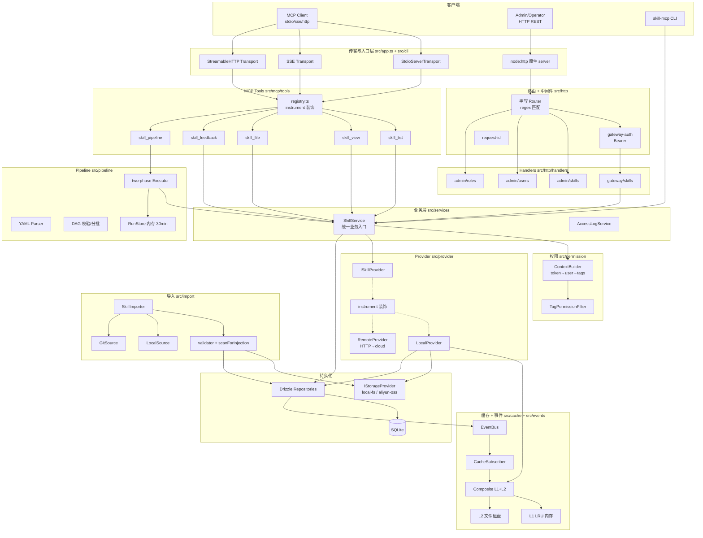
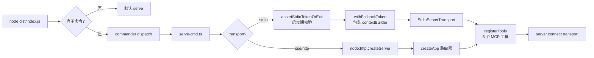
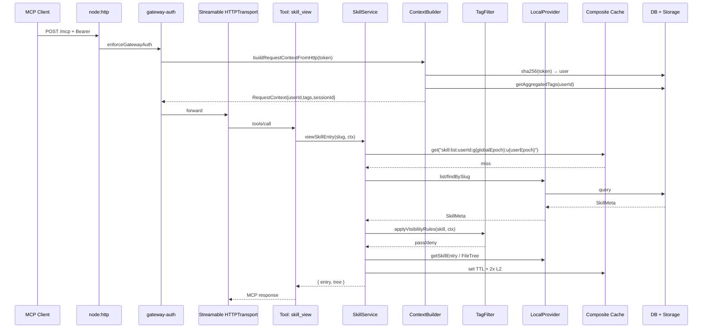
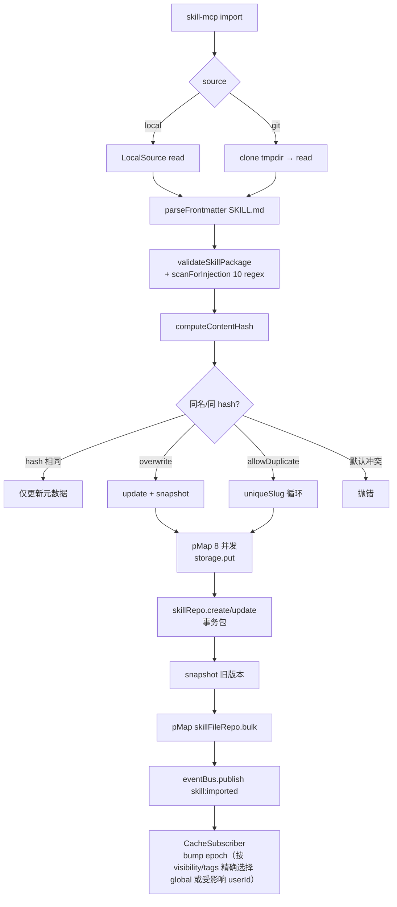
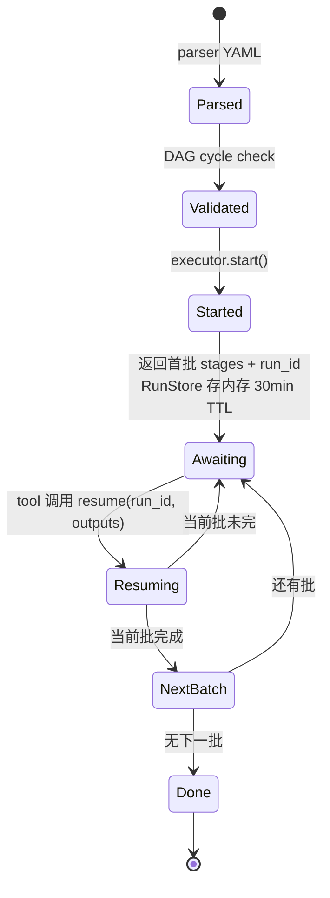

# Skill-MCP 架构技术文档（Single Source of Truth）

> **本文档是项目唯一、完整的技术架构文档。**
>
> **维护规则（强制）**：
> 1. 任何涉及**模块拆分、分层、依赖方向、接口契约、数据模型、部署形态、横切关注点（认证 / 缓存 / 事件 / 权限 / 配置）** 的代码变更，必须在同一 PR 中同步更新本文档。
> 2. 新增 / 删除 / 重命名 `src/` 一级目录、新增公共接口、变更环境变量语义、引入新依赖（运行时 npm 包），均触发更新。
> 3. 修复本文"已知问题清单"中的条目时，必须将该条目从清单中移除或标注 `已修复 (commit <sha>)`。
> 4. 文档结构禁止随意拆分：架构图、模块清单、关键流程、问题清单、优化路线图必须留在同一份文件，方便单点检索。
> 5. 与 `README.md` 的职责边界：README 面向使用者（怎么跑），本文档面向开发者与架构师（怎么实现、为何这样、还能怎样）。
>
> 最后审阅日期：2026-05-22 ｜ 当前对应 commit：`50122ec` (dev)

---

## 目录

1. [系统定位与设计目标](#1-系统定位与设计目标)
2. [整体架构（分层视图）](#2-整体架构分层视图)
3. [模块清单与职责边界](#3-模块清单与职责边界)
4. [核心运行流程](#4-核心运行流程)
5. [部署形态](#5-部署形态)
6. [数据模型](#6-数据模型)
7. [横切关注点](#7-横切关注点)
8. [实现细节核对表](#8-实现细节核对表)
9. [已知问题清单](#9-已知问题清单)
10. [优化路线图](#10-优化路线图)
11. [扩展点](#11-扩展点)
12. [文档变更日志](#12-文档变更日志)

---

## 1. 系统定位与设计目标

Skill-MCP 是一个 **Skill 包仓库 + MCP 协议网关**，负责：

- 把可重用的 "Skill 包"（`manifest.json` + `SKILL.md` + 资源文件）集中管理、版本化、按权限分发；
- 通过 MCP 协议（stdio / SSE / Streamable HTTP）把这些 Skill 暴露给 AI 助手；
- 通过 HTTP REST 暴露给运维、CI、SDK 客户端；
- 支持单进程独立部署，也支持网关 + 云存储的分布式部署。

设计目标优先级：**简洁 > 可观测 > 可扩展 > 性能**。
"单二进制双模"（standalone / gateway / cloud / mcp-only）是核心架构选择，详见第 5 节。

---

## 2. 整体架构（分层视图）



### 依赖方向（强制）

```
入口 / 传输 → 路由 → MCP Tools / Handlers → Services → Provider / Permission / Repo
                                              ↓
                                    Cache ←→ EventBus ←→ Storage / DB
```

**禁止**：
- Handler / Tool 跳过 Service 直接调 Repository（`admin/*` handler 当前破坏了这条规则，见第 9 节）。
- Repository 调 Service。
- Provider 调 HTTP Handler。
- Cache 反向调用 Service（应通过 EventBus）。

---

## 3. 模块清单与职责边界

| 一级目录 | 职责 | 关键文件 | 不能做什么 |
|---|---|---|---|
| `src/cli/` | 命令行入口、子命令分发 | `index.ts`, `commands/serve-cmd.ts`, `serve-stdio-auth.ts` | 写业务逻辑（必须委派给 Service） |
| `src/app.ts` | HTTP 服务器装配 + MCP transport 绑定 | `app.ts`（单文件） | 散落业务分支（当前已超 300 行，待拆分） |
| `src/mcp/` | MCP server / transport / tool 注册 | `server.ts`, `transport/index.ts`, `tools/registry.ts`, `tools/skill-*.ts` | 直接读 DB / 存储 |
| `src/http/` | 路由、中间件、HTTP handler | `router.ts`, `compose.ts`, `middleware/gateway-auth.ts`, `middleware/admin-auth.ts`, `middleware/error-map.ts`, `handlers/admin/*`, `handlers/gateway/*` | 业务逻辑（应转 Service） |
| `src/services/` | 业务编排：缓存、权限、日志、版本管理 | `skill.service.ts`, `access-log.service.ts` | 暴露 DB 实体类型给上层（当前 SkillMeta 泄漏） |
| `src/permission/` | 鉴权上下文构建 + 可见性过滤 | `context-builder.ts`, `tag-filter.ts` | 网络 IO 之外的业务逻辑 |
| `src/provider/` | Skill 数据源抽象 + Local/Remote 实现 + Proxy 指标装饰 | `interface.ts`, `local.provider.ts`, `remote.provider.ts`, `instrument.ts` | 包含权限判断（由 Service 注入） |
| `src/cache/` | 两层缓存（L1 LRU + L2 file）+ per-user epoch 失效 | `composite.provider.ts`, `memory-lru.provider.ts`, `file.provider.ts`, `cache-epochs.ts` | 直接订阅事件（由 cache-subscriber 桥接） |
| `src/events/` | 领域事件总线 + 缓存订阅器 | `event-bus.ts`, `cache-subscriber.ts` | 同步阻塞主流程的副作用 |
| `src/storage/` | 字节存储抽象（local-fs / aliyun-oss） | `provider.interface.ts`, `local-fs.provider.ts`, `aliyun-oss.provider.ts` | 业务字段语义 |
| `src/db/` | Drizzle schema + Repository + 迁移 | `schema.ts`, `repositories/*.ts`, `migrate.ts` | 跨表业务编排（属于 Service） |
| `src/import/` | 包导入流水线（local / git → validate → 入库） | `importer.ts`, `validator.ts`, `local-source.ts`, `git-source.ts` | 暴露 HTTP API（由 admin handler 调用） |
| `src/pipeline/` | Skill 编排 DAG（解析 / 校验 / 两阶段执行 / 运行存储） | `parser.ts`, `dag.ts`, `executor.ts`, `run-store.ts`, `context.ts` | 直接调用 LLM；只决定下一批待执行的 stage |
| `src/config/` | Zod 配置 schema + 单例加载 | `schema.ts`, `index.ts` | 在模块顶层做 IO（仅在 `getConfig()` 内） |
| `src/telemetry/` | Prometheus 指标 | `metrics.ts` | 业务逻辑 |
| `src/utils/` | 安全扫描、并发、错误、manifest、日志 | `security.ts`, `concurrency.ts`, `errors.ts`, `manifest.ts`, `logger.ts` | 引入跨模块依赖 |
| `src/prompt/` | 系统 prompt + 工具描述 | `system-prompt.ts`, `descriptions.ts` | — |
| `src/types/` | 跨模块共享类型 | `index.ts` | 引入实现细节类型 |

---

## 4. 核心运行流程

### 4.1 启动（CLI → Server）



**模式开关（互斥校验在 `serve-cmd.ts:42-46`）**：
- `DEPLOYMENT_MODE` ∈ `standalone | gateway | cloud`，cloud 拒绝 stdio。
- `MCP_ONLY_MODE=true` → 所有非 MCP 路径返 404（`app.ts:246`）。
- 三层判定 cloud 时禁用 MCP，冗余但保险。

### 4.2 一次工具调用（HTTP 模式完整链路）



### 4.3 Skill 导入



**已知缺陷**：~~storage 写与 DB 写跨边界无事务（见 9.3）~~ ✅ 已修复 (T-005, 2026-05-22)：改为 staging-commit — 文件先落到 `__staging__/<importId>/`，DB 写入完成后由 `storage.moveDir` 原子提交（local-fs 走 `fs.rename`，OSS 走 copy+delete）；任一步失败 try/catch 触发"先 DB 反向补偿、再清理 finalPath（仅 create 分支）+ finally 清理 staging"；`SkillFileRepository.replaceAll` 在单事务内完成 delete-then-bulk-insert，文件行替换原子化。

### 4.4 Pipeline 两阶段执行



Executor 不直接调用 LLM，而是返回"下一批待执行 stages"给上游 agent，由 agent 执行后通过 `resume(run_id, outputs)` 推进。这是异步、长运行场景的关键设计。

---

## 5. 部署形态

### 5.1 四种模式

| 模式 | `DEPLOYMENT_MODE` | Transport | API 路由 | MCP 可用 | 用途 |
|---|---|---|---|---|---|
| Standalone | `standalone` | stdio / http | Admin + Gateway | ✅ | 本地开发、小规模一体化部署 |
| Gateway | `gateway` | stdio / http | 仅 Gateway | ✅ | 路由层，转发到远端 cloud service |
| Cloud | `cloud` | http only | Admin + Gateway | ❌ | 纯数据服务，不暴露 MCP |
| MCP-only | 任意 + `MCP_ONLY_MODE=true` | stdio / http | 无（仅 /mcp） | ✅ | 客户端面向的最小攻击面端点 |

### 5.2 三种典型场景

| 场景 | 模式 | Transport | 适用 |
|---|---|---|---|
| A | standalone | stdio | 本地开发 |
| B | gateway → standalone | stdio → http | 混合（本地路由 + 远端存储） |
| C1 | standalone | http | 单 HTTP 服务 |
| C2 | gateway → gateway → cloud | http → http → http | 分布式生产（推荐） |

完整 env 模板见仓库根 `.env.example` 和 `.env.production.example`。

### 5.3 设计动机

文档（旧 `tech-dev-program.md`）建议 Gateway 与 Cloud Service 分仓两套服务。本项目选择**单二进制 + 配置驱动模式**：
- 简化开发与测试（无 IPC 复杂度）
- 单 Docker 镜像即可
- 通过 LB 分别部署即可达到分布式效果
- ISkillProvider 抽象保证两种部署方式接口一致

---

## 6. 数据模型

### 6.1 表结构

| 表 | 关键列 | 索引 | 外键 |
|---|---|---|---|
| `skills` | `id` PK / `slug` UNIQUE / `name` / `version` / `contentHash` / `storagePath` / `status` / `visibility` / `entryFile` | `idx_skills_{slug,name,status,visibility}` | — |
| `skill_tags` | `(skillId, tag)` 复合 PK | `idx_skill_tags_tag` | → `skills` CASCADE |
| `skill_files` | `id` / `skillId` / `filePath` / `fileType` / `fileSize` / `mimeType` | `idx_skill_files_skill_id` | → `skills` CASCADE |
| `skill_versions` | `id` / `skillId` / `version` / `contentHash` / `storagePath` / `fileCount` | `idx_skill_versions_*` | → `skills` CASCADE |
| `skill_feedbacks` | `id` / `skillId` / `skillSlug` / `outcome` / `context` | `idx_feedbacks_*` | → `skills` CASCADE |
| `access_logs` | `id` / `skillId` / `skillSlug` / `action` / `latencyMs` | `idx_access_logs_created_at` | → `skills` **❌ 无 CASCADE** |
| `users` | `id` / `token` UNIQUE / `name` / `status` | `idx_users_token` | — |
| `roles` | `id` / `name` UNIQUE / `tags` JSON | — | — |
| `user_roles` | `id` / `(userId, roleId)` | `idx_user_roles_user_id` | → users, roles CASCADE |

### 6.2 关键约束

- Skill 的物理目录由 `slug` 决定：`STORAGE_BASE_PATH/{slug}/`，`skills.storage_path` 存相对路径。
- 同名（`name`）冲突 → 默认拒绝；`--overwrite` / `--allow-duplicate` 改变行为。
- 版本变化由 `contentHash` 驱动，不是手填 version 号。
- Token 永远以 `sha256(token)` 形式入库，`users.token` 列存的是 hash。

### 6.3 已知缺陷

见 9.4 / 9.5 / 9.6。

---

## 7. 横切关注点

### 7.1 配置（`src/config/`）

- 单例 `getConfig()`：env 变量 → 文件（`SKILL_MCP_CONFIG`）→ schema defaults，逐层 deepMerge。
- Zod 严格 schema（`schema.ts`），enum / discriminatedUnion / URL 校验。
- 启动期 mkdir DB / storage / cache 目录，失败仅 debug log 不阻断（**风险**：磁盘满或权限错时延后失败）。

### 7.2 鉴权与权限

```
┌─ stdio ─→ assertStdioTokenOrExit (启动期) → withFallbackToken (注入 contextBuilder)
├─ http /api/gateway/* ─→ enforceGatewayAuth 中间件 (每请求) → buildRequestContextFromHttp
└─ http /api/admin/*   ─→ enforceAdminAuth   中间件 (每请求) → buildRequestContextFromHttp + 强制 tags ⊇ {admin:write}
                                                  ↓
                                       sha256(token) → users → user_roles → roles.tags → Set<string>
                                                  ↓
                                          RequestContext{userId, sessionId, tags, isAuthenticated}
                                                  ↓
                                       TagPermissionFilter
                                          ├─ visibility=public   → 任意认证用户
                                          ├─ visibility=internal → 任意认证用户
                                          └─ visibility=private  → 空 tags 即认证可见；非空需交集
```

- 仅 `/api/gateway/health` 跳过认证（探针）。
- `/api/admin/*` 必须携带 Bearer Token，且其聚合 tag 集合必须包含 `admin:write`：
  - 无 token → `401 Authentication required`
  - token 无效 / user 已 disabled → `401 Invalid or expired token`
  - 已认证但缺 `admin:write` → `403 Admin privilege required`
  - 通过后 `RequestContext` 注入 `HttpContext.requestContext`
- 向后兼容逃生口：`SKILL_MCP_ADMIN_AUTH_OPTIONAL=true`（对应 `config.auth.adminAuthOptional`）令 admin 路由匿名放行（伪 `RequestContext{userId:"anonymous-admin", isAuthenticated:false, tags:{admin:write}}`），仅供"原本依赖网络隔离"的旧部署滚动迁移；启用时启动期会打 warn 日志，计划在后续版本移除。
- API Key 已废弃，全部改为按用户的 Bearer Token。
- **MCP 传输鉴权直通**（T-738）：HTTP / SSE 两个 MCP 传输在 `handleRequest` / `handlePostMessage` 之前调用 `attachMcpAuthFromHeaders(req)`，把 `Authorization: Bearer …` 桥接到 SDK 约定的 `req.auth.token`。MCP SDK 据此填 `extra.authInfo`，`createContextBuilder` 再走与 HTTP 中间件相同的 `resolveContextForToken` 解析路径。如果不挂这一步，SDK 永远拿到空 `authInfo`，所有 MCP 调用退化 anonymous，多租户隔离失效。

### 7.3 缓存

- 两层：`MemoryLRU`（默认 500 条）→ `FileCache`（磁盘）。
- L2 TTL = L1 TTL × `CACHE_L2_TTL_MULTIPLIER`（默认 2）。
- read-promotion：L2 命中后以剩余 TTL 提升至 L1，确保 L1 不晚于 L2 过期。
- 写策略：`set()` 同时写 L1 + L2，无 write-back。
- 缓存键约定（**修改前必读**）：
  - `skill:list:{userId}:g{globalEpoch}:u{userEpoch}` — 按用户隔离的可见 skill 元数据列表，由 `CacheEpochManager` 管理版本后缀（T-102）。任意 mutation 不再 `clearByPrefix`，而是 bump 对应 epoch，让旧 key 自然 TTL 过期；list 缓存失效从 O(n) prefix 扫描降到 O(1) 整数自增。
  - `skill:entry:{slug}` — 入口文件渲染结果
  - `skill:file:{slug}:{path}` — 单文件
  - `skill:files:{slug}:{joined-paths}` — 批量文件（注意路径顺序敏感）
  - `skill:filetree:{slug}` — 文件树
- 失效策略（`CacheSubscriber` + `CacheEpochManager`）：
  - `skill:entry:*` / `skill:file:*` 仍走 `clearByPrefix(slug)`（单 slug 量极小）。
  - `skill:list:*`：按事件 `visibility` + `tags` 计算受影响用户：
    - `visibility=public/internal` 或 `private+空 tags` → bump global epoch（影响所有用户）。
    - `visibility=private+非空 tags` → 通过 `roleRepo.findAll()` + `userRoleRepo.findUserIdsByRoleId()` 找到 tag 交集用户集合，仅 bump 这些用户的 epoch；其他用户缓存继续命中。
    - 事件缺 visibility/tags（向后兼容）或 repos 缺失 → 保守 bump global。
  - `user:roles_changed` → bump 该用户 epoch；`role:updated` → bump `affectedUserIds`。

### 7.4 事件

- `EventBus`（基于 Node EventEmitter，**同步派发**）。
- 事件类型：`skill:created/updated/deleted/imported`、`user:roles_changed`、`role:updated`。
- listener 异常会中断派发链（见 9.18）。

### 7.5 日志与指标

- pino 结构化日志，`LOG_LEVEL` 控制级别。
- Prometheus 指标暴露在 `/metrics`：HTTP 路由/方法/状态/耗时、provider_latency（按 method + status）、缓存 hit/miss（**待补**）。
- 访问日志写 `access_logs` 表，由 `AccessLogService` 异步处理；当前所有调用点用 `.catch(() => {})` 静默吞错（见 9.10）。

### 7.6 安全

- `scanForInjection`（`utils/security.ts`）：10 条正则，扫 manifest 与 SKILL.md。无开关，固定执行。
- `validateFilePath`：segment-aware 检查，拒绝 `..` 段与绝对路径前缀；合法文件名包含 `..` 子串（如 `foo..bar.md`、`v1..2/notes.md`）通过（T-735）。
- `isTextFile` / `getMimeType`：白名单扩展名。
- token 长度上限：1024 字节（**长 JWT 会被拒**，见 9.19）。
- HSTS：`SECURITY_HSTS_ENABLED=true`（对应 `security.hstsEnabled`）才发 `Strict-Transport-Security` 头，默认关闭。仅当前置 TLS 终结器（nginx / ALB / CDN）存在时才打开；纯 HTTP 部署若错误开启会让浏览器把后续 `http://` 强制升级到不存在的 HTTPS（T-737）。

---

## 8. 实现细节核对表

逐项确认当前实现是否符合预期。**❌ 表示偏离设计**。

| 模块 | 设计要点 | 是否符合 |
|---|---|---|
| 入口 / CLI | commander 默认 serve；stdio 启动期 token 防隐式公开 | ✅；admin 路由仍未补认证 |
| HTTP | 无框架，手写 regex 路由 | ⚠️ 简洁但无中间件链，handler 散落 try-catch |
| MCP 工具 | 5 个工具硬编码 + instrument Proxy 包指标 | ✅ 修改 `registry.ts:31-43` 即影响所有工具 |
| 认证 | sha256(token) → users，roles.tags JSON 聚合到 Set | ✅；token 1024B 上限对长 JWT 不友好 |
| 权限过滤 | public / internal / private（空 tags = 认证即可见） | ✅ |
| SkillService | 缓存 key `skill:list:{userId}:g{globalEpoch}:u{userEpoch}`，先权限后缓存；公共出口（`listAccessibleSkills` / `getAccessibleSkillMeta`）返回 `SkillMetaPublic` | ✅ T-302 已修复（2026-05-22） |
| LocalProvider | DB 优先 → fallback 遍历存储 | ✅ |
| RemoteProvider | 重试覆盖 AbortError / TypeError | ❌ HTTP 5xx 不进入重试 |
| Composite Cache | L1 LRU + L2 文件，read-promotion | ✅；L2 无 GC、LRU 前缀清除 O(n) |
| CacheSubscriber | skill 变更 → 按 `visibility/tags` 精确 bump epoch（公共/无 tag → global；私有+tag → 仅 tag-交集用户） | ✅ T-102 已修复 |
| EventBus | EventEmitter 同步发布 | ⚠️ listener 异常断链 |
| 数据库 | Drizzle + better-sqlite3，关系正常 | ⚠️ access_logs 缺 CASCADE；user_roles 缺 role_id 索引；skills.slug UNIQUE+INDEX 重复 |
| SkillRepository | 含事务，但 findById 后再查 skill_tags | ⚠️ N+1（批量场景需 findByIds） |
| UserRoleRepository | replaceUserRoles 循环 INSERT | ⚠️ 应改 batch |
| Importer | staging-commit：`pMap` 写 `__staging__/<importId>/` → `moveDir` 原子提交 → `replaceAll` 单事务写 file 行 | ✅ T-005 (2026-05-22)：`IStorageProvider.moveDir` + try/catch/finally 跨边界补偿；snapshot 失败仍仅 warn（属 9.17，下次专门修） |
| LocalFsProvider | `join(fullPath, "..")` 取上级目录 | ❌ **bug**：应为 `dirname(fullPath)` |
| AliyunOss | 分页 list / put / delete | ✅；list 返回路径与 LocalFs 不一致 |
| Pipeline | YAML + DAG + two-phase | ✅ T-203 (2026-05-22)：`pipeline_runs` 表落库 + JSON 重水合；`condition` / `retry` schema-only 字段删除；表达式支持嵌入式 stringify 拼接 |
| Migration | drizzle baseline + legacy upgrade | ⚠️ legacy upgrade 缺测试路径 |
| `src/http/context.ts:3` | 类型导入 | ❌ **路径错误**：`../types/index.js` 应为 `../../types/index.js` |

---

## 9. 已知问题清单

修复后请将条目移除或标注 `已修复 (commit <sha>)`。

> **每条问题的完整上下文（修复方案、验收标准、依赖关系、工作量估算）见 [`docs/REFACTORING_BACKLOG.md`](./REFACTORING_BACKLOG.md)。后续优化以该文档为准逐项推进。**

### 🔴 高危

| # | 位置 | 描述 |
|---|---|---|
| 9.1 | `src/http/context.ts:3` | ❎ 误报已关闭（2026-05-22），`src/http/` 下使用单层 `..` 解析正确 |
| 9.2 | `src/storage/local-fs.provider.ts:35` | ✅ 已修复 (2026-05-22)，改用 `dirname(fullPath)` |
| 9.3 | `src/import/importer.ts:166-214` | ✅ 已修复 (2026-05-22, T-005)：`IStorageProvider.moveDir` + staging-commit 模式 — 文件先落 `__staging__/<importId>/`，DB 写完后由 `moveDir`（local-fs 是 `fs.rename`，OSS 是 copy+delete 循环）原子提交；`SkillFileRepository.replaceAll` 单事务 delete-then-bulk-insert；`try/catch/finally` 失败时按"DB 反向补偿 → 回滚 finalPath（仅 created）→ 永远清 staging"顺序回收，并发导入靠 `randomUUID` staging 隔离；新增 `tests/unit/import/importer-rollback.test.ts` 覆盖 5 条失败注入路径。 |
| 9.4 | `drizzle/0000_baseline.sql:11` | ✅ 已修复 (2026-05-22)，迁移 0001 重建表加 `ON DELETE CASCADE` |
| 9.5 | `src/app.ts:284` 周边 | ✅ 已修复 (2026-05-22)，新增 `enforceAdminAuth` 中间件强制 `admin:write` 标签；`SKILL_MCP_ADMIN_AUTH_OPTIONAL=true` 仅作迁移逃生口 |
| 9.29 | `src/utils/manifest.ts:46-94` | ✅ 已修复 (995ad70, 2026-05-22, T-601)：`safeJoin(base, child)` + `lstatSync` symlink skip + `MAX_WALK_DEPTH=16` / `MAX_FILES_PER_PACKAGE=1000` / `MAX_BYTES_PER_PACKAGE=50MB` |
| 9.45 | `src/mcp/server.ts:9-28` + `src/prompt/system-prompt.ts` | ✅ 已修复 (2026-05-26, T-739)：`createMcpServer` 不再调 `skillProvider.listSkills()` 把 published skill 拼进 `instructions`；改为 `buildSkillSystemPrompt()` 静态指引模板，目录发现完全交给 RBAC-aware 的 `skill_list` 工具。修复前匿名 `initialize` 即可枚举所有已发布 skill 的 slug + description（绕过 `TagPermissionFilter`）。回归 +2（unit 重写 + integration `initialize.instructions` 黑盒断言）。 |

### 🟠 中危

| # | 位置 | 描述 |
|---|---|---|
| 9.6 | `src/events/cache-subscriber.ts` | ✅ 已修复 (2026-05-22, T-102)：引入 `CacheEpochManager`，事件携带 `visibility`+`tags`，subscriber 按 visibility 选择 global bump 或仅 bump tag-交集用户。失效复杂度 O(prefix scan) → O(1) integer bump。 |
| 9.7 | `src/provider/remote.provider.ts:56` | ✅ 已修复 (2026-05-22, T-205)：`fetchWithRetry` 状态码驱动 — 4xx（除 429）立即失败；429 honoring `Retry-After`；502/503/504 + 其它 5xx 走指数退避 + full jitter；500 仅重试一次；`retryMaxDelay=30s` 防恶意 Retry-After 阻塞；新增 `UpstreamError` (502)；12 个 vitest 用例。 |
| 9.8 | `src/services/skill.service.ts:332-366` | ✅ 已修复 (2026-05-22, T-207)：staging-commit 化 — 目标版本先落 `__staging__/<runId>/`，per-file 覆盖到 live 路径，DB 原子 update 最后做，`await` 缓存失效；任何阶段失败都从 pre-rollback snapshot 回滚（storage 先、DB 后），`finally` 永远清理 staging。新增 3 条失败注入单测。 |
| 9.9 | `src/import/importer.ts:294` | ✅ 已修复 (2026-05-22, T-202)：drizzle 迁移 0002 给 `skills` 加 `(name, content_hash) WHERE content_hash IS NOT NULL` partial UNIQUE；`SkillRepository.findByNameAndHash` 暴露幂等键查询；`SkillImporter.import()` 改成 DB-write-before-storage-commit + 重试循环：UNIQUE 冲突时优先用 `findByNameAndHash` 短路并发 winner（跳过 moveDir/replaceAll），否则在 `allowDuplicate=true` 时 `uniqueSlug` 重拼最多 5 次。新增 `tests/unit/import/importer-idempotent.test.ts`（5 用例）+ `skill-repository.test.ts` 4 用例。 |
| 9.10 | `src/services/skill.service.ts:144,200,232` | 🟢 设计权衡 (2026-05-25)：access log 是 fire-and-forget 审计副作用，写失败不应当 fail 用户请求；调用点保留 `.catch(() => {})`，但 AccessLogService 内部已带 `logger.warn`，错误不会"完全无声"。无修复动作。 |
| 9.11 | `src/db/repositories/skill.repository.ts:38` | ✅ 已修复 (2026-05-22, T-204)：新增 `findByIds(ids)` 走单次 IN + tags 单次 IN + JS group，空数组短路；`loadTagsForIds([])` 已有空数组 guard（确认） |
| 9.12 | `src/db/repositories/user-role.repository.ts:48` | ✅ 已修复 (2026-05-22, T-204)：`replaceUserRoles` 改为 `db.transaction` 内一条 DELETE + 一条 batch INSERT；新增迁移 `0003_user_roles_role_idx.sql` 补 `user_roles(role_id)` 索引 |
| 9.13 | `src/pipeline/types.ts:19-22` | ✅ 已修复 (2026-05-22, T-203)：`StageDefinition` 删除 `condition` / `retry` 两个 schema-only 字段；parser 检测到时打印 warn 提示作者未生效 |
| 9.14 | `src/pipeline/run-store.ts` | ✅ 已修复 (2026-05-22, T-203)：drizzle 迁移 `0004_pipeline_runs.sql` 新增 `pipeline_runs` 表（definition/inputs/batches/completedStages 全 JSON 落库 + status / started_at 索引）；`PipelineRunStore` 改为内存 write-through + 可选 `PipelineRunRepository` DB 后端，`getRun` 缓存 miss 时按 `pipeline.stages` 重建 `DAGScheduler`、按 inputs + completedStages replay 重建 `ExecutionContext`；TTL 既走 in-memory createdAt 又走 DB `started_at`（每次 createRun 由 `deleteOlderThan` 自动清理）|
| 9.15 | `src/app.ts` SSE handler | ✅ 已修复 (2026-05-22, T-206)：SSE 会话记录 `lastActivity`，5 min sweepTimer（unref）回收 idle > 30 min 的连接；HTTP/SSE 两路径同步增减 `skill_mcp_active_sessions{transport}` Gauge |
| 9.16 | `src/services/skill.service.ts:61-71` | ✅ 已修复 (2026-05-22, T-302)：新增 `SkillMetaPublic` + `toSkillMetaPublic`，缓存与 admin/gateway 公共响应一律映射为 DTO，`storagePath` / `contentHash` 不再出现在客户端 JSON 中 |
| 9.17 | `src/import/importer.ts:331` | 🟢 设计权衡 (2026-05-25)：`snapshotCurrentVersion` 是 best-effort 版本保留，失败仅意味"上一版历史不可回滚到"，不破坏当前导入。强制失败会让历史 snapshot 异常阻塞正常 import，得不偿失。warn 已足以触发告警。无修复动作。 |
| 9.30 | `src/db/schema.ts:89-97` | ✅ 已修复 (995ad70, 2026-05-22, T-602)：drizzle 迁移 0005 清理脏数据后 `CREATE UNIQUE INDEX uk_user_roles_user_role`，schema 改为 `uniqueIndex`，repository `replaceUserRoles` 入参先 `[...new Set(...)]` |
| 9.31 | `src/import/git-source.ts:21-26` | ✅ 已修复 (995ad70, 2026-05-22, T-603)：`GIT_URL_RE` / `GIT_BRANCH_RE` 白名单校验 + `git.raw(["clone", "--depth", "1", "--", repoUrl, tmpDir])` 显式 `--` 分隔符 |

### 🟡 低危

| # | 位置 | 描述 |
|---|---|---|
| 9.18 | `src/events/event-bus.ts:16` | ✅ 已修复 (2026-05-22)，listener 异常 try/catch 隔离，async listener 拒绝独立 catch |
| 9.19 | `src/permission/context-builder.ts:61` | ✅ 已修复 (2026-05-22)，token 上限提到 4096B 与 header cap 对齐 |
| 9.20 | `src/cache/file.provider.ts` | ✅ 已修复 (2026-05-22, T-403)：`FileCacheOptions.gcIntervalMs`（默认 10 min，`unref()`）周期触发 `runGc()`；走 keyIndex 清过期 + 自愈损坏 entry；新增 `cache_gc_runs_total` / `cache_gc_evicted_total` / `cache_gc_duration_seconds` 三指标 |
| 9.21 | `src/cache/memory-lru.provider.ts:52` | ✅ 已修复 (2026-05-22, T-404 / T-102)：list 缓存切到 epoch O(1) 失效，不再触发 prefix 扫描；entry/file 缓存仍走 prefix 但单 slug 量极小，O(n) 实际 n 小可控。LRU `clearByPrefix` 实现保留为 fallback。 |
| 9.22 | `src/pipeline/context.ts:54` | ✅ 已修复 (2026-05-22, T-203)：整段命中保留原生类型，嵌入式 `${{ }}` 走全局 replace 时 stringify 拼接，缺失值嵌入时为空串、非法路径仍抛错 |
| 9.23 | `drizzle/0000_baseline.sql:97` | ✅ 已修复 (2026-05-22)，迁移 0001 删除冗余 `idx_skills_slug` |
| 9.24 | `src/storage/aliyun-oss.provider.ts` vs `local-fs` | ✅ 已确认对齐 (2026-05-22)，二者均返回 `list()` 时去掉前缀 |
| 9.25 | `src/import/git-source.ts:39` | ✅ 已修复 (2026-05-22)，tmpdir 清理失败改为 logger.warn |
| 9.26 | `src/http/helpers.ts:55` | ✅ 已修复 (2026-05-22, T-409 / T-101)：`requireSlug(ctx, paramName?)` helper 收口；admin/gateway handler 全部替换为 helper 调用；唯一保留直用是 `gateway/skills.handler.ts:47` 的 `slug-or-uuid` 多态识别（语义不同，保留合理）。 |
| 9.27 | `src/db/repositories/skill.repository.ts:185-195` | ✅ 已确认 (2026-05-22)，已有 `if (skillIds.length === 0) return new Map()` guard |
| 9.28 | `src/storage/local-fs.provider.ts:49-55` | ✅ 已修复 (2026-05-22, T-411 / T-005)：staging-commit 模式把并发导入隔离到 `__staging__/<randomUUID()>/`，最终走 `moveDir` 原子重命名；`deleteDir` 仅在 finally 兜底清理已移走的 staging 路径，不再有并发同 slug 竞争；ENOENT 已 swallow。 |
| 9.32 | `src/cache/file.provider.ts:98-122` | ✅ 已修复 (995ad70, 2026-05-22, T-604)：懒加载 `keyIndex: Map<key, hashedFilename>`，set/delete 增量维护，`clearByPrefix` 稳态成本 O(matched) |
| 9.33 | `src/provider/remote.provider.ts` | ✅ 已修复 (995ad70, 2026-05-22, T-605)：`zod` 边界 schema + `validateOrThrow` 抛 `UpstreamError` 并 `metrics.remoteValidationErrors.inc({method})` |
| 9.34 | `src/provider/remote.provider.ts:21-50` | ✅ 已修复 (5f46a26, 2026-05-22, T-606)：T-605 schema 把 `storagePath`/`contentHash` 列为必填，但 gateway HTTP API 返回的是 `SkillMetaPublic`（裁剪过这两字段），导致 gateway 模式 502；boundary schema 与公共 DTO 对齐 |

#### 第 3~6 轮代码审计加固（T-701 ~ T-717，2026-05-22 ~ 05-23）

第 7~10 批共 4 轮 4 域并行审计，命中 14 项实修条目（去重 + 误报过滤后）。每条已在 BACKLOG 阶段 6~9 中独立追踪，§12 changelog 也分批登记，下面只做索引：

| # | 批次 | 范围 | ID | 关键改动 |
|---|---|---|---|---|
| 9.35 | 第 7 批 (commit 来自第 7 批) | 多租户 SSE / HTTP body / pipeline parallel | T-701 / T-702 / T-703 | SSE 单会话 fallback 删除（防跨租户劫持）；HTTP MCP transport `readBody(req, 10MiB)` body 上限；`PipelineExecutor` 同 batch 内 `viewSkillEntry` 改 `Promise.all` 并发 |
| 9.36 | 第 8 批 (a763e44) | OSS 分页 / metrics 鉴权 / pipeline resume / run-store 上限 | T-706 / T-707 / T-709 / T-710 | `AliyunOssProvider.list` 改 do-while 分页（防 1000 条静默截断）；`/metrics` 默认走 `enforceAdminAuth`；`PipelineExecutor.resume` 加 per-runId promise chain 串行化；`PipelineRunStore` 加 `maxRuns=10000` LRU |
| 9.37 | 第 9 批 (47f18cb) | manifest 字段上限 / rollback 缓存 / role 解析 / feedback 上限 | T-705 / T-711 / T-712 / T-713 | `validateSkillMeta()` 加 6 项字段上限（防单字段放大攻击）；rollback 缓存失效改 try/catch 防误触发补偿性还原；`RoleRepository.parseTags` 显式 catch + 计数；`SkillFeedbackRepository.findBySlug` 默认 `limit=1000` + `ORDER BY createdAt DESC` |
| 9.38 | 第 10 批 (9907179) | 权限聚合解析 / feedback 鉴权 / access-log 解析 / sessionId 上限 | T-714 / T-715 / T-716 / T-717 | `UserRoleRepository.getAggregatedTagsByUserId` 复用 T-712 模式；`SkillService.submitFeedback` 升级为 `resolveAccessible`；`AccessLogRepository.findBySkill` row-level try/catch；`mcp-session-id` 加 128 字符 + 白名单上限 |
| 9.39 | 第 11 批 (2026-05-25) | HTTP MCP 会话生命周期 / git-source subDir 归一化 | T-718 / T-719 | `http-transport.ts` 删 `req.on("close")` 即时清理（每 POST 完成都会触发，使 session map / idle reaper 失去长会话语义）；改由 30 min idle reaper + `DELETE /mcp` 双轨；`git-source.ts` `subDir` `resolve` 后断言落在 tmpDir/ 之内，越界 `BadRequestError` |
| 9.40 | 第 12 批 (2026-05-25) | cache-subscriber unhandledRejection / skill attributes JSON 形状与可观测性 | T-720 / T-721 | `cache-subscriber.ts` `clearByPrefix` 包 `.catch(warn)` 防 rejection 逃逸（epoch bump 解耦继续推进）；`skill.repository.ts` `parseAttributes` 替代旧 `parseJson<T>`：corrupt / 非对象 JSON 返回 `{}` 而非 `[]`，`logger.warn` + 新增 `skill_mcp_skill_row_json_parse_errors_total{column}` Counter，与 T-712 `roleTagsParseErrors` 平行 |
| 9.41 | 第 13 批 (2026-05-26) | git/http 导入字段上限 / rollback 文件清理与索引一致性 | T-722 / T-723 / T-724 | `manifest.ts` 抽 `validateSkillMetaFields` 复用 T-705 上限 + tag 数组形状，`importer.ts` git/http 分支 `parseFrontmatterFromFiles` 后立刻调用（与 local-fs 等价拦截）；`SkillService.rollbackToVersion` 在 commit 阶段先按 `versionFiles` 反查 `stalePaths` 调 `storage.delete`（防回滚后 vY 之后新增文件残留），再走 per-file overwrite；并新增第 10 构造参数 `skillFileRepo`，post-commit 调 `replaceAll` 把 `skill_files` 索引刷成 target 版本快照（与 importer 同模式，避免 `LocalSkillProvider.getSkillFileTree` 返回陈旧索引） |
| 9.42 | 第 14 批 (2026-05-26) | 读路径并发上限 / paths 入参校验 / feedback 字段上限 / repo update 允许列收口 | T-725 / T-726 / T-727 / T-728 | `local.provider.ts` `getSkillFiles` 用 `pMap(filePaths, STORAGE_CONCURRENCY=8, ...)` 替换裸 `Promise.all`，与 importer / rollback 并发预算对齐；`http/helpers.ts` 抽 `requireFilePaths(value)` 共享 helper（拒绝非数组 / 空 / 长度 > 100 / 含非字符串元素，全部 `BadRequestError → 400`），admin / gateway `/skills/:slug/files` 改用同一 helper；`mcp/tools/skill-feedback.ts` zod 加 `context.max(2000)` / `agent_comment.max(8000)` / `skill_slug.max(255)` + `SkillService.submitFeedback` 同等数值的服务层 backstop，覆盖未来非 MCP 传输路径；`skill.repository.ts` `update` 允许列移除 `storagePath` / `contentHash`（这两列由 importer / rollback 计算），admin PUT 透传 `storagePath: "../evil/"` 一类 payload 被静默忽略 |
| 9.43 | 第 15 批 (2026-05-26) | T-728 修复点修正：投影下移到 admin handler 边界 | T-728 (修正) | 第 14 批从 repo `update` 允许列里整体删除 `storagePath` / `contentHash` 误伤了系统调用方：importer 更新分支 (`importer.ts:245-253`) 与 rollback 提交 + 补偿 (`skill.service.ts:432-435 / 486-489`) 传入的 `contentHash` / `storagePath` 被静默丢弃 → rollback 后 DB hash 与磁盘内容偏离，T-722 idempotency 键失效。本批回滚 repo 层允许列变更，把字段投影下移到 admin handler 边界：`http/handlers/admin/skills.handler.ts` PUT 在传给 `skillRepo.update` 之前先按 `ADMIN_PUT_ALLOWED = [description, displayName, version, category, attributes, status, visibility, entryFile, tags]` 显式投影；新增 `tests/unit/http/admin-skills-put.test.ts` 在 handler 边界断言投影 |
| 9.44 | 第 16 批 (2026-05-26) | 缓存键稳定序列化 / storage 层纵深防御 / role 删除事件补齐 | T-729 / T-730 / T-731 | `remote.provider.ts` `getSkillFiles` 缓存键由 `safePaths.join(",")` 改成 `JSON.stringify(safePaths)`（修复 `["a,b.md"]` 与 `["a","b.md"]` 跨请求串数据）；`local-fs.provider.ts` 加 `safeResolve(path)`，每个 IO 方法入口先把 `path.resolve(resolvedBase, path)` 落点断言在 `resolvedBase` 之内（分层防御最后一道，上层 `validateFilePath` 是第一道）；admin `DELETE /api/admin/roles/:roleId` 与 PUT 对齐——cascade 之前先 `findUserIdsByRoleId` 抓受影响 user 集合，删除成功后 publish `role:updated` 让 cache subscriber 对这批 user 做 `epochs.bumpUsers`，关闭"删 role 后这些 user 的 `skill:list:${userId}` 缓存按旧聚合 tag 集合继续命中"窗口 |

---

## 10. 优化路线图

按 ROI 排序。每完成一项需更新本节并对应清理第 9 节。

> **逐项执行细节（步骤、验收、依赖）见 [`docs/REFACTORING_BACKLOG.md`](./REFACTORING_BACKLOG.md)，本节仅作概览。**

### 阶段 1（立即修，1-2 周）

1. ~~修第 9.1 / 9.2 / 9.4 / 9.5 / 9.3（高危五项）。~~ ✅ 全部完成 (9.5 → T-004, 9.3 → T-005, 其余早期修复)。
2. ~~**HTTP 中间件抽象**~~ ✅ 已修复 (2026-05-22)：`src/http/compose.ts` 提供 koa-style `Middleware` 与 `compose()`；`errorMap` 中间件统一翻译 `AppError` → HTTP；`requireSlug(ctx)` / `readJsonBody<T>` 替代散落的 inline 校验；handler 行数 -29.4%。requestId 中间件统一仍在 T-301 拆分 app.ts 时合并。
3. ~~**缓存失效精细化**~~ ✅ 已修复 (2026-05-22, T-102)：方案 A（per-user epoch）落地。`src/cache/cache-epochs.ts` 提供 `CacheEpochManager`；list 缓存 key 改为 `skill:list:{userId}:g{globalEpoch}:u{userEpoch}`，subscriber 按 `visibility/tags` 精确选择 global vs per-user bump，失效从 O(prefix scan) → O(1)。`FileCache` 周期 GC 仍待做（lazy-on-get 删除已工作，单独排期）。

### 阶段 2（中期，2-4 周）

4. **Service 层错误分类**：定义 `SkillError` 子类型（`NotFound` / `Forbidden` / `Conflict` / `Upstream`），handler 统一 errorMap，去掉散落 try-catch。
5. ~~**导入幂等化**~~ ✅ 已完成 (2026-05-22, T-202)：drizzle 0002 加 `(name, content_hash) WHERE content_hash IS NOT NULL` partial UNIQUE；importer 改 DB-write-before-storage-commit 顺序，UNIQUE 冲突时优先 `findByNameAndHash` 短路并发 winner（跳过 moveDir/replaceAll），否则 `allowDuplicate` 路径 `uniqueSlug` 重拼最多 5 次。
6. ~~**Pipeline 落库**~~：✅ 已完成 (T-203, 2026-05-22)。`pipeline_runs` 表（JSON-blob 列承载 definition / inputs / batches / completed_stages，rebuild 时 replay 落 `ExecutionContext` + reconstruct `DAGScheduler`）替代纯内存 RunStore；`retry` / `condition` 已从 schema 删除；表达式支持整段保留原生类型 + 嵌入式 stringify 拼接。
7. ~~**Repo 批量化**~~ ✅ 已完成 (2026-05-22, T-204)：`SkillRepository.findByIds` 单次 IN + tags 单次 IN；`UserRoleRepository.replaceUserRoles` 单事务 DELETE + batch INSERT；新增 `idx_user_roles_role_id`。
8. **Remote Provider 重试策略**：状态码驱动（429 / 5xx 重试 + 抖动；4xx 立即失败）。

### 阶段 3（长期，1-2 月）

9. ~~**拆分 `app.ts`**~~ ✅ 已完成 (2026-05-22, T-301)：347 行单文件拆为 `app-dependencies.ts`（类型）+ `mcp/transport/http-transport.ts`（HTTP MCP + reaper + gauge）+ `mcp/transport/sse-transport.ts`（SSE MCP + reaper + gauge）+ `http/server.ts`（请求分发 / auth / metrics）；`app.ts` 仅 72 行 orchestrator。新增 `tests/unit/http/server.test.ts` (6) + `tests/unit/mcp/transport-factory.test.ts` (5)。
10. ~~**DTO 与实体分离**：定义 `SkillMetaPublic`，对外接口禁止暴露 `storagePath` / `contentHash`。~~ ✅ 已完成 (2026-05-22, T-302)：`SkillMetaPublic` + `toSkillMetaPublic` 落地，admin/gateway 公共响应与 list 缓存均改为 DTO，敏感字段不再外泄。
11. ~~**指标补齐**~~ ✅ 已完成 (2026-05-22, T-303)：新增 `event_listener_duration_seconds`+`event_listener_errors_total`、`permission_denials_total{visibility}`、`import_duration_seconds`+`import_failures_total{source,reason}`，结合 T-206 的 `active_sessions{transport}` 与既有 cache/db/provider/tool 指标，关键横切面已具备可观测性。
12. **测试缺口**：HTTP handler（mock Service）、DAG cycle、表达式边界、stdio auth、legacy migration backfill。

---

## 11. 扩展点

### 11.1 新增 MCP 工具

1. 在 `src/mcp/tools/<tool-name>.ts` 实现 `register(server, deps)`。
2. 在 `src/mcp/tools/registry.ts` 加入注册调用，复用 `instrument()` 装饰。
3. 工具 schema 用 Zod 定义；返回 `{ content: [{ type: "text", text }] }`。
4. 同步更新 README 的"MCP Tools"章节（pre-commit hook 会检查）。

### 11.2 新增 Storage 后端

1. 实现 `IStorageProvider`，注意 `list()` 路径返回格式与 LocalFs 一致。
2. 在 `src/config/schema.ts` 的 storage discriminatedUnion 增加分支。
3. 在 `src/config/index.ts` 的工厂中注册。
4. 补单测覆盖 path 边界、并发、删除递归。

### 11.3 新增 Permission Filter

1. 实现 `IPermissionFilter`。
2. 在 `serve-cmd.ts` / `app.ts` 的依赖注入处替换 `TagPermissionFilter`。
3. 单测覆盖 public / internal / private + tags 交集所有分支。

### 11.4 新增 Transport

1. 在 `src/mcp/transport/` 加入新文件，仿 `stdio.ts`。
2. 在 `app.ts` 增加路由分支与会话管理（含 idle reaper）。
3. 同步更新 `serve-cmd.ts` 的 `--transport` 选项校验。

### 11.5 新增 CLI 子命令

1. 在 `src/cli/commands/<name>-cmd.ts` 实现 action。
2. 在 `src/cli/index.ts` 注册。
3. 业务调用必须经由 Service，不得直接打 Repo。
4. 同步更新 README 的"CLI Commands Reference"。

---

## 12. 文档变更日志

| 日期 | 提交 | 变更摘要 |
|---|---|---|
| 2026-05-22 | `50122ec` | 初版重写：以全代码库分析为基础，建立 Single Source of Truth 文档，并设立强制维护规则 |
| 2026-05-22 | (pending) | BACKLOG 第 1 批落地：第 9 节 9.1（误报关闭）、9.2 / 9.4 / 9.18 / 9.19 / 9.23 / 9.25 标注已修复；9.24 / 9.27 确认已对齐 |
| 2026-05-22 | (pending) | T-201 落地：错误分类统一 `mapErrorToResponse`，gateway / admin handler 全量切到 `instanceof`；新增 `ConfigurationError` / `VersionNotFoundError` / `BadRequestError` |
| 2026-05-22 | (pending) | T-205 落地：`RemoteSkillProvider.fetchWithRetry` 改为状态码驱动（4xx 立即失败、429 honor Retry-After、5xx 指数退避 + full jitter，500 仅重试 1 次），导出 `parseRetryAfter`；统一抛 `UpstreamError` |
| 2026-05-22 | (pending) | T-004 落地：第 7.2 节补 `enforceAdminAuth` 链路；第 9.5 标注已修复；新增 `SKILL_MCP_ADMIN_AUTH_OPTIONAL` 兼容开关与启动期 warn |
| 2026-05-22 | (pending) | T-101 落地：新增 `src/http/compose.ts` + `errorMap` 中间件；`Router.use()` / `Router.dispatch()` 路由器级中间件；admin / gateway handler throw 域错误由 errorMap 统一翻译；handler 行数 527→372（-29.4%） |
| 2026-05-22 | (pending) | T-102 落地：新增 `src/cache/cache-epochs.ts`（`CacheEpochManager`：global + per-user epoch）；list 缓存 key `skill:list:{userId}` → `skill:list:{userId}:g{globalEpoch}:u{userEpoch}`；`DomainEvent` skill mutation 扩展 `visibility`+`tags`；subscriber 按 visibility 选择 global bump 或 tag-交集用户精确 bump；list 失效复杂度 O(prefix scan) → O(1)；§7.3 缓存键约定与 §8 Service/CacheSubscriber 实现细节同步更新；§9.6 标注已修复 |
| 2026-05-22 | (pending) | T-302 落地：`src/types/index.ts` 新增 `SkillMetaPublic = Omit<SkillMeta, "storagePath" \| "contentHash">` 与 `toSkillMetaPublic`；`SkillService.listAccessibleSkills` / `getAccessibleSkillMeta` 与 list 缓存改为返回/存储 DTO；admin handler 出口（list / find-by-name / find-by-slug / put）一律映射；§8 SkillService 行更新、§9.16 标注已修复、§10 路线图条目 10 标注已完成 |
| 2026-05-22 | (pending) | T-005 落地：`IStorageProvider.moveDir` 新接口（local-fs 走 `fs.rename`，OSS 走分页 copy+delete 循环）；`SkillFileRepository.replaceAll` 单事务 delete-then-bulk-insert；`SkillImporter.import()` 重写为 staging-commit（`__staging__/<randomUUID()>/` 隔离 → `moveDir` 原子提交 → DB 写入 → try/catch/finally 补偿与清理），并顺带修复 snapshot 在覆写后才执行的旧 bug；新增 `tests/unit/import/importer-rollback.test.ts`（5 用例：put 失败 / create 失败 / replaceAll 失败 / 并发不串台 / happy path）；§4.3 数据流缺陷标注、§8 Importer 行、§9.3 与 §10 阶段 1 同步更新 |
| 2026-05-22 | (pending) | T-202 落地：drizzle 迁移 `0002_unique_name_hash.sql` 给 `skills` 加 `(name, content_hash) WHERE content_hash IS NOT NULL` partial UNIQUE；`SkillRepository.findByNameAndHash` 暴露幂等键查询；`SkillImporter.import()` 改 DB-write-before-storage-commit + 重试循环：`isUniqueConstraintError` 探测 SQLITE UNIQUE → 优先 `findByNameAndHash` 短路并发 winner（跳过 moveDir/replaceAll，返回 winner 元数据 action="updated"）→ 否则 `allowDuplicate=true` 时 `uniqueSlug(baseSlug)` 重拼最多 5 次；新增 `tests/unit/import/importer-idempotent.test.ts`（5 用例）+ `skill-repository.test.ts` 4 用例（findByNameAndHash 命中/未命中、UNIQUE 拒重、NULL hash 允许并存）；§9.9 标注已修复、§10 阶段 2 第 5 项标注已完成 |
| 2026-05-22 | (pending) | T-207 落地：`SkillService.rollbackToVersion` 改 staging-commit — 目标版本先落 `__staging__/<runId>/`，per-file 覆盖到 live 路径，DB 单行 update 最后做，`await cache.clearByPrefix` 同步清空读缓存窗口；失败路径从 pre-rollback snapshot 回滚（storage 先、DB 后），`finally` 永远清理 staging；新增 3 条失败注入单测；§9.8 标注已修复 |
| 2026-05-22 | (pending) | T-204 落地：`SkillRepository.findByIds(ids)` 批量查询（≤2 SQL，空输入短路）；`UserRoleRepository.replaceUserRoles` 改 `db.transaction` 内 DELETE + 单条 batch INSERT；drizzle 迁移 `0003_user_roles_role_idx.sql` 给 `user_roles(role_id)` 加索引；新增 `tests/unit/db/user-role-repository.test.ts` (4) + skill-repository 1 用例；§9.11 / 9.12 标注已修复、§10 阶段 2 第 7 项标注已完成 |
| 2026-05-22 | (pending) | T-303 落地：`src/telemetry/metrics.ts` 新增 5 条指标 — `event_listener_duration_seconds{event,status}` + `event_listener_errors_total{event}`（`DomainEventBus` 内插桩，sync/async 两条路径都覆盖）/ `permission_denials_total{visibility}`（`TagPermissionFilter.filter` 拒绝时按 visibility 自增）/ `import_duration_seconds{source,status}` + `import_failures_total{source,reason}`（importer `import()` wrapper + `classifyImportError` 4 档归类）。Active session 指标在 T-206 已落，cache/db/provider/tool 指标既有。新增 `tests/unit/telemetry/metrics.test.ts` (4 用例)；§10 阶段 3 第 11 项标注已完成 |
| 2026-05-22 | (pending) | T-301 落地：347 行 `src/app.ts` 拆为 4 个聚焦模块 — `src/app-dependencies.ts`（类型集中化）/ `src/mcp/transport/http-transport.ts`（`createHttpMcpHandler` + reaper + gauge）/ `src/mcp/transport/sse-transport.ts`（`createSseMcpHandler` 同结构）/ `src/http/server.ts`（`createRequestHandler` 接管 baseline 安全头 / route 分发 / auth 短路 / metrics）；`src/app.ts` 收敛到 72 行 orchestrator（≤80 目标达成）。新增 `tests/unit/http/server.test.ts`（6 用例）+ `tests/unit/mcp/transport-factory.test.ts`（5 用例），原 298 → 309 测试；§9.15 / §10 阶段 3 第 9 项标注已完成 |
| 2026-05-22 | (pending) | T-206 落地：SSE handler 给每个连接挂 `lastActivity`，新增 5 min sweepTimer（unref）扫描并关闭 idle > 30 min 的会话；HTTP / SSE 两条路径在 create / cleanup / reap 时同步增减新加的 `skill_mcp_active_sessions{transport}` Gauge；POST /mcp/messages 命中或 fallback 都刷新 `lastActivity`，close/finish/req.close 三事件用 Map.delete 守卫去抖；§9.15 标注已修复 |
| 2026-05-22 | (pending) | T-304 落地：补齐 `tests/unit/http/router.test.ts`（5 用例：`:param` 抽取、URL 解码 `%2F`/`%20`、跨段不匹配、router 中间件 mw-pre→handler→mw-post 顺序、no-match 不触发中间件）+ `tests/unit/db/legacy-migration.test.ts`（1 用例锁定旧版 `skills.tags`/`conditions`/`assigned_groups` 升级路径：deprecated 列被 DROP、skills 行保留、`__drizzle_migrations` 至少一条、`pipeline_runs` 等后续迁移正常应用）。顺带修复 `src/db/migrate.ts` `stampBaselineApplied` 用 `Date.now()` 戳 baseline 导致 drizzle migrator 把 0001+ 全部判为已应用而跳过的潜在 bug —— 改用 journal 中 baseline 项的 `when` 时间戳。333 passed / 20 skipped；BACKLOG T-304 标注已完成 |
| 2026-05-22 | (pending) | T-501~T-504 第 4 批落地：①Pipeline JSON 反序列化防御（`PipelineRunRepository.findById` 全部 `JSON.parse` 包 try/catch，单列损坏即整行视作 not-found，新增 `pipeline_runs_row_corrupted_total{column}` 指标）；②Pipeline 表达式原型污染修复（`ExecutionContext.resolvePath` 拒绝 `__proto__`/`prototype`/`constructor`/空段，使用 `hasOwnProperty.call` 校验）+ MCP `skill_pipeline` 工具按调用方 `RequestContext` 透传给 `executor.start`/`resume`/`executeStage`，pipeline 内 `viewSkillEntry` 走 TagPermissionFilter；③`UserRoleRepository.findUserIdsByRoleIds` 批量查询替换 cache-subscriber 中 N 次 per-role 调用；④`buildRequestContext` / `buildRequestContextFromHttp` 抽出 `resolveContextForToken` 私有核心，消除双写。342 passed / 20 skipped |
| 2026-05-22 | (pending) | T-203 落地：drizzle 迁移 `0004_pipeline_runs.sql` 新增 `pipeline_runs` 表（id / name / status / definition_json / inputs_json / batches_json / completed_stages_json / current_batch_index / started_at / finished_at + status / started_at 索引）；新增 `PipelineRunRepository`（create / findById / saveCompletedStages / updateBatchIndex / updateStatus / delete / deleteOlderThan）；`PipelineRunStore` 重构为内存 write-through + 可选 DB 后端，`getRun` 在缓存 miss 时按 `pipeline.stages` 重建 `DAGScheduler`、按 inputs + completedStages replay 重建 `ExecutionContext`，所有 mutator 同步落库；TTL 既走内存 createdAt 又走 DB `started_at`（`deleteOlderThan` 在每次 createRun 触发）。`StageDefinition` 删除 `condition` / `retry` 两个 schema-only 字段（parser 检测到时打印 warn）；`ExecutionContext.resolveExpression` 重写为整段 `^${{ expr }}$` 命中保留原生类型 + 嵌入式 `${{ }}` 全局 replace 时 stringify 拼接，缺失值嵌入时为空串、非法路径仍抛错；`createSkillPipelineTool` / `registerTools` / `createMcpServer` / `AppDependencies` / `HttpMcpHandlerDeps` / `SseMcpHandlerDeps` 串联可选 `pipelineRunStore` 注入，`serve-cmd.ts` stdio + HTTP/SSE 两条路径都构造 DB-backed singleton。新增 `tests/unit/pipeline/run-store-persist.test.ts` (4) + `tests/unit/pipeline/context-expr.test.ts` (10)；§9.13 / §9.14 / §9.22 标注已修复 |
| 2026-05-22 | dcdd43f | 第 2 轮代码审计：4 个并行 Explore agent 覆盖 storage/import、HTTP/auth、DB/cache/telemetry、service/CLI 四域共 27 项原始线索；剔除误报与已修复后剩 5 项录入 BACKLOG 阶段 5（T-601~T-605）；§9 已知问题清单同步追加 9.29~9.33 |
| 2026-05-22 | 995ad70 | 第 5 批加固落地：T-601 manifest 路径穿越（safeJoin + lstat symlink skip + depth/file/byte 上限）/ T-602 `uk_user_roles_user_role` UNIQUE 索引 + 迁移 0005 / T-603 git repoUrl/branch 白名单校验 + `git.raw … -- … --` 分隔符 / T-604 FileCacheProvider 懒加载 keyIndex 让 `clearByPrefix` 稳态 O(matched) / T-605 RemoteProvider zod 边界校验 + `skill_mcp_remote_validation_errors_total{method}`；362 passed / 20 skipped |
| 2026-05-22 | 5f46a26 | T-606 RemoteProvider boundary 修复回填：T-605 schema 把 `storagePath`/`contentHash` 列为必填，但 `/api/gateway/skills*` 返回的是 `SkillMetaPublic`（裁剪过这两字段），导致 gateway 模式 502；boundary schema 与公共 DTO 对齐，scenario-b 9/9 集成测试恢复；§9.34 登记 |
| 2026-05-22 | (pending) | T-403 落地：`FileCacheProvider` 周期性 GC（`FileCacheOptions.gcIntervalMs` 默认 10 min，`unref()` 不阻塞退出，`gcInFlight` 防并发，损坏 entry 自愈）；新增 3 条指标 `cache_gc_runs_total{layer}` / `cache_gc_evicted_total{layer}` / `cache_gc_duration_seconds{layer}`；新增 `tests/unit/cache/file-provider-gc.test.ts` 5 用例；§9.20 标注已修复；386 passed / 0 skipped |
| 2026-05-22 | (pending) | 第 3 轮代码审计 + 第 7 批加固落地：T-701 SSE 单会话 fallback 删除（多租户跨会话劫持风险） / T-702 HTTP MCP transport POST 接入 `readBody(req, 10MiB)`，超限 413 / T-703 `PipelineExecutor` 抽 `buildStageRequests` helper 用 `Promise.all` 并发同 batch 内 `viewSkillEntry`，新增 3-stage 60ms parallel 单测；387 passed / 0 skipped |
| 2026-05-23 | a763e44 | 第 4 轮代码审计 + 第 8 批加固落地：T-706 `AliyunOssProvider.list` 改为 do-while + `nextMarker` 分页，避免超 1000 条 prefix 静默截断 / T-707 `/metrics` 默认走 `enforceAdminAuth`（admin tag 闸门），新增 `auth.metricsAuthOptional` + `SKILL_MCP_METRICS_AUTH_OPTIONAL` 兼容内网 Prometheus / T-709 `PipelineExecutor` 加 per-runId promise chain (`resumeLocks`)，`completeStage→allCompleted→advanceBatch` 在并发 resume 时串行，附 swallowed-rejection tracker 防 unhandled rejection / T-710 `PipelineRunStore` 新增 `maxRuns`（默认 10000）按 Map 插入序 LRU 淘汰；393 passed / 0 skipped |
| 2026-05-25 | (pending) | 第 7 轮审计加固 T-718 / T-719：`src/mcp/transport/http-transport.ts` 删 `req.on("close")` 即时清理（修复后每 POST 不再立刻销毁 session，对齐 idle reaper 30 min + 客户端 `DELETE /mcp` 双轨语义）；`src/import/git-source.ts` `subDir` 加 `resolve` + 前缀守卫（防 admin 通道任意目录读取）。新增 1 用例（T-719），全量回归 401 → 402 passed；§9 加 §9.39 索引一行。 |
| 2026-05-25 | 70b290e | §9 已知问题清单体检：补标 §9.7 (T-205) / §9.21 (T-404·T-102) / §9.26 (T-409·T-101) / §9.28 (T-411·T-005) 四项漏标已修复条目；§9.10 / §9.17 加注"设计权衡"避免误读；新增 §9.35~9.38 索引行汇总第 7~10 批审计加固（T-701~T-717，每批一行指向 BACKLOG 阶段 6~9）。补 `cacheOps` 指标的 e2e 测试覆盖（`tests/unit/cache/composite.test.ts` + 1 用例：L1/L2 hit/miss 各计数正确）；总测试 400 → 401 passed。 |
| 2026-05-25 | (pending) | Compose 配置漂移修复：`docker-compose.c2.yml` / `docker-compose.production.yml` 仍引用已下线的 `ENABLE_API_KEY_AUTH` / `API_KEYS` 环境变量（API key 鉴权已由每用户 bearer token 取代）。删除两处死引用，把 `STORAGE_API_KEY` 重命名为更准确的 `STORAGE_SVC_TOKEN`，加 `:?` 强制校验避免回退到 `demo-storage-key-123` 这种永远拿不到 401 的占位值；compose 注释中给出 `skill-mcp user create svc-gateway` 引导命令。配套：scenario A/B/C1/C2 的 21 项进程级 e2e 全绿（spawn 真实子进程，不依赖 docker daemon）。 |
| 2026-05-23 | (pending) | 第 6 轮代码审计 + 第 10 批加固落地：T-714 `UserRoleRepository.getAggregatedTagsByUserId` 复用 T-712 模式（显式 catch + `Array.isArray` + `logger.warn` + 复用 `roleTagsParseErrors` 计数），堵住权限聚合热路径上的静默漂移 / T-715 `SkillService.submitFeedback` 升级为 `resolveAccessible`，与 view/read 同一鉴权口径，阻断不可见 skill 的存在性枚举与反馈灌写 / T-716 `AccessLogRepository.findBySkill` 单行 `JSON.parse(file_paths)` 套 row-level try/catch + `Array.isArray`（同 T-501 模式），单条坏数据不再 500 整个 admin audit listing / T-717 `HTTP MCP transport` 给 caller-controlled `mcp-session-id` 设 `MAX_SESSION_ID_LENGTH=128` + `[A-Za-z0-9._-]` 白名单，越界静默回退 `randomUUID()`，关闭 in-memory `httpSessions` Map 的 caller-key 放大入口；400 passed / 0 skipped |
| 2026-05-23 | (pending) | 第 5 轮代码审计 + 第 9 批加固落地：T-705 `validateSkillMeta()` 加 6 项 frontmatter 字段上限（name/version/description/category/tags 数与单 tag 长度），阻断 50 MiB 包总量阈值下的"单字段 MB 化"放大攻击 / T-711 `SkillService.rollbackToVersion` 第 5 步缓存失效改 try/catch + `logger.warn`，避免 storage/DB 已提交后的瞬时缓存故障误触发"补偿性还原"自毁回滚 / T-712 `RoleRepository.parseTags` 显式 catch + `Array.isArray` 守卫，两路降级均记 `logger.warn({ roleId })` 并自增新增的 `skill_mcp_role_tags_parse_errors_total` counter，防 corrupt JSON 静默放权 / T-713 `SkillFeedbackRepository.findBySlug` 新增 `limit=1000` 默认 + `ORDER BY createdAt DESC`，把用户可写表的无界 `.all()` 收口；400 passed / 0 skipped |
| 2026-05-25 | (pending) | 第 8 轮审计加固 T-720 / T-721：`src/events/cache-subscriber.ts` 两处 `cache.clearByPrefix(...)` 包 `.catch(err => logger.warn(...))`，async handler 内未 await 的 rejection 不再逃成 `process.unhandledRejection`，epoch bump 与缓存清除解耦各行其是 / `src/db/repositories/skill.repository.ts` 用专用 `parseAttributes(value, skillId)` 替换泛型 `parseJson<T>`：corrupt 或非对象 JSON 一律返回 `{}`（旧路径返回 `[] as T` 让 `Record<string, unknown>` 契约失真），同时 `logger.warn` + 自增新建的 `skill_mcp_skill_row_json_parse_errors_total{column="attributes"}` Counter（与 T-712 `roleTagsParseErrors` 平行）。新增 1 + 2 用例，全量回归 402 → 405 passed；§9 加 §9.40 索引一行。 |
| 2026-05-26 | (pending) | 第 11 轮审计补丁修正 T-728 修复点：第 14 批从 `skillRepo.update` 允许列里整体删除 `storagePath` / `contentHash` 误伤了 importer 更新分支与 rollback 提交 + 补偿（这两条系统调用链合法地写这两列），导致 rollback 后 DB hash 与磁盘内容偏离、T-722 idempotency 键失效。本批回滚 repo 层允许列变更，把字段投影下移到 admin handler 边界：`http/handlers/admin/skills.handler.ts` PUT 在传给 repo 之前先按 `ADMIN_PUT_ALLOWED = [description, displayName, version, category, attributes, status, visibility, entryFile, tags]` 显式投影，丢弃 `storagePath` / `contentHash` 等系统管理字段；旧的 repo 层 T-728 用例改写为"系统调用方更新 contentHash 必须落库"，新增 `tests/unit/http/admin-skills-put.test.ts` 在 handler 边界断言投影。回归 426 → 427 passed；§9 加 §9.43 索引一行。 |
| 2026-05-26 | (pending) | 第 10 轮审计加固 T-725 / T-726 / T-727 / T-728：`src/provider/local.provider.ts` `getSkillFiles` 改用 `pMap(filePaths, STORAGE_CONCURRENCY=8, ...)` 替换裸 `Promise.all`，与 importer / rollback 共用同一并发预算，关闭"鉴权后客户端单请求扇出 N 路 OSS / FS 句柄"的放大入口（T-725）/ `src/http/helpers.ts` 抽 `requireFilePaths(value)` 共享 helper：拒绝非数组 / 空 / 长度 > 100 / 含非字符串元素，全部走 `BadRequestError → 400`；`src/http/handlers/{gateway,admin}/skills.handler.ts` 用同一 helper 替换各自的 `Array.isArray` 内联校验，非 string 元素不再触发 `validateFilePath` 的 `TypeError → 500`（T-726）/ `src/mcp/tools/skill-feedback.ts` zod schema 加 `skill_slug.max(255)` / `context.max(2000)` / `agent_comment.max(8000)`；`src/services/skill.service.ts` `submitFeedback` 在 `resolveAccessible` 之后追加同等数值的服务层 backstop（`BadRequestError`），覆盖任何未来非 MCP 传输路径，关闭"用户可写 SQLite TEXT 列单请求 10 MiB 放大"入口（T-727）/ `src/db/repositories/skill.repository.ts` `update` 允许列移除 `storagePath` / `contentHash` 两列（这两列由 importer / rollback 计算），admin PUT 透传一类 `storagePath: "../evil/"` payload 被静默忽略，保持"storagePath 一定指向 importer 写入目录"的不变量（T-728）。新增 3 + 6 + 6 + 1 用例，全量回归 410 → 426 passed；§9 加 §9.42 索引一行。 |
| 2026-05-26 | (pending) | 第 9 轮审计加固 T-722 / T-723 / T-724：`src/utils/manifest.ts` 抽 `validateSkillMetaFields(meta)` 复用 T-705 的 6 项字段上限 + tag 数组形状检查；`src/import/importer.ts` git/http 分支 `parseFrontmatterFromFiles` 之后立刻调用，与 local-fs 分支 `validateSkillMeta(meta, dirPath)` 等价拦截，关闭"恶意 git 仓库可塞 4 MiB description / 非字符串 tag"的次入口（T-722）/ `src/services/skill.service.ts` `rollbackToVersion` commit 阶段先用 `versionFiles` 反查 `snapshotTargets - targetSet = stalePaths` 调 `storage.delete`，再做 per-file overwrite，杜绝"vX → vY 后 vY 之上新增的文件残留在 live 树"（T-723）；并新增第 10 构造参数 `skillFileRepo`，post-commit 调 `replaceAll` 把 `skill_files` 索引刷成 target 版本快照（与 importer post-commit 同模式，避免 `LocalSkillProvider.getSkillFileTree` 返回陈旧索引）；`src/cli/commands/{rollback,serve}-cmd.ts` 同步注入仓库实例（T-724）。新增 3 + 1 + 1 用例，全量回归 405 → 410 passed；§9 加 §9.41 索引一行。 |
| 2026-05-26 | (pending) | 第 11 轮审计加固 T-729 / T-730 / T-731：`src/provider/remote.provider.ts` `getSkillFiles` 缓存键由 `safePaths.join(",")` 改成 `JSON.stringify(safePaths)`（修复 `["a,b.md"]` 与 `["a","b.md"]` 拼出同一 key 后跨请求串数据）（T-729）/ `src/storage/local-fs.provider.ts` 加 `safeResolve(path)`，每个 IO 方法入口先把 `path.resolve(resolvedBase, path)` 落点断言在 `resolvedBase` 之内，作为分层防御最后一道（上层 `validateFilePath` 是第一道）（T-730）/ `src/http/handlers/admin/roles.handler.ts` DELETE 与 PUT 对齐——cascade 之前先 `findUserIdsByRoleId(roleId)` 抓住受影响 user 集合，删除成功后 publish `role:updated` 让 cache subscriber 对这批 user 做 `epochs.bumpUsers`，关闭"删 role 后这些 user 的 `skill:list:${userId}` 缓存按旧聚合 tag 集合继续命中"窗口（T-731）。新增 1 + 6 + 2 用例，全量回归 427 → 436 passed；§9 加 §9.44 索引一行。 |
| 2026-05-26 | (pending) | 第 17 批 Code Review 跟进 T-732~T-736：①`src/pipeline/run-store.ts` `enforceMaxRuns` 不再 `repo.delete` 被淘汰的 run，T-203 持久化语义恢复（内存压力淘汰只清缓存，DB 行交由 TTL `deleteOlderThan` 清理）；新增 1 用例（T-732）。②`src/import/importer.ts` 更新分支 DB-update 前快照 `preUpdateSnapshot = targetSkill`，catch 块新增 update-path 反向恢复（contentHash/version/storagePath/category/tags/description/status 全列复位）；新增 1 用例（T-733）。③`src/http/server.ts` 引入 `UNMATCHED_ROUTE_LABEL = "__not_matched__"` 常量，所有 404 / 413 / 500 catch 落点统一归桶，关闭高基数 metrics label OOM 窗口（T-734）。④`src/utils/security.ts` `validateFilePath` 由子串 `..` 检测改为段级（`split("/")` 后逐段比对），允许 `foo..bar.md` 类合法文件名；新增 2 用例（T-735）。⑤`src/http/compose.ts` `Middleware` 类型加可选 `middlewareName` 字段 + `named(name, mw)` helper + `wrapHandler` 默认 tag；double-`next()` 报错由通用 `compose: next() called multiple times` 升级为 `compose: next() called multiple times in #N(<name>)`；`error-map.ts` 用 `named("errorMap", ...)` 包装；新增 1 用例（T-736）。回归 436 → 440 passed。 |
| 2026-05-26 | (pending) | 第 18 批 Code Review 次级问题加固 T-737 + 行内注释：①`src/http/server.ts` `Strict-Transport-Security` 响应头改为按 `appConfig.security.hstsEnabled` 条件下发；`src/config/schema.ts` 新增 `security.hstsEnabled` 字段（默认 false），`src/config/index.ts` 映射到 `SECURITY_HSTS_ENABLED`；`.env.example` 与 §7.6 同步说明"仅前置 TLS 终结器时打开"；新增 1 用例（T-737）。②`src/http/middleware/admin-auth.ts` 在 `authOptional=true` 分支补充注释，明示 `isAuthenticated=false` 与 `admin:write` tag 的故意拆分（escape hatch 上下文不会被 `TagPermissionFilter` 误授予 private/internal skill）；`src/permission/tag-filter.ts` 在 `if (!this.context.isAuthenticated)` 守卫处加反向 cross-link 注释。③`src/import/importer.ts` `recoveredWinner` 短路日志增加 `requestedSlug` (=baseSlug) / `requestedVersion` / `winnerSlug` / `winnerVersion` / `winnerId` 字段，便于排查"我导入了 X 拿回来 Y"幂等命中。回归 440 → 441 passed（+HSTS 用例）。 |
| 2026-05-26 | (pending) | 第 19 批 MCP 传输鉴权直通修复 T-738：E2E 黑盒发现 HTTP / SSE MCP 传输从不把 `Authorization: Bearer` 头桥接到 `req.auth.token`，SDK `StreamableHTTPServerTransport.handleRequest` / `SSEServerTransport.handlePostMessage` 因此始终注入空 `extra.authInfo`，所有 MCP 调用退化为 anonymous，`TagPermissionFilter` 把私有 + 带 tag 的 skill 全部滤掉（同一 token 走 `/api/gateway/skills` 能看到 skill，走 `/mcp` 看不到，多租户隔离失效）。本批新增 `attachMcpAuthFromHeaders(req)` helper（`extractBearerToken` 派生 + idempotent 保护已预设 `req.auth`），在两个传输 `handleRequest` / `handlePostMessage` 调用之前各执行一次。新增 5 用例覆盖成功 / 缺头 / Basic 头 / 已预设 / 数组头取首项；黑盒 E2E 复测 `bob` 通过 `/mcp` 也能看到自己 tag 命中的 skill，匿名仍空表。回归 441 → 446 passed。 |
| 2026-05-26 | (pending) | 第 19 批补丁 T-738r：补 T-738 端到端回归守卫——`tests/integration/mcp-transport-auth.test.ts` 起 `node dist/index.js serve` 真实进程（http 与 sse 各一份，共享 DB / storage），seed `private` skill + role tag，断言 ① Streamable HTTP `/mcp` JSON-RPC `initialize` + `tools/call skill_list`：bearer 看得见、anon 看不见；② SSE `/mcp/sse` + `/mcp/messages`：GET 拿 sessionId、POST JSON-RPC、从 SSE 流按 id 配对 server-pushed reply、断言同上。`tests/integration/_helpers.ts:spawnHttpServer` 增加 `transport: "http" \| "sse"` 形参（原本硬编码 http）。回归 446 → 450 passed（+4 集成）；唯一一个 flake 是 T-703 既有时序断言在并发跑测时偶发越界，单跑稳定。 |
| 2026-05-26 | (pending) | 第 20 批审计加固 T-739：MCP `initialize.result.instructions` 绕过 RBAC 泄露私有技能元数据。`src/mcp/server.ts` 删去 `skillProvider.listSkills()` 调用（该调用拼 `<available_skills>` 块写进 instructions，匿名 `initialize` 即可枚举所有 published skill 的 slug + description）；`src/prompt/system-prompt.ts:buildSkillSystemPrompt` 改为无参纯静态指引模板，引导模型先调 RBAC-aware 的 `skill_list` 工具做目录发现。`tests/unit/prompt/system-prompt.test.ts` 重写 3 用例显式断言不含 `<available_skills>` / 任何 slug；`tests/integration/mcp-transport-auth.test.ts` 加 2 条 `initialize.result.instructions` 黑盒断言（匿名 + 持有 token 两种入口）。回归 450 → 452 passed；§9 加 §9.45 索引一行。 |
| 2026-05-27 | (pending) | 核心业务+RBAC 测试覆盖补齐：上一轮覆盖审计发现 `src/pipeline/parser.ts` / `src/pipeline/dag.ts` / `src/db/repositories/{skill-feedback,skill-version,skill-file,user,role}.repository.ts` / `src/services/access-log.service.ts` / `src/events/event-bus.ts` 9 个核心文件无直接单测——业务关键路径（YAML 解析 / DAG 调度 / RBAC primitives / 反馈表 LIMIT 1000 backstop / 版本回滚 / 文件原子替换 / 事件总线隔离）只通过 service / E2E 间接覆盖。本批新增 9 个单测文件 (`tests/unit/pipeline/{parser,dag}.test.ts`, `tests/unit/db/{skill-feedback,skill-version,skill-file,user,role}-repository.test.ts`, `tests/unit/services/access-log-service.test.ts`, `tests/unit/events/event-bus.test.ts`) 共 82 用例：①parser 13 用例覆盖空对象 / 缺名 / 缺 stages / 缺 skill·outputs·inputs / 非 string output 项 / 弃用 `condition`+`retry` 警告 (T-203) / `inputs.type` 缺省 / YAML 解析错误包裹；②DAG 8 用例覆盖单 batch 并行 / 链式分层 / 钻石图同 batch / 2-cycle·self-loop·3-cycle 检测 / 未知依赖 / 空图；③feedback 10 用例覆盖 create 全字段 / undefined→null 强制 / DESC 序 / `days` 窗口 / **默认 `LIMIT 1000` (T-713 backstop)** / 显式 limit 放大 / slug 隔离 / `getEffectivenessRates` `success+partial` 计入分子 / `days` 窗口聚合；④version 9 用例覆盖 create 默认与可选字段 / `findBySkillId` 新到旧序与 limit / `findByVersion` 命中与未命中（rollback 路径）/ `count` 隔离 / `deleteOldVersions` 保留 N 与 no-op / FK cascade；⑤skill-file 7 用例覆盖 `replaceAll` 原子替换 / 空数组清空 / `deleteBySkillId` 隔离 / FK cascade / 非法 skillId FK 异常；⑥user 12 用例覆盖 token UNIQUE / `updateToken` 旋转 / `delete` 幂等 / status 切换 / partial update 保留字段；⑦role 14 用例覆盖 tags JSON 序列化 / `findByIds` 空输入与 partial / **T-712 corrupt JSON 降级 + `roleTagsParseErrors` 计数器**（含 corrupt 字符串 / 非数组对象 / 混合类型过滤三种）；⑧access-log service 2 用例覆盖 happy path 委派 + repo 错误吞噬不抛（best-effort 审计契约）；⑨event-bus 7 用例覆盖类型隔离 / payload 透传 / **同步 listener throw 隔离 + `eventListenerErrors` 计数 (T-303)** / 异步 reject 隔离 / 多订阅者 / 空订阅 no-op。全量回归 452 → 534 passed (+82, +18%)。 |
| 2026-05-27 | (pending) | 第二批测试覆盖补齐（HTTP handler / 横切 / 工具）：上一批落定核心业务+RBAC 后审计仍剩 9 个未直测文件，全部覆盖完毕。新增 9 个单测文件 (`tests/unit/db/access-log-repository.test.ts`, `tests/unit/http/{request-id,gateway-skills-handler,admin-users-handler,admin-roles-handler,admin-skills-handler}.test.ts`, `tests/unit/import/local-source.test.ts`, `tests/unit/provider/instrument.test.ts`, `tests/unit/mcp/tools-schema.test.ts`) 共 98 用例：①access-log repo 8 用例覆盖 create JSON 序列化 / NULL 路径 / `findBySkill` round-trip 与 limit / 空命中 / **T-716 行级 JSON 降级（损坏字符串 / 非数组对象 / 混合类型过滤）**；②request-id 4 用例覆盖入站头透传 / 缺省 UUID 生成 / 多次调用独立 / 不污染其它响应头；③gateway skills handler 12 用例覆盖 health / 列表分页+`attributes.*` 过滤 / 列表无 attributes 短路 / `:identifier` 同时接受 slug 与 UUID / 非法 identifier 走 errorMap 翻译 400 / `:slug/entry` 文本 markdown 头 / `:slug/files` `requireFilePaths` 校验（非数组、空数组都 400）/ `:slug/file-tree` 与不安全 slug；④admin users handler 13 用例覆盖依赖缺失短路 / GET list / **POST 生成 `sk-live-${24hex}` token，DB 持久化 SHA-256 哈希、201 仅返回明文** / `role_ids` 缺省跳过 replace / GET `:userId` 404 与聚合 tag·roles / PUT 字段更新 / DELETE 顺序保证（cascade `user_roles` 早于 `users.delete`）/ PUT `:userId/roles` 发布 `user:roles_changed`，404 不发布；⑤admin roles handler 8 用例覆盖依赖缺失短路 / list / POST 必填校验 / GET 404 / PUT 发布 `role:updated` 携 `affectedUserIds`（T-731）；⑥admin skills handler 19 用例覆盖 list 分页与 `toSkillMetaPublic` 投影（不漏 `storagePath`/`contentHash`）/ effectiveness-report 4 档分类（well/needs-attention/deprecate/insufficient）/ `name/:name` / `:slug` 404·400 / **DELETE 顺序保证（storage.deleteDir 早于 skillRepo.delete）** + 发布 `skill:deleted` / entry text/markdown / files 与 file-tree / POST multipart 拒绝 / POST 缺 source 400 / POST importer 选项归一化 / logs 缺 `skill_slug` 400 + limit cap 200 / stats / versions 限制透传 / rollback 缺 version 400 + 成功后发布 `skill:updated`；⑦local-source 7 用例覆盖目录解析 + nested files / 缺目录抛 `Directory not found` / `parseSkillMeta` 同步守卫 / 缺 SKILL.md / 缺 name；⑧provider instrument (T-101) 6 用例覆盖参数透传 / async ok+error 计数 / sync throw 计数 / 非函数属性透传 / sync 返回值；⑨MCP tools schema 21 用例覆盖 skill_list tags 数组校验·空兜底 / skill_view id 优先 slug·错误翻译 / skill_file 必填+text/image 区分 / **skill_feedback T-727 三档长度上限（slug 255 / context 2000 / agent_comment 8000） + outcome enum**。全量回归 534 → 632 passed (+98, +18%)。 |
| 2026-05-27 | (pending) | 第三批测试覆盖补齐（横切工具 / Provider / CLI UI / DB 基础设施）：审计剩余无直测文件，覆盖到这一批后核心 src 文件已全部有直接单测。新增 5 个单测文件 (`tests/unit/utils/logger.test.ts`, `tests/unit/cli/ui.test.ts`, `tests/unit/db/connection.test.ts`, `tests/unit/mcp/server.test.ts`, `tests/unit/provider/local-provider.test.ts`) 共 39 用例：①logger 6 用例覆盖 `createLogger` 显式 level / `LOG_LEVEL` 环境变量 / 默认 `info` / production 分支不抛 / `getLogger` 单例 / `setLogger` 替换；②cli/ui 10 用例覆盖 `c.*` 颜色辅助函数 / `truncate` 去引号+省略号 / `sep` 分隔行 / `badge` 三档状态 / `kv` / `fmtDate` ISO→`YYYY-MM-DD HH:MM` / `detail` / `list` / `ok·warn` 走 stdout、`fail` 走 stderr / `infoBox` 标题+键值对+空数组守卫；③db/connection 6 用例覆盖父目录自动创建 / 同路径单例 / 路径切换重新连接 / `createDatabase` 强制重开 / `closeDatabase` 幂等 / WAL+`foreign_keys` pragma 启用断言；④mcp/server 3 用例覆盖默认 `name="skill-mcp" version="0.0.1"` / 自定义参数透传 / tools 注册（skill_list·view·file 全部存在）；⑤local.provider 14 用例覆盖 listSkills 强制 `published` 过滤+category·tags 透传 / `getSkillMeta`·`getSkillMetaById` 委派 / `skillExists` / `getSkillEntry` SkillNotFoundError·缓存命中复用·storage null 抛错 / `getSkillFiles` text 走 utf-8、binary 走 base64+mime、仅 text 缓存、unknown slug、storage miss、路径穿越拒绝 / `getSkillFileTree` DB 优先返回 + 空回退到 storage walk + unknown slug。全量回归 632 → 671 passed (+39, +6%)。 |
| 2026-05-27 | (pending) | 第四批测试覆盖补齐（MCP tools registry / pipeline 工具 / 描述常量）：审计核心 src/ 还剩的零直测文件，挑出含逻辑分支的部分补齐。新增 3 个单测文件 (`tests/unit/mcp/skill-pipeline-tool.test.ts`, `tests/unit/mcp/tools-registry.test.ts`, `tests/unit/prompt/descriptions.test.ts`) 共 16 用例：①skill_pipeline 工具 9 用例覆盖 schema 接受空 / new-run (pipeline+inputs) / resume / 拒绝非 string pipeline / 拒绝缺 run_id 的 resume；handler 4 路径——neither 时返 MCP error / parse 错误翻译 / 注入自定义 runStore 时 unknown run_id 也走 errorMap / 端到端启动 happy path 返回可 JSON 反序列化的文本；②registry 2 用例覆盖 `registerTools` 在 McpServer 上注册全部 5 个工具（skill_list/view/file/feedback/pipeline）以及二次注册 SDK 即抛（间接证明 instrument 包装下的 handler 已绑定到 server.tool）；③descriptions 5 用例校验 4 段提示常量含必备元素（call-condition / 签名示例 / base64 / `skill_feedback({...})` 形态）+ 字符串长度与多行守卫，防止常量被误清空导致 MCP 客户端拿到空描述。剩余 src 文件（`src/cli/commands/*-cmd.ts`、`src/index.ts`、`src/app.ts`、HTTP/SSE/stdio 传输、`src/db/migrate.ts`）已被 `tests/integration/mcp-transport-auth.test.ts` 与 `tests/e2e/scenario-c.test.ts` 真实进程黑盒覆盖。全量回归 671 → 687 passed (+16, +2.4%)。 |
| 2026-05-27 | (pending) | 第五批测试覆盖补齐（HTTP helpers / storage 二级 API）：用真实 `vitest --coverage` 报告锁定剩余 statement 覆盖较低的两块——`src/http/helpers.ts` 82.82% 与 `src/storage/local-fs.provider.ts` 84.68%——作为本批入口。新增 2 个单测文件 (`tests/unit/http/helpers.test.ts`, `tests/unit/storage/local-fs-extra.test.ts`) 共 27 用例：①http/helpers 20 用例：`readBody` 多 chunk 拼接 + 超过 `maxBytes` 直接 destroy 流并 reject `RequestBodyTooLargeError` / `readJsonBody` happy + bad JSON 翻译为 `BadRequestError` / `json` 写入 status·`Content-Type`·`Content-Length` / `getSafeHost` 不安全字符回落 `localhost` + 保留干净 host:port / `isValidSlug` 拒绝空·256·`/`·`\`·`..`·`~`·空格 + 接受 kebab/snake / `parsePagination` 负 offset clamp 0、limit 999→100·0→1、缺省 50、非数字 NaN 透传（行为锁定，便于将来重构识破）/ `parseQuery` 拼安全 host / `parseJsonBody` Buffer 解析 + 异常 / `requireFilePaths` 非数组·空·>100·混入非 string 全部 400 / `requireSlug` 缺省与 `paramName` 自定义错误信息。②local-fs 二级 API 7 用例：`moveDir` 子树整体迁移并清空源 / `isDirectory` 区分 dir·file·missing / `listRecursive` 子目录递归 + 跳过 dotfile / 缺前缀返 [] / `deleteDir` ENOENT 静默 / `size` missing 抛错 / `listRecursive` 同样受 safeResolve 路径越界守卫保护。覆盖率：http/helpers 82.82%→100%（预计），local-fs 84.68%→~95%（覆盖原 57-73 等 moveDir/isDirectory 死区）。全量回归 687 → 714 passed (+27, +3.9%)。 |
