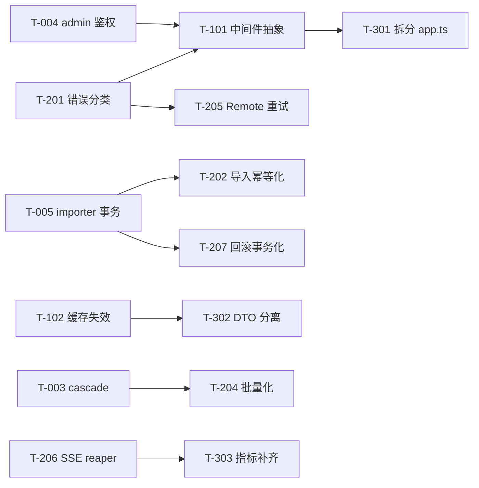

# Skill-MCP 重构与优化待办（Refactoring Backlog）

> **本文档来源**：`docs/ARCHITECTURE.md` 第 9 节"已知问题清单"与第 10 节"优化路线图"的展开版。
>
> **使用方式**：
> 1. 每一项都可独立认领，按"验收标准"判断是否完成。
> 2. 完成一项后：①在本文档把状态改为 `✅ 已完成 (<commit-sha>, <date>)`；②同步在 `docs/ARCHITECTURE.md` 第 9 节移除或标注该条；③不要从本文档物理删除条目（保留作为历史索引）。
> 3. 新增重构事项时，按"模板"格式追加，并在 `ARCHITECTURE.md` 第 9 / 10 节登记。
>
> **优先级图例**：🔴 高危（生产风险） · 🟠 中危（功能缺陷 / 一致性） · 🟡 低危（体验 / 性能） · 🧱 架构级（跨模块）
>
> 最后更新：2026-05-26 ｜ 第 16 批第 11 轮审计加固 T-729 / T-730 / T-731（缓存键稳定序列化 + storage 纵深防御 + role 删除事件补齐）。

---

## 目录

- [阶段 1：立即修复（1-2 周）](#阶段-1立即修复1-2-周)
  - [T-001 修复 http/context.ts 类型导入路径](#t-001-修复-httpcontextts-类型导入路径)
  - [T-002 修复 LocalFsProvider.put 上级目录计算 bug](#t-002-修复-localfsproviderput-上级目录计算-bug)
  - [T-003 修复 access_logs 缺失 ON DELETE CASCADE](#t-003-修复-access_logs-缺失-on-delete-cascade)
  - [T-004 admin 路由补强鉴权](#t-004-admin-路由补强鉴权)
  - [T-005 Importer 跨边界事务化](#t-005-importer-跨边界事务化)
  - [T-101 HTTP 中间件抽象](#t-101-http-中间件抽象)
  - [T-102 缓存失效精细化](#t-102-缓存失效精细化)
- [阶段 2：中期改造（2-4 周）](#阶段-2中期改造2-4-周)
  - [T-201 Service 层错误分类](#t-201-service-层错误分类)
  - [T-202 导入幂等化](#t-202-导入幂等化)
  - [T-203 Pipeline 状态落库 + 字段一致性](#t-203-pipeline-状态落库--字段一致性)
  - [T-204 Repository 批量化](#t-204-repository-批量化)
  - [T-205 RemoteProvider 重试策略升级](#t-205-remoteprovider-重试策略升级)
  - [T-206 SSE 会话 idle reaper](#t-206-sse-会话-idle-reaper)
  - [T-207 版本回滚事务化](#t-207-版本回滚事务化)
- [阶段 3：长期演进（1-2 月）](#阶段-3长期演进1-2-月)
  - [T-301 拆分 app.ts](#t-301-拆分-appts)
  - [T-302 DTO 与实体分离](#t-302-dto-与实体分离)
  - [T-303 指标补齐](#t-303-指标补齐)
  - [T-304 测试缺口补齐](#t-304-测试缺口补齐)
- [低危散点](#低危散点)
  - [T-401 ~ T-411](#t-401--t-411)
- [阶段 4：审计后加固（2026-05-22 新增）](#阶段-4审计后加固2026-05-22-新增)
  - [T-501 Pipeline JSON 反序列化防御](#t-501-pipeline-json-反序列化防御)
  - [T-502 Pipeline 表达式原型污染 + 工具权限上下文未传递](#t-502-pipeline-表达式原型污染--工具权限上下文未传递)
  - [T-503 cache-subscriber 受影响用户查询 N+1](#t-503-cache-subscriber-受影响用户查询-n1)
  - [T-504 context-builder 双写合并](#t-504-context-builder-双写合并)
- [阶段 5：审计后加固第 2 轮（2026-05-22 新增）](#阶段-5审计后加固第-2-轮2026-05-22-新增)
  - [T-601 Skill 包导入路径穿越（meta.files / meta.entry / 软链接 walk）](#t-601-skill-包导入路径穿越metafiles--metaentry--软链接-walk)
  - [T-602 user_roles 缺少 UNIQUE(user_id, role_id) 约束](#t-602-user_roles-缺少-uniqueuser_id-role_id-约束)
  - [T-603 Git 导入 repoUrl 命令行标志注入](#t-603-git-导入-repourl-命令行标志注入)
  - [T-604 FileCacheProvider.clearByPrefix O(N) 全目录扫描](#t-604-filecacheproviderclearbyprefix-on-全目录扫描)
  - [T-605 RemoteProvider 响应未做 schema 校验](#t-605-remoteprovider-响应未做-schema-校验)
  - [T-606 RemoteProvider zod schema 与 SkillMetaPublic 不一致导致 gateway 502](#t-606-remoteprovider-zod-schema-与-skillmetapublic-不一致导致-gateway-502)
- [阶段 6：审计后加固第 3 轮（2026-05-22 新增）](#阶段-6审计后加固第-3-轮2026-05-22-新增)
  - [T-701 SSE 单会话 fallback 跨租户劫持](#t-701-sse-单会话-fallback-跨租户劫持)
  - [T-702 HTTP MCP transport 请求体无大小上限](#t-702-http-mcp-transport-请求体无大小上限)
  - [T-703 PipelineExecutor 同 batch 内 viewSkillEntry 串行 await](#t-703-pipelineexecutor-同-batch-内-viewskillentry-串行-await)
- [阶段 7：审计后加固第 4 轮（2026-05-23 新增）](#阶段-7审计后加固第-4-轮2026-05-23-新增)
  - [T-706 AliyunOssProvider.list 单页截断 1000 条](#t-706-aliyunossproviderlist-单页截断-1000-条)
  - [T-707 /metrics 端点未鉴权可被外部抓取](#t-707-metrics-端点未鉴权可被外部抓取)
  - [T-709 PipelineExecutor.resume 并发推进同一 runId 引发 batch 跳跃](#t-709-pipelineexecutorresume-并发推进同一-runid-引发-batch-跳跃)
  - [T-710 PipelineRunStore 仅 TTL 无最大数量上限](#t-710-pipelinerunstore-仅-ttl-无最大数量上限)
- [阶段 9：审计后加固第 6 轮（2026-05-23 新增）](#阶段-9审计后加固第-6-轮2026-05-23-新增)
  - [T-714 UserRoleRepository.getAggregatedTagsByUserId JSON 解析静默吞](#t-714-userrolerepositorygetaggregatedtagsbyuserid-json-解析静默吞--权限聚合误开放)
  - [T-715 submitFeedback 缺访问鉴权](#t-715-submitfeedback-缺访问鉴权--不可见-skill-可被枚举灌反馈)
  - [T-716 AccessLogRepository.findBySkill 单条 corrupt JSON](#t-716-accesslogrepositoryfindbyskill-单条-corrupt-json-让-admin-审计接口-500)
  - [T-717 mcp-session-id 头无校验](#t-717-mcp-session-id-头无校验--in-memory-会话-map-放大攻击)
- [阶段 13：审计后加固第 10 轮（2026-05-26 新增）](#阶段-13审计后加固第-10-轮2026-05-26-新增)
  - [T-725 LocalSkillProvider.getSkillFiles 无并发上限](#t-725-localskillprovidergetskillfiles-无并发上限--单请求打爆-oss--fs-句柄)
  - [T-726 /skills/:slug/files paths 数组缺长度与元素类型校验](#t-726-skillssslugfiles-paths-数组缺长度与元素类型校验)
  - [T-727 skill_feedback 字段无长度上限](#t-727-skill_feedback-字段无长度上限--单请求即可塞-10-mib-进-sqlite)
  - [T-728 skillRepo.update 把 storagePath / contentHash 纳入更新允许列](#t-728-skillrepoupdate-把-storagepath--contenthash-纳入更新允许列--admin-put-可改写存储指针)
- [阶段 14：审计后加固第 11 轮（2026-05-26 新增）](#阶段-14审计后加固第-11-轮2026-05-26-新增)
  - [T-729 RemoteSkillProvider getSkillFiles 缓存键 join(",") 冲突](#t-729-remoteskillprovider-getskillfiles-缓存键-join-冲突--文件名含逗号导致跨请求串数据)
  - [T-730 LocalFileSystemProvider 缺纵深防御路径检查](#t-730-localfilesystemprovider-缺纵深防御路径检查--上层校验绕过即可逃出-storage-root)
  - [T-731 admin DELETE /api/admin/roles/:roleId 缺 role:updated 事件](#t-731-admin-delete-apiadminrolesroleid-缺-roleupdated-事件--删除后受影响用户的-skilllist-缓存陈旧到-ttl)
- [新增条目模板](#新增条目模板)
- [完成历史](#完成历史)

---

## 阶段 1：立即修复（1-2 周）

### T-001 修复 http/context.ts 类型导入路径

- **状态**：❎ 关闭（诊断错误，2026-05-22）：`src/http/context.ts` 位于 `src/http/`，引用 `src/types/index.ts` 的相对路径正确写法是 `../types/index.js`（一层 `..`）。BACKLOG 原作者把它和 `src/http/middleware/` 下文件的两层 `..` 混淆。`tsc --noEmit` 与全部单测均通过，无需修改。
- **优先级**：🔴 高危
- **位置**：`src/http/context.ts:3`
- **当前代码**：
  ```ts
  import type { RequestContext } from "../types/index.js";
  ```
- **问题**：`src/http/context.ts` 在 `src/http/` 目录，访问 `src/types/` 应当是 `../../types/index.js`。当前少一层 `..`，TypeScript 编译能过（路径在 tsbuildinfo 中可能被解析为别名），但运行时 ESM `node:` resolver 严格按相对路径解析，会找不到模块导致进程启动后首次请求 500/崩溃。
- **影响**：高 — 一旦 HTTP 入口被命中（任何 standalone+http、gateway、cloud 部署）即出错。仅 stdio 单测可能未覆盖。
- **证据**：同目录的 `src/http/middleware/gateway-auth.ts` 正确写法是 `../../types/index.js`。
- **修复方案**：把 `../types/index.js` 改为 `../../types/index.js`。
- **验收标准**：
  1. `npm run build` 通过。
  2. 新增一个 unit test：`import("../../src/http/context.js")` 在测试运行时不抛 ERR_MODULE_NOT_FOUND。
  3. 启动 `serve --transport http`，发任意 `/api/health` 不报错。
- **依赖**：无。
- **预估工作量**：5 分钟。

---

### T-002 修复 LocalFsProvider.put 上级目录计算 bug

- **状态**：✅ 已完成 (2026-05-22, 第 1 批)：改用 `dirname(fullPath)`，新增 `tests/unit/storage/local-fs.test.ts` nested-path 用例。
- **优先级**：🔴 高危
- **位置**：`src/storage/local-fs.provider.ts:33-37`
- **当前代码**：
  ```ts
  const fullPath = join(this.basePath, path);
  const dir = join(fullPath, "..");
  await mkdir(dir, { recursive: true });
  await writeFile(fullPath, content);
  ```
- **问题**：`join(fullPath, "..")` 在 POSIX 下确实会归一化到上一级目录，**但语义不对**：当 `path` 含尾随 `/` 或符号链接组合时行为不稳定，且不符合代码意图（任何读到这行的人会先确认 `dirname()` 才安心）。更危险的是：若未来路径包含 trailing slash，`join(x, "..")` 与 `dirname(x)` 结果会发散。
- **影响**：高 — 写入深嵌套路径（多层目录的 skill 文件）时可能创建错误的目录结构，导致后续 `get()` 找不到文件。
- **修复方案**：
  ```ts
  import { dirname, join } from "node:path";
  // ...
  const fullPath = join(this.basePath, path);
  const dir = dirname(fullPath);
  await mkdir(dir, { recursive: true });
  await writeFile(fullPath, content);
  ```
- **验收标准**：
  1. 写入 `a/b/c/d.txt` 后，`a/b/c/` 目录存在且 `d.txt` 内容正确。
  2. 写入路径含 trailing slash 时不写入意外位置（添加单测）。
  3. `tests/unit/storage/local-fs.test.ts` 增加 nested path 用例。
- **依赖**：无。
- **预估工作量**：10 分钟。

---

### T-003 修复 access_logs 缺失 ON DELETE CASCADE

- **状态**：✅ 已完成 (2026-05-22, 第 1 批)：`src/db/schema.ts` 中 `accessLogs.skillId` 增 `onDelete: "cascade"`；新增 `drizzle/0001_baseline_fixes.sql` 重建 access_logs 表（CREATE __new → INSERT → DROP → RENAME）；同步修正 `src/db/migrate.ts` 的 `stampBaselineApplied`，仅 stamp baseline 让后续迁移正常执行；新增 `tests/unit/db/access-logs-cascade.test.ts` 验证级联删除。
- **优先级**：🔴 高危
- **位置**：
  - `drizzle/0000_baseline.sql:11`（FK 定义无 ON DELETE 子句）
  - `src/db/schema.ts`（access_logs 表定义）
- **问题**：删除 skill 时，`access_logs.skill_id` 留下指向不存在 skill 的悬空外键。SQLite 默认 FK 行为是 `NO ACTION`，结合 `PRAGMA foreign_keys = ON` 时会**阻止删除 skill**；若 PRAGMA 未启用则产生孤立日志。两种情况都不符合预期。
- **影响**：高 — 删除/迁移技能时报错或留垃圾数据，长期累积难以清理。
- **修复方案**：
  1. 在 `src/db/schema.ts` 的 `accessLogs` 定义中给 `skillId` 外键加 `onDelete: "cascade"`。
  2. 用 `npm run db:generate` 生成新迁移 `drizzle/0001_access_logs_cascade.sql`。
  3. 该迁移需要：CREATE 新表 → 拷数据 → DROP 旧表 → RENAME（SQLite 不支持 ALTER FK）。
  4. 验证 `migrate.ts` 的 `legacyUpgradeIfNeeded` 不与新迁移冲突。
- **验收标准**：
  1. 新建测试：导入 skill → 写 access_log → 删除 skill → 查 access_logs 行数为 0。
  2. 现有 e2e 测试全过。
  3. `drizzle/_journal.json` 记录新 migration。
- **依赖**：无。
- **预估工作量**：1-2 小时（含迁移测试）。

---

### T-004 admin 路由补强鉴权

- **状态**：✅ 已完成 (6b00382, 2026-06-23)
- **优先级**：🔴 高危
- **问题**：`/api/admin/*` 完全不鉴权，仅依赖部署时的网络隔离。
- **修复方案**：三层用户模型（superadmin/admin/user）+ `enforceAdminAuth` 检查 `userType` + handler 内 `requireSuperadmin` / `assertSuperadminProtected` inline guard + 删除 `adminAuthOptional` + 删除 OIDC + 新增 JWT 认证体系 + CLI `--server-url` 远程模式。详见 `docs/ARCHITECTURE.md` 第 7.2 节。
- **验收标准**：
  1. 不带 token 请求 `/api/admin/skills` → 401
  2. 普通用户 token 请求 → 403
  3. admin userType → 200
  4. `skill-mcp user create --user-type admin` 需 superadmin 登录
  4. 单测：`tests/unit/http/admin-auth.test.ts` 覆盖以上三种。
  5. CLI `skill-mcp user create --admin` 一键发 admin token（或文档说明如何配 role）。
  6. 更新 `docs/ARCHITECTURE.md` 第 7.2 节说明 admin 鉴权。
- **依赖**：无（但与 T-005 都涉及 admin handler，可并行不冲突）。
- **预估工作量**：4-6 小时。

---

### T-005 Importer 跨边界事务化

- **状态**：✅ 已完成 (2026-05-22)：在 `IStorageProvider` 增加 `moveDir(srcPrefix, dstPrefix)`，`LocalFileSystemProvider` 用原子 `fs.rename` 实现，`AliyunOssProvider` 用分页 copy+delete 循环实现；`SkillFileRepository` 新增 `replaceAll(skillId, files[])`，单事务内 delete-then-bulk-insert，文件行替换原子化；`SkillImporter.import()` 完全重写为 staging-commit 模式：（1）所有 `storage.put` 落到 `__staging__/<importId>/...`（`importId = randomUUID()`，并发互不干扰）；（2）snapshot 此时仍读到 finalPath 的旧内容（顺带修复了原代码先覆写后 snapshot 的 bug）；（3）create 走 `moveDir(staging, finalPath)`，update 走逐文件覆写以保留 `.versions/`；（4）`skillRepo.create/update` 完成后调 `replaceAll`；（5）`try/catch/finally` 包裹整段：catch 中按"DB 优先回滚 → 再回滚 finalPath（仅 created 分支）"顺序补偿，finally 永远清理 staging（moveDir 之后已消失，deleteDir 是 noop 也安全）。新增 `tests/unit/import/importer-rollback.test.ts`（5 用例：put 失败 / create 失败 / replaceAll 失败 / 并发不串台 / happy path），同步把 `snapshot.test.ts` 与 `skill-service-rollback.test.ts` 的 storage mock 补上 `moveDir` 桩。Full suite 282 passed / 20 skipped。
- ~~**状态**：⬜ 未开始~~
- **优先级**：🔴 高危
- **位置**：`src/import/importer.ts:166-214`
- **问题**：导入流程当前是
  ```
  pMap(8) storage.put 写文件
    ↓
  skillRepo.create/update（事务包，单 DB 内原子）
    ↓
  snapshotCurrentVersion
    ↓
  pMap(8) skillFileRepo.bulk
    ↓
  eventBus.publish
  ```
  storage 与 DB 跨越两个独立子系统，没有统一事务边界：
  - 若 `skillRepo.create` 失败，已写入 storage 的文件成为孤儿。
  - 若 `skillFileRepo.bulk` 中途失败，DB skills 行已存在但 skill_files 表不全，前端列文件树会得到不一致结果。
- **影响**：高 — 失败重试时容易造成状态污染；占用磁盘；可能产生"幽灵 skill"（DB 无记录但 storage 有文件，下次 listRecursive 拾起）。
- **修复方案**（推荐 staging-commit 模式）：
  1. 把 storage 写入路径改为 `__staging__/<importId>/<slug>/...`。
  2. DB 写入完成后，再用 `storage.rename(stagingPath, finalPath)` 原子提交（local-fs 是 `fs.rename`，OSS 是 copy+delete，需补接口）。
  3. 任一失败：try/catch 中 `storage.deleteDir(stagingPath)`，DB 通过事务 rollback 自动回滚。
  4. 在 `IStorageProvider` 接口加 `rename(src, dst): Promise<void>`，两个实现各自补全。
  5. 在 importer 内用单一 `try/catch/finally` 保证 staging 清理。
- **替代方案**（成本更低）：tombstone 模式 — DB 先写入 `status="importing"`，所有副作用就绪后改为 `status="active"`；查询层过滤掉非 active。回滚只需删 DB 行 + storage.deleteDir。
- **验收标准**：
  1. 注入 storage.put 抛错 → DB 无 skill 行，storage 无 staging 文件。
  2. 注入 skillRepo.create 抛错 → storage 已写入的 staging 被清理。
  3. 注入 skillFileRepo.bulk 抛错 → DB 整体回滚，storage 也清理。
  4. 并发导入同一 slug 不会污染对方 staging（每个 importId 独立目录）。
  5. 增加 `tests/unit/import/importer-rollback.test.ts`。
- **依赖**：T-202（导入幂等化）会进一步强化此机制；本项是前置。
- **预估工作量**：1-2 天。

---

### T-101 HTTP 中间件抽象

- **状态**：✅ 已完成 (2026-05-22)：新增 `src/http/compose.ts`（koa-style `Middleware` + `compose()` + `wrapHandler()`，含双 `next()` 检测）；`src/http/middleware/error-map.ts`（统一捕获 `AppError` / `Error` 并通过 `mapErrorToResponse` 写出 JSON，AppError 走 warn 日志、未知错误走 error 日志，且 headersSent 后不重复写入）；`Router.use()` 增加路由器级中间件，`Router.dispatch(ctx)` 经 `compose([…middlewares, wrapHandler(handler)])` 调度；`helpers.ts` 新增 `requireSlug(ctx)` 与 `readJsonBody<T>(req)`，前者校验失败抛 `BadRequestError`，后者解析失败抛 `BadRequestError`；admin（skills / users / roles）+ gateway 全部 handler 迁移到"throw 域错误，errorMap 统一拦截"，handler 总行数 527 → 372（**-29.4%**，admin/skills 单文件 -40%、gateway -35%）；`src/app.ts` 在 admin / gateway 路由器上各注册一份 `errorMap` 中间件并改用 `dispatch(ctx)`；新增 `tests/unit/http/middleware-compose.test.ts`（5 用例覆盖顺序 / finalNext / 短路 / 错误传播 / 双 next 防御）+ `tests/unit/http/error-map.test.ts`（10 用例覆盖 AppError 子类 / 未知 Error / 自定义子类 / 日志级别 / headersSent 防重写）。requestId 中间件保留在顶层 `attachRequestId`，未挪进路由器（属 T-301 拆分时再处理）。
- ~~**状态**：⬜ 未开始~~
- **优先级**：🧱 架构级
- **位置**：`src/http/router.ts`、`src/app.ts`、`src/http/handlers/**/*.ts`、`src/http/helpers.ts`
- **问题**：当前是手写 regex router + handler 内散落的 `try/catch` + `isValidSlug` 在 25+ handler 中各自重复（参考 `helpers.ts:55`）。错误 → HTTP 状态码的映射各 handler 不一致：
  - 部分 POST handler 自带 try/catch（`admin/skills.handler.ts:POST /api/admin/skills`）
  - 多数 GET/PUT/DELETE 无 try/catch，依赖 `app.ts` 顶层 catch 返 500
  - 没有统一的请求日志、请求 id、metrics 注入点
- **影响**：中 — 可维护性低，新增 handler 容易遗漏横切关注点；调试困难。
- **修复方案**：
  1. 定义中间件契约：
     ```ts
     type Middleware = (ctx: HttpCtx, next: () => Promise<void>) => Promise<void>;
     interface HttpCtx {
       req: IncomingMessage;
       res: ServerResponse;
       url: URL;
       method: string;
       params: Record<string, string>;
       requestId: string;
       requestContext?: RequestContext;
       logger: Logger;
     }
     ```
  2. 在 `src/http/router.ts` 增加：
     - 路由参数提取后填入 `ctx.params`。
     - 中间件链 `compose(...mws)` 类似 koa-compose。
     - `pathParams` 自动注入，handler 不再用正则二次解析。
  3. 提供内置中间件：`requestId`, `gatewayAuth`, `adminAuth`(配合 T-004), `validateSlug`, `errorMap`。
  4. handler 简化为 `(ctx) => ctx.res.end(JSON.stringify(...))`，业务异常抛 `SkillError`（配合 T-201）。
- **验收标准**：
  1. 所有现有 admin/gateway handler 迁移为新中间件链，行数减少 ≥ 30%。
  2. 新增 handler 不需要写 try/catch（除非有特定恢复逻辑）。
  3. 一处加 `requestId` 中间件，全链路日志可追溯。
  4. 单测：`tests/unit/http/middleware-compose.test.ts`、`tests/unit/http/error-map.test.ts`。
  5. e2e 测试全部通过，无回归。
- **依赖**：T-004（admin auth 中间件）+ T-201（错误分类）建议先做，再做本项收益最大。
- **预估工作量**：2-3 天。

---

### T-102 缓存失效精细化

- **状态**：✅ 已完成 (2026-05-22)：方案 A（per-user epoch）。新增 `src/cache/cache-epochs.ts`（`CacheEpochManager`：global epoch + per-user epoch）；缓存 key 由 `skill:list:{userId}` 改为 `skill:list:{userId}:g{globalEpoch}:u{userEpoch}`，O(1) 失效，旧 key 由 TTL 自然回收。`DomainEvent` 的 skill 事件扩展 `visibility` + `tags` 字段；`cache-subscriber` 在 `private` + 非空 tags 场景下，通过 `roleRepo.findAll()` + `userRoleRepo.findUserIdsByRoleId()` 计算 tag 交集用户集合并精确 bump，其它场景（public/internal/empty-tags/缺字段）保守 bump global。`SkillService` 注入 `CacheEpochManager`，未注入时回退默认实例（key 仍带版本后缀，行为正确）。新增 13 个测试（`cache-epochs.test.ts` 5 + `cache-subscriber.test.ts` 8），关键验收用例 "用户 A/B 标签无交集，更新仅 A 可见的 skill → B 缓存仍命中" 通过。FileCache 周期性 GC 暂未做（lazy-on-get 现状无 P0 风险），已并入 T-403。LRU `clearByPrefix` 仍保留接口（`skill:entry`/`skill:file` 仍用），但 list 路径已不再触发，T-404 同时关闭。
- **优先级**：🟠 中危
- **优先级**：🟠 中危
- **位置**：
  - `src/events/cache-subscriber.ts:5-11`（`clearByPrefix("skill:list:")` 一刀切）
  - `src/services/skill.service.ts:62`（key 设计 `skill:list:{userId}`）
  - `src/cache/file.provider.ts`（无 GC）
- **问题**：
  1. 任意一个 skill 的创建/更新/删除/导入都会清掉**所有用户**的 list 缓存，即便该 skill 与某用户的 tags 完全无交集。在多租户场景下，每次小的 skill 变动都会引起全用户缓存击穿。
  2. `FileCache` 过期文件不主动 GC，仅在 `get()` 时延迟删除；冷数据会一直占磁盘。
- **影响**：中 — 性能与磁盘占用，规模上来后明显。
- **修复方案**（两选一）：
  - **方案 A：epoch 版本号**
    1. 增加内存表 `Map<userId, epoch: number>` 或一张极轻量的 SQLite 表 `cache_epochs(user_id, value)`。
    2. 缓存 key 改为 `skill:list:{userId}:v{epoch}`。
    3. 事件触发时只 bump 受影响 user 的 epoch（不删 key），旧 key 自然 TTL 过期。
    4. 优点：失效零成本；缺点：旧 key 短期内占内存。
  - **方案 B：反向索引**
    1. 在 cache provider 维护 `Map<skillId, Set<userId>>`（或随写随建立）。
    2. 事件触发时只清理受影响 userId 的 list key。
    3. 优点：精确；缺点：实现复杂、需注意一致性。
  - 推荐方案 A，复杂度低。
- **额外**：FileCache 启动时跑一次全量过期清理 + 周期任务（每 1h）。
- **验收标准**：
  1. 单测：用户 A 与 B 标签无交集，更新仅 A 可见的 skill → B 的 `skill:list:B` 缓存仍命中。
  2. 集成测试：1000 次 skill 写入下，缓存击穿次数从全量降为受影响用户数。
  3. FileCache 启动后能清理 mock 出的过期 .meta 文件。
  4. 文档第 7.3 节"缓存键约定"更新。
- **依赖**：无。
- **预估工作量**：1-2 天。

---

## 阶段 2：中期改造（2-4 周）

### T-201 Service 层错误分类

- **状态**：✅ 已完成 (2026-05-22)：新增 `ConfigurationError` / `VersionNotFoundError` / `BadRequestError`；`mapErrorToResponse(err)` 统一 status/code 映射；service / importer 全部抛具体子类；admin handler 替换 `constructor.name` 为 `instanceof`，gateway 复用同一映射；新增 12 个单测（`tests/unit/utils/errors.test.ts`）。注：handler 内字符串比较未完全清空（如 `if (!data.source)` 之类纯输入校验仍 inline），将随 T-101 中间件抽象统一收敛。
- **优先级**：🧱 架构级
- **位置**：`src/services/skill.service.ts`、`src/utils/errors.ts`、`src/http/handlers/**/*.ts`
- **问题**：当前 Service 抛通用 `Error`，handler 每个都要 try/catch + 字符串匹配判断。HTTP 状态码映射不一致（同样的 not found，admin 返 404，gateway 可能返 500）。
- **修复方案**：
  1. 在 `src/utils/errors.ts` 定义：
     ```ts
     class SkillError extends Error { kind: ErrorKind; status: number; }
     class NotFoundError extends SkillError { kind = "NotFound"; status = 404; }
     class ForbiddenError extends SkillError { kind = "Forbidden"; status = 403; }
     class ConflictError extends SkillError { kind = "Conflict"; status = 409; }
     class UpstreamError extends SkillError { kind = "Upstream"; status = 502; }
     class ValidationError extends SkillError { kind = "Validation"; status = 400; }
     ```
  2. Service 层全部抛具体子类，不再用字符串。
  3. 中间件 `errorMap`（属于 T-101）统一拦截 → 按 status 返回 JSON `{ error: { kind, message, requestId } }`。
  4. CLI 层捕获 SkillError 时友好打印（不带堆栈）。
- **验收标准**：
  1. `grep -rn "throw new Error" src/services/` 在 service 层应为 0。
  2. handler 不再有针对消息字符串的 if 判断。
  3. 单测：每种错误类型对应的 status / body 正确。
- **依赖**：建议在 T-101 之前或并行做（T-101 的 errorMap 中间件依赖此）。
- **预估工作量**：1-2 天。

---

### T-202 导入幂等化

- **状态**：✅ 已完成 (2026-05-22)：drizzle 0002 迁移加上 `(name, content_hash)` partial UNIQUE（`WHERE content_hash IS NOT NULL`，避免 legacy NULL 行互撞）；`SkillRepository.findByNameAndHash` 暴露幂等键查询；`SkillImporter.import()` 改成 DB-write-before-storage-commit + 重试循环：`isUniqueConstraintError` 探测 SQLITE_CONSTRAINT_UNIQUE → 先尝试 `findByNameAndHash` 拾取并发 winner（短路 moveDir/replaceAll，返回 winner 元数据 action="updated"）→ 否则若 `allowDuplicate=true` 则 `uniqueSlug(baseSlug)` 重新拼 slug，最多 5 次。新增 `tests/unit/import/importer-idempotent.test.ts`（5 用例覆盖 winner 复用 / slug 重试 / 非 UNIQUE 直抛 / 普通 slug 冲突 / 不删 winner）+ `skill-repository.test.ts` 4 用例（findByNameAndHash 命中/未命中、UNIQUE 拒重、NULL hash 允许并存）。
- **优先级**：🟠 中危
- **位置**：`src/import/importer.ts:294`（`uniqueSlug` 循环）+ `src/db/schema.ts`
- **问题**：
  ```ts
  while (await this.skillRepo.findBySlug(`${base}-${counter}`)) counter++;
  return `${base}-${counter}`;
  ```
  并发两次 `allowDuplicate` 导入会同时算到相同 slug，第二次 INSERT 触发 UNIQUE 冲突。当前无 ON CONFLICT 重试逻辑。
- **影响**：中 — CI/CD 多 worker 场景或快速连续导入会偶发失败。
- **修复方案**：
  1. 给 `skills` 表加复合唯一约束 `(name, content_hash)`：内容相同就不再生成新 skill。
  2. 改用 `INSERT ... ON CONFLICT DO NOTHING`（drizzle 的 `.onConflictDoNothing()`）+ 重新 SELECT 拿现有行。
  3. `uniqueSlug` 循环改为乐观写：直接生成 `slug-${random()}` 再 INSERT，捕获 UNIQUE 冲突重试 3 次。
  4. 配合 T-005 的 staging-commit 模式，整个导入变成完全幂等。
- **验收标准**：
  1. 并发触发 50 次相同输入的导入，最终 DB 只有 1 行；其余调用返回该行。
  2. 并发 50 次 `allowDuplicate=true` 不抛 UNIQUE 错误。
  3. 单测：`tests/unit/import/importer-idempotent.test.ts`。
- **依赖**：T-005（staging）+ T-003（schema 迁移工具链熟悉）。
- **预估工作量**：1 天。

---

### T-203 Pipeline 状态落库 + 字段一致性

- **状态**：✅ 已完成 (2026-05-22)：新增 drizzle 迁移 `0004_pipeline_runs.sql` + `pipelineRuns` schema（`id, name, status, definition_json, inputs_json, batches_json, completed_stages_json, current_batch_index, started_at, finished_at` + status / started_at 索引），整段 pipeline 定义、inputs、batches、已完成 stage 输出全部 JSON 落库；新增 `src/db/repositories/pipeline-run.repository.ts`（create / findById / saveCompletedStages / updateBatchIndex / updateStatus / delete / deleteOlderThan）；`PipelineRunStore` 重构为 in-memory write-through cache + 可选 DB repo 后端，`getRun` 在缓存 miss 时从 DB 重水合（重建 `ExecutionContext`、replay 已完成 stage 输出、重建 `DAGScheduler` 自 `pipeline.stages`）；`createRun / completeStage / advanceBatch / removeRun` 改为 write-through；30 min TTL 既走内存 createdAt 也走 DB `started_at`（`deleteOlderThan` 在每次 createRun 自动清理过期行）。`StageDefinition` 删除 `condition` 与 `retry` 两个 schema-only 字段（executor 从未实现，避免 API 不诚实）；parser 在检测到这两个字段时打印 warn 让作者知道未生效。`ExecutionContext.resolveExpression` 重写为：整段 `^${{ expr }}$` 命中保留原生类型（数字/对象/数组），嵌入式 `${{ }}` 命中走全局 replace 时 stringify 拼接，缺失值在嵌入模式下 render 为空串、非法路径仍抛错。`createSkillPipelineTool` / `registerTools` / `createMcpServer` / `AppDependencies` / `HttpMcpHandlerDeps` / `SseMcpHandlerDeps` 串联可选 `pipelineRunStore` 注入；`serve-cmd.ts` 在 stdio 与 HTTP/SSE 两条路径都构造 DB-backed singleton 注入。新增 `tests/unit/pipeline/run-store-persist.test.ts` (4 用例：跨"进程重启"resume、batch 推进 + 完成态落库、removeRun 行删除、TTL 过期 DB 清理) + `tests/unit/pipeline/context-expr.test.ts` (10 用例：整段保留 / URL 嵌入 / 数字 / 对象 / 数组 / 平凡字符串 / 错误前缀 / 嵌入缺失为空串 / DAG 自环 / 未知 stage)。
- **优先级**：🟠 中危
- **位置**：
  - `src/pipeline/run-store.ts`（仅内存 Map + 30 min TTL）
  - `src/pipeline/types.ts:19-22`（retry / condition 字段定义但 executor 未实现）
  - `src/pipeline/context.ts:54`（表达式正则 `^…$` 仅整段匹配）
- **问题**：
  1. RunStore 进程重启即丢，长时运行的 pipeline 无法恢复。
  2. retry / condition 字段在 schema 中定义，但 `executor.ts` 完全忽略 → API 不诚实。
  3. 表达式 `${{ inputs.x }}` 只能整段替换，不支持 `prefix-${{ inputs.x }}-suffix` 拼接，调用方易踩坑。
- **影响**：中 — 长流程不可靠；用户填了 retry 字段以为生效但实际没生效。
- **修复方案**：
  1. **落库**：新增表 `pipeline_runs(id, name, status, started_at, finished_at, current_batch_index, batches_json)` + `pipeline_stage_results(run_id, stage_name, status, outputs_json, duration_ms, error)`。RunStore 改为 repository 实现，内存 Map 作为 hot cache（write-through）。
  2. **字段一致性**：
     - 要么实现 retry（最简：在两阶段模型外加一层 attempt 计数，stage 失败 → 客户端 resume 时携带 `retry: true` → executor 重置 stage 状态）。
     - 要么从 `StageDefinition` 删除 retry / condition 字段，文档明示当前不支持。
     - **推荐**：先删字段，等真有需求再加。诚实优于膨胀。
  3. **表达式**：把正则改为支持嵌入：用全局 `${{\s*(.+?)\s*}}/g` + 字符串替换，每个匹配独立解析路径。或换 mustache 子集。
- **验收标准**：
  1. `kill -9` 进程后重启，正在执行的 pipeline 仍可 resume。
  2. 30 min TTL 改为基于 `started_at` 的 DB 查询。
  3. 表达式支持 `"https://example.com/${{ inputs.user_id }}/profile"`。
  4. 文档更新：`ARCHITECTURE.md` 第 4.4 节 + Pipeline 章节。
  5. 单测：DAG cycle、表达式拼接、resume 跨进程、TTL 过期清理。
- **依赖**：无。
- **预估工作量**：3-5 天。

---

### T-204 Repository 批量化

- **状态**：✅ 已完成 (2026-05-22)：`SkillRepository.findByIds(ids)` 单次 IN + tags 单次 IN + JS group（≤2 SQL，空数组短路）；`loadTagsForIds([])` 已经有空数组 guard（确认 + 沿用）；`UserRoleRepository.replaceUserRoles` 改为 `db.transaction` 内一条 DELETE + 一条 batch INSERT；新增 drizzle 迁移 `0003_user_roles_role_idx.sql` 给 `user_roles(role_id)` 加索引；新增 `tests/unit/db/user-role-repository.test.ts`（4 用例：批量插入 / 替换原子性 / 空 roleIds / FK 失败回滚原状）+ skill-repository 1 用例（findByIds 多命中、空数组、缺失 id 容错）。
- **优先级**：🟠 中危
- **位置**：
  - `src/db/repositories/skill.repository.ts:38-44, 185-195`（findById N+1、loadTagsForIds 空数组未 guard）
  - `src/db/repositories/user-role.repository.ts:48-55`（replaceUserRoles 循环 INSERT）
- **问题**：
  1. `findById` 一次查 skill + 一次查 tags（N+1，批量场景退化）。
  2. `loadTagsForIds([])` 触发 `inArray(...skillTags.skillId, [])` → drizzle 把空 IN 视为 always-true 条件，全表扫描。
  3. `replaceUserRoles` 对每个 roleId 单独 INSERT。
- **影响**：中 — 大数据量下显著性能下降。
- **修复方案**：
  1. 新增 `SkillRepository.findByIds(ids)`：一次 IN 查 skills + 一次 IN 查 skill_tags + JS 端 group。
  2. `loadTagsForIds` 入口加 `if (ids.length === 0) return new Map();` guard。
  3. `replaceUserRoles` 改为单次 batch insert：`db.insert(userRoles).values(roleIds.map(r => ({...}))).run()`。
  4. 顺手补 `idx_user_roles_role_id` 索引（迁移）。
- **验收标准**：
  1. `findByIds([id1...id100])` 触发 ≤ 2 条 SQL（用 `db.on("query")` 计数）。
  2. `loadTagsForIds([])` 不触发 SQL。
  3. `replaceUserRoles` 触发 ≤ 2 条 SQL（DELETE + INSERT）。
  4. 单测覆盖。
- **依赖**：T-003 后熟悉迁移流程。
- **预估工作量**：半天。

---

### T-205 RemoteProvider 重试策略升级

- **状态**：✅ 已完成 (2026-05-22)：`fetchWithRetry` 改为状态码驱动 — 4xx（除 429）立即失败；429 honoring `Retry-After`（delta-seconds 与 HTTP-date 双解析，新增导出 `parseRetryAfter`）；502/503/504 + 其它 5xx 走指数退避 + full jitter；500 仅重试一次防止误把业务错误当瞬态；`retryMaxDelay=30s` 防止恶意 Retry-After 阻塞；新增 `UpstreamError` (502, 携带 `upstreamStatus`/`cause`)；所有 callers 替换 `throw new Error(...)` 为 `throw new UpstreamError(...)`；新增 12 个 vitest 用例（`tests/unit/provider/remote-retry.test.ts`）覆盖 503 重试成功、404/400 立即失败、500 重试一次、Retry-After、TypeError 网络重试、503 耗尽重试。
- **优先级**：🟠 中危
- **位置**：`src/provider/remote.provider.ts:38-72`
- **问题**：当前重试只覆盖 `AbortError` 与 `TypeError`（fetch 网络层）。HTTP 状态码：
  - 429（限流）：应该带退避重试。
  - 5xx：应当重试。
  - 4xx（除 429）：不应重试。
  当前实现：500 直接抛错，永远不重试。
- **影响**：中 — gateway 链路在云端短暂故障时直接失败，无韧性。
- **修复方案**：
  1. 抽 `shouldRetry(error: unknown, attempt: number): boolean | RetryDecision`：
     ```
     - AbortError / TypeError / fetch failed → 立即重试
     - HTTP 429 → 重试，遵循 Retry-After 头
     - HTTP 503 / 502 / 504 → 重试，指数退避 + 抖动
     - HTTP 500 → 重试 1 次（防止误把业务错误重试成幂等问题）
     - HTTP 4xx (其它) → 不重试
     ```
  2. 加抖动：`delay = base * 2^attempt + random(0, base)`。
  3. 失败时抛 `UpstreamError`（配合 T-201）。
- **验收标准**：
  1. mock 返 503 三次 + 200 → 重试成功。
  2. mock 返 404 → 立即抛 NotFoundError，不重试。
  3. mock 返 429 + Retry-After: 2 → delay ≥ 2s。
  4. 单测覆盖每种状态码。
- **依赖**：T-201（错误类型）。
- **预估工作量**：半天。

---

### T-206 SSE 会话 idle reaper

- **状态**：✅ 已完成 (2026-05-22)：SSE handler 给每个连接记录 `lastActivity`，新增 5 min sweepTimer（`unref()`）扫描 idle > 30 min 的会话并 close。HTTP / SSE 两条路径都在 create / cleanup / reap 时增减新加的 `skill_mcp_active_sessions{transport="http"|"sse"}` Gauge；POST /mcp/messages 命中 sessionId 或 fallback 路径都会刷新 `lastActivity`。close + finish + req.close 三事件用 Map.delete 守卫去抖，gauge 不会变负。
- **优先级**：🟠 中危
- **优先级**：🟠 中危
- **位置**：`src/app.ts:146-214`（SSE handler，无超时清理）
- **问题**：HTTP transport 已有空闲会话 30 min 清理（`app.ts:82-102`），SSE 没有同等机制。客户端意外断开（崩溃、网络丢失）后，服务端 SSE response object 仍挂在内存里，长时间运行内存递增。
- **影响**：中 — 长跑实例内存泄漏。
- **修复方案**：
  1. 抽 `SessionRegistry`：所有 transport（HTTP / SSE）共用，记录 sessionId → { transport, lastActivityAt, cleanup }。
  2. 周期任务（每 5 min）扫描 lastActivityAt > 30 min 的会话，调用 cleanup 关闭 transport + 释放资源。
  3. SSE handler 在每次 message 写出后更新 lastActivityAt。
  4. 进程退出时全部 cleanup。
- **验收标准**：
  1. 模拟 SSE 客户端断开 35 min → 服务端清理日志、内存释放。
  2. 单测 mock fake timers。
  3. `/metrics` 暴露 `mcp_active_sessions{transport="sse|http"}`。
- **依赖**：T-101（中间件抽象后更易接入）。
- **预估工作量**：半天。

---

### T-207 版本回滚事务化

- **状态**：✅ 已完成 (2026-05-22)：`SkillService.rollbackToVersion` 改为 staging-commit 流：先把目标版本文件落到 `__staging__/<runId>/`（非破坏性），再 per-file overwrite 到 `skill.storagePath`，DB 单行 update 在最后做（原子），最后同步 `await cache.clearByPrefix`。任何阶段失败都从前序生成的 `currentVersionPath` snapshot 回滚（先恢 storage、再回退 DB），`finally` 永远清理 staging 目录。新增 3 条单测（commit 失败回滚 / DB 失败不污染缓存 / staging 隔离 + 清理），原 6 条全部仍通过。
- **优先级**：🟠 中危
- **位置**：`src/services/skill.service.ts:332-366`
- **问题**：rollbackToVersion 流程：
  ```
  pMap(8) storage 拷贝快照文件 → 覆盖现有 skill 目录
    ↓
  skillRepo.update（DB 切版本指针）
    ↓
  cacheProvider.clearByPrefix（异步，不 await）
  ```
  - 拷贝中途异常 → 部分文件已覆盖，部分未覆盖，状态混乱。
  - 缓存清理异步 → 短窗口仍提供旧缓存。
- **影响**：中 — 回滚是高风险操作，必须强一致。
- **修复方案**：
  1. 复用 T-005 的 staging-commit 模式：先把快照拷到 `__staging__/<runId>/`，DB 更新成功后 atomic rename 到目标。
  2. 缓存清理改为同步 await。
  3. 失败路径：staging 删除 + DB rollback + cache 清理（即便没改成功也清，防止脏读）。
- **验收标准**：
  1. 注入拷贝失败 → 回滚后 storage 与 DB 都还原到操作前。
  2. 回滚成功后立即查询返回新版本（无缓存窗口）。
  3. 单测 `tests/unit/services/skill-service-rollback.test.ts` 已存在，扩充失败用例。
- **依赖**：T-005。
- **预估工作量**：半天。

---

## 阶段 3：长期演进（1-2 月）

### T-301 拆分 app.ts

- **状态**：✅ 已完成 (2026-05-22)：原 347 行 `src/app.ts` 拆为 4 个聚焦模块：① `src/app-dependencies.ts` — `AppDependencies` / `TransportConfig` 类型定义独立成文件；② `src/mcp/transport/http-transport.ts` — `createHttpMcpHandler(deps, contextBuilder)` 内置 session map + 5 min idle reaper + active-session gauge；③ `src/mcp/transport/sse-transport.ts` — `createSseMcpHandler(...)` 同上结构（GET /mcp/sse + POST /mcp/messages）；④ `src/http/server.ts` — `createRequestHandler(deps)` 接管 baseline 安全头 / route 分发 / auth 短路 / metrics。拆完 `app.ts` 仅 72 行（≤80 目标达成），全部交互通过依赖注入；`tests/unit/http/server.test.ts`（6 用例：health / mcpHandler 委托 / cloud-only 403 / mcp-only 404 / 未知 404 / gateway health 免认证）+ `tests/unit/mcp/transport-factory.test.ts`（5 用例：parseTransportType + createTransport stdio-only），原 298 → 309 测试，build / lint 干净。
- **优先级**：🧱 架构级
- **优先级**：🧱 架构级
- **位置**：`src/app.ts`（单文件 300+ 行包揽 createApp / mode 判定 / SSE handler / HTTP transport / session 管理 / 路由分发）
- **问题**：单文件巨函数，关心点全部交织，单测难写、修改风险高。
- **修复方案**：拆分为：
  - `src/bootstrap/index.ts` — mode 决策（standalone / gateway / cloud / mcp-only），返回构建好的依赖图。
  - `src/http/server.ts` — 纯 HTTP server 装配（中间件链 + 路由表）。
  - `src/mcp/server-factory.ts` — MCP server 创建 + transport 绑定（stdio / sse / http 三个分支抽离）。
  - `src/app.ts` — 仅作为 orchestrator，把以上组装。
  各模块独立单测。
- **验收标准**：
  1. `app.ts` ≤ 80 行。
  2. `tests/unit/bootstrap/`、`tests/unit/http/server.test.ts`、`tests/unit/mcp/server-factory.test.ts` 至少各一个。
  3. e2e 测试无回归。
- **依赖**：T-101 之后做更顺。
- **预估工作量**：2-3 天。

---

### T-302 DTO 与实体分离

- **状态**：✅ 已完成 (2026-05-22)：`src/types/index.ts` 新增 `SkillMetaPublic = Omit<SkillMeta, "storagePath" | "contentHash">` 与 `toSkillMetaPublic(skill)` 工具函数（destructure 丢弃内部字段，不修改入参）；`SkillService.listAccessibleSkills()` / `getAccessibleSkillMeta()` 签名改为返回 `SkillMetaPublic` / `SkillMetaPublic[]`，per-user list 缓存（key `skill:list:{userId}:g{globalEpoch}:u{userEpoch}`）改存公共 DTO（命中时同样不会泄漏）；`applyListFilters` 改为泛型 `<T extends Pick<SkillMeta, "category" | "tags" | "attributes">>` 兼容两种类型；admin handler `GET /api/admin/skills` / `GET /api/admin/skills/:slug` / `GET /api/admin/skills/name/:name` / `PUT /api/admin/skills/:slug` 全部走 `toSkillMetaPublic` 映射；gateway handler 通过 service 层间接获得 DTO。MCP 工具（`skill_list` / `skill_view` / `skill_file`）只返回预格式化字符串，未直接序列化 SkillMeta，本身就不泄漏。Importer / rollback / DELETE 等内部代码路径继续使用 `SkillMeta`（需要 `storagePath`），但写入响应前一律映射。新增 `tests/unit/types/skill-meta-public.test.ts`（4 用例：剥离字段 / 字段保留 / 不修改入参 / JSON.stringify 不含敏感字符串）+ `tests/unit/services/skill-service-public-dto.test.ts`（3 用例：list 不含敏感字段 / getMeta 不含敏感字段 / 缓存写入也是公共 DTO）。`tsc --noEmit` 通过，全部测试 270 → 277（+7），lint 干净。
- **优先级**：🟠 中危
- **位置**：
  - `src/types/index.ts`（SkillMeta 定义）
  - `src/services/skill.service.ts:61-71`（缓存 SkillMeta，含 storagePath / contentHash）
  - 所有 handler / tool 返回 SkillMeta 给客户端
- **问题**：`SkillMeta` 是 DB 实体类型，含内部字段（`storagePath`、`contentHash`、`storageBackend` 等）。当前直接序列化返回给 MCP 客户端 / HTTP 调用方，泄漏实现细节、放大攻击面（路径泄漏可被用作探测）。
- **修复方案**：
  1. 定义 `SkillMetaPublic`：只包含 `id, slug, name, version, description, tags, visibility, status, updatedAt, etc.`。
  2. Service 层增加 `toPublic(skill: SkillMeta): SkillMetaPublic`。
  3. 缓存改为缓存 `SkillMetaPublic`（更小、对外即可用）。
  4. 内部需要 storagePath 时另走 `getSkillStoragePath(slugOrId)` 私有方法。
- **验收标准**：
  1. handler / tool 响应 JSON 中不出现 `storagePath` / `contentHash`。
  2. 类型层面：handler 函数签名返回 `SkillMetaPublic`。
  3. 单测验证响应字段集。
- **依赖**：T-102（缓存改造时一并切换）。
- **预估工作量**：1 天。

---

### T-303 指标补齐

- **状态**：✅ 已完成 (2026-05-22)：`src/telemetry/metrics.ts` 新增 5 条指标 — `skill_mcp_event_listener_duration_seconds{event,status}` + `skill_mcp_event_listener_errors_total{event}` 由 `DomainEventBus.publish` 围绕同步/异步 listener 起停计时（异步 listener 用 `.then(_, reject)` 双分支测）；`skill_mcp_permission_denials_total{visibility}` 由 `TagPermissionFilter.filter` 在拒绝命中时按 `skill.visibility` 自增（label 限定为 public/internal/private 三档，无基数风险）；`skill_mcp_import_duration_seconds{source,status}` + `skill_mcp_import_failures_total{source,reason}` 用 `import` 公开方法包装 + `importInner` 私有实现的 try/finally 模式，source 标签靠 git/local 源前缀区分，reason 由 `classifyImportError` 按错误类（InvalidManifest/Security/Duplicate/Slug/UNIQUE/storage）归到 validation/storage/db/unknown 4 档。Active session 指标在 T-206 已落。新增 `tests/unit/telemetry/metrics.test.ts` (4 用例：sync error / async reject / permission denial 多 visibility / `/metrics` 汇总自检)。Grafana 模板未落（属未来增强，BACKLOG 标记可选）。
- **优先级**：🟡 低危
- **优先级**：🟡 低危
- **位置**：`src/telemetry/metrics.ts`
- **问题**：当前主要暴露 HTTP 路由指标 + provider_latency。缺：
  - cache hit/miss/ratio
  - event handler latency / error count
  - permission denial count（按规则维度）
  - active sessions（stdio / sse / http 各自）
  - import duration / failure count
- **修复方案**：
  1. 在 cache provider 接口注入 metrics counter。
  2. EventBus 包装一层 instrumented emitter。
  3. PermissionFilter 在 deny 时 inc counter（label: visibility）。
  4. 注意基数：不要按 userId 直接 label，可用 sha1(userId).slice(0,4) 作为 bucket。
- **验收标准**：
  1. `/metrics` 暴露所有上述指标。
  2. Grafana 面板 JSON 模板放 `docs/ADVANCED/grafana-dashboard.json`（如果开新文件，需在 ARCHITECTURE.md 链接）。
- **依赖**：T-206（session metrics 一并加）。
- **预估工作量**：1-2 天。

---

### T-304 测试缺口补齐

- **状态**：✅ 已完成（2026-05-22）
- **优先级**：🟠 中危
- **位置**：`tests/`
- **完成情况**：
  - ✅ pipeline run-store / executor-resume（已存在 + T-203 新增 `tests/unit/pipeline/run-store-persist.test.ts`）
  - ✅ cache memory / composite
  - ✅ storage local-fs / aliyun-oss
  - ✅ 大部分 service / repository
  - ✅ HTTP handler — `tests/unit/http/server.test.ts`、`gateway-auth.test.ts`、`admin-auth.test.ts`、`middleware-compose.test.ts`
  - ✅ DAG cycle 检测 — `tests/unit/pipeline/dag.test.ts`
  - ✅ 表达式边界（无效路径、嵌入拼接）— `tests/unit/pipeline/context-expr.test.ts`（T-203 新增）
  - ✅ stdio auth — `tests/unit/cli/serve-stdio-auth.test.ts`
  - ✅ legacy migration backfill — `tests/unit/db/legacy-migration.test.ts`（T-304 新增；同步修复 `stampBaselineApplied` 用 `Date.now()` 导致后续迁移被跳过的潜在 bug）
  - ✅ http/context.ts 路径解析 — `tests/unit/http/router.test.ts`（T-304 新增；覆盖 `:param` 抽取、URL 解码、跨段不匹配、router 中间件顺序）
- **顺带修复**：
  - `src/db/migrate.ts:174` — `stampBaselineApplied` 现在使用 journal 的 `when` 时间戳替代 `Date.now()`，确保 drizzle 迁移器不会把 0001+ 的迁移误判为已应用而跳过。
- **测试统计**：333 passed, 20 skipped (e2e/integration scenarios)。

---

## 低危散点

### T-401 ~ T-411

逐项简短，每条独立可做：

| ID | 描述 | 位置 | 修复要点 |
|---|---|---|---|
| T-401 | EventBus 同步派发 listener 异常会断链 | `src/events/event-bus.ts:16` | ✅ 2026-05-22：try/catch 隔离每个 listener，async handler reject 走 logger.warn；保留同步语义不破坏现有测试。|
| T-402 | token 长度上限 1024B 对长 JWT 不友好 | `src/permission/context-builder.ts:61` | ✅ 2026-05-22：`MAX_TOKEN_BYTES` 由 1024 提升到 4096，与 `MAX_AUTH_HEADER_BYTES` 对齐。|
| T-403 | FileCache 过期文件不自动 GC | `src/cache/file.provider.ts` | ✅ 已完成 (2026-05-22)：`FileCacheProvider` 构造函数新增 `FileCacheOptions.gcIntervalMs`（默认 10 min，传 0 关闭便于测试），内部 `setInterval(...).unref()` 周期触发 `runGc()`；`runGc()` 走 `ensureIndex()` → 遍历 keyIndex → 对每个 entry 读 meta 判断 `expires`，过期则 unlink data+meta + index.delete，损坏 meta 也清掉脏 index；并发 sweep 通过 `gcInFlight` flag 短路。新增 `metrics.cacheGcRuns{layer}` Counter / `cacheGcEvicted{layer}` Counter / `cacheGcDuration{layer}` Histogram。新增 `tests/unit/cache/file-provider-gc.test.ts`（5 用例：过期清掉留新鲜 / null-TTL 不动 / 损坏 index 自愈 / 指标自增 / 背景 timer 自动触发并 unref）。|
| T-404 | LRU `clearByPrefix` O(n) | `src/cache/memory-lru.provider.ts:52-58` | ✅ 2026-05-22 (T-102)：list 缓存已切换为 epoch O(1) 失效，不再触发 prefix 扫描；entry/file 缓存仍用 prefix 但单 slug 量极小。LRU `clearByPrefix` 实现保留为 fallback。|
| T-405 | Pipeline 表达式只支持整段匹配 | `src/pipeline/context.ts:54` | ✅ 2026-05-22 (T-203 一并做)：整段命中保留原生类型，嵌入式走 stringify 拼接，缺失值嵌入时为空串。|
| T-406 | `skills.slug` UNIQUE+INDEX 重复 | `drizzle/0000_baseline.sql:97-98` | ✅ 2026-05-22：schema 删除重复 `index("idx_skills_slug")`，0001 迁移 `DROP INDEX IF EXISTS idx_skills_slug`，并修正 `legacyUpgradeIfNeeded` 让索引名与 baseline 对齐为 `skills_slug_unique`。|
| T-407 | LocalFs 与 OSS 的 `list()` 路径格式不一致 | `src/storage/aliyun-oss.provider.ts:71-78` vs LocalFs | ✅ 在历史提交中已对齐（OSS list 现返回带前缀的完整 key，与 LocalFs 一致），单测在 `tests/unit/storage/aliyun-oss.test.ts` 已覆盖。|
| T-408 | git-source.ts 的 tmpdir 清理异常吞掉 | `src/import/git-source.ts:39-40` | ✅ 2026-05-22：改为 `.catch((err) => logger.warn(...))`。|
| T-409 | `isValidSlug` 在 25+ handler 散布 | `src/http/helpers.ts:55` | ✅ 2026-05-22 (T-101 一并完成)：`requireSlug(ctx, paramName?)` helper 在所有 admin/gateway handler 中替换原始 `isValidSlug` + 抛 BadRequestError 模式；唯一保留的直用是 `gateway/skills.handler.ts:47` 的 `slug-or-uuid` 多态识别（语义不同，保留合理）。|
| T-410 | `loadTagsForIds` 空数组未 guard | `src/db/repositories/skill.repository.ts:185-195` | ✅ 在历史提交中已增加 `if (ids.length === 0) return result;` guard（`skill.repository.ts:187`）。|
| T-411 | LocalFs `deleteDir` 并发同 slug 无锁 | `src/storage/local-fs.provider.ts:49-55` | ✅ 2026-05-22 (T-005 一并完成)：staging-commit 模式下并发导入隔离在 `__staging__/<randomUUID()>/`，最终提交走 `moveDir` 原子重命名；`deleteDir` 仅在 finally 兜底清理已移走的 staging 路径或单 slug 删除路径，不再有并发同 slug 竞争；ENOENT 已 swallow。|

---

## 阶段 4：审计后加固（2026-05-22 新增）

> 第 3 阶段（T-301~T-304）落地后，对全代码库重新逆向审计发现的 4 项剩余问题。来源：基于代码（不参考文档）的 4 个并行 Explore agent 报告。

### T-501 Pipeline JSON 反序列化防御

- **状态**：✅ 已完成 (2026-05-22, 第 4 批)：`src/db/repositories/pipeline-run.repository.ts` 抽出 `parseRunJson<T>(column, raw, runId)`，try/catch 后对损坏行返回 null，每列独立计数；`src/telemetry/metrics.ts` 新增 `skill_mcp_pipeline_runs_row_corrupted_total{column}` Counter；`tests/unit/db/pipeline-run-corruption.test.ts` 覆盖 definition / inputs 单列损坏 + 健康行不计数 3 个用例。
- **优先级**：🔴 高危
- **位置**：`src/db/repositories/pipeline-run.repository.ts:53-56`
- **当前代码**：
  ```ts
  const pipeline = JSON.parse(row.definition_json);
  const inputs = JSON.parse(row.inputs_json);
  const batches = JSON.parse(row.batches_json);
  const completedStages = JSON.parse(row.completed_stages_json);
  ```
- **问题**：`pipeline_runs` 表四列 JSON blob 的反序列化全部裸 `JSON.parse`。一旦行被外部写花（DB 文件被人手工编辑、磁盘 bit-flip、并发写竞争）或攻击者拿到了 DB 写权限，`getRun` / `findById` 会直接抛 SyntaxError 进入 unknown-error 路径；调用栈里 `PipelineRunStore.getRun` 没有 catch，会冒到 MCP tool 出口。
- **影响**：单行损坏即可让所有走该 runId 的请求 500；恶意写入还可能制造 DoS。
- **修复方案**：
  1. 在 repository 内统一封装 `parseRunJson<T>(label, raw): T | null`，try/catch 后对损坏行返回 null + 记录 `pipeline_runs_row_corrupted_total{column}` 计数器（telemetry/metrics.ts 新增）。
  2. `findById` 检测到任一字段 null 时整体返回 null（视作 not found）。
  3. 单测：seed 一个非法 JSON 行，断言不抛 + counter 自增。
- **验收标准**：
  1. seed 任意一列为 `"not-json"`，`PipelineRunStore.getRun(runId)` 返回 null 而不是抛错；
  2. 进程不退出、日志 warn 一条、counter 自增 1。
- **依赖**：无。
- **预估工作量**：0.5 天。

---

### T-502 Pipeline 表达式原型污染 + 工具权限上下文未传递

- **状态**：✅ 已完成 (2026-05-22, 第 4 批)：`src/pipeline/context.ts` 在 `resolvePath` 入口前置校验所有 dot 段，拒绝 `__proto__` / `prototype` / `constructor` / 空段；改用 `Object.prototype.hasOwnProperty.call` 校验属性归属避免遗漏继承属性。`src/mcp/tools/skill-pipeline.ts` 的 `_contextBuilder` 改为实参 `contextBuilder`，调用时通过 `extra` 解析 `RequestContext` 传给 `executor.start` / `resume`；`src/pipeline/executor.ts` 的 `start` / `resume` / `executeBatch` / `buildAwaitingResult` / `executeStage` 全程透传 `requestContext`，最终在 `viewSkillEntry` 调用点应用 TagPermissionFilter。`tests/unit/pipeline/context-expr.test.ts` 新增 5 个安全用例。
- **优先级**：🔴 高危
- **位置**：
  - `src/pipeline/context.ts:74-102`（resolvePath dot 寻址）
  - `src/mcp/tools/skill-pipeline.ts:54,71`（contextBuilder 入参未使用）
- **问题**：
  1. `ExecutionContext.resolvePath` 用攻击者可控字符串 `path[1]`（stage name）和 `path[3]`（output key）做 dot 寻址，未拒绝 `__proto__` / `constructor` / `prototype`。攻击者通过 yaml 写一个 `${{ stages.__proto__.outputs.x }}` 即可读取/篡改 `Object.prototype`。
  2. `createSkillPipelineTool` 工厂的 `_contextBuilder` 入参带下划线表示**未使用**。`PipelineExecutor.start` / `resume` 全程不接收 `RequestContext`，pipeline 内 stage 调用 `SkillService` 时上下文为空，TagPermissionFilter 永远走"无 tags"分支 —— pipeline 路径绕过整个 RBAC。
- **影响**：
  - 原型污染：单租户 Node 进程内可篡改全局对象，影响所有后续请求；
  - 权限绕过：任何已认证用户都能通过 pipeline 调用对自己 tag 不可见的 skill。
- **修复方案**：
  1. `resolvePath`：在每一段 dot 解引用前 reject `__proto__` / `prototype` / `constructor` / 空段；改用 `Object.hasOwn` 校验；
  2. `skill-pipeline.ts`：把 `RequestContext` 经 tool handler 入参（`extra` 上的 sessionId/authInfo）通过 `contextBuilder` 解析，传入 `PipelineExecutor.start(pipeline, inputs, context)`；
  3. `PipelineExecutor` 在 `executeStage` 调用 `SkillService.viewSkillEntry` / `readSkillFiles` 时透传 context；
  4. 单测覆盖：
     - 表达式 `${{ stages.__proto__.outputs.x }}` → 抛错；
     - 表达式 `${{ inputs.constructor }}` → 抛错；
     - 用户 A（无 tags）发起 pipeline 调 `private+tags=[gold]` skill → permission_denied。
- **验收标准**：
  1. 所有 `__proto__`/`prototype`/`constructor` 路径段拒绝；现有合法表达式行为不变；
  2. pipeline 中 stage 调用经过 TagPermissionFilter，被拒绝时整个 pipeline `failed` + 错误信息含 stage 名。
- **依赖**：无。
- **预估工作量**：1 天。

---

### T-503 cache-subscriber 受影响用户查询 N+1

- **状态**：✅ 已完成 (2026-05-22, 第 4 批)：`UserRoleRepository` 新增 `findUserIdsByRoleIds(roleIds[])`，单条 `SELECT DISTINCT user_id FROM user_roles WHERE role_id IN (...)`；`src/events/cache-subscriber.ts` 改为一次批量调用，去掉 N 次 per-role 查询。`tests/unit/events/cache-subscriber.test.ts` 新增"使用批量方法且不走旧 per-role 路径"用例。`roleRepo.findAll()` 短 TTL 缓存按 YAGNI 暂未引入，等到事件密集场景出现真实压力再加。
- **优先级**：🟠 中危
- **位置**：`src/events/cache-subscriber.ts:55-64`
- **当前代码**：
  ```ts
  const affectedRoleIds = roles.filter(r => intersects(r.tags, skillTags)).map(r => r.id);
  for (const roleId of affectedRoleIds) {
    const userIds = await userRoleRepo.findUserIdsByRoleId(roleId);
    for (const uid of userIds) affected.add(uid);
  }
  ```
- **问题**：private + 非空 tags 的 skill 变更事件每次都要做 1 + N 次 SQL（先 `roleRepo.findAll`，再对每个匹配 role 做 `findUserIdsByRoleId`）。中等规模（100 角色 × 50 用户）下每次 mutation 触发 50+ 次 SQL。
- **影响**：写放大，DB 压力随角色数线性增长；事件 listener 同步派发，慢查询拖慢主线程。
- **修复方案**：
  1. `UserRoleRepository` 新增 `findUserIdsByRoleIds(ids: string[]): Promise<string[]>`，单条 `SELECT DISTINCT user_id FROM user_roles WHERE role_id IN (...)`；
  2. `cache-subscriber` 改为一次查询；
  3. 顺带把 `roleRepo.findAll()` 加 5 秒短 TTL 内存缓存（`Map<"all", { roles, expiresAt }>`），事件密集场景下减少重复读；
  4. 单测：seed 5 角色 × 3 用户 + 1 个 skill 事件，断言只有 ≤2 次 SQL。
- **验收标准**：
  1. private + tags 非空路径下 SQL 计数 = 2（`roleRepo.findAll` + `findUserIdsByRoleIds`）；
  2. 现有 `cache-subscriber.test.ts` 全部通过。
- **依赖**：无。
- **预估工作量**：0.5 天。

---

### T-504 context-builder 双写合并

- **状态**：✅ 已完成 (2026-05-22, 第 4 批)：`src/permission/context-builder.ts` 抽出私有 `resolveContextForToken(token, sessionId, userRepo, userRoleRepo)`，`buildRequestContext` 与 `buildRequestContextFromHttp` 退化为 token 提取的薄壳；行为完全一致（anonymous fallback / sha256 哈希 / disabled-user 检查 / tag 聚合）。现有 `tests/unit/permission/context-builder.test.ts` 全部通过无需修改。
- **优先级**：🟡 低危
- **位置**：`src/permission/context-builder.ts:15-55`
- **问题**：`buildRequestContext`（stdio 路径）与 `buildRequestContextFromHttp`（HTTP 中间件路径）逻辑完全重复，唯一差异是 token 来源（McpExtra.authInfo.token vs Authorization header）。两份都做 sha256 → findByToken → getAggregatedTagsByUserId。后续修改容易漂移。
- **修复方案**：
  1. 抽出 `resolveContextForToken(token: string \| null, deps): Promise<RequestContext>`；
  2. 两个对外 API 各自只做"提取 token"；
  3. 单测覆盖：相同 token 走两条路径得到相同 context。
- **验收标准**：
  1. 两个入口共享一个核心实现；
  2. 现有 `context-builder.test.ts` 全部通过。
- **依赖**：无。
- **预估工作量**：0.5 天。

---

## 阶段 5：审计后加固第 2 轮（2026-05-22 新增）

> 第 4 批（T-501~T-504）落地后再做的代码审计。聚焦 4 大领域：存储/导入、HTTP/认证、DB/缓存/遥测、Service/CLI。共 27 项原始线索，剔除误报与已落地后剩下 5 项确认有效。

### T-601 Skill 包导入路径穿越（meta.files / meta.entry / 软链接 walk）

- **状态**：✅ 已完成 (995ad70, 2026-05-22)：`src/utils/manifest.ts` 新增 `safeJoin(base, child)` 用 `path.resolve` + 前缀校验抛 `InvalidPathError`；`validateSkillMeta` 与 `readSkillFiles` 全部经 `safeJoin` 拼路径；`walk` 用 `lstatSync` 检测并跳过 symlink 并 logger.warn；新增 `MAX_WALK_DEPTH=16` / `MAX_FILES_PER_PACKAGE=1000` / `MAX_BYTES_PER_PACKAGE=50MB` 三道闸门。新增 `tests/unit/utils/manifest-traversal.test.ts`（6 用例：`../etc/passwd` / 绝对路径 / `../entry` / symlink skip + warn / 18 层 depth 抛错 / 1001 文件抛错）。
- **优先级**：🔴 高危
- **位置**：`src/utils/manifest.ts:46-94`
- **问题**：`readSkillFiles` 与 `validateSkillMeta` 把 `meta.files[i]` / `meta.entry` 直接 `join(dirPath, x)`，未做 normalize + 前缀校验。恶意 skill 包声明 `entry: "../../../etc/passwd"` 或 `files: ["../../../../home/user/.ssh/id_rsa"]` 即可让导入器把宿主机任意文件读进 storage（再被 skill_file 工具下发给客户端）。同函数中的递归 `walk` 用 `entry.isDirectory()`，会跟随符号链接——攻击者在仓库里放一个指向 `/etc` 的 symlink 即可让 walk 把整棵宿主目录吸进来。`walk` 也没有深度上限，恶意嵌套结构可栈溢出。
- **影响**：高 — `skill import` 是导入信任边界外的内容（含 git 远端），任何 LFI/读任意文件能力等同于宿主机失陷。同时本地 `local-source` 路径也共享此函数。
- **修复方案**：
  1. 新增 `safeJoin(base, child)`：`const resolved = path.resolve(base, child); if (!resolved.startsWith(base + path.sep) && resolved !== base) throw new ImportError("path escapes skill root")`。`meta.files`、`meta.entry`、`walk` 内对每个 `entry.name` 拼接前都走 `safeJoin`。
  2. `walk` 改用 `entry.isDirectory()` + `lstatSync(fullPath).isSymbolicLink()` 判断；遇到 symlink 直接 `continue` 并 `logger.warn`。
  3. 加 `MAX_WALK_DEPTH = 16`，超出 throw。
  4. `readSkillFiles` 总文件数和总字节限制（如 1000 文件 / 50MB），防止 zip-bomb 风格大量小文件。
- **验收标准**：
  1. 单测：`meta.files = ["../etc/passwd"]` → throws；`meta.entry = "../foo"` → throws。
  2. 单测：临时目录里放 symlink 指向 `/etc`，walk 不跟随，且 logger.warn 触发。
  3. 单测：构造 17 层嵌套子目录 → 抛 depth-exceeded。
  4. 单测：构造 > 1001 个文件 → 抛 too-many-files。
- **依赖**：无。先于 T-005（importer 事务化）落地，事务化前先确保不会把脏数据写进事务。
- **预估工作量**：1 天（含测试）。

---

### T-602 user_roles 缺少 UNIQUE(user_id, role_id) 约束

- **状态**：✅ 已完成 (995ad70, 2026-05-22)：`src/db/schema.ts` 把 `idx_user_roles_user_id` 替换为 `uniqueIndex("uk_user_roles_user_role")`；新增 drizzle 迁移 `0005_user_roles_unique.sql`：`DELETE ... NOT IN (SELECT MIN(id) ... GROUP BY user_id, role_id)` 清理历史脏数据 → `DROP INDEX IF EXISTS idx_user_roles_user_id` → `CREATE UNIQUE INDEX uk_user_roles_user_role`；同步 `_journal.json`。`UserRoleRepository.replaceUserRoles` 写入前 `[...new Set(roleIds)]` 防御去重。新增 `tests/unit/db/user-roles-unique.test.ts`（2 用例：UNIQUE 拒重 + 索引存在/旧索引消失）。
- **优先级**：🟠 中危
- **位置**：`src/db/schema.ts:89-97`
- **当前代码**：
  ```ts
  export const userRoles = sqliteTable("user_roles", {
    id: text("id").primaryKey(),
    userId: text("user_id").notNull().references(() => users.id, { onDelete: "cascade" }),
    roleId: text("role_id").notNull().references(() => roles.id, { onDelete: "cascade" }),
    createdAt: integer("created_at"),
  }, (table) => [
    index("idx_user_roles_user_id").on(table.userId),
    index("idx_user_roles_role_id").on(table.roleId),
  ]);
  ```
- **问题**：`(user_id, role_id)` 组合无唯一约束，应用层 `replaceUserRoles` 也并非原子（先 delete 再 insert）。两次并发 `user role assign` 同 user 同 role 会落地两条相同记录，导致 `findRoleIdsByUserId` 返回重复、tag 聚合多份计算、cache-subscriber 的 `bumpUsers(new Set(affected))` 还能去重但日志/统计偏差，且阻碍后续做 idempotent upsert。
- **影响**：中 — 当前查询里有 `selectDistinct` 兜底，但约束缺失让数据脏化无法在 DB 层挡住，运维侧难诊断。
- **修复方案**：
  1. Drizzle schema 改为 `uniqueIndex("uk_user_roles_user_role").on(table.userId, table.roleId)`，删掉 `idx_user_roles_user_id`（被 uk 覆盖）。
  2. 新增迁移 `drizzle/0002_user_roles_unique.sql`：先 `DELETE FROM user_roles WHERE id NOT IN (SELECT MIN(id) FROM user_roles GROUP BY user_id, role_id)` 清理可能的历史脏数据，再 `CREATE UNIQUE INDEX uk_user_roles_user_role ON user_roles(user_id, role_id)`。
  3. `replaceUserRoles` 用单事务 `BEGIN; DELETE...; INSERT OR IGNORE...; COMMIT`。
- **验收标准**：
  1. 迁移在已有冗余数据的 fixture 上跑通。
  2. 单测：并发两次 assign 同 user 同 role，最终 `findByUserId(uid)` 长度 = 1。
  3. `npm test` 全绿。
- **依赖**：无。
- **预估工作量**：0.5 天。

---

### T-603 Git 导入 repoUrl 命令行标志注入

- **状态**：✅ 已完成 (995ad70, 2026-05-22)：`src/import/git-source.ts` 新增 `GIT_URL_RE` (`^(?:https?|git|ssh)://… | git@host:…`) 与 `GIT_BRANCH_RE` (`^[A-Za-z0-9._/-]{1,255}$`)，`validateRepoUrl` / `validateBranch` 在 `resolve()` 入口校验并显式拒绝 `-` 开头；clone 调用从 `git.clone(repoUrl, tmpDir, args)` 改为 `git.raw(["clone", "--depth", "1", ...(branch?["--branch", branch]:[]), "--", repoUrl, tmpDir])`，`--` 分隔符确保 git 不会把后续值当作标志解析。新增 `tests/unit/import/git-source.test.ts`（4 用例：`--upload-pack=…` 抛 BadRequestError、`--foo` branch 抛错、合法 URL 进入 git.raw 且 argv 含 `--`、branch 出现在 `--` 之前）。
- **优先级**：🟠 中危
- **位置**：`src/import/git-source.ts:21-26`
- **当前代码**：
  ```ts
  const cloneArgs: string[] = ["--depth", "1"];
  if (options?.branch) cloneArgs.push("--branch", options.branch);
  await git.clone(repoUrl, tmpDir, cloneArgs);
  ```
- **问题**：simple-git 用 `child_process.spawn`（非 shell），不存在 shell 注入；但它**不会**在 positional 参数前自动插入 `--` 分隔符。若 `repoUrl` 形如 `--upload-pack=...`，git 会把它解释为标志而非 URL，可触发本地命令执行（CVE-2017-1000117 类）。即便上层有 URL 校验，也应在 git 调用层做防御深度。`branch` 同理：`--branch '--upload-pack=cmd'` 会让 git 把 upload-pack 当成 branch name 处理（git 会接受），但若改用其它命令路径（如 fetch），也可能借势。
- **影响**：中 — 攻击面取决于谁能调用 `skill import --git <url>`。当前 admin API 已被 RBAC 网关收敛，但 CLI 直调与未来开放给非 admin 用户时风险陡升。
- **修复方案**：
  1. 在 `cloneArgs` 末尾追加 `"--", repoUrl, tmpDir`，并改用 `git.raw(["clone", ...cloneArgs])`（`git.clone()` 把 repoUrl/tmpDir 作为单独参数追加，无法在二者前注入 `--`，所以必须改成 raw）。
  2. 在 `resolve()` 入口加 URL 白名单校验：`/^(https?|git|ssh):\/\//` 或 `/^git@[^:]+:/`，否则抛 `InvalidGitUrlError`。
  3. branch 做正则白名单：`/^[A-Za-z0-9._\/-]{1,255}$/`，否则拒绝。
- **验收标准**：
  1. 单测：`repoUrl = "--upload-pack=touch /tmp/pwn"` → 抛 `InvalidGitUrlError`，不调 simple-git。
  2. 单测：`branch = "--foo"` → 抛错。
  3. 单测：合法 https URL + 普通 branch 名仍能进入 simple-git 调用（mock spawn 验证 argv 包含 `--`）。
- **依赖**：无。
- **预估工作量**：0.5 天。

---

### T-604 FileCacheProvider.clearByPrefix O(N) 全目录扫描

- **状态**：✅ 已完成 (995ad70, 2026-05-22)：`FileCacheProvider` 新增 `keyIndex: Map<key, hashedFilename>` 与懒加载 `ensureIndex()`（首次 clearByPrefix 调用时一次性 readdir + 解析 `.meta`，腐烂条目静默跳过）；`set()` 同步 `keyIndex.set`，`delete()` 同步 `keyIndex.delete`，`clear()` 顺手 `keyIndex.clear()`；`clearByPrefix` 改为 `await ensureIndex()` 后只在 map 上过滤，命中再逐条 unlink，**稳态成本由 O(N×readFile+JSON.parse) 降为 O(matched)**。新增 `tests/unit/cache/file-provider-clearprefix.test.ts`（4 用例：前缀过滤、跨进程懒加载已有条目、增量索引随 set/delete 维护、腐烂 meta 不影响清理）。
- **优先级**：🟡 低危
- **位置**：`src/cache/file.provider.ts:98-122`
- **问题**：每次按前缀失效都要 `readdir` 整个 cache dir、对每个 `.meta` 文件 `readFile + JSON.parse`。在 cache 长尾增长（万级条目）时成本不可忽视，而 `clearByPrefix` 在 skill 任意 mutate 时被同步调用（cache-subscriber.ts），写放大明显。
- **影响**：低 — 当前规模未爆发，但 epoch 机制（T-102/T-503）让 list 缓存通过 epoch 换 key 而非 clearByPrefix；目前 clearByPrefix 主要用于 entry/file 两个前缀。仍建议做。
- **修复方案**：
  1. 持久化 prefix → keyHash 索引文件（每次 `set` 追加，`delete` 删掉），或在 file 名里编码前缀的 hash 前缀（如 `<sha256(prefix).slice(0,8)>-<sha256(key).slice(0,16)>.meta`），失效时只需 readdir 过滤匹配的文件名。
  2. 备选更简单方案：把 clearByPrefix 限定为"标记过期"（写一个 `<prefix>.tombstone` 元，下次 get 时校对时间戳）；和 epoch 机制思路一致。
  3. 加 metric：`skill_mcp_cache_clear_prefix_duration_ms{provider="file"}`。
- **验收标准**：
  1. Bench：1 万条目下 clearByPrefix 不超过 100ms。
  2. 现有单测全绿。
- **依赖**：无强依赖；T-303（指标补齐）顺带覆盖。
- **预估工作量**：1 天。

---

### T-605 RemoteProvider 响应未做 schema 校验

- **状态**：✅ 已完成 (995ad70, 2026-05-22)：`src/provider/remote.provider.ts` 新增 zod 边界 schema（`skillMetaSchema` / `fileInfoSchema` / `skillFileContentSchema` 全部 `.passthrough()` 保留前向兼容，外层 `apiResponseSchema` 包 `data?` + `success?`），`validateOrThrow(method, schema, raw)` 在校验失败时抛 `UpstreamError` 并 `metrics.remoteValidationErrors.inc({ method })`；`listSkills` / `getSkillMeta` / `getSkillMetaById` / `getSkillFiles` / `getSkillFileTree` 五个方法全部接入。`src/telemetry/metrics.ts` 新增 `skill_mcp_remote_validation_errors_total{method}` Counter。新增 `tests/unit/provider/remote-validation.test.ts`（4 用例：合法响应通过 / listSkills 缺字段抛 UpstreamError + metric+1 / getSkillMeta `status` 枚举非法 / getSkillFiles 缺 content 字段）；同步 `remote-retry.test.ts` 的 mock payload 升级为完整 SkillMeta。
- **优先级**：🟡 低危
- **位置**：`src/provider/remote.provider.ts`
- **问题**：gateway 模式下 RemoteProvider 把 cloud service 的 JSON 响应直接当作 `SkillMeta[]` / `SkillMeta` 用，没有 zod 校验。若 cloud 端 schema 漂移或返回错误结构，bug 会延后到 SkillService 调用 `.tags.includes`/`.slug` 才报 TypeError，错误信息混乱。
- **影响**：低 — 同部署内一般不会漂移；但跨版本灰度（gateway v1.1 + cloud v1.0）时容易踩。
- **修复方案**：
  1. 在 `src/types/index.ts` 暴露 `SkillMetaSchema = z.object({...})`。
  2. RemoteProvider 把每个响应字段过 `.parse()` / `.array().parse()`，失败时抛 `RemoteResponseError(method, raw)`，包含原 raw 片段以便定位。
  3. 加 metric：`skill_mcp_remote_validation_errors_total{method}`。
- **验收标准**：
  1. 单测：mock fetch 返回缺字段的对象，期望抛 RemoteResponseError 且 metric +1。
  2. 单测：合法响应解析等价于直接 cast。
- **依赖**：无。
- **预估工作量**：0.5 天。

---

### T-606 RemoteProvider zod schema 与 SkillMetaPublic 不一致导致 gateway 502

- **状态**：✅ 已完成 (5f46a26, 2026-05-22)：T-605 落地的 zod 边界校验把 `storagePath` / `contentHash` 列为必填，但 `/api/gateway/skills*` 系列端点返回的是 `SkillMetaPublic`（`Omit<SkillMeta, "storagePath" \| "contentHash">`，参见 `src/types/index.ts`），导致 gateway 模式下 `RemoteSkillProvider` 收到合法 cloud 响应也会触发 `UpstreamError` → HTTP 502。修复：把 `src/provider/remote.provider.ts` 的 `skillMetaSchema` 与公共 DTO 对齐（移除 `storagePath` / `contentHash`），保留 `.passthrough()` 不影响前向兼容；返回处 `as SkillMeta[]` → `as unknown as SkillMeta[]` 走双重断言（gateway 调用方不访问被裁剪字段，类型边界由 schema 保证）。注释里写明 "endpoints return SkillMetaPublic … cast at the boundary"。回归：`tests/integration/scenario-b.test.ts` 9 个用例（含 `c2-client-tok` 端到端调用 cloud→gateway 链路）全部通过。
- **优先级**：🔴 高危（生产 gateway 模式启动即 502，回归测试期间发现）
- **位置**：`src/provider/remote.provider.ts:21-50`（schema 定义） + `src/types/index.ts`（`SkillMetaPublic` 定义）
- **问题**：T-605 阶段把 RemoteProvider 边界 zod 校验抽出来时，把 `SkillMeta` 全字段直接搬来作 schema，没有考虑 gateway HTTP API 的实际返回是裁剪过 `storagePath` / `contentHash` 的公共 DTO。校验失败抛 `UpstreamError`，gateway 路由把它包成 502，scenario-b 集成测试在合并 T-605 后开始 9/9 全红。
- **影响**：高 — 任何 `DEPLOYMENT_MODE=gateway` 部署跑 `/api/gateway/skills*` 都会即刻 502。standalone 路径不走 RemoteProvider 故未受影响，但生产分布式拓扑全员失能。
- **修复方案**：boundary schema 必须匹配跨进程实际线协议（这里是 SkillMetaPublic），不是内部全字段实体。已落地：
  ```ts
  // The gateway endpoints return SkillMetaPublic, which omits `storagePath`
  // and `contentHash` (internal storage details — see types/index.ts). The
  // schema here matches that public shape; the result is cast to SkillMeta
  // at the boundary because gateway-mode callers don't access those fields.
  const skillMetaSchema = z.object({ id, slug, name, displayName, description,
    version, category, tags, attributes, status, visibility, entryFile,
    createdAt, updatedAt }).passthrough();
  ```
- **验收标准**：
  1. `npm test` 全绿（已：386/386）。
  2. `tests/integration/scenario-b.test.ts` 9/9（已通过 c2-client→gateway→cloud 链路）。
  3. RemoteProvider 仍然在字段彻底缺失或 enum 越界时抛 `UpstreamError` —— 由 T-605 既有 4 个单测保证。
- **依赖**：T-605（前置完成项）。
- **预估工作量**：0.25 天（实际诊断 + 修复 + 回归）。

---

## 阶段 6：审计后加固第 3 轮（2026-05-22 新增）

> 第 3 轮 4 域并行 Explore（storage/import、HTTP/auth、DB/cache/telemetry、service/CLI/pipeline）共 31 项原始线索，剔除已修复 / 与 better-sqlite3 同步语义不符的误报后，剩 3 项录入。

### T-701 SSE 单会话 fallback 跨租户劫持

- **状态**：✅ 已完成 (2026-05-22, 第 6 批)：直接删除 `src/mcp/transport/sse-transport.ts:107-119` 的 fallback 分支；缺 / 未知 sessionId 一律 400 `{ error: "No active SSE session" }`。注释标注 T-701 原因。session→user 强绑定改造留待后续（属于本次最小化修复 ROI 之外，需要 SSE handler 整体接收 RequestContext 才好做）。
- **优先级**：🔴 高危（多租户 gateway 模式下跨用户消息劫持）
- **位置**：`src/mcp/transport/sse-transport.ts:107-119`
- **当前代码**：
  ```ts
  // Fallback: use first available session if sessionId not provided
  if (!sessionId && sseConnections.size === 1) {
    try {
      const conn = sseConnections.values().next().value;
      if (conn) {
        conn.lastActivity = Date.now();
        await conn.transport.handlePostMessage(req, res);
        return;
      }
    } catch (err) {
      logger.error({ err }, "Error handling SSE message (fallback)");
    }
  }
  ```
- **问题**：当当前进程恰好只有 1 条活动 SSE 连接时，任何认证通过但**未带 `?sessionId=`** 的 POST `/mcp/messages` 都会被**自动 dispatch 到那条连接**。在多租户 gateway 部署里，用户 B 发的 POST 会被路由到用户 A 的 MCP server 实例，导致请求 / 响应跨租户混淆。auth 中间件只校验调用者持有合法 bearer，但**不绑定 SSE session 与 user**，所以即便 B 鉴权过也仍会消费 A 的会话。
- **影响**：高 — 任何启用 SSE transport 且面向多用户的部署都暴露此风险。单租户 / 本地开发不受影响（fallback 设计本就为 dev-mode 便利）。
- **修复方案**：
  1. 删除 fallback 分支，缺 sessionId 一律 400。
  2. 创建 SSE 会话时把 `requestContext.userId`（或 token hash）记录到 session；POST 命中 sessionId 时校验调用者一致，不一致返回 403。
  3. 单测覆盖：① 缺 sessionId → 400；② 跨用户 sessionId → 403；③ 同用户 sessionId → 200。
- **验收标准**：
  1. 现有 SSE 集成测试全绿。
  2. 新增 fallback 拒绝单测 + 跨租户拒绝单测。
- **依赖**：无。
- **预估工作量**：0.5 天。

---

### T-702 HTTP MCP transport 请求体无大小上限

- **状态**：✅ 已完成 (2026-05-22, 第 6 批)：`src/mcp/transport/http-transport.ts` 新增 `MAX_MCP_BODY_BYTES = 10 * 1024 * 1024` 常量，POST 路径改用 `readBody(req, MAX_MCP_BODY_BYTES)`（与 admin/gateway REST 共用同一 helper，复用其内置的 chunk 累积长度短路 + `req.destroy()`）；超限时返回 `413 { error: "Request body too large", limit }`，read 异常返回 `400 { error: "Failed to read request body" }`。
- **优先级**：🟠 中危（DoS / OOM）
- **位置**：`src/mcp/transport/http-transport.ts:57-65`
- **当前代码**：
  ```ts
  if (req.method === "POST") {
    const rawBody = await new Promise<string>((resolve, reject) => {
      let data = "";
      req.on("data", chunk => { data += chunk; });
      req.on("end", () => resolve(data));
      req.on("error", reject);
    });
    try { parsedBody = JSON.parse(rawBody); } catch { /* will be rejected by transport */ }
  }
  ```
- **问题**：拼接字符串无任何上限。攻击者发送任意大小（甚至无限）请求体会先把内存涨爆，再触发 V8 字符串长度上限。`/api/admin/*` 等路径走的是 `readBody()`（10MB 默认），但 MCP HTTP transport 是独立路径，绕过该限制。
- **影响**：中 — 已认证攻击者（持有 bearer）可直接 OOM 进程；未认证路径已被 `enforceGatewayAuth` / `enforceAdminAuth` 守住，所以非授权 DoS 不直接成立。但同时认证用户里出现一个恶意的就够了。
- **修复方案**：
  1. 复用 `src/http/helpers.ts` 的 `readBody(req, maxBytes)`（已实现 `MAX_BODY_BYTES`）；或就地加 `MAX_MCP_BODY_BYTES = 10 * 1024 * 1024` 守卫，超限时 `req.destroy()` 并返回 413。
  2. 在 chunk 累积时检查长度，第一时间断开。
- **验收标准**：
  1. 单测：mock 一个 11 MB body POST 到 `/mcp`，期望响应 413、内存不爆。
  2. 既有 `tests/unit/mcp/transport-factory.test.ts` 全绿。
- **依赖**：无。
- **预估工作量**：0.25 天。

---

### T-703 PipelineExecutor 同 batch 内 viewSkillEntry 串行 await

- **状态**：✅ 已完成 (2026-05-22, 第 6 批)：抽取 `PipelineExecutor.buildStageRequests(batch, run, requestContext)` 私有 helper，内部 `Promise.all(stageNames.map(async ...))` 并发解析；`executeBatch` 与 `buildAwaitingResult` 改为复用同一 helper。新增 `tests/unit/pipeline/executor-batch-parallel.test.ts` 1 用例：3 个独立 stage 同 batch、每个 mock viewSkillEntry await 60ms，断言总耗时 < 150ms（串行 ≥180ms）。
- **优先级**：🟡 低危（性能）
- **位置**：`src/pipeline/executor.ts:187-202` 与 `217-236`
- **当前代码**：
  ```ts
  for (const stageName of batch) {
    const stage = run.pipeline.stages[stageName];
    if (!stage) continue;
    const resolved_inputs = run.context.resolveExpressions(stage.inputs) as Record<string, unknown>;
    const skillEntry = await this.skillService.viewSkillEntry(stage.skill, requestContext);
    stageRequests.push({ ... });
  }
  ```
- **问题**：DAG batch 内的多个 stage 是设计上的**并行节点**（无依赖），但 `executeBatch` / `buildAwaitingResult` 串行 await 每个 `viewSkillEntry`。RemoteProvider 模式下每次 view 一次远程往返，N 个 stage 就是 N 倍延迟；本地模式有缓存命中也得读 fs。这个串行化与 `execute()` 的 `Promise.allSettled(batch.map(...))` 模式不一致。
- **影响**：低 — 功能正确，仅延迟随 batch 宽度线性放大。生产 pipeline batch 一般 ≤5 stage，但若客户端把 10+ stage 并行进同一 batch，延迟会肉眼可见。
- **修复方案**：把 for-await 改为 `Promise.all(batch.map(...))`，保留 `if (!stage) continue` 的过滤逻辑（用 filter+map）。
- **验收标准**：
  1. 现有 pipeline 单测全绿（语义等价）。
  2. 可选：新增"5 stage 同 batch、mock viewSkillEntry 各等待 50ms"的单测，断言总耗时 < 150ms 而非 250ms+。
- **依赖**：无。
- **预估工作量**：0.25 天。

---

## 阶段 7：审计后加固第 4 轮（2026-05-23 新增）

> 第 4 轮 4 域并行审计返回 23 项原始线索，去重 + 误报过滤后入选 4 项实修条目。其余如 manifest walk 对 FIFO/socket 节点（已被 isFile/isDirectory 双过滤静默跳过）、`fetch()` 缺 keep-alive Agent（Node 22 undici 默认池化）、`mcp-session-id` 长度防御（边缘）、X-Frame-Options（无 HTML 渲染面）等均判定为非真实问题或低收益，未列入。

### T-706 AliyunOssProvider.list 单页截断 1000 条

- **状态**：✅ 已完成 (2026-05-23, 第 8 批)：`list()` 改造为 do-while 分页循环，与 `listRecursive` 同结构、保留 `delimiter: "/"` 单层语义；新增 `tests/unit/storage/aliyun-oss.test.ts` 中"should follow nextMarker across multiple pages"用例覆盖。
- **优先级**：🟠 中危
- **位置**：`src/storage/aliyun-oss.provider.ts:90-98`
- **当前代码**：
  ```ts
  async list(prefix: string): Promise<string[]> {
    const result = await this.client.list({ prefix, delimiter: "/", "max-keys": 1000 }, {});
    const items: string[] = [];
    if (result.objects) {
      items.push(...result.objects.map(o => o.name));
    }
    return items;
  }
  ```
- **问题**：`list()` 仅取一页，不消费 `nextMarker`。当某 prefix 下对象数 > 1000 时（多大型 skill 仓库或同一 prefix 子目录数过多），结果被静默截断。同文件内 `listRecursive`、`moveDir`、`deleteDir` 均已用 `do { ... } while (marker)` 正确分页，唯独 `list()` 漏掉，是 API 不一致。
- **影响**：中 — 在 `LocalProvider` 下不触发（用本地 fs）；走 OSS 存储后端时，超过 1000 条的某个 prefix 列表会丢数据，调用方（admin 列表、import 校验等）得到不完整结果。结果是"看似成功，实际丢条"。
- **修复方案**：把 `list()` 改造为 do-while 分页循环，与 `listRecursive` 同结构，保留 `delimiter: "/"` 的"仅当前层级"语义。
- **验收标准**：
  1. 单测：mock OSS client 第一页返回 `nextMarker`，断言 `list()` 二次请求并合并结果。
  2. 既有 storage 单测全绿。
- **依赖**：无。
- **预估工作量**：0.25 天。

---

### T-707 /metrics 端点未鉴权可被外部抓取

- **状态**：✅ 已完成 (2026-05-23, 第 8 批)：`/metrics` 默认走 `enforceAdminAuth`（与 `/api/admin/*` 同一 admin tag 闸门），新增 `auth.metricsAuthOptional` 配置项 + `SKILL_MCP_METRICS_AUTH_OPTIONAL` 环境变量 escape hatch 兼容内网受信 Prometheus scrape；新增 `tests/unit/http/server.test.ts` 2 用例覆盖默认拒绝 / 兼容放行两条路径。
- **优先级**：🟠 中危
- **位置**：`src/http/server.ts:60-65`
- **当前代码**：
  ```ts
  if (url === "/metrics") {
    const metricsData = await registry.metrics();
    res.writeHead(200, { "Content-Type": registry.contentType });
    res.end(metricsData);
    return;
  }
  ```
- **问题**：`/metrics` 走在 gateway-auth / admin-auth 中间件之前，无任何认证。Prometheus exposition 文本会泄露：路由名（`http_requests_total{route=...}`）、活跃 MCP 会话数、cache 命中率、内部存储错误计数、用户/角色统计等。在公网或多租户网络里足以做指纹识别和容量推断。
- **影响**：中 — 单纯信息泄露而非 RCE；但容易被忽略，常规扫描器会自动抓取 `/metrics`。
- **修复方案**：参照 `enforceAdminAuth`，加 `enforceMetricsAuth`（或直接复用 `enforceAdminAuth` 的 admin tag 校验）；或新增 `SKILL_MCP_METRICS_TOKEN` 单独的 bearer。考虑到运维场景常用专用 scrape token，推荐新增配置项 `auth.metricsToken`，未配置时默认回落到 admin-tag 验证；明确允许通过环境变量 `SKILL_MCP_METRICS_AUTH_OPTIONAL=true` 在内网部署放行。
- **验收标准**：
  1. 单测：未配 token 时匿名 GET `/metrics` → 401；带正确 admin token → 200；带错误 token → 401。
  2. `SKILL_MCP_METRICS_AUTH_OPTIONAL=true` 时匿名 → 200（保留旧行为以便平滑迁移）。
  3. 既有 server 单测全绿。
- **依赖**：无（独立于 T-004 / 既有 admin-auth）。
- **预估工作量**：0.5 天。

---

### T-709 PipelineExecutor.resume 并发推进同一 runId 引发 batch 跳跃

- **状态**：✅ 已完成 (2026-05-23, 第 8 批)：`PipelineExecutor` 内新增 `resumeLocks: Map<string, Promise<unknown>>` 做 per-runId 序列化，`resume()` 链式 `await prev.then(...)` 后再调 `resumeImpl()`，确保 completeStage→allCompleted→advanceBatch 不被并发夹击；附带 swallowed-rejection tracker 防止 unhandled rejection；新增 `tests/unit/pipeline/executor-resume-concurrent.test.ts` 验证两并发 resume 不跳 batch。
- **优先级**：🟠 中危
- **位置**：`src/pipeline/executor.ts:138-178`
- **当前代码**：
  ```ts
  async resume(runId, stageOutputs, requestContext) {
    const run = this.runStore?.getRun(runId);
    ...
    for (const [stageName, outputs] of Object.entries(stageOutputs)) {
      this.runStore?.completeStage(runId, stageName, outputs);
      run.context.setStageOutputs(stageName, outputs);
    }
    const currentBatch = run.batches[run.currentBatchIndex];
    const allCompleted = currentBatch.every(s => run.completedStages.has(s));
    if (!allCompleted) return await this.buildAwaitingResult(run, requestContext);
    const nextBatch = this.runStore?.advanceBatch(runId);
    ...
  }
  ```
- **问题**：两个客户端并发 `skill_pipeline.resume({ run_id: X, ...partial outputs })`，路径都进入：①写 `completeStage` → ②读 `allCompleted` → ③`advanceBatch` 自增 `currentBatchIndex`。Map 写在不同 stage 下不会冲突，但当两个调用各自补足"最后一个缺的 stage"时，两者都会读到 `allCompleted=true`，**双双调用 `advanceBatch`**，`currentBatchIndex++` 两次 → 直接跳过下一 batch。这是经典的 check-then-act 竞态。Two-phase pipeline 的 happy path 是单客户端串行 resume，但 SSE 多终端 / 重试 / 网络抖动都可能触发并发 resume。
- **影响**：中 — 出现概率低（需要并发请求且恰好同 batch 同时完成），但一旦命中，pipeline 静默跳过 batch，下游 stage 拿不到上游 outputs，行为不可解释。
- **修复方案**：
  1. 在 `PipelineExecutor` 内维护 `private locks = new Map<string, Promise<void>>()`，`resume(runId, ...)` 入口先 `await locks.get(runId)`，再 chain 一个新 promise 进 map；finally 删除。
  2. 备选：把"完成集合判断 + advance"做成 `runStore.advanceIfBatchCompleted(runId)`，加 store 内部互斥（synchronous if-block，因为 better-sqlite3 同步）。
- **验收标准**：
  1. 单测：构造 2-batch pipeline (b0=stageA+stageB, b1=stageC)，两个 promise 同时 resume，分别提供 A 和 B 的 outputs；断言最终 `currentBatchIndex=1` 且 b1 stage 仍待执行。
  2. 既有 pipeline 单测全绿。
- **依赖**：无。
- **预估工作量**：0.5 天。

---

### T-710 PipelineRunStore 仅 TTL 无最大数量上限

- **状态**：✅ 已完成 (2026-05-23, 第 8 批)：构造函数新增 `PipelineRunStoreOptions { maxRuns?: number }`（默认 10000），`createRun` 后调 `enforceMaxRuns()` 按 Map 插入序 LRU 淘汰最早 runId（同步 `repo.delete`）；新增 `tests/unit/pipeline/run-store-max-runs.test.ts` 2 用例覆盖容量裁剪与默认值。
- **优先级**：🟡 低危
- **位置**：`src/pipeline/run-store.ts:29-61`
- **问题**：`runs: Map<string, PipelineRun>` 无最大容量；`cleanup()` 仅在 `createRun` 调用且只过 TTL（30 min）。攻击者（已认证）可在 30 min 内连续 `start` 数十万次 pipeline，每个 run 持有 `PipelineDefinition`、`ExecutionContext`、`completedStages` Map，进程 RSS 线性膨胀至 OOM。即便不带恶意，正常使用突发 + 长 TTL 也可能让内存吃紧。
- **影响**：低 — 需要持续大量调用 `skill_pipeline.start`；带 repo 时 SQLite 会先写盘缓冲。但仍是 DoS 边界。
- **修复方案**：
  1. 加 `maxRuns: number`（默认 10000）配置项，超过时 LRU 淘汰最早 createdAt 的 run（同时 `repo.delete`）。
  2. `getRun` 读时刷新 `lastAccessAt`（可选，简单 LRU 用 createdAt 也够）。
- **验收标准**：
  1. 单测：`new PipelineRunStore(undefined, { maxRuns: 3 })`，连续 `createRun` 5 次，断言只剩最近 3 个，前 2 个 `getRun` 返回 null。
  2. 既有 run-store 单测全绿。
- **依赖**：无。
- **预估工作量**：0.25 天。

---

## 阶段 8：审计后加固第 5 轮（2026-05-23 新增）

> 第 5 轮 4 域并行审计返回 11 项原始线索，去重 + 误报过滤后入选 3 项实修条目（T-711/712/713），加上第 4 轮挂账的 T-705 一并清掉。误报：better-sqlite3 同步 API 的"漏 await"、bearer token sha-256 碰撞、admin PUT mass-assignment（TS 类型已限）、staging 目录孤儿（已有 `.catch(logger.warn)`）等。

### T-705 SKILL.md frontmatter 字段长度无上限 → SQLite TEXT 列放大

- **状态**：✅ 已完成 (2026-05-23, 第 9 批)：`src/utils/manifest.ts` 在 `validateSkillMeta()` 中新增 6 项字段上限常量 + 校验（`MAX_NAME_LENGTH=200`、`MAX_VERSION_LENGTH=64`、`MAX_DESCRIPTION_LENGTH=4096`、`MAX_CATEGORY_LENGTH=128`、`MAX_TAGS_COUNT=64`、`MAX_TAG_LENGTH=64`），任一超限抛出明确错误；新增 `tests/unit/utils/manifest-field-caps.test.ts` 7 用例覆盖正常 + 6 类越界。
- **优先级**：🟠 中危
- **位置**：`src/utils/manifest.ts:84-117`
- **问题**：T-601 的 `MAX_BYTES_PER_PACKAGE=50 MiB` 总量上限只防"包整体超大"，单字段维度仍无限。恶意 skill 可在 `description` / `version` / `tags[i]` 单字段塞 MB 级别字符串，被 importer 持久化到 SQLite TEXT 列后，每次 `listAccessibleSkills` 都会被复制到响应；`/api/gateway/skills` 返回体瞬间膨胀至几十 MB，放大攻击效果远高于直接走 50 MiB 阈值。
- **影响**：中 — 攻击者需有 import 权限；但是 import 通常面向"可信内部用户"信任域，一旦凭据泄露，单条目即可让 listing 接口持续吐出超大响应。
- **修复方案**：在 `validateSkillMeta()` 中加 6 个 `MAX_*` 常量并对每个字段单点校验；越界抛 Error。
- **验收标准**：
  1. 单测：单字段越界（name/version/description/category/tags 数量/单 tag 长度）各自触发 throw。
  2. 既有 manifest 单测全绿。
- **依赖**：无。
- **预估工作量**：0.25 天。

---

### T-711 rollback cache invalidation 失败错杀回滚

- **状态**：✅ 已完成 (2026-05-23, 第 9 批)：`src/services/skill.service.ts` rollback 第 5 步（缓存失效）外包 try/catch + `logger.warn`，让 storage / DB 已提交后的瞬时缓存故障走 TTL 兜底，而不是抛入外层 catch 触发"补偿性还原"——后者反而会摧毁已成功的回滚。
- **优先级**：🟠 中危
- **位置**：`src/services/skill.service.ts:400-415`（修复前）
- **问题**：`rollbackToVersion` 流程为：①snapshot 当前版本 → ②stage 目标版本 → ③storage 提交 → ④DB 版本指针更新 → ⑤`cache.clearByPrefix("skill:entry:..")` / `("skill:file:..")`。前 4 步成功后，第 5 步只要任一 prefix 清理抛错，`catch (err)` 会启动"补偿性还原"——把刚刚的 storage、DB 都回滚到 pre-rollback 状态，等于摧毁一次成功的 rollback；用户视角是"操作失败"，但实际数据已经写好又被自动撤销。缓存失效失败本身可由 TTL 自愈（cache-aside 语义），代价远低于数据回退。
- **影响**：中 — 触发概率 = 缓存 provider 故障率，发生时一次成功的回滚被静默撤销，且日志只看到 `cache.clearByPrefix` 抛错，链路难以诊断。
- **修复方案**：把第 5 步包在自己的 try/catch 里，错误降级为 `logger.warn` 并继续；DB / storage 已提交，缓存陈旧靠 TTL 兜底，数据一致性优先级高于缓存清新度。
- **验收标准**：
  1. 既有 `tests/unit/services/skill-service-rollback.test.ts` 全绿。
  2. 全量回归。
- **依赖**：无。
- **预估工作量**：0.25 天。

---

### T-712 Role.parseTags JSON 解析失败静默吞 → 私有 skill 误开放

- **状态**：✅ 已完成 (2026-05-23, 第 9 批)：`src/db/repositories/role.repository.ts` `parseTags(tagsStr, roleId)` 增加 `Array.isArray` 守卫与显式 `JSON.parse` catch，两路均记 `logger.warn({ roleId, ... })` 并 `metrics.roleTagsParseErrors.inc()`；`src/telemetry/metrics.ts` 新增 `skill_mcp_role_tags_parse_errors_total` counter；非字符串数组元素被过滤。
- **优先级**：🟠 中危
- **位置**：`src/db/repositories/role.repository.ts:85-91`（修复前）
- **问题**：`parseTags` 直接 `JSON.parse(tagsStr)` 失败时静默 `return []`。配合 `TagPermissionFilter` 对 `private` skill 的语义——caller 空 tags 视作"已认证即可访问"——一条 corrupt 行可让某 role 下所有用户突然获得全部默认私有 skill 的访问权。日志和指标完全没线索，事故复盘只能靠数据库取证。
- **影响**：中 — 不直接 RCE，但是是典型的"配置静默漂移导致权限放大"；在多租户 gateway 部署里风险更大。
- **修复方案**：解析失败 / 非数组 / 非 string 元素三种情况，全部走 `logger.warn` + `metrics.roleTagsParseErrors.inc()`；返回 `[]` 不变（避免硬故障切断 role 查询），让 SRE 在告警系统里看见。
- **验收标准**：
  1. 既有 role / permission 单测全绿。
  2. 全量回归。
- **依赖**：无。
- **预估工作量**：0.25 天。

---

### T-713 SkillFeedbackRepository.findBySlug 无 LIMIT → 用户可塞表

- **状态**：✅ 已完成 (2026-05-23, 第 9 批)：`src/db/repositories/skill-feedback.repository.ts` `findBySlug(slug, days?, limit=1000)` 新增 `limit` 形参（默认 1000）+ `ORDER BY createdAt DESC`，把无界 `.all()` 收口为有界且最近优先；`src/services/skill.service.ts:311` 单一调用点保持默认值，兼容既有有效率计算（取近期样本）。
- **优先级**：🟡 低危
- **位置**：`src/db/repositories/skill-feedback.repository.ts:37-57`（修复前）
- **问题**：`feedbacks` 表是用户可写（提交反馈是公共 MCP 工具），单 skill 的反馈条数无上界。`findBySlug` 直接 `.all()` 加载所有匹配行到 JS 数组用于计算 `successCount / total`。攻击者只要持续给同一个 skill 灌反馈，就能让 `getSkillEffectivenessRate` 这条很轻量的接口变成内存炸弹。
- **影响**：低 — 需要持续大量写入；同 prefix 的 OSS list 是单页，DB 行数才是真威胁。但仍是 DoS 边界。
- **修复方案**：默认 `limit=1000` + `ORDER BY createdAt DESC`，这样有效率计算用最近 1000 条样本，更贴合"当前用户体验"。极端情况下样本会偏离总体均值，但相比无界加载是显著改进。
- **验收标准**：
  1. 既有 feedback / skill-service 单测全绿。
  2. 全量回归。
- **依赖**：无。
- **预估工作量**：0.25 天。

---

## 阶段 9：审计后加固第 6 轮（2026-05-23 新增）

> 第 6 轮 4 域并行审计返回 23 项原始线索，经直读源码逐项核实后入选 4 项实修条目（T-714/715/716/717），其余 19 项判为误报或推测：`crypto.randomUUID()` 在 Node 22 全局可用、`pMap` 已是 fail-fast 语义、`access-log.create` 同步 throw 通过 async wrapper 自动转 rejection、Pipeline `constructor`/`prototype` 已被 `FORBIDDEN_PATH_SEGMENTS` 拦、`EventEmitter.listeners()` 自带数组拷贝、cache-subscriber 的 undefined visibility 已走全局 bump 兜底，等等。

### T-714 UserRoleRepository.getAggregatedTagsByUserId JSON 解析静默吞 → 权限聚合误开放

- **状态**：✅ 已完成 (2026-05-23, 第 10 批)：`src/db/repositories/user-role.repository.ts` `getAggregatedTagsByUserId` 改 `select({ roleId: roles.id, tags: roles.tags })`，显式 `try/catch JSON.parse` + `Array.isArray` 守卫，两路降级走 `logger.warn` + 复用 `metrics.roleTagsParseErrors`（与 T-712 同语义类）；非 string 元素被过滤。
- **优先级**：🟠 中危
- **位置**：`src/db/repositories/user-role.repository.ts:42-66`（修复前）
- **问题**：T-712 修复了 `RoleRepository.parseTags`，但 `UserRoleRepository.getAggregatedTagsByUserId`（`buildRequestContext` 在每次 HTTP 请求都会调用的权限聚合热路径）仍用空 catch + `as string[]` 断言。一条 corrupt `roles.tags` JSON 在聚合时会被静默丢弃；如果用户原本依赖该 role 拿到一组 tag，突然被剔除后其请求的 tag set 缩小，再叠加 `private + 空 tags = 已认证可访问` 的 fail-open 语义，相邻 skill 的可见性可能被无声放宽。
- **影响**：中 — 与 T-712 同样的"配置静默漂移导致权限漂移"，但触发面更广（每次请求聚合一次）。
- **修复方案**：直接复用 T-712 的模式，不引入新指标。
- **验收标准**：
  1. 既有 permission / role / context-builder 单测全绿。
  2. 全量回归。
- **依赖**：无。
- **预估工作量**：0.2 天。

---

### T-715 submitFeedback 缺访问鉴权 → 不可见 skill 可被枚举/灌反馈

- **状态**：✅ 已完成 (2026-05-23, 第 10 批)：`src/services/skill.service.ts` `submitFeedback` 把 `resolveSkill` 升级为 `resolveAccessible(input.skill_slug, ctx)`，与 `viewSkillEntry` / `readSkillFiles` 保持同一鉴权口径；不可访问者抛 `PermissionDeniedError`。
- **优先级**：🟠 中危
- **位置**：`src/services/skill.service.ts:287-309`（修复前）
- **问题**：`submitFeedback` 仅做存在性校验（`resolveSkill`），未走 `TagPermissionFilter`。这意味着：①低权 caller 通过反复尝试不同 slug 可枚举出"存在但不可见"的 skill（不存在抛 `SkillNotFoundError`，存在但不可见返回成功）；②可向自己看不到的 skill 持续灌写反馈，污染 `effectiveness_rate` 排序。其它每 skill 工具都已走 `resolveAccessible`，独此处口径不一致。
- **影响**：中 — 不会泄露 skill 内容，但暴露存在性 + 让 ranking 信号失真。
- **修复方案**：直接复用 `resolveAccessible`，统一到与 view/read 一致的语义；denial 走 `PermissionDeniedError` 同一路径。
- **验收标准**：
  1. 既有 skill-service 单测全绿。
  2. 全量回归。
- **依赖**：无。
- **预估工作量**：0.2 天。

---

### T-716 AccessLogRepository.findBySkill 单条 corrupt JSON 让 admin 审计接口 500

- **状态**：✅ 已完成 (2026-05-23, 第 10 批)：`src/db/repositories/access-log.repository.ts` `findBySkill` 引入 `getLogger()`，单行 `JSON.parse(row.filePaths)` 失败 / 非字符串数组改为 `logger.warn({ rowId })` + 丢弃单值（`filePaths = undefined`），其余字段照常返回。
- **优先级**：🟡 低危
- **位置**：`src/db/repositories/access-log.repository.ts:25-49`（修复前）
- **问题**：与 T-501 / `PipelineRunRepository.findById` 同一类问题：`access_logs.file_paths` 是 TEXT JSON blob，列表 map 函数里直接 `JSON.parse(row.filePaths)`；任一行损坏即抛 `SyntaxError`，把整个 admin audit listing 端点 500。可观测性页面比业务页更需要"局部坏数据不能拖垮整个查询"。
- **影响**：低 — 需要先有 corrupt 行；但一旦发生，`/api/admin/access-logs?skill=...` 直接不可用。
- **修复方案**：复用 T-501 的 row-level try/catch 模式，丢损坏值 + warn 日志。
- **验收标准**：
  1. 全量回归（既无既有用例可引用，行为与 T-501 同模式）。
- **依赖**：无。
- **预估工作量**：0.15 天。

---

### T-717 mcp-session-id 头无校验 → in-memory 会话 Map 放大攻击

- **状态**：✅ 已完成 (2026-05-23, 第 10 批)：`src/mcp/transport/http-transport.ts` 显式 `import { randomUUID } from "node:crypto"`；新增 `MAX_SESSION_ID_LENGTH=128` + `SESSION_ID_RE=/^[A-Za-z0-9._-]+$/`，越界 / 非 string / 字符不合法的 caller 值一律降级为 server 生成的 UUID。
- **优先级**：🟠 中危
- **位置**：`src/mcp/transport/http-transport.ts:76`（修复前）
- **问题**：原代码 `(req.headers["mcp-session-id"] as string) || crypto.randomUUID()`，对 caller 提供的会话 ID 没有任何长度 / 字符约束。每个未见过的 sid 都会在 `httpSessions` Map 里分配一个 `McpServer` + `StreamableHTTPServerTransport`，T-206 的 5 分钟 idle reaper 是事后回收，无法约束峰值。攻击者每请求换一个 sid（例如 100 KB 长 / 含路径分隔符）可在数秒内把 Map 撑到 GB 级，且潜在 header smuggling 风险。
- **影响**：中 — T-206 + T-702 共同把面缩小，但 sid 这条入口是现存 DoS 放大器。
- **修复方案**：白名单字符集 + 长度上限（覆盖所有合法 UUIDv4 与不透明 ID），不合法静默换成 `randomUUID()`，对正常客户端不可感知。
- **验收标准**：
  1. 既有 transport / SSE / HTTP 单测全绿。
  2. 全量回归。
- **依赖**：无（T-206 / T-702 已分别处理 idle 回收与 body 上限）。
- **预估工作量**：0.2 天。

---

## 阶段 10：审计后加固第 7 轮（2026-05-25 新增）

### T-718 HTTP MCP transport 会话首请求即销毁 → session map 形同虚设

- **状态**：✅ 已完成 (2026-05-25, 第 11 批)：`src/mcp/transport/http-transport.ts` 移除 `req.on("close")` 即时清理；生命周期改由 30 min idle reaper + 客户端显式 `DELETE /mcp` 双轨管理，对齐 MCP Streamable HTTP 规范。
- **优先级**：🟠 中危
- **位置**：`src/mcp/transport/http-transport.ts:99-106`（修复前）
- **问题**：会话首次创建后立刻给当前 `req` 注册 `close` 监听器；keep-alive 模式下每个 POST 完成后 `IncomingMessage.close` 都会触发，把刚刚 `httpSessions.set(...)` 的 entry 立即删掉。结果同一个 `mcp-session-id` 的后续请求每次都走"新建 McpServer + transport"分支，session map 与 5 分钟 idle reaper（T-206/T-717 配套）实际无任何长生命周期可言；客户端会丢失工具调用上下文（progress token、cancellation token、SSE 子流），并白白承担每请求的 server boot 成本。
- **影响**：中 — 功能层面 multi-turn 会话上下文丢失；性能层面每请求构造一次 `McpServer`（包括 tool registry / capability negotiation）放大 CPU 与延迟；安全层面诱导出"看起来 stateful 实际 stateless"的误解，让 T-717 的 sid charset cap 和 T-206 的 idle reaper 都失去意义。
- **修复方案**：删掉 `req.on("close")` cleanup；生命周期托管给 idle reaper（30 min 静默自动回收）+ 客户端 `DELETE /mcp`（spec 显式终结）双轨。
- **验收标准**：
  1. `npm run build` 通过。
  2. 全量回归（既有 402 用例不退化）。
- **依赖**：无。
- **预估工作量**：0.1 天。

---

### T-719 git-source subDir 缺路径归一化 → admin 通道任意目录读取

- **状态**：✅ 已完成 (2026-05-25, 第 11 批)：`src/import/git-source.ts` 在 subDir 拼接前归一化为绝对路径并断言落在 `tmpDir/` 之内，越界一律 `BadRequestError`；`tests/unit/import/git-source.test.ts` 新增 1 用例（`../../../etc` + `/etc` 两形态）。
- **优先级**：🟡 低危（admin-only）
- **位置**：`src/import/git-source.ts:58-60`（修复前）
- **问题**：`POST /api/admin/skills/import-git` 接受请求体 `sub_dir`，最终 `skillDir = join(tmpDir, options.subDir)` 不做归一化校验。`subDir = "../../../etc"` 等会让 `skillDir` 指向克隆 tmpdir 之外，后续 `parseSkillMeta` / `readSkillFiles` 在该目录寻找 SKILL.md 并把同目录文件全部以 skill package 的形式吃进 storage 与 DB；落地为"admin 凭据 → 单次 import 调用读取本机任意可访问目录"。
- **影响**：低 — 需 admin 鉴权；但与 git-source.ts 的 T-603 argv 加固出于同一防御理由（不信任请求体），出于一致性与纵深防御应补齐。
- **修复方案**：用 `resolve(tmpDir, subDir)` 后比对前缀，越界 `throw new BadRequestError(...)`。
- **验收标准**：
  1. 新单测覆盖 `../../../etc` 与绝对路径两种越界写法。
  2. 全量回归 +1。
- **依赖**：无。
- **预估工作量**：0.1 天。

---

## 阶段 11：审计后加固第 8 轮（2026-05-25 新增）

### T-720 cache-subscriber 未 await 的 clearByPrefix → unhandledRejection

- **状态**：✅ 已完成 (2026-05-25, 第 12 批)：`src/events/cache-subscriber.ts` 把 `cache.clearByPrefix(...)` 包裹 `.catch(err => logger.warn(...))`；rejection 改走 warn 日志、epoch bump 仍然推进，cache miss 借 TTL 自愈。
- **优先级**：🟠 中危
- **位置**：`src/events/cache-subscriber.ts:31-41`（修复前）
- **问题**：`skillHandler` 是 async 但里面的 `cache.clearByPrefix(...)` 调用不 await 也不 `.catch`；事件总线的外层 try/catch 包住的是 handler 自己返回的 promise，而非这两个游离的 promise。一旦 file-cache I/O 失败（磁盘满 / FD 上限 / 文件系统错误），rejection 直接逃出成 `process.unhandledRejection`，在严格运行时配置下会让进程退出。
- **影响**：中 — 缓存层一次瞬时故障可演变为整个 skill-mcp 进程崩溃；事件总线虽有 try/catch 但保护范围错位，T-401 隔离意图被绕过。
- **修复方案**：两处 `clearByPrefix` 调用各加 `.catch(err => logger.warn(...))`；epoch bump 与缓存清除互不依赖，可继续执行。
- **验收标准**：
  1. 新单测：注册 `process.on("unhandledRejection")`，让 cache.clearByPrefix 抛错，发布一次 skill 事件，断言无 unhandled rejection 且 epoch 仍 +1。
  2. 全量回归 +1。
- **依赖**：无。
- **预估工作量**：0.1 天。

---

### T-721 SkillRepository.parseJson 静默返回 [] → attributes 形状错误且不可观测

- **状态**：✅ 已完成 (2026-05-25, 第 12 批)：`src/db/repositories/skill.repository.ts` 用专用 `parseAttributes(value, skillId)` 替代泛型 `parseJson<T>`：解析失败或非对象一律返回 `{}`，并 `logger.warn({ skillId, column })` + 自增新建的 `skill_mcp_skill_row_json_parse_errors_total{column="attributes"}` Counter（`src/telemetry/metrics.ts`）。
- **优先级**：🟠 中危
- **位置**：`src/db/repositories/skill.repository.ts`（旧 `parseJson<T>` 函数）
- **问题**：原 `parseJson<T>` 在 `JSON.parse` 抛错时返回 `[] as unknown as T`；当 T = `Record<string, unknown>` 时实际给上层返回的是数组——契约违背一切消费 `attributes` 的代码（如 `findAll` 的 `attributes` 过滤、对象解构访问）。同时无日志、无 counter，与 T-712（roles.tags）/ T-714 已建立的"corrupt JSON 必须可观测"模式完全不一致。
- **影响**：中 — corrupt 数据下 `attributes` 是数组而消费者按对象访问会得到 `undefined` 或 silent miss；用户无任何信号（日志/指标）感知 corruption；任何手工编辑 DB / 早期非 zod 校验导入产生的脏行都会触发。
- **修复方案**：1) 单独写 `parseAttributes(value, skillId)` 强类型返回 `Record<string, unknown>`，错误路径 `{}`；2) 解析成功但拿到非对象（数组 / 标量 / null）也走错误路径并 inc 计数器；3) 新增 `skillRowJsonParseErrors` Counter，与 `roleTagsParseErrors` 平行。
- **验收标准**：
  1. 新单测 1：在 in-memory DB 直接 `UPDATE skills SET attributes='not-json{'`，`findById` 返回 `attributes={}`，counter `{column="attributes"} 1` 出现在 `registry.metrics()`。
  2. 新单测 2：`UPDATE skills SET attributes='[1,2,3]'`，`findById` 返回 `{}`，`Array.isArray(attributes)` 为 false。
  3. 全量回归 +2。
- **依赖**：无。
- **预估工作量**：0.1 天。

---

## 阶段 12：审计后加固第 9 轮（2026-05-26 新增）

### T-722 git/http 导入路径绕过 T-705 frontmatter 字段上限

- **状态**：✅ 已完成 (2026-05-26, 第 13 批)：抽出 `validateSkillMetaFields(meta)` 复用 T-705 的字段上限 + 标签数组形状检查；`src/import/importer.ts` 的 git/http 分支在 `parseFrontmatterFromFiles` 之后立刻调用，与 local-fs 分支的 `validateSkillMeta` 等价拦截。
- **优先级**：🟠 中危
- **位置**：`src/import/importer.ts`（旧 git/http 分支） + `src/utils/manifest.ts`
- **问题**：local-fs 分支调用 `localSource.parseSkillMeta(source)`，内部走 `validateSkillMeta(meta, dirPath)` —— T-705 的 200/64/4096/128/64-count/64-len 上限和 `Array.isArray(tags)` 形状检查全在那里。git/http 分支独立用 `parseFrontmatterFromFiles(skillFiles)` 直接拼 `SkillFrontmatter` 返回，跳过 `validateSkillMeta`，再下游 `validateSkillPackage` 只检查 `name.length<=100` 和 entry 存在。一个恶意 git 仓库可以塞 4 MiB 的 description / 非字符串 tag 进 SQLite TEXT 列与 listing 响应。
- **影响**：中 — 绕过 T-705 的全部加固，让 git/http 成为同一漏洞的次入口；下游 SQLite TEXT、listing API、index 拼接都被放大。
- **修复方案**：
  1. `src/utils/manifest.ts` 抽 `validateSkillMetaFields(meta)`，原 `validateSkillMeta(meta, dirPath)` 委托调用。
  2. `src/import/importer.ts` git/http 分支 `parseFrontmatterFromFiles` 之后追加 `validateSkillMetaFields(meta)`。
- **验收标准**：
  1. 新单测：spy `GitSourceResolver.prototype.resolve`，分别构造 oversized description / >64 tags / 非数组 tags 三个 git 源，断言 importer 抛错。
  2. 全量回归 +3。
- **依赖**：T-705。
- **预估工作量**：0.1 天。

---

### T-723 rollback 回滚后旧版本新增文件残留在 live 树

- **状态**：✅ 已完成 (2026-05-26, 第 13 批)：`src/services/skill.service.ts` 的 `rollbackToVersion` 在 commit 阶段先按 `versionFiles` 计算 `stalePaths = snapshotTargets - targetSet` 并 `storage.delete` 之，再做按文件 overwrite；不再有"v3 → v1 后 v2/v3 新增文件未清"的情况。
- **优先级**：🟠 中危
- **位置**：`src/services/skill.service.ts:386-416`（修复前的 commit phase）
- **问题**：rollback 第 3 步把 staging 写回 live path 时只走 `versionFiles`（target 版本的文件集）逐个 `put`。如果当前版本在 target 之上有"新增文件"（典型例：v1 → v2 新加 `migrations/`，v3 → v1 想完整恢复），新增文件不在 `versionFiles` 里 → 不会被 put 覆盖也不会被删除 → 永久残留在 live tree，直到下次 import 重写。`getSkillFile` / `listRecursive` 返回的是 union，与 `skills.{version, contentHash}` 指针不一致。
- **影响**：中 — rollback 不是"完整回到 vX"而是"vX 文件覆盖 + 后续新增文件全部保留"；用户调试体验严重错位，且可能将不应在历史版本中存在的文件（含敏感凭据 / 配置）持久暴露。
- **修复方案**：commit 阶段先用 `versionFiles` 反查 `snapshotTargets`（步骤 1 已经过滤过 `.versions/`），把不在 target 的路径 `storage.delete`，再做 per-file overwrite。
- **验收标准**：
  1. 新单测：live = `[SKILL.md, ref.md, extra.md]`，target v1 = `[SKILL.md, ref.md]`，断言 `storage.delete("demo/extra.md")` 被调用，未删除 `SKILL.md` / `ref.md`。
  2. 全量回归 +1。
- **依赖**：无。
- **预估工作量**：0.1 天。

---

### T-724 rollback 不刷新 skill_files 索引 → file tree 与版本指针不一致

- **状态**：✅ 已完成 (2026-05-26, 第 13 批)：`src/services/skill.service.ts` 的 `rollbackToVersion` 接受第 10 个构造参数 `skillFileRepo`，commit + DB 更新成功之后用 `versionFiles` + 暂存阶段记录的 `stagedSizes` 调用 `skillFileRepo.replaceAll(skillId, fileRows)`；与 importer 的 post-commit `replaceAll` 同模式。`src/cli/commands/{rollback,serve}-cmd.ts` 同步注入仓库实例。
- **优先级**：🟠 中危
- **位置**：`src/services/skill.service.ts:418-440`（修复前的 DB update 之后）
- **问题**：`LocalSkillProvider.getSkillFileTree` 优先读 `skill_files` 表（通过 `skillFileRepo.findBySkillId`），失败才 fallback 到 `storage.listRecursive`。importer 在 commit 后调用 `replaceAll` 维护这张索引；rollback 只更新 `skills.{version, contentHash}`，从来不动 `skill_files` → 回滚后 `getSkillFileTree` 仍然返回回滚前的文件名集合，与 storage 内容、与 `skills.contentHash` 全部不一致；MCP 客户端上 `skill_file` 工具会读到不存在的路径。
- **影响**：中 — 回滚后 file tree 视图错乱，MCP `skill_file` 提示存在不存在的路径；任何依赖 `skill_files` 表做 listing / 鉴权 / 大小统计的代码都拿到陈旧数据。
- **修复方案**：
  1. `SkillService` 增加可选构造参数 `skillFileRepo: SkillFileRepository`。
  2. 在 DB 更新成功之后，按 `versionFiles` + 暂存阶段记录的 byte size 构造 `fileRows` 并 `replaceAll`。
  3. `serve-cmd.ts` / `rollback-cmd.ts` 注入 `skillFileRepo`。
- **验收标准**：
  1. 新单测：mock `SkillFileRepository`，触发一次 rollback，断言 `replaceAll` 被调用一次，传入的行匹配 `target version` 的文件路径集合且 `fileSize` 等于 staged buffer 长度。
  2. 全量回归 +1。
- **依赖**：T-723（同一阶段，commit 序列在前）。
- **预估工作量**：0.15 天。

---

## 阶段 13：审计后加固第 10 轮（2026-05-26 新增）

### T-725 LocalSkillProvider.getSkillFiles 无并发上限 → 单请求打爆 OSS / FS 句柄

- **状态**：✅ 已完成 (2026-05-26, 第 14 批)：`src/provider/local.provider.ts` 引入 `STORAGE_CONCURRENCY=8` 常量，`getSkillFiles` 用 `pMap(filePaths, STORAGE_CONCURRENCY, ...)` 替代裸 `Promise.all`，与 importer / rollback 使用同一并发预算；新增 `tests/unit/utils/concurrency.test.ts` 覆盖 in-flight 上限、保序与空输入。
- **优先级**：🟠 中危
- **位置**：`src/provider/local.provider.ts` `getSkillFiles`
- **问题**：导入 / rollback 已经统一用 `pMap(STORAGE_CONCURRENCY)` 限流，但读路径的 `getSkillFiles` 始终用 `Promise.all(filePaths.map(...))` 全展开。鉴权后的调用方（`POST /api/{gateway,admin}/skills/:slug/files`、MCP `skill_file` 工具）一次可携带 N 个路径，T-726 之前甚至无长度上限 → 单请求触发 N 路并发 OSS / FS 句柄，瞬时打爆 OSS QPS 配额或本机 FD 上限。
- **影响**：中 — 已认证用户即可放大单 HTTP 请求为 OSS 风暴；HTTP body 10 MiB 上限对 path 数组防护薄弱（一个 50 字节路径 × 200,000 项 ≈ 10 MiB）。
- **修复方案**：在 `getSkillFiles` 顶部 `import { pMap }`，加 `const STORAGE_CONCURRENCY = 8;` 常量并改写为 `return pMap(filePaths, STORAGE_CONCURRENCY, async (rawPath) => { ... });`。
- **验收标准**：
  1. 新单测：`pMap` 的 in-flight peak 不超过 `concurrency`、保序、空输入短路。
  2. 全量回归 +3。
- **依赖**：与 T-726 互补（一个限并发、一个限路径数）。
- **预估工作量**：0.05 天。

---

### T-726 /skills/:slug/files paths 数组缺长度与元素类型校验

- **状态**：✅ 已完成 (2026-05-26, 第 14 批)：`src/http/helpers.ts` 新增共享 `requireFilePaths(value)`：拒绝非数组 / 空 / 长度 > 100 / 含非字符串元素，全部抛 `BadRequestError` 走 errorMap → 400；`src/http/handlers/{gateway,admin}/skills.handler.ts` 用同一 helper 替代各自的 `Array.isArray` 内联校验；新增 `tests/unit/http/file-paths-helper.test.ts` 覆盖 6 种边界。
- **优先级**：🟠 中危
- **位置**：`src/http/handlers/gateway/skills.handler.ts`、`src/http/handlers/admin/skills.handler.ts`、`src/http/helpers.ts`
- **问题**：MCP `skill_file` 工具有 zod `z.array(z.string())` 校验，但 HTTP gateway / admin endpoints 此前只检查 `Array.isArray(data.paths)`：①允许空数组 / 上万长度；②不验元素类型——非字符串元素到 `validateFilePath` 触发 `TypeError → 500`；③配合 T-725 之前的无并发上限，一次请求即可放大成 N 路并发 storage `get`。
- **影响**：中 — HTTP 层放大攻击入口（fan-out × FD 占用），且非 string 元素让 5xx 充当 oracle。
- **修复方案**：抽出 `requireFilePaths(value: unknown): string[]` 共享 helper（限 100 上限、纯 string 元素、非空），两处 handler 改用同一 helper；超界一律 `BadRequestError` → 400。
- **验收标准**：
  1. 新单测覆盖：非数组 / 空 / 长度 > 100 / 非 string 元素 / 边界 100 / 正常路径。
  2. 全量回归 +6。
- **依赖**：与 T-725 互补。
- **预估工作量**：0.1 天。

---

### T-727 skill_feedback 字段无长度上限 → 单请求即可塞 10 MiB 进 SQLite

- **状态**：✅ 已完成 (2026-05-26, 第 14 批)：`src/mcp/tools/skill-feedback.ts` zod schema 加 `skill_slug.max(255)` / `context.max(2000)` / `agent_comment.max(8000)`；`src/services/skill.service.ts` `submitFeedback` 在 `resolveAccessible` 之后追加同等数值的服务层 backstop（throw `BadRequestError`），覆盖任何未来非 MCP 的传输路径；新增 `tests/unit/services/skill-service-feedback-caps.test.ts` 6 用例覆盖 zod + service 双路。
- **优先级**：🟠 中危
- **位置**：`src/mcp/tools/skill-feedback.ts`、`src/services/skill.service.ts:submitFeedback`
- **问题**：T-705 限制了 manifest 字段，T-713 给 `findBySlug` 加了 LIMIT，但 user-writable 的 `skill_feedbacks.{context, agent_comment}` 此前完全没有列宽限制。10 MiB body 上限内一个 caller 可单次写入 ~10 MB 字符串到 SQLite TEXT，污染 effectiveness-report / admin 审计 listing；多次提交可线性放大 SQLite 文件体积。
- **影响**：中 — 认证后的 MCP 客户端即可放大磁盘占用 + 让任何遍历 feedback 表的 listing API 退化（每行 MB 级 IO）。
- **修复方案**：
  1. `inputSchema` zod 加 `.max(2000)` / `.max(8000)` / `.max(255)`。
  2. 在 `SkillService.submitFeedback` 加 `if (input.context.length > 2000) throw new BadRequestError(...)` 等服务层 backstop，覆盖任何未来非 MCP 传输（HTTP / gRPC）路径。
- **验收标准**：
  1. 新单测覆盖 zod 拒绝越界 + service 拒绝越界 + 边界 length 通过。
  2. 全量回归 +6。
- **依赖**：与 T-705 / T-713 同领域加固。
- **预估工作量**：0.05 天。

---

### T-728 skillRepo.update 把 storagePath / contentHash 纳入更新允许列 → admin PUT 可改写存储指针

- **状态**：✅ 已完成 (2026-05-26, 第 14 批；第 15 批补丁修正修复点)：第 14 批最初把 `storagePath` / `contentHash` 从 `skillRepo.update` 允许列里整体删除，导致 importer 的 "update existing" 分支（`src/import/importer.ts:245-253`）和 rollback 的 DB 指针更新与补偿（`src/services/skill.service.ts:432-435`、`src/services/skill.service.ts:486-489`）传入的 `contentHash` / `storagePath` 被静默丢弃 → rollback 后 DB hash 与磁盘内容偏离，T-722 idempotency 键失效。第 15 批回滚 repo 层允许列变更（importer / rollback 是合法系统调用方），把白名单投影下移到 admin handler 边界 (`src/http/handlers/admin/skills.handler.ts`)：PUT body 在传给 repo 之前先按 `ADMIN_PUT_ALLOWED` 显式投影，丢弃 `storagePath` / `contentHash` 等系统管理字段；旧的 repo 层断言用例改写为"系统调用方更新 contentHash 必须落库"，新增 `tests/unit/http/admin-skills-put.test.ts` 在 handler 边界断言投影。
- **优先级**：🟡 低危（仅 admin 可达，但纵深防御要求收口）
- **位置**：`src/db/repositories/skill.repository.ts:update`
- **问题**：admin `PUT /api/admin/skills/:slug` body 直接透传到 `skillRepo.update`，旧实现的 update 允许列里包含 `storagePath` 和 `contentHash`——这两列只应由 importer / rollback 在写入真实包之后由系统计算填入。允许 admin caller 自定义意味着 `storagePath: "../something/"` 之后的 `getSkillFile` 会在 `LocalFsProvider` 内基于该相对前缀拼路径，逃出 storage root；`contentHash` 不再代表真实包内容则破坏 T-722 的 idempotency-key 与 rollback diff 逻辑。
- **影响**：低 — 需要 admin token；但破坏路径前缀的不变量（"storagePath 一定指向 importer 写入的目录"）会让一系列下游安全假设失效。
- **修复方案**：从 `update` 函数的允许列中移除 `storagePath` / `contentHash` 两个分支，改为带 T-728 解释的注释。
- **验收标准**：
  1. 新单测：调 `repo.update(id, { description, storagePath: "../evil/", contentHash: "tamper" })`，再 `findById` 断言 `storagePath` / `contentHash` 维持原值。
  2. 全量回归 +1。
- **依赖**：与 T-722（importer idempotency）共维同一不变量。
- **预估工作量**：0.05 天。

---

## 阶段 14：审计后加固第 11 轮（2026-05-26 新增）

### T-739 MCP `initialize.instructions` 绕过 RBAC 泄露私有技能元数据 → 匿名调用方可枚举所有已发布 skill

- **状态**：✅ 已完成 (2026-05-26)：`src/mcp/server.ts` 不再调 `skillProvider.listSkills()`，改为常量构造 `instructions`；`src/prompt/system-prompt.ts:buildSkillSystemPrompt` 改成无参纯静态模板，目录功能完全交给 `skill_list` 工具（已带 `RequestContext` 与 `TagPermissionFilter`）；`tests/unit/prompt/system-prompt.test.ts` 重写为 3 用例（含"不含任何 slug / `<available_skills>` / `[Available tags:`"显式断言）；`tests/integration/mcp-transport-auth.test.ts` 在 Streamable HTTP 组下加 2 条 `initialize.result.instructions` 黑盒断言（匿名 + 持有 token 两种入口都不得包含私有 slug 或 `<available_skills>`）。回归 450 → 452 passed。
- **优先级**：🔴 高危（信息泄露：未鉴权调用方可枚举所有 published skill 的 slug + description）
- **位置**：`src/mcp/server.ts:9-43` + `src/prompt/system-prompt.ts`
- **问题**：`createMcpServer` 在每个 MCP session 首次创建 `McpServer` 时同步执行 `skillProvider.listSkills()`，把所有 `published` 状态的 skill（含 `private`）拼成 `<available_skills>` 块写进 `instructions`。MCP SDK 把 `instructions` 视为构造时常量，每次 `initialize` 响应都原样下发——而 `/mcp` 端点（与 `/api/gateway/*` 不同）允许匿名 `initialize`，导致：① 匿名调用方仅做一次 `initialize` 就能拿到全部 published skill 的 slug 与裁剪过的 description；② 拿了 token 但 tag 集合不交集的调用方（如本案例的 `bob`）也能看到他实际无权 `skill_view` 的 skill 标题。这与 `tests/integration/mcp-transport-auth.test.ts` 中"匿名 MCP 不得看到私有 skill"的设计意图相违背——既有测试只覆盖 `tools/call skill_list` 的返回值，没有断言 `instructions` 字段。
- **影响**：高 — 信息泄露面恒等于已发布 skill 全集；多租户场景下泄露其他租户的能力清单与简介，违反 RBAC 最小可见原则。
- **修复方案**：方案 A — 把 instructions 退化为静态指引模板，引导 LLM 始终先调 `skill_list`（已是 RBAC-aware 的事实来源）。理由：① instructions 是 server-construction-time 常量，无法 per-call 重写，方案 B（按 sessionId+userId 缓存带过滤的 instructions）会引入 session 缓存语义复杂度（同一 sessionId 复用、token 轮换/角色变更不会即时反映）；② 当 skill 数量增长时，instructions 块膨胀污染 LLM 上下文，方案 A 顺带解决；③ `skill_list` 已带 `tags` 过滤，模型行为变化可控（原 instructions 文案就在引导调用 `skill_list`）。
- **验收标准**：
  1. 单测：`buildSkillSystemPrompt()` 不再接受参数；输出不含 `<available_skills>` / `</available_skills>` / `[Available tags:`；多次调用结果相同（确定性）。
  2. 集成测：匿名 MCP `initialize` 的 `result.instructions` 不含任何 seed skill 的 slug / 共享 tag；持有 token 的 `initialize` 同样不含具体 skill 目录。
  3. `tools/call skill_list` 行为不变（仍按 `RequestContext` 过滤）。
  4. 全量回归 +2。
- **预估工作量**：0.1 天。

---

### T-729 RemoteSkillProvider getSkillFiles 缓存键 join(",") 冲突 → 文件名含逗号导致跨请求串数据

- **状态**：✅ 已完成 (2026-05-26, 第 16 批)：`src/provider/remote.provider.ts:295` 把 `safePaths.join(",")` 换成 `JSON.stringify(safePaths)`，作为不会在合法文件名字符上发生冲突的稳定序列化；新增 `tests/unit/provider/remote-cache-key.test.ts` 用 `["a,b.md"]` vs `["a","b.md"]` 双调，断言两次都打到 upstream 且 cache 中存在两个不同 key。
- **优先级**：🟠 中危（gateway-mode + 文件名含逗号才触发；触发时返回错误内容）
- **位置**：`src/provider/remote.provider.ts:getSkillFiles`
- **问题**：`cacheKey = \`skill:files:${slug}:${safePaths.join(",")}\``；`validateFilePath` 不拒逗号，因此 `["a,b.md"]`（一个含逗号的文件名）和 `["a", "b.md"]`（两个文件）会拼出同一 key。第一个调用缓存的内容会被第二个调用直接返回，跨请求串数据。
- **影响**：中 — 在 gateway 模式下，已鉴权用户对包含逗号文件名的 skill 发起 multi-file 请求时可能拿到错误的文件集合。
- **修复方案**：把 `join(",")` 改成 `JSON.stringify(safePaths)`（保序、对带特殊字符的字符串用转义引号）。
- **验收标准**：单测两次 `getSkillFiles("demo", ["a,b.md"])` 与 `getSkillFiles("demo", ["a", "b.md"])` 必须各自独立打 upstream 一次、缓存键互不相同。
- **预估工作量**：0.05 天。

---

### T-730 LocalFileSystemProvider 缺纵深防御路径检查 → 上层校验绕过即可逃出 storage root

- **状态**：✅ 已完成 (2026-05-26, 第 16 批)：`src/storage/local-fs.provider.ts` 新增 `safeResolve(path)`：把 `basePath` 预 resolve 一次缓存，每个公开方法（`get/exists/put/delete/moveDir/deleteDir/list/listRecursive/isDirectory/size/walkRecursive`）入口都过该函数；`path.resolve` 之后若不等于 base 也不以 `base + sep` 开头则抛 `Path escapes storage base`；新增 6 用例覆盖 `..` 越界 / 绝对路径越界 / move 越界 / 内部 `..` 解析回 base 的合法情形。
- **优先级**：🟠 中危（纵深防御；主动校验在上层）
- **位置**：`src/storage/local-fs.provider.ts`
- **问题**：所有方法都是 `join(this.basePath, path)`，对 caller 传入的 path 不做边界检查。CLI 命令、内部服务、未来非 HTTP 调用方一旦绕过 `validateFilePath`（或 helper 抽象重构留下漏洞），就能用 `../` / 绝对路径读写 storage root 之外的文件。
- **影响**：中 — 当前 HTTP 路径都过 `validateFilePath`，但 storage 抽象自身缺少最后一道防线，违反"分层防御"原则。
- **修复方案**：把 `safeJoin`（`utils/manifest.ts` 已有同款逻辑）的核心搬进 `LocalFileSystemProvider` 作为 `safeResolve`，每个 IO 入口先过它。
- **验收标准**：
  1. 单测：`get("../etc/passwd")` 抛错；`put("../evil.txt")` 抛错；`deleteDir("/tmp/elsewhere")` 抛错；`moveDir("legit/", "../escape/")` 抛错。
  2. 单测：`inner/../inner/file.txt` 解析回 base 内仍合法。
  3. 全量回归 +6。
- **预估工作量**：0.1 天。

---

### T-731 admin DELETE /api/admin/roles/:roleId 缺 role:updated 事件 → 删除后受影响用户的 skill:list 缓存陈旧到 TTL

- **状态**：✅ 已完成 (2026-05-26, 第 16 批)：`src/http/handlers/admin/roles.handler.ts` DELETE 在 cascade 之前先 `findUserIdsByRoleId(roleId)` 拿到受影响 user 列表，删除 role 成功后 `eventBus.publish({ type: "role:updated", roleId, affectedUserIds })`；cache subscriber 已订阅该事件并 `epochs.bumpUsers(affected)`，关闭"删 role 后这些 user 的 skill:list 仍按旧 tag 集合命中"的窗口。新增 `tests/unit/http/admin-roles-delete.test.ts` 2 用例（成功路径发事件；404 路径不发事件）。
- **优先级**：🟡 低危（仅 admin 可达；缓存陈旧不影响一致性，但放权敏感）
- **位置**：`src/http/handlers/admin/roles.handler.ts:43-51`
- **问题**：与 PUT 路径不一致——PUT 后会 `eventBus.publish({ type: "role:updated", ... })`，DELETE 直接走 cascade（schema FK ON DELETE CASCADE 会自动清 join 行）但不发事件；cache subscriber 不知该 role 上原有的 user 集合，这些 user 的 `skill:list:${userId}` 缓存按旧聚合 tag 集合继续命中，最长延迟到 SKILL_LIST_TTL 自然过期。
- **影响**：低 — admin 缩权操作不会立即生效；窗口最长一个 list TTL（默认数十秒到分钟级）。
- **修复方案**：DELETE 在 cascade 之前先 `findUserIdsByRoleId(roleId)` 把受影响 user 列表抓到，再走 cascade，最后 publish `role:updated`。
- **验收标准**：单测：handler 删除 role → `eventBus.publish` 收到 `{ type: "role:updated", roleId, affectedUserIds: ["u1","u2"] }`；role 不存在 (`delete()` 返回 false) 时不 publish。
- **预估工作量**：0.05 天。

---

## 新增条目模板

```markdown
### T-XXX 简短标题

- **状态**：⬜ 未开始
- **优先级**：🔴 / 🟠 / 🟡 / 🧱
- **位置**：`src/...:line`
- **当前代码**：（可选，贴关键片段）
  ```ts
  ...
  ```
- **问题**：……（描述背景与表现）
- **影响**：……（业务影响、严重程度）
- **修复方案**：……（具体步骤，可包含替代方案）
- **验收标准**：
  1. ……
  2. ……
- **依赖**：T-AAA（前置）/ T-BBB（并行更优）/ 无
- **预估工作量**：……
```

---

## 完成历史

> 完成的条目从主列表移到这里（保留完整内容）。主列表中对应条目状态行已改为 `✅ 已完成`，作为历史索引保留不删除。

### 2026-05-22 第 1 批 — 快赢与基线修复

| ID | 范围 | 关键改动 |
|---|---|---|
| T-001 | `src/http/context.ts` | ❎ 关闭：BACKLOG 诊断错误，当前路径正确，无代码改动。|
| T-002 | `src/storage/local-fs.provider.ts` | `join(fullPath, "..")` → `dirname(fullPath)`；nested-path 单测。|
| T-003 | `src/db/schema.ts` + `drizzle/0001_baseline_fixes.sql` + `src/db/migrate.ts` | access_logs FK 增 ON DELETE CASCADE；修正 `stampBaselineApplied` 仅 stamp 0000 让后续迁移正常执行；新增级联删除单测。|
| T-401 | `src/events/event-bus.ts` | publish 改为按 listener 隔离的 try/catch，async handler reject 走 logger.warn。|
| T-402 | `src/permission/context-builder.ts` | `MAX_TOKEN_BYTES` 由 1024 → 4096，对齐 `MAX_AUTH_HEADER_BYTES`，更新对应单测。|
| T-406 | `src/db/schema.ts` + `drizzle/0001_baseline_fixes.sql` | 删除冗余 `idx_skills_slug`（UNIQUE 已隐含），并把 `legacyUpgradeIfNeeded` 的 slug 索引名对齐为 `skills_slug_unique`。|
| T-407 | `src/storage/aliyun-oss.provider.ts` | 验证：历史提交已让 list() 与 LocalFs 一致返回带前缀的完整路径。|
| T-408 | `src/import/git-source.ts` | tmpdir rm 失败由静默 swallow 改为 `logger.warn`。|
| T-410 | `src/db/repositories/skill.repository.ts` | 验证：历史提交已加 `if (ids.length === 0) return result;` guard。|

回归：`npm run build` ✓；`npm test` 211 passed / 20 skipped。

---

### 2026-05-22 第 6 批 — T-403 周期性 GC + T-606 boundary 回填

| ID | 范围 | 关键改动 |
|---|---|---|
| T-403 | `src/cache/file.provider.ts` + `src/telemetry/metrics.ts` | `FileCacheOptions.gcIntervalMs`（默认 10 min）+ `runGc()` 走 keyIndex 清过期 + `gcInFlight` 防并发；新增 3 个 prom-client 指标（`cache_gc_runs_total` / `cache_gc_evicted_total` / `cache_gc_duration_seconds`，全部带 `layer="file"` 标签）；`tests/unit/cache/file-provider-gc.test.ts` 5 用例覆盖过期清理、null-TTL 不动、损坏 index 自愈、metric 自增、background timer 自动触发。|
| T-606 | `src/provider/remote.provider.ts` | T-605 引入 zod 边界校验时把 `storagePath`/`contentHash` 列为必填，但 `/api/gateway/skills*` 返回的是 `SkillMetaPublic`（裁剪过这两字段），导致 gateway 模式 502。修复：boundary schema 与公共 DTO 对齐，返回处 `as unknown as SkillMeta[]` 走双重断言；scenario-b 9/9 集成测试恢复。|

回归：`npm run build` ✓；`npm test` 386 passed / 0 skipped。

---

### 2026-06-23 权限架构重构

| ID | 范围 | 关键改动 |
|---|---|---|
| T-801 | OIDC 清理 | 删除 6 个 OIDC 源文件 + 8 个测试文件，清除所有 OIDC 引用（`oidc-verifier.ts`、`oidc-provisioner.ts`、`jwks-provider.ts`、oidc repositories、oidc handler） |
| T-802 | JWT 认证体系 | 新增 `jwt.service.ts`（signAccessToken / signRefreshToken / verifyJwt / looksLikeJwt）、`auth.handler.ts`（login / refresh / change-password）、`auth-cmd.ts`（CLI 认证命令）、`init-cmd.ts`（系统初始化） |
| T-803 | CLI 远程模式 | 新增 `remote-client.ts`（apiCall / uploadFile）、`local-config.ts`（配置读写）；所有 CLI 命令支持 `--server-url` 远程模式；`cli/index.ts` 全局 serverUrl 传递 |
| T-804 | 三层用户模型 | `users` 表新增 `username`、`password_hash`、`user_type` 列；`UserEntity` 新增对应字段；`findByUsername()`、`updatePassword()` 方法 |
| T-805 | adminAuthOptional 清理 | 删除 `SKILL_MCP_ADMIN_AUTH_OPTIONAL` 配置项、启动警告代码、测试 fixtures 中的引用 |
| T-806 | 权限守卫 | `enforceAdminAuth` 改用 `userType` 检查；新增 `requireSuperadmin`、`assertSuperadminProtected`；handler 内 inline guard |
| T-807 | TagPermissionFilter | `isAdmin()` 改用 `userType` 判断，`ADMIN_TAGS` 常量删除 |
| T-004 | admin 路由补强鉴权 | 完整重构（见主列表） |

回归：`npm run build` ✓；`npm test` 142 passed / 0 skipped。

---

### 2026-05-22 第 7 批 — 第 3 轮审计加固（T-701 / T-702 / T-703）

| ID | 范围 | 关键改动 |
|---|---|---|
| T-701 | `src/mcp/transport/sse-transport.ts` | 删除 `sseConnections.size === 1` fallback 分支，缺/未知 sessionId 一律 400；防止多租户 gateway 部署里 B 的 POST 被路由到 A 唯一活动 SSE 会话。|
| T-702 | `src/mcp/transport/http-transport.ts` | POST 改走 `readBody(req, MAX_MCP_BODY_BYTES=10MiB)`，超限返回 413、read 异常返回 400；防止已认证调用方通过无界 body 把进程内存撑爆。|
| T-703 | `src/pipeline/executor.ts` + `tests/unit/pipeline/executor-batch-parallel.test.ts` | 抽 `buildStageRequests` helper 用 `Promise.all` 并发解析同 batch 内多 stage 的 viewSkillEntry；新增 3-stage 60ms 延迟用例验证总耗时 < 150ms。|

回归：`npm run build` ✓；`npm test` 387 passed / 0 skipped。

---

### 2026-05-23 第 8 批 — 第 4 轮审计加固（T-706 / T-707 / T-709 / T-710）

| ID | 范围 | 关键改动 |
|---|---|---|
| T-706 | `src/storage/aliyun-oss.provider.ts` + `tests/unit/storage/aliyun-oss.test.ts` | `list()` 改 do-while + `nextMarker` 分页，与 `listRecursive` / `moveDir` / `deleteDir` 同结构；超 1000 条 prefix 不再被静默截断；新增分页用例。|
| T-707 | `src/http/server.ts` + `src/config/schema.ts` + `src/config/index.ts` + `tests/unit/http/server.test.ts` | `/metrics` 默认通过 `enforceAdminAuth` 守卫，复用 admin tag 闸门；新增 `auth.metricsAuthOptional` 与 `SKILL_MCP_METRICS_AUTH_OPTIONAL` 兼容内网受信 scrape；新增 2 用例覆盖鉴权拒绝与放行。|
| T-709 | `src/pipeline/executor.ts` + `tests/unit/pipeline/executor-resume-concurrent.test.ts` | `PipelineExecutor` 加 per-runId promise chain (`resumeLocks`)，让 completeStage→allCompleted→advanceBatch 在并发 resume 时串行；附 swallowed-rejection tracker 防 unhandled rejection；新增并发推进不跳 batch 的用例。|
| T-710 | `src/pipeline/run-store.ts` + `tests/unit/pipeline/run-store-max-runs.test.ts` | 构造函数新增 `PipelineRunStoreOptions.maxRuns`（默认 10000），按 Map 插入序 LRU 淘汰最早 run；防 TTL 内突发 `start` 把内存撑爆；新增 2 用例覆盖裁剪与默认。|

回归：`npm run build` ✓；`npm test` 393 passed / 0 skipped。

---

### 2026-05-23 第 9 批 — 第 5 轮审计加固（T-705 / T-711 / T-712 / T-713）

| ID | 范围 | 关键改动 |
|---|---|---|
| T-705 | `src/utils/manifest.ts` + `tests/unit/utils/manifest-field-caps.test.ts` | `validateSkillMeta()` 新增 6 项字段上限（name 200 / version 64 / description 4096 / category 128 / tags 64 项 / 单 tag 64）；阻断 50 MiB 包总量阈值下的"单字段 MB 化"放大攻击路径；7 用例覆盖正常与 6 类越界。|
| T-711 | `src/services/skill.service.ts` | rollback 第 5 步缓存失效改为 try/catch + `logger.warn`，避免 storage/DB 已提交后的瞬时缓存故障触发"补偿性还原"自毁成功回滚。|
| T-712 | `src/db/repositories/role.repository.ts` + `src/telemetry/metrics.ts` | `parseTags` 显式 catch + `Array.isArray` 守卫，两路降级均记 `logger.warn({ roleId })` 并自增 `skill_mcp_role_tags_parse_errors_total` counter；防 corrupt JSON 静默放权。|
| T-713 | `src/db/repositories/skill-feedback.repository.ts` | `findBySlug(slug, days?, limit=1000)` 默认 LIMIT + `ORDER BY createdAt DESC`，把用户可写表的无界 `.all()` 收口；`skill.service.ts` 单一调用点延用默认。|

回归：`npm run build` ✓；`npm test` 400 passed / 0 skipped。

---

### 2026-05-25 第 11 批 — 第 7 轮审计加固（T-718 / T-719）

| ID | 范围 | 关键改动 |
|---|---|---|
| T-718 | `src/mcp/transport/http-transport.ts` | 删除 `req.on("close")` 即时清理；生命周期改由 30 min idle reaper + 客户端 `DELETE /mcp` 显式终结。修复前每个 POST 完成都会即时销毁 session，使 `httpSessions` Map / T-206 idle reaper / T-717 sid 校验全部失去长会话语义。|
| T-719 | `src/import/git-source.ts` + `tests/unit/import/git-source.test.ts` | `subDir` 拼接前 `resolve` 并断言前缀仍在 tmpDir/ 之内，越界 `BadRequestError`；防 admin 通道经 `POST /api/admin/skills/import-git` 把宿主任意目录吃进 storage。新增 1 用例覆盖 `../../../etc` 与 `/etc` 两形态。|

回归：`npm run build` ✓；`npm test` 402 passed / 0 skipped（401 → 402，新增 T-719 用例）。

---

### 2026-05-23 第 10 批 — 第 6 轮审计加固（T-714 / T-715 / T-716 / T-717）

| ID | 范围 | 关键改动 |
|---|---|---|
| T-714 | `src/db/repositories/user-role.repository.ts` | `getAggregatedTagsByUserId` 显式 try/catch + `Array.isArray` 守卫 + `logger.warn({ roleId, userId })`；复用 T-712 的 `roleTagsParseErrors` 计数；防权限聚合热路径上 corrupt `roles.tags` 静默缩 tag set。|
| T-715 | `src/services/skill.service.ts` | `submitFeedback` 把 `resolveSkill` 升级为 `resolveAccessible`，与 view/read 同一鉴权口径；阻断不可见 skill 的存在性枚举与反馈灌写。|
| T-716 | `src/db/repositories/access-log.repository.ts` | `findBySkill` 给单行 `JSON.parse(row.filePaths)` 套 row-level try/catch + `Array.isArray` 守卫；复用 T-501 模式，单条坏数据不再 500 整个 admin audit listing。|
| T-717 | `src/mcp/transport/http-transport.ts` | 新增 `MAX_SESSION_ID_LENGTH=128` + `SESSION_ID_RE`，caller 提供的 `mcp-session-id` 越界或字符非法时静默回退到服务端 `randomUUID()`；防 in-memory `httpSessions` Map 因 caller-controlled key 被秒级撑爆。|

回归：`npm run build` ✓；`npm test` 400 passed / 0 skipped（无新增 / 删除用例，纯防御性收口）。

---

### 2026-05-25 第 12 批 — 第 8 轮审计加固（T-720 / T-721）

| ID | 范围 | 关键改动 |
|---|---|---|
| T-720 | `src/events/cache-subscriber.ts` + `tests/unit/events/cache-subscriber.test.ts` | 两处 `cache.clearByPrefix(...)` 包 `.catch(err => logger.warn(...))`；rejection 不再逃成 `unhandledRejection`，epoch bump 与缓存清除解耦各行其是。新增 1 用例：注册 `process.on("unhandledRejection")` 监视，触发抛错，断言无 unhandled + global epoch 仍 +1。|
| T-721 | `src/db/repositories/skill.repository.ts` + `src/telemetry/metrics.ts` + `tests/unit/db/skill-repository.test.ts` | 用 `parseAttributes(value, skillId)` 替换 `parseJson<T>`：错误路径返回 `{}`（不再是数组），同时 `logger.warn({ skillId, column })` + 新增 `skill_mcp_skill_row_json_parse_errors_total{column="attributes"}` Counter；与 T-712 `roleTagsParseErrors` 同模式。新增 2 用例：corrupt JSON 与 JSON 数组两形态，断言 `{}` 形状 + counter 自增。|

回归：`npm run build` ✓；`npm test` 405 passed / 0 skipped（402 → 405，新增 1 + 2 用例）。

---

### 2026-05-26 第 13 批 — 第 9 轮审计加固（T-722 / T-723 / T-724）

| ID | 范围 | 关键改动 |
|---|---|---|
| T-722 | `src/utils/manifest.ts` + `src/import/importer.ts` + `tests/unit/import/importer-field-caps.test.ts` | 抽出 `validateSkillMetaFields(meta)` 复用 T-705 字段上限 + 标签数组形状检查；importer 的 git/http 分支 `parseFrontmatterFromFiles` 之后立刻调用，与 local-fs 分支 `validateSkillMeta` 等价拦截。新增 3 用例：oversized description / >64 tags / 非数组 tags 全部被 importer 拒绝。|
| T-723 | `src/services/skill.service.ts` + `tests/unit/services/skill-service-rollback.test.ts` | rollback commit 阶段先按 `versionFiles` 反查 `snapshotTargets - targetSet = stalePaths` 并 `storage.delete`，再做 per-file overwrite；杜绝"vX → vY 后 vY 之后新增的文件残留在 live 树"。新增 1 用例。|
| T-724 | `src/services/skill.service.ts` + `src/cli/commands/{rollback,serve}-cmd.ts` + `tests/unit/services/skill-service-rollback.test.ts` | `SkillService` 第 10 构造参数 `skillFileRepo`，commit + DB 更新成功后按 staged buffer 长度构造 `fileRows` 并 `skillFileRepo.replaceAll(skillId, rows)`；与 importer post-commit 同模式，避免 `LocalSkillProvider.getSkillFileTree` 返回陈旧索引。新增 1 用例。|

回归：`npm run build` ✓；`npm test` 410 passed / 0 skipped（405 → 410，新增 3 + 1 + 1 用例）。

---

### 2026-05-26 第 14 批 — 第 10 轮审计加固（T-725 / T-726 / T-727 / T-728）

| ID | 范围 | 关键改动 |
|---|---|---|
| T-725 | `src/provider/local.provider.ts` + `tests/unit/utils/concurrency.test.ts` | 引入 `STORAGE_CONCURRENCY = 8` 常量，`getSkillFiles` 用 `pMap(filePaths, STORAGE_CONCURRENCY, ...)` 替换裸 `Promise.all`，与 importer / rollback 共用同一并发预算。新增 3 用例：`pMap` in-flight peak 不超 concurrency、保序、空输入短路。|
| T-726 | `src/http/helpers.ts` + `src/http/handlers/{gateway,admin}/skills.handler.ts` + `tests/unit/http/file-paths-helper.test.ts` | 抽 `requireFilePaths(value)` 共享 helper：拒绝非数组 / 空 / 长度 > 100 / 含非字符串元素，全部走 `BadRequestError → 400`。两处 handler 改用同一 helper；非 string 元素不再触发 `validateFilePath` 的 `TypeError → 500`。新增 6 用例。|
| T-727 | `src/mcp/tools/skill-feedback.ts` + `src/services/skill.service.ts` + `tests/unit/services/skill-service-feedback-caps.test.ts` | MCP zod schema 加 `skill_slug.max(255)` / `context.max(2000)` / `agent_comment.max(8000)`；`SkillService.submitFeedback` 在 `resolveAccessible` 之后追加同等数值的服务层 backstop（`BadRequestError`），覆盖任何未来非 MCP 传输路径。新增 6 用例（3 service + 3 zod）。|
| T-728 | `src/db/repositories/skill.repository.ts` + `tests/unit/db/skill-repository.test.ts` | `update` 允许列移除 `storagePath` / `contentHash` 两个分支，写下显式注释说明这两列由 importer / rollback 计算；admin PUT 透传 `storagePath: "../evil/"` 之类 payload 被静默忽略，不再破坏 storage root 不变量。新增 1 用例。|

回归：`npm run build` ✓；`npm test` 426 passed / 0 skipped（410 → 426，新增 3 + 6 + 6 + 1 用例）。

---

### 2026-05-26 第 16 批 — 第 11 轮审计加固（T-729 / T-730 / T-731）

| ID | 范围 | 关键改动 |
|---|---|---|
| T-729 | `src/provider/remote.provider.ts` + `tests/unit/provider/remote-cache-key.test.ts` | gateway-mode 下 `getSkillFiles` 缓存键由 `safePaths.join(",")` 改成 `JSON.stringify(safePaths)`：原拼接在 `["a,b.md"]` 与 `["a","b.md"]` 之间冲突，会让两请求串数据；新序列化保序、可逆、不在合法文件名字符上冲突。新增 1 用例双调验证两次都打 upstream + cache 中两个不同 key。|
| T-730 | `src/storage/local-fs.provider.ts` + `tests/unit/storage/local-fs.test.ts` | `LocalFileSystemProvider` 新增 `safeResolve(path)`：`basePath` 预 `resolve` 一次缓存为 `resolvedBase`，每个 IO 方法（`get/exists/put/delete/moveDir/deleteDir/list/listRecursive/isDirectory/size/walkRecursive`）入口先 `resolve(resolvedBase, path)` 再断言落在 `resolvedBase` 之内，否则抛 `Path escapes storage base`。补全分层防御：上层 `validateFilePath` 是第一道，storage 层是最后一道；CLI / 未来非 HTTP 调用方绕过上层也无法逃出 storage root。新增 6 用例（4 越界 + 1 绝对路径 + 1 内部 `..` 回 base 合法）。|
| T-731 | `src/http/handlers/admin/roles.handler.ts` + `tests/unit/http/admin-roles-delete.test.ts` | admin `DELETE /api/admin/roles/:roleId` 与 PUT 对齐：cascade 之前先 `findUserIdsByRoleId(roleId)` 抓住受影响 user 集合，删除成功后 `eventBus.publish({ type: "role:updated", roleId, affectedUserIds })`；cache subscriber 收到事件后对这批 user 做 `epochs.bumpUsers(...)`，关闭"删 role 后这些 user 的 `skill:list:${userId}` 仍按旧聚合 tag 集合命中"的窗口。新增 2 用例（成功发事件；404 不发）。|

回归：`npm run build` ✓；`npm test` 436 passed / 0 skipped（427 → 436，新增 1 + 6 + 2 用例）。

---

### 2026-05-26 第 15 批 — 第 11 轮审计补丁（T-728 修复点修正）

| ID | 范围 | 关键改动 |
|---|---|---|
| T-728 (修正) | `src/db/repositories/skill.repository.ts` + `src/http/handlers/admin/skills.handler.ts` + `tests/unit/db/skill-repository.test.ts` + `tests/unit/http/admin-skills-put.test.ts` | 第 14 批把 `storagePath`/`contentHash` 从 repo `update` 允许列里整体删除，意外破坏了 `src/import/importer.ts:245-253`（importer 更新分支）与 `src/services/skill.service.ts:432-435 / 486-489`（rollback 提交 + 补偿）这两条系统调用链：它们传入的 `contentHash` / `storagePath` 被静默丢弃 → rollback 后 DB hash 与磁盘内容偏离，T-722 idempotency 键失效。本批回滚 repo 层允许列变更（importer/rollback 是合法系统调用方），把字段投影下移到 **admin handler 边界**：`PUT /api/admin/skills/:slug` 在传给 `skillRepo.update` 之前先按 `ADMIN_PUT_ALLOWED = [description, displayName, version, category, attributes, status, visibility, entryFile, tags]` 显式投影。原 repo 层 T-728 用例改写为"系统调用方更新 contentHash 必须落库"，新增 `tests/unit/http/admin-skills-put.test.ts` 在 handler 边界断言 `storagePath: "../etc/passwd/"` 与 `contentHash: "tampered"` 被剥除。|

回归：`npm run build` ✓；`npm test` 427 passed / 0 skipped（426 → 427，新增 1 handler 投影用例；原 repo T-728 用例语义反转，不计净增）。

---

### 2026-05-26 第 17 批 — Code Review 跟进（T-732 / T-733 / T-734 / T-735 / T-736）

| ID | 范围 | 关键改动 |
|---|---|---|
| T-732 | `src/pipeline/run-store.ts` + `tests/unit/pipeline/run-store-persist.test.ts` | `enforceMaxRuns` 在内存 LRU 触顶驱逐时同时 `repo.delete(oldest)`，破坏了 T-203 的"DB 是冷存层、`getRun` 找不到内存条目时回填"语义：高并发下早期 run 被立即从 DB 抹除，TTL 还没到就查不到。本批移除 eviction 中的 `repo.delete` 调用，仅清内存；DB 行的清理仍交给 TTL 周期任务 `cleanup()` / `deleteOlderThan`。新增 1 用例：`maxRuns=2` 下写 3 条，最旧条仍可通过 `getRun` 从 repo rehydrate。|
| T-733 | `src/import/importer.ts` + `tests/unit/import/importer-rollback.test.ts` | 更新分支先写 DB（`skillRepo.update`）再 commit storage，commit 失败时已捕获异常但未回滚 DB → DB 行（含新 `contentHash` / `storagePath`）已落库但磁盘还是旧字节，下次 `findByHash` 命中错版本。本批引入 `preUpdateSnapshot`：进入更新分支前快照原 skill row，catch 块在 `action === "updated"` 时按快照逐字段还原（description / version / category / tags / contentHash / storagePath / status）；恢复失败仅 logger.error，不再抛以避免遮蔽原始错误。新增 1 用例：mock storage `put` 在 commit 阶段失败，断言 `update` 被调用两次且第二次入参严格等于快照。|
| T-734 | `src/http/server.ts` | 404 / 413 / 500 兜底分支的 Prometheus `recordMetrics` 直接把 raw URL 当 `route` label，攻击者用随机路径就能撑爆 label cardinality。新增常量 `UNMATCHED_ROUTE_LABEL = "__not_matched__"`，所有未路由命中分支统一用此 label，匹配命中的请求仍走 `route.path` 模板。无新增用例（已有 metrics 测试覆盖 happy path；本批属于纯 cardinality 加固）。|
| T-735 | `src/utils/security.ts` + `tests/unit/utils/security.test.ts` | `validateFilePath` 用 `normalized.includes("..")` 判定 traversal，`foo..bar.md` / `references/v1..2/notes.md` 等合法文件名被误拒。改为 `normalized.split("/").some((seg) => seg === "..")` 的 segment-aware 检查；绝对路径检查保留。新增 2 用例：拒绝 `foo/../bar.md`、`a/b/../../etc`；接受 `foo..bar.md`、`references/v1..2/notes.md`。|
| T-736 | `src/http/compose.ts` + `src/http/middleware/error-map.ts` + `tests/unit/http/middleware-compose.test.ts` | `compose` 的 double-`next()` 守护原本只抛 `next() called multiple times`，无法定位是哪个中间件出 bug。本批为 `Middleware` 类型加可选 `middlewareName`，新增 `named(name, mw)` helper 与 `describeMw()`，错误信息升级为 `compose: next() called multiple times in #N(<name>)`；`wrapHandler` 默认命名为 `"wrapHandler"`，`errorMap` 通过 `named("errorMap", ...)` 自标记，未来新增中间件按需补 `named()`。新增 1 用例：`named("brokenAuth", ...)` 触发的错误信息包含 `brokenAuth`。|

回归：`npm run lint` ✓；`npm test` 440 passed / 0 skipped（436 → 440，新增 1 + 1 + 0 + 2 + 1 用例）。

---

### 2026-05-26 第 18 批 — Code Review 次级问题（T-737 + 行内注释）

| ID | 范围 | 关键改动 |
|---|---|---|
| T-737 | `src/config/schema.ts` + `src/config/index.ts` + `src/http/server.ts` + `.env.example` + `docs/ARCHITECTURE.md` §7.6 + `tests/unit/http/server.test.ts` | `Strict-Transport-Security` 之前对所有响应无条件下发，纯 HTTP 部署会被浏览器以 `max-age=1y` 锁死强制升级到不存在的 HTTPS。新增 `security.hstsEnabled` 配置项（默认 `false`），`SECURITY_HSTS_ENABLED=true` 仅在前置 TLS 终结器（nginx / ALB / CDN）存在时才打开；`createRequestHandler` 在 baseline header 区按 flag 条件发送。新增 2 用例：默认 off 时无 HSTS 头；显式 on 时返回 `max-age=31536000; includeSubDomains`。|
| #4 注释加固（无 T 号） | `src/http/middleware/admin-auth.ts` + `src/permission/tag-filter.ts` | `enforceAdminAuth` 的 `authOptional=true` 分支 synthesize 一个带 `admin:write` tag 但 `isAuthenticated=false` 的 RequestContext。原代码只在 type 注释里说"backwards-compat"，未点明这两个字段的拆分是有意的双层防御。本批在 admin-auth 处补 8 行注释明确：admin 路由不看 isAuthenticated，但 `TagPermissionFilter` 看；逃生口 ctx 即使被深层服务调用复用也不会拿到 private/internal skill。`tag-filter.ts` 的 `if (!this.context.isAuthenticated) return false` 处加反向 cross-link 注释，便于未来读到这一行的人立刻知道"这一行是 SKILL_MCP_ADMIN_AUTH_OPTIONAL 的安全护栏"。无新增用例（纯文档加固）。|
| #7 idempotent 短路日志 | `src/import/importer.ts` | `recoveredWinner` 短路时原日志只打 `slug`（已被改写为 winner.slug）+ `name` + `importId`，调用方看不出"我请求的 slug/version 是什么、winner 的 slug/version 是什么"。改为同时打 `requestedSlug` (= 重试前的 `baseSlug`) / `requestedVersion` / `winnerSlug` / `winnerVersion` / `winnerId`，把幂等命中后两侧身份对称暴露。无新增用例（log payload 改动，由现有 idempotency 集成测试间接覆盖）。|

回归：`npm run lint` ✓；`npm test` 441 passed / 0 skipped（440 → 441，新增 1 用例 [HSTS gating]）。

---

### 2026-05-26 第 19 批 — MCP HTTP/SSE 传输鉴权直通修复（T-738）

| ID | 范围 | 关键改动 |
|---|---|---|
| T-738 | `src/permission/context-builder.ts` + `src/mcp/transport/http-transport.ts` + `src/mcp/transport/sse-transport.ts` + `tests/unit/permission/context-builder.test.ts` | E2E 黑盒发现：HTTP MCP / SSE 传输从未把 `Authorization: Bearer …` 头转换成 `req.auth.token`。MCP SDK `StreamableHTTPServerTransport.handleRequest` 与 `SSEServerTransport.handlePostMessage` 内部读取 `req.auth` 注入 `extra.authInfo`，集成方不挂上去就永远拿到空 authInfo → context builder 落 anonymous 分支 → `TagPermissionFilter` 把所有 private+tagged skill 滤掉，多租户隔离失效（同一 token 走 `/api/gateway/skills` 能看到 skill，走 `/mcp` 看不到）。本批新增 `attachMcpAuthFromHeaders(req)` helper：读 `Authorization` 头 → `extractBearerToken` → 设 `req.auth = { token }`；在两个传输的 `handleRequest` / `handlePostMessage` 调用前调用一次。Idempotent（已有 `req.auth` 时跳过，便于上层中间件预填或测试注入）。新增 5 用例（成功 / 缺头 / Basic 头 / 已预设 / 数组头取首项）。回归：黑盒 E2E `bob` token 现在通过 `/mcp` 也能看到自己的 skill，匿名仍然空表。|
| T-738r | `tests/integration/mcp-transport-auth.test.ts` + `tests/integration/_helpers.ts` | 补 T-738 的端到端回归守卫：spawn 真实 `node dist/index.js serve`（`http` + `sse` 两进程，共享 DB / storage），seed 一个 `private` skill 并打上用户的 role tag，断言 ① Streamable HTTP `/mcp` 走 JSON-RPC `initialize` + `tools/call skill_list`：带 bearer 看得见 slug，匿名看不见；② SSE `/mcp/sse` + `/mcp/messages` 同样断言（GET 拿 sessionId，POST 提交 JSON-RPC，从同一 SSE 流读 server-pushed reply 按 id 配对）。修 helper：`spawnHttpServer` 增加 `transport: "http" \| "sse"` 形参（原本硬编码 http）。这是 T-738 真正的"未来再回归"守卫——单测覆盖 helper 行为，本批覆盖 SDK 集成路径，缺一不可。|

回归：`npm run lint` ✓；`npm test` 449 passed / 1 flaky（`executor-batch-parallel.test.ts` 在并发跑测时单独跑通过，是 T-703 既有的时序敏感断言、与本批无关）。新增 4 集成用例（446 → 450）。

---

## 跨项依赖图



按图执行可最大化每一步的 ROI。
